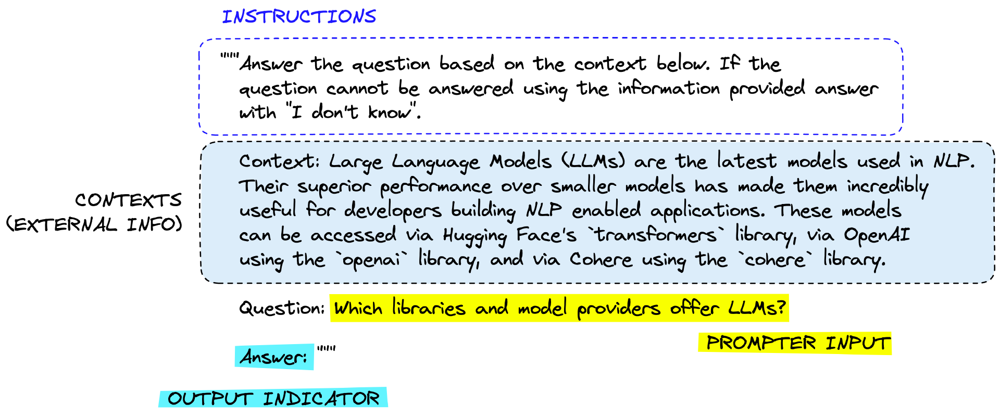
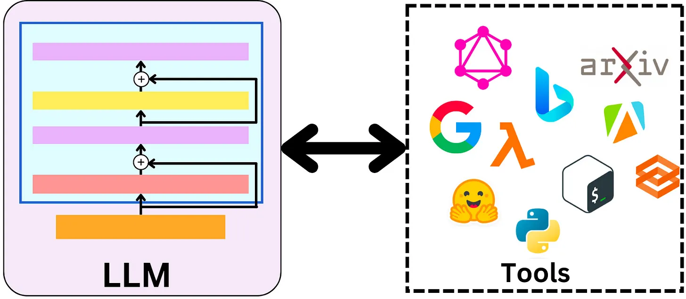
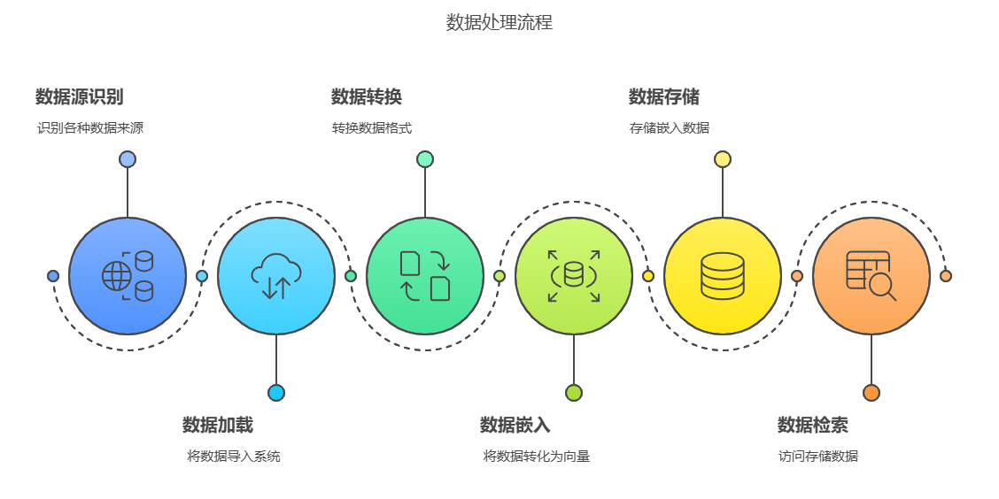

# LangChain

ChatGPT 的巨大成功在全球开发者社区中掀起了一股热潮，众多开发者纷纷希望通过 OpenAI 或其他模型提供的 API，构建基于大语言模型（LLM）的创新应用程序。尽管调用 LLM 的接口相对简单，但要打造一个功能完备的应用程序，仍面临诸多挑战。在这一背景下，LangChain 作为当前最热门的大语言模型应用框架脱颖而出。它充分发挥了 LLM 的强大能力，为各类大语言模型提供了统一的接口，显著简化了应用程序的开发流程。不仅如此，LangChain 还使大语言模型能够与外部数据源无缝连接，并与环境进行交互，从而极大地拓展了大语言模型的应用场景和潜力。

利用 LangChain 框架，我们可以轻松地构建以下知识库应用：


## 架构

LangChain 整体架构由以下几个框架组成：


- **LangChain-Core**：核心库和组件，提供了基础的抽象，用于构建、运行与 LLM 交互的应用程序。
- **LangChain**：主包包含构成应用程序认知架构的链和检索策略。
- **Integrations Packages**：提供流行框架的集成，例如 langchain-openai、langchain-antropic。查阅 [integrations packages](https://python.langchain.com/docs/integrations/providers/) 获取更多集成包信息。
- **LangChain-Community**：该软件包包含由 LangChain 社区维护的第三方集成，例如向量存储、工具等。
- **LangGraph**：LangChain 的扩展，旨在通过将步骤建模为图中的边和节点，以构建具有状态的多参与者应用程序。
- **LangServe**：部署服务，用于将 LangChain 应用程序部署到云端。
- **LangSmith**：开发者平台，专注于 LangChain 应用程序的开发、调试和测试。

## 核心模块

LangChain 的核心模块包含以下几个部分：

- **模型输入输出(Model I/O)**：与 LLM 交互的接口
- **数据连接(Data Connection)**：与特定应用程序进行数据交互的接口
- **链(Chains)**：定义了应用程序的业务逻辑，每一条链代表一个处理逻辑
- **记忆(Memory)**：多个链之间持久化状态
- **智能体(Agents)**：扩展模型的推理能力
- **回调(Callbacks)**：定义了链之间的交互方式

## 构建输入

由于 OpenAI 在国内访问网络限制，后续所有示例以 ZhipuAI 为例。一个简单的 LLM 应用程序如下：

```PYTHON
from langchain_community.chat_models import ChatZhipuAI
from langchain_core.messages import SystemMessage, HumanMessage

model = ChatZhipuAI(api_key="your_api_key"))

messages = [
    SystemMessage("Translate the following from Chinese to English),
    HumanMessage("你好"),
]

print(model.invoke(messages).content)
```

LangChain 支持多种输入格式，以下三种输入等价：

```PYTHON
model.invoke("Hello")

model.invoke([{"role": "user", "content": "你好"}])

model.invoke([HumanMessage("你好")])
```

### 提示工程

OpenAI 给出了提示工程的六大策略，分别是：

1. 写清晰的指示
2. 给模型提供参考示例
3. 拆分复杂任务
4. 给 GPT 时间思考
5. 使用外部工具
6. 反复迭代问题

基于此，一个实用的提示框架可以如下设计：



### 提示模板

在很多情况下， 我们并不需要每次都输入提示词，而是可以预先定义好提示模板，然后根据输入内容动态生成提示词。
LangChain 提供了两种提示模板，一种是`PromptTemplate`，另一种是`ChatPromptTemplate`。前者用于格式化单个字符串，后者可以用来格式化消息列表，它本身可以携带多个消息。

=== "PromptTemplate"
    类`PromptTemplate`接收一个原始模板字符串，并将其转换为一个`PromptTemplate`对象。

    ```PYTHON
    from langchain.prompts import PromptTemplate

    template = "Tell me a joke about {topic}"
    prompt_template = PromptTemplate.from_template(template)

    print(prompt.format(topic="Python"))
    ```
    
    打印结果为：`Tell me a joke about Python`

=== "ChatPromptTemplate"
    类`ChatPromptTemplate`接收一个消息列表，并将其转换为一个`ChatPromptTemplate`对象。它用来构建更加复杂的提示结构。

    ```PYTHON
    from langchain_core.prompts import ChatPromptTemplate

    system_template = "You are a helpful assistant that translates English to {language}."
    human_template = "Translate the following text: {text}"

    # 创建 ChatPromptTemplate
    chat_prompt = ChatPromptTemplate.from_messages([
        ("system", system_template),
        ("human", human_template),
    ])
    ```

在以上示例中，`PromptTemplate`构造了单个消息，而`ChatPromptTemplate`同时构造了`SystemMesssage`和 `HumanMessage`。

除了使用模板之外，我们还可以使用`MessagePlaceholder`类来将用户传入的消息列表插入到特定位置：

```PYTHON
from langchain.prompts import (
    ChatPromptTemplate,
    SystemMessagePromptTemplate,
    HumanMessagePromptTemplate,
    MessagesPlaceholder,
)
from langchain_core.messages import HumanMessage, AIMessage

# 定义系统消息模板
system_template = "You are a helpful assistant. Your task is to help users with their questions."
system_message_prompt = SystemMessagePromptTemplate.from_template(system_template)

# 定义用户消息模板
human_template = "Here is the latest user input: {user_input}"
human_message_prompt = HumanMessagePromptTemplate.from_template(human_template)

# 使用 MessagesPlaceholder 预留对话历史的位置
chat_history_placeholder = MessagesPlaceholder(variable_name="chat_history")

# 创建 ChatPromptTemplate
prompt_template = ChatPromptTemplate.from_messages(
    [
        system_message_prompt,  # 系统消息
        chat_history_placeholder,  # 对话历史占位符
        human_message_prompt,  # 用户消息
    ]
)

# 定义对话历史和用户输入
chat_history = [
    HumanMessage(content="Hi, how are you?"),
    AIMessage(content="I'm fine, thank you! How can I assist you today?"),
]
user_input = "Tell me a joke."

# 格式化模板
messages = prompt_template.format_messages(
    chat_history=chat_history,  # 填充对话历史
    user_input=user_input,  # 填充用户输入
)

# 打印结果
for message in messages:
    print(f"{message.type}: {message.content}")
```

输出如下：

```TEXT
system: You are a helpful assistant. Your task is to help users with their questions.
human: Hi, how are you?
ai: I'm fine, thank you! How can I assist you today?
human: Here is the latest user input: Tell me a joke.
```

### FewShot

大模型具备强大的学习能力，可以从 FewShot(少样本)中学习到新事物的规律。在构建 Prompt 时，我们可以创建少量示例，帮助模型学习特定的知识。

```PYTHON
from langchain.prompts import FewShotPromptTemplate, PromptTemplate

# 定义少样本示例
examples = [
    {"input": "翻译成法语: Hello", "output": "Bonjour"},
    {"input": "翻译成法语: Goodbye", "output": "Au revoir"},
]

example_template = """
Input: {input}
Output: {output}
"""

example_prompt = PromptTemplate(
    input_variables = ["input", "output"],
    template = example_template,
)

print(example_prompt.format(**examples[0]))
```

输出：

```TEXT
Input: 翻译成法语: Hello
Output: Bonjour
```

创建`FewShotPromptTemplate`对象，可以将示例和原始提示模板结合起来：

```PYTHON
few_shot_prompt = FewShotPromptTemplate(
    examples = examples,
    example_prompt = example_prompt,
    prefix = "请根据以下示例进行翻译:",
    suffix = "Input: {input} \n Output:",
    input_variables = ["input"], 
)

prompt = few_shot_prompt.format(input = "翻译成法语: Please")

print(prompt)
```

输出：

```TEXT
请根据以下示例进行翻译:
Input: 翻译成法语: Hello
Output: Bonjour
Input: 翻译成法语: Goodbye
Output: Au revoir
Input: 翻译成法语: Please
Output:
```


### CoT

CoT，即 Chain of Thought(思维链)，是一种用于解决复杂问题的方法，可以显著提高大模型进行复杂推理的能力。
简单来说，就是给出一两个示例，并且在示例中写清楚推导的过程。
下面是一个简单的示例程序：

```PYTHON
# 设置环境变量和API密钥
import os
from dotenv import load_dotenv
from langchain_community.chat_models import ChatZhipuAI

# 加载环境变量
load_dotenv()

ZHIPU_API_KEY = os.getenv("ZHIPU_API_KEY")

# 初始化 ChatZhipuAI 模型
llm = ChatZhipuAI(model="glm-4-plus", api_key=ZHIPU_API_KEY)

# 设定 AI 的角色和目标
role_template = "你是一个为花店电商公司工作的AI助手, 你的目标是帮助客户根据他们的喜好做出明智的决定"

# CoT 的关键部分，AI 解释推理过程，并加入一些先前的对话示例（Few-Shot Learning）
cot_template = """
作为一个为花店电商公司工作的AI助手，我的目标是帮助客户根据他们的喜好做出明智的决定。 

我会按部就班的思考，先理解客户的需求，然后考虑各种鲜花的涵义，最后根据这个需求，给出我的推荐。
同时，我也会向客户解释我这样推荐的原因。

示例 1:
  人类：我想找一种象征爱情的花。
  AI：首先，我理解你正在寻找一种可以象征爱情的花。在许多文化中，红玫瑰被视为爱情的象征，这是因为它们的红色通常与热情和浓烈的感情联系在一起。因此，考虑到这一点，我会推荐红玫瑰。红玫瑰不仅能够象征爱情，同时也可以传达出强烈的感情，这是你在寻找的。

示例 2:
  人类：我想要一些独特和奇特的花。
  AI：从你的需求中，我理解你想要的是独一无二和引人注目的花朵。兰花是一种非常独特并且颜色鲜艳的花，它们在世界上的许多地方都被视为奢侈品和美的象征。因此，我建议你考虑兰花。选择兰花可以满足你对独特和奇特的要求，而且，兰花的美丽和它们所代表的力量和奢侈也可能会吸引你。
"""
from langchain.prompts import ChatPromptTemplate, HumanMessagePromptTemplate, SystemMessagePromptTemplate
system_prompt_role = SystemMessagePromptTemplate.from_template(role_template)
system_prompt_cot = SystemMessagePromptTemplate.from_template(cot_template)

# 用户的询问
human_template = "{human_input}"
human_prompt = HumanMessagePromptTemplate.from_template(human_template)

# 将以上所有信息结合为一个聊天提示
chat_prompt = ChatPromptTemplate.from_messages([system_prompt_role, system_prompt_cot, human_prompt])

prompt = chat_prompt.format_prompt(human_input="我想为我的女朋友购买一些花。她喜欢粉色和紫色。你有什么建议吗?").to_messages()

# 接收用户的询问，返回回答结果
response = llm(prompt)
print(response.content)
```

## 解析输出

LangChain 针对不同的使用场景和目标，设计了各种输出解析器：

- 列表解析器（ListOutputParser）：这个解析器用于处理模型生成的输出，当需要模型的输出是一个列表的时候使用。例如，如果你询问模型“列出所有鲜花的库存”，模型的回答应该是一个列表。
- 日期时间解析器（DatetimeOutputParser）：这个解析器用于处理日期和时间相关的输出，确保模型的输出是正确的日期或时间格式。
- 枚举解析器（EnumOutputParser）：这个解析器用于处理预定义的一组值，当模型的输出应该是这组预定义值之一时使用。例如，如果你定义了一个问题的答案只能是“是”或“否”，那么枚举解析器可以确保模型的回答是这两个选项之一。
- 结构化输出解析器（StructuredOutputParser）：这个解析器用于处理复杂的、结构化的输出。如果你的应用需要模型生成具有特定结构的复杂回答（例如一份报告、一篇文章等），那么可以使用结构化输出解析器来实现。
- Pydantic（JSON）解析器(PydanticOutputParser)：这个解析器用于处理模型的输出，当模型的输出应该是一个符合特定格式的 JSON 对象时使用。它使用 Pydantic 库，这是一个数据验证库，可以用于构建复杂的数据模型，并确保模型的输出符合预期的数据模型。
- 输出修复解析器（from langchain.output_parsers import OutputFixingParser
）：这个解析器可以自动修复某些常见的模型输出错误。例如，如果模型的输出应该是一段文本，但是模型返回了一段包含语法或拼写错误的文本，自动修复解析器可以自动纠正这些错误。
- 重试解析器（RetryWithErrorOutputParser）：这个解析器用于在模型的初次输出不符合预期时，尝试修复或重新生成新的输出。例如，如果模型的输出应该是一个日期，但是模型返回了一个字符串，那么重试解析器可以重新提示模型生成正确的日期格式。

### 结构化输出解析器

我们可以通过 LangChain 的结构化输出解析器来解析大模型的输出，将无序的文本转换为结构化形式：

```PYTHON
from langchain_community.chat_models import ChatZhipuAI
from langchain.prompts import ChatPromptTemplate, PromptTemplate
from langchain_core.messages import SystemMessage, HumanMessage
from langchain.output_parsers import ResponseSchema, StructuredOutputParser
from dotenv import load_dotenv
import pandas as pd
import os

# 加载环境变量
load_dotenv()

# 获取 API 密钥
ZHIPU_API_KEY = os.getenv("ZHIPU_API_KEY")

# 初始化 ChatZhipuAI 模型
llm = ChatZhipuAI(model="glm-4-plus", api_key=ZHIPU_API_KEY)

prompt_template = """您是一位专业的鲜花店文案撰写员。\
对于售价为 {price} 元的 {flower_name} ，    \
您能提供一个吸引人的简短描述吗？{format_instructions}   \
"""

response_schemas = [
    ResponseSchema(name="description", description="鲜花的描述文案"),
    ResponseSchema(name="reason", description="为什么要写这个文案")
]

output_parser = StructuredOutputParser.from_response_schemas(response_schemas)

format_instructions = output_parser.get_format_instructions()

prompt = PromptTemplate.from_template(prompt_template, partial_variables={"format_instructions": format_instructions})

flowers = ["玫瑰", "向日葵", "百合", "菊花"]

prices = [100, 200, 300, 400]

df = pd.DataFrame(columns=["flower_name", "price", "description", "reason"])

for flower, price in zip(flowers, prices):
    input = prompt.format(flower_name=flower, price=price)
    
    output = llm.invoke(input)
    
    parsed_output = output_parser.parse(output.content)
    
    parsed_output["flower_name"] = flower
    parsed_output["price"] = price
    
    df.loc[len(df)] = parsed_output
    
print(df.to_dict(orient="records"))
```

以上代码将输出：

```PYTHON
[
    {
        "flower_name": "玫瑰",
        "price": 100,
        "description": "💐 百元浪漫，玫瑰绽放 🌹 — 100元精选玫瑰，每一朵都承载着深情与诗意，为爱加冕，让瞬间永恒。",
        "reason": "此文案旨在突出玫瑰的高性价比和浪漫寓意，吸引顾客关注并激发购买欲望，同时传递出鲜花带来的情感价值。"
    },
    {
        "flower_name": "向日葵",
        "price": 200,
        "description": "💐【阳光之约】200元 | 向日葵：沐浴在金色阳光下，绽放出希望与温暖的微笑，传递积极向上的力量，让每一天都充满阳光！",
        "reason": "此文案突出了向日葵象征阳光和希望的特性，简洁有力，易于引发情感共鸣，适合吸引顾客购买。"
    },
    {
        "flower_name": "百合",
        "price": 300,
        "description": "清新脱俗的百合，300元尊享雅致芬芳。每一朵都散发着纯洁与高雅，宛如初夏微风，轻抚心田，带来宁静与美好。",
        "reason": "此文案突出了百合花的清新与高雅特质，同时强调其价格与品质的匹配，旨在吸引注重生活品质与情感表达的顾客，激发购买欲望。"
    },
    {
        "flower_name": "菊花",
        "price": 400,
        "description": "优雅绽放，深情寄托——精选400元菊花礼盒，每一朵都承载着对逝去亲人的无尽思念与深切缅怀，让爱与怀念在芬芳中永恒流转。",
        "reason": "此文案旨在突出菊花的象征意义和情感价值，强调其对逝去亲人的纪念意义，同时以优雅的措辞和高品质的礼盒形式提升产品的高端感，吸引顾客的情感共鸣和购买欲望。"
    }
]
```

### Pydantic 解析器

> Pydantic 是一个用于数据验证和设置管理的库，基于 Python 的类型提示系统。它允许你定义数据模型，并自动验证输入数据是否符合模型的定义。如果数据不符合模型的要求，Pydantic 会抛出错误并提供详细的错误信息。

在 LangChain 中，`PydanticOutputParser` 类是一个专门用于将大模型生成的文本解析为`Pydantic`模型实例的工具。它可以帮助你将非结构化的文本转换为结构化的对象，从而更容易进行后续处理。

使用的详细步骤如下：

1. 定义一个`Pydantic`数据模型，用于表示大模型的输出：

    ```PYTHON
    from pydantic import BaseModel, Field

    class Product(BaseModel):
        product_name: str = Field(description="The name of the product")
        price: float = Field(ge=0, description="The price of the product in USD")
        category: str = Field(description="The category of the product")
    ```

2. 创建`PydanticOutputParser`实例，并与`Pydantic`模型关联：

    ```PYTHON
    from langchain.output_parsers import PydanticOutputParser
    from langchain.prompts import PromptTemplate

    # 创建 PydanticOutputParser
    parser = PydanticOutputParser(pydantic_object=Product)
    ```

3. 定义提示模板：

    ```PYTHON
    template = """
    您是一位专业的电商文案撰写员。
    请根据以下产品描述生成一个包含产品名称、价格和类别的字典:
    {format_instructions}
    产品描述: {product_description}
    """

    # 获取格式化指令
    format_instructions = parser.get_format_instructions()

    # 创建 PromptTemplate
    prompt = PromptTemplate(
        template=template,
        input_variables=["product_description"],
        partial_variables={"format_instructions": format_instructions}
    )
    ```

4. 调用模型：

    ```PYTHON
    from langchain_community.chat_models import ChatZhipuAI

    # 初始化语言模型
    llm = ChatZhipuAI(model="glm-4-plus")

    # 生成提示
    input_data = "这是一款高端智能手机，配备了最新的处理器和摄像头技术，售价为999美元，属于电子产品类别。"
    prompt_text = prompt.format(product_description=input_data)

    # 调用模型生成输出
    response = llm.invoke(prompt_text)

    # 使用解析器解析输出
    parsed_output = parser.parse(response.content)
    print(parsed_output)
    ```

### 输出修复解析器

LangChain 提供了`OutputFixingParser`类，它接受另一个输出解析器作为参数，也可以传入大模型，用于纠正任何格式错误。

假如某个`parser`解析器解析出来的结果不符合预期，我们可以定义一个`OutputFixingParser`来修复错误：
```PYTHON
from langchain.output_parsers import OutputFixingParser

# 错误的格式
misformatted = "{'name': 'Tom Hanks', 'film_names': ['Forrest Gump']}"

# 解析错误的输出
parser.parse(misformatted)

# 定义修复的输出解析器
from langchain.output_parsers import OutputFixingParser
 
new_parser = OutputFixingParser.from_llm(parser=parser, llm=ChatOpenAI())

# 修复错误的输出
new_parser.parse(misformatted)
```

### 重试解析器

`RetryWithErrorOutputParser`类用于在语言模型生成的输出不符合预期格式时，通过反馈的错误信息给模型来重新生成输出。它会按照以下流程来操作：

1. 当解析失败时，捕获错误信息。
2. 将错误信息嵌入到新的提示中，指导模型生成更符合预期格式的输出。
3. 重复此过程，直到成功或达到最大重试次数。

由于输出解析器只能做简单的格式修复，如果出错的不只是格式，比如输出根本不完整，有缺失内容，那么输出解析器就无能为力了，只能使用更强大的重试解析器来完成修复任务。

```PYTHON
from langchain.output_parsers import RetryWithErrorOutputParser

retry_parser = RetryWithErrorOutputParser(parser=parser, llm = OpenAI())

parse_result = retry_parser.parse_with_prompt(bad_response, prompt_value)
```

## 链

**链式调用**指的是一系列调用序列，其中，下一个调用序列依赖于上一个调用序列的输出。

## 记忆

在单轮对话中，大模型具有**记忆**功能，存储了对话的历史记录，并将该记录作为提示的一部分，在最新的对话中传递给模型。在聊天机器人中，记忆功能可谓非常重要。

## 智能体

在思维链(CoT)中，大模型被赋予了推理的能力，可以输出更好的结果，从而应对更复杂的任务。然而，仅仅使用思维链的方式并不能解决大模型的"事实幻觉"问题——因缺乏和外部世界的接触，大模型只拥有训练时的知识和当前对话的上下文信息。

当大模型仅凭自身知识无法完成任务，而需要依赖外部工具时，此时智能体(Agent)就出场了。智能体就像一个多功能的接口，它能够接触并使用一套工具。根据用户的输入，智能体会决定调用哪些工具。它不仅可以同时使用多种工具，而且可以将一个工具的输出数据作为另一个工具的输入数据。

在 LangChain 的智能体机制中，有以下几个关键组件：

1. 智能体(Agent)：这个类决定下一步执行什么操作。它由一个语言模型和一个提示词驱动。提示可能包含智能体的性格（也就是给它分配角色，让它以特定方式进行响应）、任务的背景（用于给它提供更多任务类型的上下文）以及用于激发更好推理能力的提示策略（例如 ReAct）。
2. 工具(Tools)：工具是智能体调用的函数。这里有两个重要的考虑因素：一是让智能体能访问到正确的工具，二是以最有帮助的方式描述这些工具。如果你没有给智能体提供正确的工具，它将无法完成任务。如果你没有正确地描述工具，智能体将不知道如何使用它们。LangChain 提供了一系列的工具，同时你也可以定义自己的工具。
3. 工具包(Toolkits)：工具包是一组用于完成特定目标的彼此相关的工具，每个工具包中包含多个工具。比如 LangChain 的 Office365 工具包中就包含连接 Outlook、读取邮件列表、发送邮件等一系列工具。
4. 智能体执行器(AgentExecutor)：智能体执行器是智能体的运行环境，它调用智能体并执行智能体选择的操作。执行器也负责处理多种复杂情况，包括处理智能体选择了不存在的工具的情况、处理工具出错的情况、处理智能体产生的无法解析成工具调用的输出的情况，以及在智能体决策和工具调用进行观察和日志记录。

## 工具

智能体通过工具与外部系统交互，工具相当于智能体功能的延伸。在 LangChain 中，每个功能都被封装成一个工具。每个工具都有自己的输入和输出，以及处理这些输入和生成输出的方法。当智能体接收到一个任务后，它会拆解任务的类型和需求，通过大模型的推理，选择合适的工具处理任务。

一旦选择了合适的工具，LangChain 就会将任务的输入传递给这个工具，然后工具会处理这些输入并生成输出。这个输出又经过大模型的推理，可以被用作其他工具的输入，或者作为最终结果，被返回给用户。



## RAG

RAG，全称为 Retrieval Augmented Generation，即检索增强生成，它通过外部知识库与大模型相结合的方式，增强了大模型的生成能力，使其能够产生更为丰富、准确和有根据的内容，特别是在需要具体细节或外部事实支持的场合。



一个完整的 RAG 流程需要包含以下几步：

1. 文档加载
2. 文本分割
3. 文本嵌入
4. 数据检索