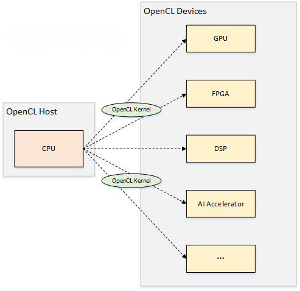
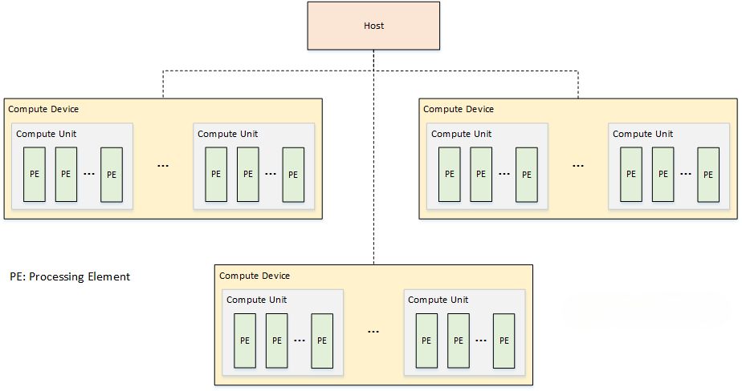
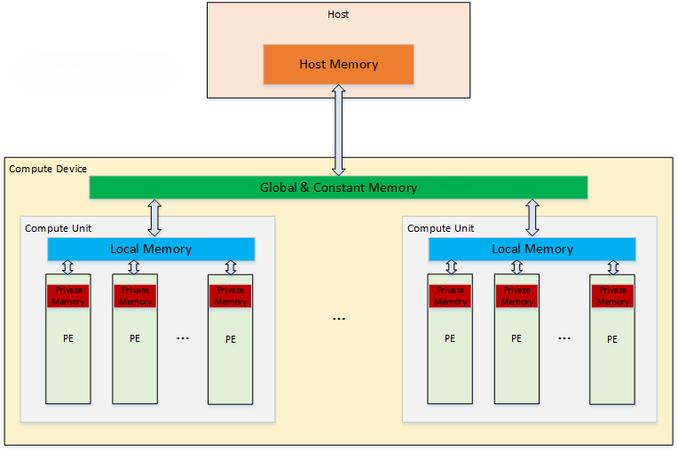
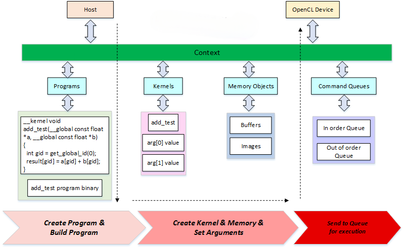
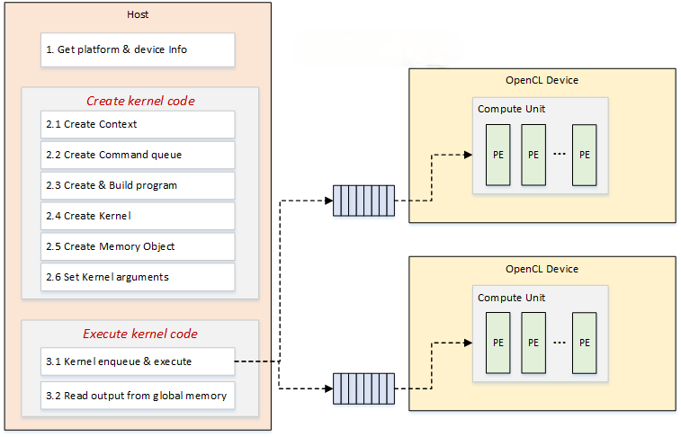

# OpenCL框架

OpenCL(Open Computing Language)——开放计算语言，是一种基于 C 语言的并行异构编程模型。OpenCL 的目标是为开发者提供一种统一的编程模型，使得程序员可以专注于算法的实现，而不用考虑底层的并行处理。

异构平台包括了 CPU、GPU、FPGA、DSP 等多个设备。以人工智能的场景举例说明，假如在某个 AI 芯片上跑人脸识别应用，CPU擅长控制，AI processor 擅长计算，软件的flow就可以进行拆分，用CPU来负责控制视频流输入输出前后处理，AI processor 来完成深度学习模型运算完成识别，这就是一个典型的异构处理场景，如果该AI芯片的 SDK 支持 OpenCL，那么上层的软件就可以基于 OpenCL 进行开发了。

## OpenCL架构

OpenCL 架构，包括了平台模型、内存模型、执行模型、编程模型四个维度。

### 平台模型

OpenCL 平台模型，是指 OpenCL 运行在哪种设备上。OpenCL 平台可以分为主机平台和设备平台。主机平台指的是运行 OpenCL 程序的主机，比如笔记本电脑、台式机、服务器等；设备平台指的是 OpenCL 程序可以运行的设备，比如 CPU、GPU、FPGA、DSP 等。

- 平台模型由一个 host 连接多个 device 组成
- 一个 device 可以由多个 compute unit 组成
- 一个 compute unit 可以包含多个 processing unit
- OpenCL 的应用程序由 host 端和 device 端组成

### 内存模型

OpenCL 内存模型，是指 OpenCL 程序如何访问内存，包含以下几类：

- Host Memory：只能由 host 访问
- Global Memory：设备内存，可以由 Host 和 OpenCL Device访问，允许 Host 的读写操作，也允许 OpenCL Device 中 PE 读写，Host 负责该内存中 Buffer 的分配和释放
- Constant Global Memory：设备内存，允许 Host 进行读写操作，而设备只能进行读操作，用于传输常量数据
- Local Memory：单个 CU 中的本地内存，Host 看不到该区域并无法对其操作，该区域允许内部的 PE 进行读写操作，也可以用于 PE 之间的共享，需要注意同步和并发问题
- Private Memory：PE 的私有内存，Host 和其他 PE 都无法访问

### 执行模型

### 编程模型

在编程模型中，有两部分代码需要编写：Host 端和 device 端。核心是维护一个 context，代表整个 kernel 执行环境。

整个代码的流程如下：

