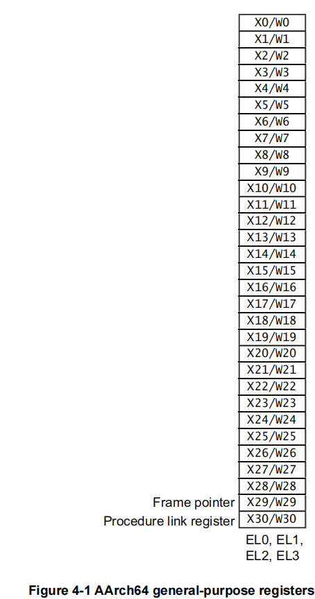
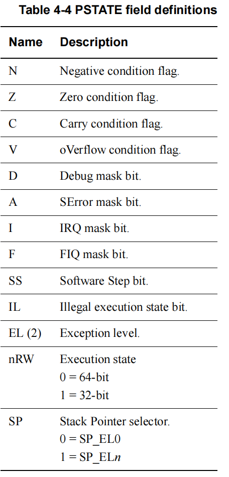

# ARM架构基础知识

ARM体系结构根据不同的应用场景分为如下三种系列：

- A系列：面向性能密集型系统

- R系列：面向实时性应用

- M系列：面向嵌入式应用

ARMv8 是第一代支持 64 位处理器的指令集和体系结构，为了兼容还提供了对 32 位指令集的支持。它还引入了许多新的特性：

- 超大物理地址空间，提供超过 4GB 物理内存的访问。

- 64 位宽的虚拟地址空间。

- 自动事件信号，可以实现节能、高性能的自旋锁。

- 31 个 64 位宽的通用寄存器，可以减少对栈的访问。

- 提供 16KB 和 64KB 的页，有助于降低 TLB 的伪命中率。

- 全新的异常处理模型，降低了操作系统和虚拟化的实现复杂度。

- 全新的加载-获取指令、存储-释放指令，专门为 C++11、C11 以及 JAVA 内存模型设计。

- NEON 双精度浮点高级 SIMD，使得 SIMD 矢量化能够应用于更广泛的算法集，例如科学计算、高性能计算(HPC)和超级计算机。

常见的采用 ARMv8 体系结构的处理器内核有：

- Cortex-A53

- Cortex-A57

- Cortex-A72

ARMv8 体系定义了两种执行状态：

=== "AArch64"

    - 提供 31 个 64 位的通用寄存器。

    - 提供64位的程序计数指针寄存器(PC)、栈指针寄存器（SP）以及异常链接寄存器(ELR)。
    
    - 提供 A64 指令集。

    - 定义 ARMv8 异常模型，支持4个异常等级——EL0 ~ EL3。
    
    - 提供一组处理器状态寄存器(PSTATE)保存 PE 的状态。

=== "AArch32"

    - 提供 13 个 32 位的通用寄存器，再加上PC、SP、LR。
    
    - 支持 A32 和 T32 (Thumb指令集)指令集。

    - 支持 ARMv7-A 异常模型。

    - 定义一组 PSTATE 保存 PE 的状态。

ARMv8 体系结构根据不同的执行状态提供不同指令集的支持：

- A64 指令集：运行在 AArch64 状态下，提供 64 位指令集

- A32 指令集：运行在 AArch32 状态下，提供 32 位指令集

- T32 指令集：运行在 AArch32 状态下，提供 16 位和 32 位指令集。

在 AArch64 状态下，系统寄存器根据不同的异常等级提供不同的变种寄存器：`<register_name>_ELx`。

## ARMv8寄存器

AArch64 执行状态支持 31 个 64 位的通用寄存器：X0 ~ X30。可以使用 W 来表示低 32 位的数据，如 W0 表示 X0 寄存器的低 32 位。从 W 寄存器读取时，忽略高 32 位，并保持其它不变。写入 W 寄存器时，将 X 寄存器的高 32 位设置为零。也就是说，将 0xFFFFFFFF 写入 W0 会将 X0 设置为 0x00000000FFFFFFFF。

其中 X29 又叫栈帧寄存器，X30 叫链接寄存器。

PSTATE 寄存器用来表示当前处理器状态，如下图：

特殊寄存器：

1. 零寄存器：ARMv8 体系结构提供两个零寄存器——WZR，XZR，寄存器的内容全是0。

2. PC 指针寄存器：用来指向当前运行指令的下一条指令的地址。

3. SP 指针寄存器：用来指向当前栈帧的栈顶，每个异常等级都有一个专门的 SP 寄存器。

4. 备份程序状态寄存器(SPSR)：当异常发生时，处理器会将 PSTATE 寄存器的值暂时保存到 SPSR 中。

5. 异常链接寄存器(ELR)：存放异常返回地址。

6. CuurentEL 寄存器：表示 PSTATE 寄存器中 EL 字段的值，保存了当前异常等级，可以通过`MRS`指令读取。

7. DAIF 寄存器：表示 PSTATE 寄存器中{D, A,I,F}字段的值。

8. SPSel 寄存器：表示 PSTATE 寄存器中 SP 字段的值。

9. PAN 寄存器：表示 PSTAET 寄存器中 PAN 字段的值。

10. UAO 寄存器：表示 PSTATE 寄存器中 UAO 字段的值。

11. NZCV 寄存器：表示 PSTATE 寄存器中{N, Z, C, V}字段的值。

## 异常等级

异常是指发生了某些事件，可以是外部也可以是内部，导致 CPU 不得不"陷入"更高等级的运行状态，执行一些预先设定的代码。在执行完毕后，会返回发生异常的现场。

ARM64 最大支持四种异常：

- EL0：用户特权，运行普通用户程序

- EL1：系统特权，运行操作系统内核

- EL2：运行虚拟机监视器
  
- EL3：运行安全监控器

异常级别之间的移动遵循以下规则：

- 移动到更高的异常级别，例如从 EL0 到 EL1，表示软件增加执行特权。

- 不能将异常处理降低到低级别的异常。

- EL0 级别不允许异常处理，必须在更高的异常级别处理。

- 异常导致程序流程发生变化。异常处理程序的执行由系统定义的异常向量表处开始。

- `ERET`指令可以结束当前异常处理并返回到上一个异常级别。

- 从异常返回可以保持相同的异常级别或进入较低的异常级别。它不能移动到更高的异常级别。

- 安全状态确实会随着异常级别的变化而变化，除非从 EL3 重新调整到非安全状态

要在相同的异常级别之间切换执行状态，必须切换到更高的异常级别，然后返回到原始的异常级别。例如，有 32 位和 64 位应用程序在 64 位操作系统下运行。在这种情况下，32 位应用程序可以执行并生成主管调用(SVC)指令，或接收中断，从而导致切换到 EL1 和 AArch64。然后操作系统可以执行任务切换并返回到 AArch64 中的 EL0。实际上，这意味着您不能拥有混合的 32 位和 64 位应用程序，因为它们之间没有直接的调用方式。
