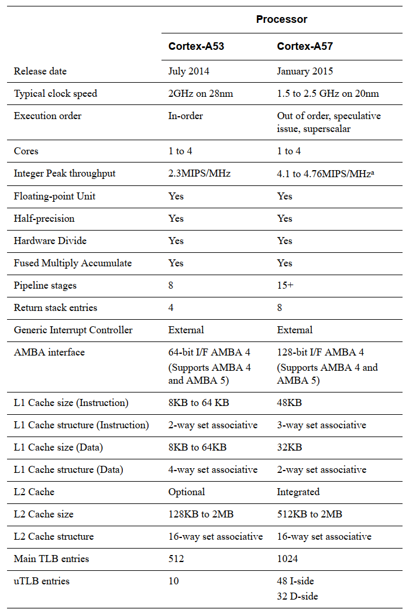
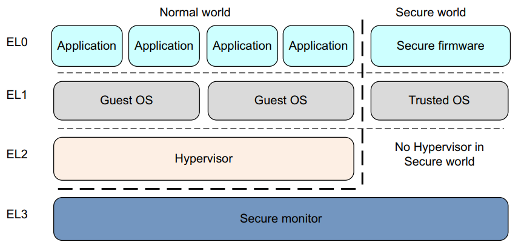

# ARM架构基础知识

ARM体系结构根据不同的应用场景分为如下三种系列：

- A系列：面向性能密集型系统

- R系列：面向实时性应用

- M系列：面向嵌入式应用

ARMv8是ARM公司发布的第一代支持64位处理器的指令集和体系结构。在扩充64位指令集的同时，还提供了对32位指令集的支持。它还引入了许多新的特性：

- 超大物理地址空间，提供超过4GB物理内存的访问。

- 64位宽的虚拟地址空间。

- 自动事件信号，可以实现节能、高性能的自旋锁。

- 31个64位宽的通用寄存器，可以减少对栈的访问。

- 提供16KB和64KB的页，有助于降低TLB的为命中率。

- 全新的异常处理模型，降低了操作系统和虚拟化的实现复杂度。

- 全新的加载-获取指令、存储-释放指令，专门为C++11、C11以及JAVA内存模型设计。

- NEON双精度浮点高级SIMD，使得SIMD矢量化能够应用于更广泛的算法集，例如科学计算、高性能计算(HPC)和超级计算机。

常见的采用ARMv8体系结构的处理器内核有：

- Cortex-A53

- Cortex-A57

- Cortex-A72

ARMv8体系定义了两种执行状态：

AArch64：64位的执行状态。

- 提供31个64位的通用寄存器。

- 提供64位的程序计数指针寄存器(PC)、栈指针寄存器（SP）以及异常链接寄存器(ELR)。
  
- 提供A64指令集。

- 定义ARMv8异常模型，支持4个异常等级——EL0 ~ EL3。
  
- 提供一组处理器状态寄存器(PSTATE)保存PE的状态。

AArch32：32位的执行状态。

- 提供13个32位的通用寄存器，再加上PC、SP、LR。
  
- 支持A32和T32(Thumb指令集)指令集。

- 支持ARMv7-A异常模型。

- 定义一组PSTATE保存PE的状态。

ARMv8体系结构根据不同的执行状态提供不同指令集的支持：

- A64指令集：运行在AArch64状态下，提供64位指令集

- A32指令集：运行在AArch32状态下，提供32位指令集

- T32指令集：运行在AArch32状态下，提供16位和32位指令集。

在AArch64状态下，系统寄存器根据不同的异常等级提供不同的变种寄存器——<register_name\>_ELx。

## ARMv8寄存器

AArch64执行状态支持31个64位的通用寄存器：X0 ~ X30。可以使用W来表示低32位的数据，如W0表示X0寄存器的低32位。从W寄存器读取时，忽略相应X寄存器高32位，并保持其它不变。写入W寄存器时，将X寄存器的高32位设置为零。也就是说，将0xFFFFFFFF写入W0会将X0设置为0x00000000FFFFFFFF。

PSTATE寄存器用来表示当前处理器状态。

特殊寄存器：

1.零寄存器

ARMv8体系结构提供两个零寄存器——WZR，XZR，寄存器的内容全是0。

2.PC指针寄存器

用来指向当前运行指令的下一条指令的地址。

3.SP指针寄存器

用来指向当前栈帧的栈顶。每个异常等级都有一个专门的SP寄存器。

4.备份程序状态寄存器(SPSR)

当异常发生时，处理器会将PSTATE寄存器的值暂时保存到SPSR中。

5.异常链接寄存器(ELR)

存放异常返回地址。

6.CuurentEL寄存器

表示PSTATE寄存器中EL字段的值，保存了当前异常等级，可以通过MRS指令读取。

7.DAIF寄存器

表示PSTATE寄存器中{D, A,I,F}字段的值。

8.SPSel寄存器

表示PSTATE寄存器中SP字段的值。

9.PAN寄存器

表示PSTAET寄存器中PAN字段的值。

10.UAO寄存器

表示PSTATE寄存器中UAO字段的值。

11.NZCV寄存器

表示PSTATE寄存器中{N, Z, C, V}字段的值。

## 异常等级

- EL0：用户特权，运行普通用户程序

- EL1：系统特权，用于操作系统内核

- EL3：运行虚拟机监视器
  
- EL4：运行安全监控器

异常级别之间的移动遵循以下规则：

- 移动到更高的异常级别，例如从EL0到EL1，表示软件增加执行特权。

- 不能将异常处理降低到较低的异常级别。

- EL0级别没有异常处理，必须在更高的异常级别处理异常。

- 异常导致程序流程发生变化。异常处理程序的执行以高于EL0的异常级别从与所采取的异常相关的已定义向量开始。例外情况包括：IRQ和FIQ等中断。内存系统中止。未定义的指令。系统调用。这些允许非特权软件对操作系统 安全监视器或管理程序陷阱。

- 通过执行ERET指令来结束异常处理并返回到上一个异常级别。

- 从异常返回可以保持相同的异常级别或进入较低的异常级别。它不能移动到更高的异常级别。

- 安全状态确实会随着异常级别的变化而变化，除非从EL3重新调整到非安全状态

要在相同的异常级别之间切换执行状态，必须切换到更高的异常级别，然后返回到原始的异常级别。例如，有32位和64位应用程序在64位操作系统下运行。在这种情况下，32位应用程序可以执行并生成主管调用(SVC)指令，或接收中断，从而导致切换到L1和AArch64。然后操作系统可以执行任务切换并返回到AArch64中的EL0。实际上，这意味着您不能拥有混合的32位和64位应用程序，因为它们之间没有直接的调用方式。
