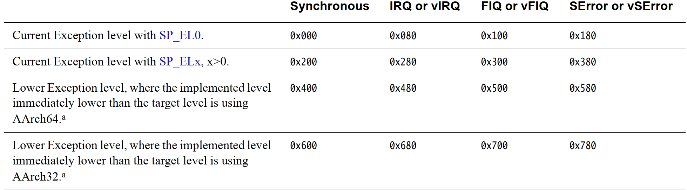

# 异常处理

## 异常

在ARMv8体系结构中，异常和中断都属于异常处理。

### 异常类型

1.中断

在ARM64处理器中，中断请求分为{==普通中断请求==}(IRQ)和{==快速中断请求==}(FIQ)，其中FIQ的优先级高于IRQ。

外设的中断引脚连接到中断控制器，中断控制器的IRQ线和FIQ线分别连接到CPU内部的IRQ引脚和FIQ引脚。外设的请求先送到中断控制器，由中断控制器仲裁并确定其优先级，然后再发送给CPU。

2.中止

中止分为指令中止和数据中止，通常是访问内存地址时发生了错误，处理器的MMU捕获这些错误并报告给处理器。

3.复位

复位是优先级最高的一种异常处理，CPU复位引脚产生复位信号，让CPU进入复位状态，然后重新启动。

4.异常指令

- SVC指令：系统调用指令，用于调用操作系统提供的服务
- HVC指令：硬件虚拟化指令，用于调用虚拟化相关的服务
- SMC指令：安全监视器调用指令，用于调用安全监视器提供的服务

### 异常等级

ARM64处理器分为两种模式：{==特权模式==}和{==非特权模式==}。操作系统内核运行在特权模式，而用户态程序运行在非特权模式。除此之外，ARM64还支持虚拟化扩展以及安全模式扩展，这四种模式被称为{==异常等级==}(Exception Level)：

- EL0：非特权模式，运行应用程序
- EL1：特权模式，运行操作系统内核
- EL1：虚拟化模式，运行虚拟化管理程序
- EL2：安全模式，运行安全世界管理程序

### 异常处理流程

当异常发生后，内核必须能感知异常的发生，并且生成一个当前的异常等级ELx，然后：

1. 把PSTATE寄存器的值保存到对应异常等级的SPSR_ELx中
2. 把返回地址保存到对应异常等级的ELR_ELx中
3. 将PSTATE寄存器里的D、A、I、F标志位设为1，即关闭调试异常、SError、IRQ和FIQ
4. 切换SP寄存器为目标异常等级的SP_ELx寄存器
5. 切换到对应目标异常等级ELx，然后跳转到异常向量表中
6. 执行异常向量表中对应的异常处理函数
7. 执行ERET指令从异常返回

ERET指令需要完成：

1. 从ELR_ELx中恢复PC指针
2. 从SPSR_ELx中恢复PSTATE寄存器

根据系统的配置，异常可以在当前异常等级处理，也可以陷入更高级别异常等级去处理。但是EL0不能用来处理异常。

由于不同异常等级都有对应的SP寄存器，因此在汇编代码跳转到`main()`函数之前，需要确保每个异常等级对应的栈空间可用。

异常处理的执行状态保存在HCR_EL2寄存器中，返回时的执行状态保存在SPSR中。

### 异常向量表

异常向量表存放的基地址可以通过向量基址寄存器(Vector Base Address Register)来设置。在ARMv8体系结构中，除了EL0，每个EL都有自己的异常向量表，基地址保存在对应的VBAR_ELx寄存器中。



根据官方文档可知，如果处理器在内核态EL1异常等级中触发了IRQ，且配置了SP_EL1寄存器作为栈指针，那么处理器就会跳转到"VBAR_EL1 + 0x280"地址处的异常向量中。如果处理器在用户态EL0异常登记中触发了IRQ，若为AArch64执行状态，那么处理器就会跳转到"VBAR_EL1 + 0x480"地址处的异常向量中。

## 中断

ARM64处理器上有两个与中断相关的引脚：

- nIRQ：IRQ信号，每个CPU内核都有一根信号线，低电平有效
- nFIQ：FIQ信号，每个CPU内核都有一根信号线，低电平有效

PSTATE寄存器里面有两位与中断有关，可以用来屏蔽和打开中断，分别是I——IRQ，F——FIQ。

### 中断处理过程

一般的中断处理过程如下：

1. 保存现场，然后跳转到中断向量表中
2. 根据中断向量表中的地址，跳转到顶层中断处理程序
3. 读取中断号，根据中断号，跳转到设备的中断处理程序
4. 在设备中断处理程序中，处理这个中断
5. 返回顶层中断处理程序，调用ERET指令返回现场
6. 执行中断前的下一条指令

### 中断现场

中断发生时需要保存现场，ARM64处理器需要保存以下内容：

- PSTATE寄存器里的值
- PC值
- SP值
- X0~X30寄存器里的值

栈框数据结构`struct pt_regs`用来描述需要保存的中断现场：

```C
struct pt_regs {
	union {
		struct user_pt_regs user_regs;
		struct {
			u64 regs[31];
			u64 sp;
			u64 pc;
			u64 pstate;
		};
	};
	u64 orig_x0;
#ifdef __AARCH64EB__
	u32 unused2;
	s32 syscallno;
#else
	s32 syscallno;
	u32 unused2;
#endif
	u64 sdei_ttbr1;
	/* Only valid when ARM64_HAS_IRQ_PRIO_MASKING is enabled. */
	u64 pmr_save;
	u64 stackframe[2];

	/* Only valid for some EL1 exceptions. */
	u64 lockdep_hardirqs;
	u64 exit_rcu;
};
```

- 栈框的PSTATE保存SPSR_EL1的内容
- 栈框的PC保存ELR_EL1的内容
- 栈框的SP保存栈顶的位置
- 栈框的regs[30]保存LR的值
- 栈框的regs[0] ~ regs[29]保存X0~X29的值

