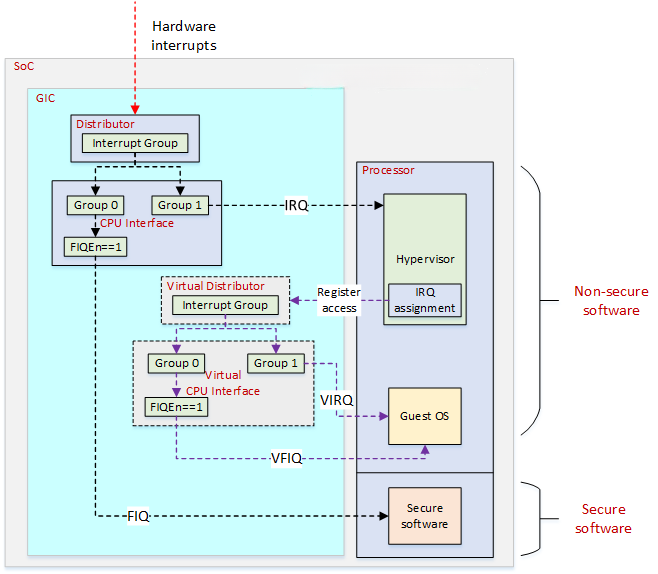

# GIC

由于现在的 SoC 做得越来越复杂，中断的管理越来越困难，所以 ARM 公司专门开发了 GIC，用于统一管理中断。目前最新版本是 GIC-V4。

GIC 从功能上来说，除了常用的中断使能、中断屏蔽、优先级管理等，还支持安全扩展和虚拟化。从组成上来说，分为{==分发器==}(distributor)和{==CPU接口==}(CPU interface)。分发器负责对中断源进行仲裁，并将最高优先级的中断发送给 CPU 接口，CPU 接口负责将中断发送给 CPU。分发器只有一个，是公用的，但是每个 CPU 核心都有一个 CPU 接口，它们通过 nIRQ 和 nFIQ 引脚连接。

GIC支持三种类型的中断：

- SGI（Software Generated Interrupt）：软件产生的中断，可以用于多核间的通信，一个CPU可以通过写 GIC 的寄存器给另外一个 CPU 产生中断。

- PPI（Private Peripheral Interrupt）：某个 CPU 私有外设的中断，只能发给绑定的那个 CPU。

- SPI（Shared Peripheral Interrupt）：共享外设的中断，可以发送给任何一个 CPU。

每一个中断支持的状态有以下4种：

- Inactive：中断处于无效状态
- Pending：中断处于有效状态，但尚未传递给目标 CPU
- Active：发生了中断并传递给目标 CPU
- Active and pending：CPU 正在响应，但是该中断源又产生了相同的中断

外设中断支持两种触发方式：

- 边沿触发：当中断源产生一个上升沿或者下降沿时，触发一个中断
- 电平触发：当中断源产生一个高电平或者低电平时，触发一个中断

## 中断流程

GIC 检测中断的流程如下：

1. 当 GIC 检测到一个中断时，标记该中断为 pending 状态
2. 对于 pending 状态的中断，分发器会确定目标 CPU，将中断请求发送给这个 CPU
3. 如果有多个处于 pending 状态的中断，分发器会选择一个优先级最高的中断，发送给 CPU 接口
4. CPU 接口会决定这个中断是否可以发送给 CPU，如果可以，GIC 就会发送一个中断请求信号给 CPU
5. CPU 进入中断异常，由 Linux 内核的中断处理器程序来读取寄存器中的中断源信息，同时 GIC 会做以下处理：

    - 如果该中断处于 pending 状态，那么状态将变成 active
    - 如果该中断又重新产生，那么状态将变成 active and pending

6. 处理器完成中断服务，发送一个完成信号(End of Interrupt)给GIC

GIC 支持中断优先级抢占，即便一个中断已经发生。

## GIC寄存器

GIC 寄存器用于配置和控制中断的行为，由分发器的寄存器和 CPU 接口的寄存器组成。
