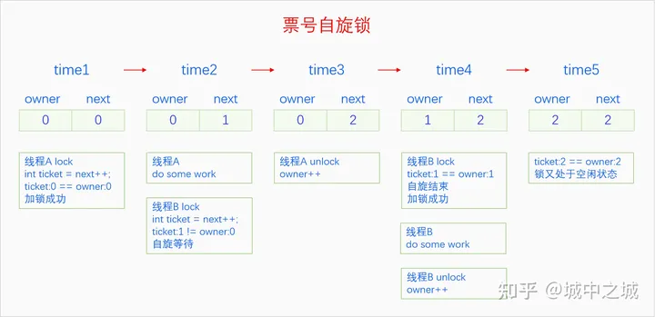

# 锁的实现

## arch_spinlock_t

早期的ARM平台spin lock的实现使用了`raw_spinlock_t`：

```C
typedef struct {
    volatile unsigned int lock;
}raw_spinlock_t;
```

0表示unlocked，1表示locked。这个版本的锁实现简单，但是存在严重的不公平性问题。也就是所有的线程无序地争抢spin lock，不管线程等待了多久。在冲突比较少的情况下，不公平性体现得并不明显。但是随着硬件的发展，处理器的核心数越来越多，多核之间的冲突愈发剧烈，不公平性就愈发明显。有些线程甚至要等待100,000次机会才会执行一次。

现在的ARM平台spin lock使用以下定义：

```C
typedef struct {
    union {
        u32 slock;
        struct __raw_tickets {
            u16 owner;
            u16 next;
        } tickets;
    };
} arch_spinlock_t; 
```

该锁实际上就是所谓的票号自旋锁。它的原理类似于去银行办业务，每个进来的人先取一个号然后等待。业务员处理完一个人的业务之后就会叫号，如果叫的号和自己手里取的号是一样的，就轮到自己去办业务。

owner代表当前正在办理业务的票号，next代表下一个人取号的号码。在最开始的时候，owner和next都等于0，第一个线程进来时，发现这两者相等，于是加锁，并且将next++。后来的线程在next的基础上累加并等待owner释放。当第一个线程释放之后，将owner++，此时owner又等于next，所以第二个线程加锁成功。以此类推。而owner与next的差值就代表排队等待线程的个数。



申请锁操作：

```C
static inline void arch_spin_lock(arch_spinlock_t *lock)
{
    arch_spinlock_t old_lock;
    old_lock.slock = lock->slock;
    lock->tickets.next++;
    while(old_lock.tickets.next != old_lock.tickets.owner) {
        wfe();
        old_lock.tickets.owner = lock->tickets.owner;
        
    }
}
```

汇编指令`wfe()`让ARM核进入低功耗模式。

释放锁操作：

```C
static inline void arch_spin_unlock(arch_spinlock_t *lock)
{
    lock->tickets.owner++;
    sev();
}
```

汇编指令`sev()`唤醒所有睡眠的CPU。

## arch_rwlock_t

```C
typedef struct {
    u32 lock;
}arch_rwlock_t;
```

lock的最高位代表是否有写线程进入临界区，低31位统计读线程个数。

read_lock操作：

```C
static inline void arch_read_lock(arch_rwlock_t *rw)
{
    unsigned int tmp;
    do {
        wfe();
        tmp = rw>lock;
        temp++;
    }while(tep & (1 << 31>>);

    rw->lock = tmp;
}


read_unlock操作：

```C
static inline void arch_read_unlock(arch_rwlock_t *rw)
{
    rw->lock++;
    sev();
}
```

write_lock操作：

```C
static inline void arch_write_lock(arch_rwlock_t *rw)
{
    unsigned int tmp;
    sevl();

    do {
        wfe();
        temp = rw->lock;
    }while(temp);
    rw->lock = 1 << 31;
}
```

只有当rw->lock的值为0，写线程才可以进入临界区，同时将最高位置1。

write_unlock操作：
```C
static inline arch_write_unlock(arch_rwlock_t *rw)
{
    rw->lock = 0;
    sev();
}
```

## semaphore

```C
struct semaphore_waiter {
    struct list_head list;
    struct task_struct *task;
};

sturct sempahore {
    unsigned int count;
    struct list_head wait_list;
};
```

申请semaphore：

```C
void down(struct semaphore *sem)
{
   	struct semaphore_waiter waiter;
     
   	if (sem->count > 0) {
   		sem->count--;                               /* 1 */
   		return;
   	}
     
   	waiter.task = current;                          /* 2 */
   	list_add_tail(&waiter.list, &sem->wait_list);   /* 2 */
   	schedule();                                     /* 3 */
}
```

 释放semaphore：

 ```C
void up(struct semaphore *sem)
{
   	struct semaphore_waiter waiter;
    
   	if (list_empty(&sem->wait_list)) {
   		sem->count++;                              /* 1 */
   		return;
   	}
     
   	waiter = list_first_entry(&sem->wait_list, struct semaphore_waiter, list);
   	list_del(&waiter->list);                       /* 2 */
   	wake_up_process(waiter->task);                 /* 2 */
}
```

## mutex

mutex类似于计数值只有1的semaphore，但是只有持有锁的人才能解锁，而信号量可以由任何一个线程释放。

```C
struct mutex_waiter {
    struct list_head list;
    struct task_struct *task;
};

struct mutex {
    long owner;
    struct list_head wait_list;
};
```

mutex的owner字段记录持有锁的线程ID，wait_list记录等待锁的线程。

申请mutex：

```C
void mutex_take(struct mutex *mutex)
{
    struct mutex_waiter waiter;
     
    if (!mutex->owner) {
    	mutex->owner = (long)current;               /* 1 */
    	return;
    }
     
    waiter.task = current;
    list_add_tail(&waiter.list, &mutex->wait_list); /* 2 */
    schedule();                                     /* 2 */
} 
```

当mutex->owner为0时，表示没有线程持有锁。当不能获取mutex时，将线程挂入等待链表。

释放mutex：

```C
int mutex_release(struct mutex *mutex)
{
    struct mutex_waiter *waiter;
     
    if (mutex->owner != (long)current)                         /* 1 */
    	return -1;
     
    if (list_empty(&mutex->wait_list)) {
    	mutex->owner = 0;                                      /* 2 */
    	return 0;
    }
     
    waiter = list_first_entry(&mutex->wait_list, struct mutex_waiter, list);
    list_del(&waiter->list);
    mutex->owner = (long)waiter->task;                         /* 3 */
    wake_up_process(waiter->task);                             /* 4 */
     
    return 0; 
}
```


