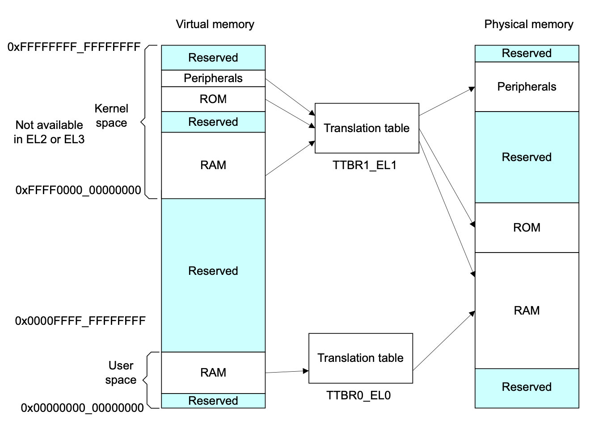

# 内存管理

现代操作系统对内存进行了抽象，进程所使用的都是虚拟地址，由MMU单元负责翻译成真实的物理地址。程序在虚拟地址空间里可以任意分配虚拟内存，但只有当程序需要访问或修改虚拟内存时，内核才会为其分配物理页面，这个过程叫做{==缺页异常==}（page fault）。

以32位系统为例，如果采用最简单的一级页表，虚拟地址空间的寻址范围是0 ~ 4GB。虚拟地址VA[31:0]可以分为两部分：VA[31:12]是虚拟页帧号(VPN)，作为索引值在页表中查询页表项；VA[11:0]是页面偏移量。页帧号加上页面偏移就构成了最终物理地址。

页面的大小一般是4KB，如果要映射整个4GB地址空间，需要4GB/4KB=220个页表项，每个页表项占用4字节，最终需要4MB大小的物理内存来存放这张页表。在多进程系统中，每个进程都拥有自己的一套页表，每次都要分配4MB的物理内存，这是无法接受的。因此内核往往会使用{==多级页表==}，当处理器执行程序时，只加载一级页表，根据物理内存的使用情况逐步创建和分配剩余的页表。

## 源码文件

- arch/arm64/include/asm/pgtable-types.h：定义`pgd_t`、`pud_t`、`pmd_t`、`pte_t`等类型
- arch/arm64/include/asm/pgtable-prot.h：页表的权限设置
- arch/arm64/include/asm/pgtable.h：页表设置相关

当CONFIG_PGTABLE_LEVELS=3时，没有PUD页表；当CONFIG_PGTABLE_LEVELS=2时，没有PUD和PMD页表。

## ARMv8 MMU

ARMv8中，内核空间的页表基地址存放在TTBR1_EL1寄存器中，用户空间的页表基地址存放在TTBR0_EL1寄存器中。内核空间的高位全为1，用户空间的高位全为0，如下图所示：

AArch64体系结构中的页表支持以下特性：

- 支持至少两级页表，最多4级页表
- 输入地址的最大位宽为48位
- 页面粒度可以是4KB、16KB或64KB

### 页表项属性

1.共享性与缓存性

缓存性是指页面是否使能了高速缓存，另外还能指定高速缓存是内部共享还是外部共享。共享性是指在SMP系统中，某个内存区域的高速缓存可以被哪些观察者观察到。

2.访问权限

控制页面的可读、可写、可执行权限。

3.访问标志位

AF(Access Flag)用来指示页面是否被访问过：1表示已经被访问过。

4.全局和进程特有TLB

用来设置TLB的类型。

## 地址转换控制寄存器

主要有以下几个：

- 转换控制寄存器(TCR)：包含与地址转换相关的控制信息以及与高速缓存相关的配置信息
- 系统控制寄存器(SCTLR)：用于控制处理器的一些基本系统级别的配置和行为
- 转换页表基地址寄存器(TTBR)：存储页表的基地址

