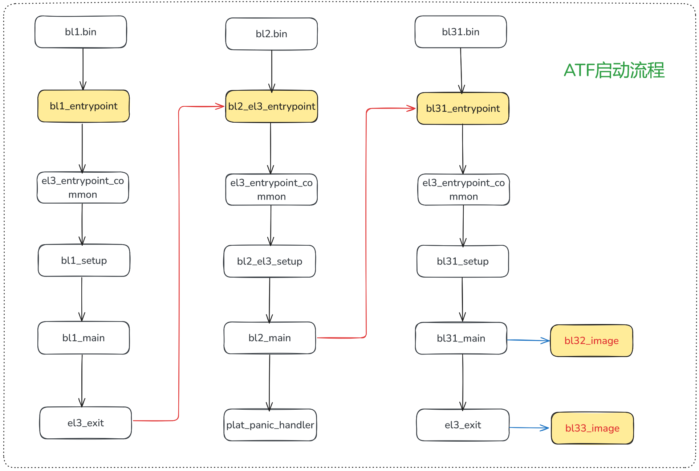

# 安全启动

Secure boot 是一种安全机制，它的根本目的是为了防止消费者从软硬件层面对产品的部分关键系统进行读写、调试等高权限的操作，来达到保护产品的商业机密、知识产权等厂家权益的目的。当然商家宣传的时候会说这项技术是用来保护用户的隐私，防止恶意软件篡改系统。

安全启动主要关注两件事：

1. 怎么从 bootrom 开始构建 image 的信任链？
2. 使用什么加密算法校验不会被破解？

下面是一个标准的安全启动的流程：

ATF：Arm Trust Firmware，也叫 TF-A，运行在最高异常级别—— EL3，负责启动过程的安全检查和认证。ATF = BL1、BL2、BL31、BL32、BL33。

- BL1：也叫 bootrom，芯片出厂时就被写死，是 SoC 上电后执行的第一段代码，负责对镜像进行校验和解密。
- BL2：存放在 flash 中的一段可信安全启动代码，主要完成一些平台相关的初始化，比如对 ddr 的初始化等。BL1 和 BL2 主要负责 runtime 之前的初始化工作。
- BL31：作为 EL3 最后的安全堡垒，它不像 BL1 和 BL2 是一次性运行的。如它的 runtime 名字暗示的那样，它通过 SMC 指令为 Non-Secure OS 持续提供设计安全的服务，在 Secure World 和 Non-Secure World 之间进行切换。是对硬件最基础的抽象，对 OS 提供服务。例如一个 EL3 级别的特权指令，比如关机、休眠等 OS 是无权处理的，就会交给 BL31 来继续操作硬件处理。
- BL32：是所谓的 secure os，运行在 secure mode。在 ARM 平台下是 ARM 家的 Trusted Execution Environment（TEE）实现。OP-TEE 是基于 ARM TrustZone 硬件架构所实现的软件 Secure OS。
- BL33：就是所谓的 uboot，之后就会启动 linux 内核了。

每一个阶段，上一阶段都会对下一个阶段的镜像进行校验，发现有改动就终止启动了，主打一个防篡改。启动 BL1、BL2、BL31、BL32、BL33、Linux 是一个完整的 ATF 信任链建立流程，负责加载镜像的 BL1、BL2、BL33 都不是 runtime，只要 Linux 系统启动，就不会再有加载镜像的机会了。

下面以[arm-trusted-firmware](https://github.com/ARM-software/arm-trusted-firmware)项目为例，大致的启动流程如下图所示：



## BL1 启动流程

BL1 通常又称为 bootrom，是 SoC 上电后执行的第一段代码，它的启动地址可以分为三种情况：

- aarch64：boot address 允许配置
- aarch32：boot address 在 0x00000000 和 0xffff0000 二选一
- ARM M 系列：boot address 固定在 0x00000000，不允许更改

bl1.ld.S 文件定义了 BL1 代码的位置分布，其中定义了`bl1_entrypoint()`函数，作为 BL1 启动的入口函数。

BL1 启动流程如下：

```C
bl1_entrypoint()
    |-->el3_entrypoint_common()
    |-->bl1_setup()
        |-->plat_setup_early_console()
        |-->bl1_early_platform_setup()
        |-->bl1_plat_arch_setup()
    |-->bl1_main()
        |-->bl1_arch_setup()
        |-->crypto_mod_init()
        |-->auth_mod_init()
        |-->bl1_plat_mboot_init()
        |-->bl1_platform_setup()
        |-->bl1_plat_get_next_image_id()
        |-->bl1_plat_mboot_finish()
        |-->bl1_prepare_next_image()
    |-->el3_exit()
```

## BL2 启动流程

BL2 的启动方式有两种，也有两个 ld 文件，分别是：bl2.ld.S 和 bl2_el3.ld.S。取决于芯片厂家是否需要将 BL2 跑在 EL3 模式。

1. BL2 跑在 EL1 模式：

    ```C
    bl2_entrpoint()
        |-->bl2_setup()
            |-->bl2_early_platfrom_setup2()
            |-->bl2_plat_arch_setup()
        |-->bl2_main()
            |-->bl2_arch_setup()
            |-->crypto_mod_init()
            |-->auth_mod_init()
            |-->bl2_plat_mboot_init()
            |-->bl2_plat_preload_setup()
            |-->bl2_load_images()
            |--smc(BL1_SMC_RUN_IMAGE, (unsigned long)next_bl_ep_info, 0, 0, 0, 0, 0, 0)
    ```

2. BL2 跑在 EL3 模式：

    ```C
    bl2_el3_entrypoint()
        |-->el3_entrypoint_common()
        |-->bl2_el3_setup()
            |-->bl2_early_platform_setup2()
            |-->bl2_plat_arch_setup()
        |-->bl2_main()
            |-->bl2_arch_setup()
            |-->crypto_mod_init()
            |-->auth_mod_init()
            |-->bl2_plat_mboot_init()
            |-->bl2_plat_preload_setup()
            |-->bl2_load_images()
            |-->bl2_run_next_image()
    ```

## BL3 启动流程

BL3 启动流程分为三个部分：

- BL31：runtime 之前的初始化工作，所有注册的 runtime service 都会在`runtime_svc_init()`函数中初始化。
- BL32：跳转到 optee，进行 secure os 的初始化。
- BL33：跳转到 uboot，之后就会启动 linux 内核了。

```C
bl32_entrypoint()
    |-->el3_entrypoint_common()
    |-->bl31_setup()
        |-->bl31_early_platform_setup2()
        |-->bl32_plat_arch_setup()
    |-->bl31_main()
        |-->bl31_platform_setup()
        |-->bl31_lib_init()
        |-->runtime_svc_init()
        |-->(*bl32_init)
        |-->bl31_prepare_next_image_entry()
        |-->bl1_plat_runtime_setup()
    |-->el3_exit()
```

重点关注`runtime_svc_init()`函数，它会注册所有的 runtime service
```C title="arm-trusted-firmware/common/runtime_svc.c"
void __init runtime_svc_init(void)
{
    ......
    // 遍历所有的 runtime service，并调用注册函数
    for(index = 0U; index < RT_SVC_DECS_NUM; index++){
        rt_svc_desc_t *service = &rt_svc_desc_array[index];
        rc = validate_rt_svc_desc(service);

        if(service->init != NULL) {
            rc = service->init();
        }
    }
    ......
}
```

对于 opteed service 来说，宏`DECLARE_RT_SVC()`注册了 opteed 的 setup 函数`opteed_setup()`：

```C title="arm-trusted-firmware/services/spd/opteed/opteed_main.c"
DECLARE_RT_SVC(
	opteed_fast,

	OEN_TOS_START,
	OEN_TOS_END,
	SMC_TYPE_FAST,
	opteed_setup,
	opteed_smc_handler
);

static int32_t opteed_setup(void)
{
    ......
    entry_point_info_t *optee_ep_info;
    optee_ep_info = bl31_plat_get_next_image_ep_info(SECURE);
    ......
    opteed_init_optee_ep_state(optee_ep_info, opteed_rw, optee_ep_info->pc,
				arg0, arg1, arg2, arg3,
				&opteed_sp_context[linear_id]);
    // 真正的入口函数
    bl31_register_bl32_init(&opteed_init);
    return 0;
}
```

其中，`entry_point_info_t`结构体定义了 secure os 的入口点信息，比如 PC 指针、SPSR 寄存器、AAPCS 寄存器等：

```C
typedef struct entry_point_info {
    param_header_t h;
    uintptr_t pc;
    uint32_t spsr;
#ifdef __aarch64__
    aapcs64_params_t args;
#else
    aapcs32_params_t args;
#endif
} entry_point_info_t;
```

`bl31_plat_get_next_image_ep_info()`函数为虚函数，其定义由各家平台实现，ARM 默认的实现如下：

```C title="arm-trusted-firmware/plat/arm/common/arm_bl31_setup.c"
#pragma weak bl31_plat_get_next_image_ep_info

struct entry_point_info *bl31_plat_get_next_image_ep_info(uint32_t type)
{
	entry_point_info_t *next_image_info;

	assert(sec_state_is_valid(type));
	if (type == NON_SECURE) {
#if TRANSFER_LIST && !RESET_TO_BL31
		next_image_info = transfer_list_set_handoff_args(
			ns_tl, &bl33_image_ep_info);
#else
		next_image_info = &bl33_image_ep_info;
#endif
	}
#if ENABLE_RME
	else if (type == REALM) {
		next_image_info = &rmm_image_ep_info;
	}
#endif
	else {
		next_image_info = &bl32_image_ep_info;
	}

	/*
	 * None of the images on the ARM development platforms can have 0x0
	 * as the entrypoint
	 */
	if (next_image_info->pc)
		return next_image_info;
	else
		return NULL;
}
```


## ATF 初始化


## 镜像加密算法RSA

RSA 加密算法是使用最广泛的非对称加密算法，即加密和解密不使用同样的密码和规则，只要这两种规则之间存在某种对应关系即可。这种算法非常可靠，密钥越长，它就越难破解。根据已经披露的文献，目前被破解的最长 RSA 密钥是 768个二进制位。也就是说，长度超过 768 位的密钥，还无法破解（至少没人公开宣布）。因此可以认为，1024 位的 RSA 密钥基本安全，2048 位的密钥极其安全。

Secure boot中使用 RSA 加密算法对镜像进行签名，具体步骤为：

1. 使用 hash 算法计算镜像的 hash 值
2. 编译时用私钥将 hash 值签名，并存入镜像中，放在指定位置
3. 启动上电后拿到公钥，将存储在镜像中特定位置的 hash 值解密
4. 对比解密后的 hash 值和计算出的 hash 值是否一致，如果一致，则认为镜像没有被篡改，可以正常启动