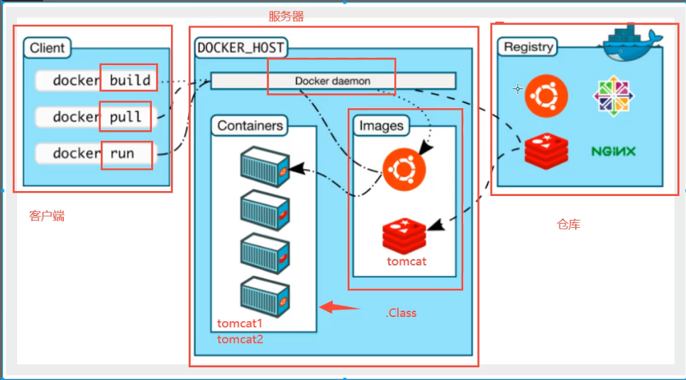
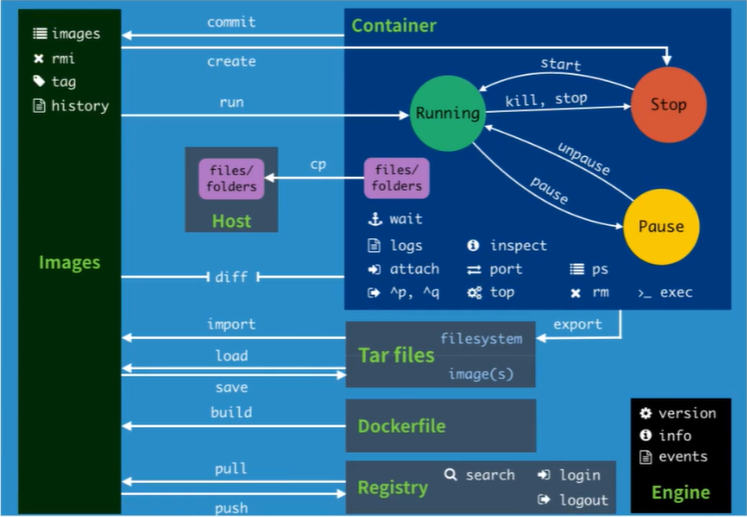

# 容器技术

Docker 是一种轻量级、高性能的虚拟化技术，可以让开发者将应用和依赖打包至一个可移植的镜像中，然后发布到任何 Linux 机器上运行。

镜像就是一个轻量级、独立的运行单元，它包含了应用程序及其所需的所有组件（如库、依赖项、环境变量等）。每个镜像相互隔离，不会产生冲突，可以在任何支持 Docker 的环境中运行。

Docker 还提供了一套工具和命令行界面，使开发人员可以轻松地构建、打包、发布和管理 Docker 镜像。这使得应用程序的交付和部署变得更加简单和可重复，加速了开发周期并提高了应用程序的可移植性和可扩展性。

Docker 的整体架构如下图所示：



要构建一个镜像，可以有多种方式：

1. 从 Docker 官方仓库下载
2. 从本地容器构建
3. 从压缩文件 tar 构建
4. 从 Dockerfile 构建

## Docker常用命令

Docker API 参考：[Docker命令](https://docs.docker.com/reference/cli/docker/)

这里只列出一些常用的命令：

镜像管理：

| 命令 | 描述 |
| ---- | ---- |
| docker images | 查看本地镜像 |
| docker search | 在 Docker Hub 上搜索镜像 |
| docker pull | 拉取镜像 |
| docker rmi | 删除镜像 |
| docker ps | 查看容器 |
| docker commit | 提交容器为新的镜像 |
| docker save | 保存镜像到文件 |
| docker load | 从文件中加载镜像 |

容器管理：

| 命令 | 描述 |
| ---- | ---- |
| docker create | 从镜像中创建一个容器 |
| docker ps | 查看本地容器 |
| docker start | 启动一个停止的容器 |
| docker stop | 停止一个运行的容器 |
| docker rm | 删除容器 |
| docker exec | 进入容器 |
| docker export | 导出容器到本地文件 |
| docker cp | 在本地和容器之间复制文件 |
| docker update | 更新容器的配置 |
| docker stats | 查看容器的资源占用情况 |

Docker 命令总结：



## Dockerfile

Dockerfile 是一种特殊的脚本文件，可以由 Docker Runtime 识别并从中构建镜像，它的语法比较简单，可以参考：[Dockerfile](https://docs.docker.com/reference/dockerfile/)

Dockerfile 常用指令：

```dockerfile
FROM 指定基础镜像

MAINTAINER 指定维护者信息

WORKDIR 设置工作目录

ENV 设置环境变量

LABEL 为镜像添加元数据
 
RUN 执行命令
 
CMD 启动时默认执行的命令，只能有一条

COPY 复制文件至容器中

EXPOSE 指定监听端口
 
VOLUME 设置挂载点

USER 指定运行时的用户名

ARG 定义构建时的变量，启动时以参数--build-arg指定

STOPSIGNAL 定义停止容器时的信号

ONBUILD 在当前镜像被作为基础镜像时，触发的指令

HEALTHCHECK 健康检查

SHELL 指定容器内的 shell
```

在编写完 Dockerfile 之后，使用`docker build`命令来启动 docker。


