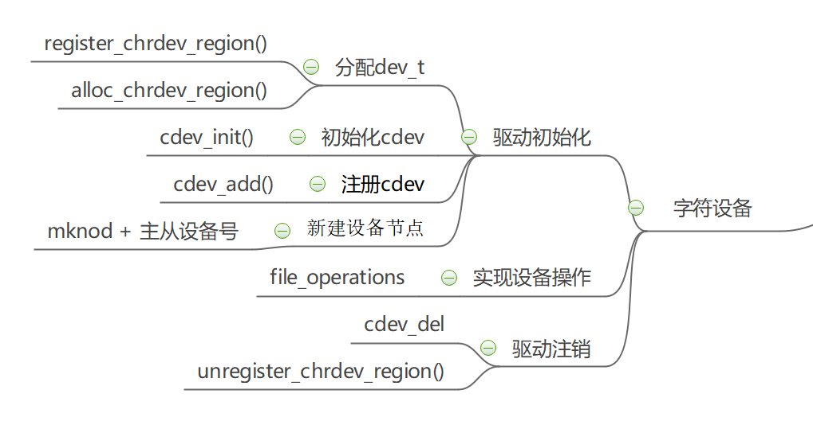

# 字符设备驱动

字符设备是最常见的设备，这种设备的读写可以直接进行而无需经过缓冲区。从用户态的角度来看，一个字符设备本质上就是一个文件，进程可以通过标准I/O操作来访问字符设备。

字符设备驱动框架如图所示：



内核使用`struct cdev`结构体来描述一个字符设备：

```C
struct cdev {
    struct kobject kobj;            
    struct module *owner;           
    struct file_operations *ops;
    struct list_head list;
    dev_t dev;
    unsigned int count;
};
```

## 快速参考

```C
#include <linux/types.h>

dev_t devID;

int MAJOR(dev_t dev);

int MINOR(dev_t dev);

dev_t MKDEV(unsigned int major, unsigned int minor);
```

```C
#include <linux/fs.h>

int register_chrdev_region(dev_t first, unsigned int count, char *name);

int alloc_chrdev_region(dev_t *dev, unsigned int firstminor, unsigned int count, char *name);

void unregister_chrdev_region(dev_t first, unsigned int count);

int register_chrdev(unsigned int major, const char *name, struct file_operations *fops);

int unregister_chrdev(unsigned int major, const char *name);

struct file_operations;

struct file;

struct inode;
```

```C
#include <linux/cdev.h>

struct cdev *cdev_alloc(void);

void cdev_init(struct cdev *dev, dev_t num, unsigned int count);

int cdev_add(struct cdev *cdev, dev_t num, unsigned int count);

void cdev_del(struct cdev *dev);
```

```C
#include <linux/kernel.h>

container_of(pointer, type, field);

#include <asm/uaccess.h>

unsigned long copy_from_user(void *to, const void *from, unsigned long count);

unsigned long copy_to_user(void *to, const void *from, unsigned long count);
```

## 设备号初始化

字符设备通过主、次设备号来标识。主设备号用来识别设备对应的驱动程序，因为现代Linux内核允许多个驱动共享主设备号，所以还需要次设备号用于正确确定设备文件所指向的设备。

`dev_t`数据类型就表示一个设备号。宏`MAJOR`、`MINOR`用于获取一个`dev_t`类型的主、次设备号。

设备号的注册与卸载有两种方式：{==手动分配==}与{==动态分配==}。

- 手动分配：

```C
int register_chrdev_region(dev_t from, unsigned count, const char *name)
```

该函数用于设备号已知的场景，仅在教学演示的时候有意义，因为你无法确定其他机器上该设备号是否被占用。

- 动态分配：

```C
int alloc_chrdev_region(dev_t *dev, unsigned baseminor, unsigned count, const char *name)

void unregister_chrdev_region(dev_t first, unsigned count)
```

> baseminor：次设备号的起始值，一般为0。

推荐使用该函数由内核动态分配设备号。

## file_operations结构体

`struct file_operations`结构体中的函数指针是字符设备驱动程序设计的主体内容。这些函数会在应用程序调用诸如`read()`、`write()`等系统调用时被内核调用。

结构体中最基本的函数有`open()`、`release()`、`read()`、`write()`，其实就是对应文件的打开、关闭、读和写。

由于用户空间不能直接访问内核空间的内存，因此需要借助两个函数完成通信：

```C
unsigned long copy_from_user(void *to, const void *from, unsigned long count);

unsigned long copy_to_user(void *to, const void *from, unsigned long count);
```

## 字符设备的注册

`struct cdev`结构体用来表示字符设备，`cdev_init()`函数可以将已经定义好的`file_operations`结构体与`struct cdev`结构体绑定起来：

```C
void cdev_init(struct cdev *cdev, const struct file_operations *fops);
```

注册完毕之后，调用`cdev_add()`函数告知内核一个新的字符设备已准备就绪，而`cdev_del()`函数用来删除字符设备。

```C
int cdev_add(struct cdev *p, dev_t dev, unsigned count);

void cdev_del(struct cdev *p);
```

## 高级字符驱动操作

### ioctl

大部分的驱动除了具备基本的读写功能之外，还需要对设备有控制能力，这些操作通过`ioctl()`函数来实现。

用户空间的`ioctl()`：`int ioctl(int fd, int cmd, ...)`。

驱动程序的`ioctl()`：`long (*unlocked_ioctl)(struct file *filep, unsigned int cmd, unsigned long arg)`。

`ioctl()`方法的cmd参数是用户与驱动交流的"协议"，内核提供了统一的命名格式，将32位的int型划分成4个段：

- dir：表示数据传输方向，占据2个bit，可以为_IOC_NONE、_IOC_READ、IOC_WRITE、_IOC_READ|_IOC_WRITE，分别表示无数据、读数据、写数据、读写数据。

- type：设备类型，占据8bit，为任意的char，作用是让ioctl命令有唯一的设备标识。

- nr：编号，为任意的unsigned char，多个ioctl命令递增。

- size：指定了arg参数的数据类型和长度，ARM架构为14bit。

内核提供了宏以生成上述格式的`ioctl()`命令：

```C
#define _IOC(dir,type,nr,size) \
    (((dir)  << _IOC_DIRSHIFT) | \
     ((type) << _IOC_TYPESHIFT) | \
     ((nr)   << _IOC_NRSHIFT) | \
     ((size) << _IOC_SIZESHIFT))
```

为了方便使用，可以用衍生宏_IOC()来直接定义`ioctl()`命令：

```C
#define _IO(type,nr)        _IOC(_IOC_NONE,(type),(nr),0)
#define _IOR(type,nr,size)  _IOC(_IOC_READ,(type),(nr),(_IOC_TYPECHECK(size)))
#define _IOW(type,nr,size)  _IOC(_IOC_WRITE,(type),(nr),(_IOC_TYPECHECK(size)))
#define _IOWR(type,nr,size) _IOC(_IOC_READ|_IOC_WRITE,(type),(nr),(_IOC_TYPECHECK(size))
```

> _IO：不带参数的ioctl命令

> _IOW：带写参数的ioctl命令

> _IOR：带读参数的ioctl命令

> _IOWR：带读写参数的ioctl命令

## 简单示例

```C
#include <linux/module.h>
#include <linux/init.h>
#include <linux/fs.h>
#include <linux/version.h>
#include <linux/device.h>
#include <linux/cdev.h>

static unsigned int major; /* major number for device */
static struct class *dummy_class;
static struct cdev dummy_cdev;

int dummy_open(struct inode * inode, struct file * filp)
{
    pr_info("Someone tried to open me\n");
    return 0;
}

int dummy_release(struct inode * inode, struct file * filp)
{
    pr_info("Someone closed me\n");
    return 0;
}

ssize_t dummy_read (struct file *filp, char __user * buf, size_t count,
                                loff_t * offset)
{
    pr_info("Nothing to read guy\n");
    return 0;
}


ssize_t dummy_write(struct file * filp, const char __user * buf, size_t count,
                                loff_t * offset)
{
    pr_info("Can't accept any data guy\n");
    return count;
}

struct file_operations dummy_fops = {
    open:       dummy_open,
    release:    dummy_release,
    read:       dummy_read,
    write:      dummy_write,
};

static int __init dummy_char_init_module(void)
{
    struct device *dummy_device;
    int error;
    dev_t devt = 0;

    /* Get a range of minor numbers (starting with 0) to work with */
    error = alloc_chrdev_region(&devt, 0, 1, "dummy_char");
    if (error < 0) {
        pr_err("Can't get major number\n");
        return error;
    }
    major = MAJOR(devt);
    pr_info("dummy_char major number = %d\n",major);

    /* Create device class, visible in /sys/class */
    dummy_class = class_create(THIS_MODULE, "dummy_char_class");
    if (IS_ERR(dummy_class)) {
        pr_err("Error creating dummy char class.\n");
        unregister_chrdev_region(MKDEV(major, 0), 1);
        return PTR_ERR(dummy_class);
    }

    /* Initialize the char device and tie a file_operations to it */
    cdev_init(&dummy_cdev, &dummy_fops);
    dummy_cdev.owner = THIS_MODULE;
    /* Now make the device live for the users to access */
    cdev_add(&dummy_cdev, devt, 1);

    dummy_device = device_create(dummy_class,
                                NULL,   /* no parent device */
                                devt,    /* associated dev_t */
                                NULL,   /* no additional data */
                                "dummy_char");  /* device name */

    if (IS_ERR(dummy_device)) {
        pr_err("Error creating dummy char device.\n");
        class_destroy(dummy_class);
        unregister_chrdev_region(devt, 1);
        return -1;
    }

    pr_info("dummy char module loaded\n");
    return 0;
}

static void __exit dummy_char_cleanup_module(void)
{
    unregister_chrdev_region(MKDEV(major, 0), 1);
    device_destroy(dummy_class, MKDEV(major, 0));
    cdev_del(&dummy_cdev);
    class_destroy(dummy_class);

    pr_info("dummy char module Unloaded\n");
}

MODULE_INIT(dummy_char_init_module);
MODULE_EXIT(dummy_char_cleanup_module);

MODULE_AUTHOR("John Madieu <john.madieu@gmail.com>");
MODULE_DESCRIPTION("Dummy character driver");
MODULE_LICENSE("GPL");
```


