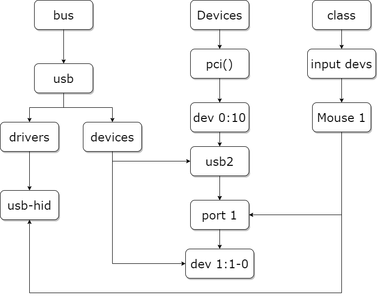
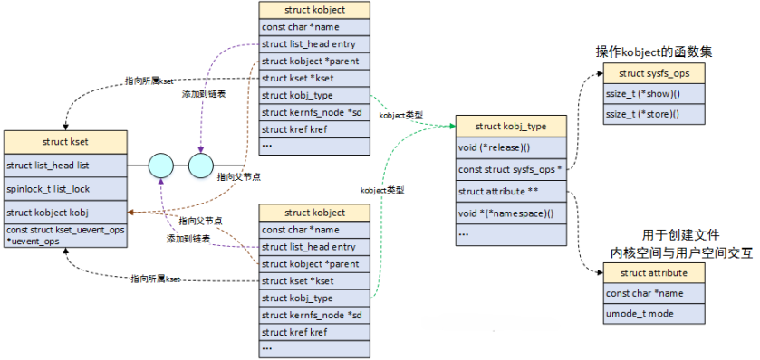

# 设备模型

由于Linux支持世界上几乎所有的、不同功能的硬件设备，导致Linux内核中有一半的代码都是设备驱动。随着硬件的快速迭代，设备驱动的代码也在快速增长。

为了降低设备的多样性带来的驱动开发的复杂度，Linux提出了{==设备模型==}的概念，该模型将设备和驱动分层，把我们编写的驱动代码分成了两块：{==设备==}与{==驱动==}。设备负责提供硬件资源而驱动负责去使用设备提供的硬件资源。二者由总线关联起来。

设备模型通过几个数据结构来反映当前系统中总线、设备以及驱动工作的情况：

- 总线(bus)：总线是CPU和设备之间信息交互的通道，所有的设备都应连接到总线上，无论是CPU内部总线还是虚拟总线。

- 类（class）：面向对象思想，将相同功能的设备，归结到一种class统一管理。

- 设备（device）：挂载在总线的物理设备。

- 驱动（driver）：硬件设备的驱动程序，负责初始化设备以及实现该设备的一些接口函数。

{==

platform bus是内核中的一种虚拟总线类型，它不是物理上存在的总线，而是一种抽象的总线。它允许开发者以一种标准的方式来描述和管理那些不通过传统物理总线连接的设备。

==}

内核使用{==sysfs文件系统==}将设备和驱动导出到用户空间，用户可以通过访问/sys目录下的文件，来查看甚至控制内核的一些驱动设备。

/sys目录记录了各个设备之间的关系。其中，/sys/bus目录下的每个子目录都是已经注册的总线类型。每个总线类型下还有两个文件夹——devices和drivers：devices是该总线类型下的所有设备，以符号链接的形式指向真正的设备（/sys/devices）。而drivers是所有注册在这个总线类型上的驱动。



/sys/devices目录下是全局的设备结构体系，包含了所有注册在各类总线上的物理设备。所有的物理设备以总线拓扑的结构来显示。

/sys/class目录下是包含所有注册在内核中的设备类型，按照设备的功能进行分类。比如鼠标的功能是作为人机交互的输入，于是被归类到/sys/class/input目录下。

那么“总线-设备-驱动”是如何配合工作的呢？


在总线上挂载了两个链表，分别管理设备模型和驱动模型。当我们向系统注册一个设备时，便会在设备的链表中插入新的设备。在插入的同时总线会执行`match()`方法对新插入的设备/驱动进行配对。若配对成功则调用`probe()`方法获取设备资源，在移除设备/驱动时，调用`remove()`方法。

## kobject、ktype和kset

设备驱动模型的基本元素有三个：

- kobject：sysfs中的一个目录，表示基本驱动对象。
- kset：一个特殊的kobject，用来管理类似的kobject。
- ktype：目录下kobject属性文件操作的接口。

它们之间的关系如下图所示：



kobject是Linux设备模型的基础，是一种抽象的、统一的对硬件设备的描述。它主要提供以下功能：

1. 通过parent指针，将所有kobject以树状结构的形式组合起来。
2. 使用引用计数kref，来记录kobject被引用的次数，在计数为0时释放它。
3. 和sysfs虚拟文件系统配合，将每一个kobject的特性，以文件的形式开放给用户空间查询。
4. 通过uevent机制，将热插拔事件（比如一个设备通过USB连接到系统）通知用户空间。

内核很少单独创建kobject对象，而是将其作为顶层基类（C语言没有面向对象的机制），嵌入到其他数据结构中。当kobject中的引用计数归零时，释放kobject所占用的内存空间。同时通过ktype中的`release()`回调函数，释放内嵌数据结构的内存空间。每一个内嵌kobject的数据结构都需要自己实现ktype中的回调函数。

```C
struct cdev {
	struct kobject kobj;
	struct module *owner;
	struct file_opeartions *ops;
	struct list_head list;
	dev_t dev;
	unsigned int count;
};
```

如此一来，要使用kobject的属性和方法，访问cdev.kobj就可以。当我们已知一个kobject指针，可以通过`container_of`宏的方式获取上层数据结构的指针：
```C
struct cdev *device = container_of(kp, struct cdev, kobj);
```
 
kobject的数据结构如下：

```C
struct kobject {
	const char		*name;
	struct list_head	entry;
	struct kobject		*parent;
	struct kset		*kset;
	struct kobj_type	*ktype;
	struct kernfs_node	*sd; 
	struct kref		kref;
	unsigned int state_initialized:1;
	unsigned int state_in_sysfs:1;
	unsigned int state_add_uevent_sent:1;
	unsigned int state_remove_uevent_sent:1;
	unsigned int uevent_suppress:1;
};
```
> name：kobject的名称，同时也是sysfs中的目录名称。当kobject添加到内核时，需要根据name注册到sysfs中。

> entry：用于将kobject加入到链表中。

> parent：指向父kobject的指针，在sysfs中表示上一层的节点。

> kset：该kobject所属的kset。若该kobject未指定parent，则会把kset作为parent。

> ktype：该kobject所属的类型。

> sd：该kobject在sysfs中的对应目录项。

> kref：原子引用计数。

> state_initialized：指示该kobject是否已经初始化。

> state_in_sysfs：指示该kobject是否已在sysfs中建立目录。

> state_add_uevent_sent/state_remove_uevent_sent：记录是否已向用户空间发送add uevent。

> uevent_suppress：如果该字段为1，则表示忽略所有上报的uevent事件。

ktype的数据结构如下：

```C
struct kobj_type {
	void (*release)(struct kobject *kobj);
	const struct sysfs_ops *sysfs_ops;
	const struct attribute_group **default_groups;
	...	
};


struct sysfs_ops {
	ssize_t (*show)(struct kobject *kobj, struct attribute *attr, char *buf);
	ssize_t (*store)(struct kobject *kobj, struct attribute *attr, const char *buf, size_t count);
};
```

> release：当kobject引用计数归零时调用该析构函数，负责释放kobject的内存。

> sysfs_ops：sysfs文件系统读写时的操作方法，cat/echo操作，最终会调用show/store方法。

> default_groups：定义了kobject的属性，由struct attritube和struct bin_attribute构成。

ktype的存在是为了描述一族kobject所具有的普遍特性。这样就不需要每个kobject定义自己的特性，而是在ktype中统一定义。

kset的数据结构如下：

```C
struct kset {
	struct list_head list;
	spinlock_t list_lock;
	struct kobject kobj;
	const struct kset_uevent_ops *uevent_ops;
};
```

> list/list_lock：用于保存该kset下所有kobject对象。

> kobj：该kset自己的kobject。

> uevent_ops：uevent是用户空间的缩写，提供了与用户空间热插拔进行通信的机制。当任何kobject需要上报uevent时，都要调用所属的kset中uevent_ops中的函数。uevent的概念稍后说明。

kset是多个kobject对象的集合。它与ktype的区别在于：具有相同ktype的kobject可以被分组到不同的kset。sysfs中的组织结构的依据就是kset，/sys/bus目录就是一个kset对象。

当设置了kset并把它添加到系统中，将在sysfs中创建一个目录。kobject的添加与删除主要是`kobject_regsiter()`函数和`kobject_unregister()`函数。在大多数情况下，kobject会在其parent指针中保存kset的指针。


kset既是kobject的集合，本身也是一个kobject，可以添加到其他集合中，从而构建更复杂的拓扑结构。

示例代码：

来源：https://www.cnblogs.com/LoyenWang/p/13334196.html

```C
#include <linux/kernel.h>
#include <linux/module.h>
#include <linux/slab.h>
#include <linux/kobject.h>

//自定义一个结构，包含了struct kobject子结构
struct test_kobj {
    int value;
    struct kobject kobj;
};

//自定义个属性结构体，包含了struct attribute结构
struct test_kobj_attribute {
    struct attribute attr;
    ssize_t (*show)(struct test_kobj *obj, struct test_kobj_attribute *attr, char *buf);
    ssize_t (*store)(struct test_kobj *obj, struct test_kobj_attribute *attr, const char *buf, size_t count);
};

//声明一个全局结构用于测试
struct test_kobj *obj;

//用于初始化sysfs_ops中的函数指针
static ssize_t test_kobj_attr_show(struct kobject *kobj, struct attribute *attr, char *buf)
{
    struct test_kobj_attribute *test_kobj_attr;
    ssize_t ret = -EIO;

    test_kobj_attr = container_of(attr, struct test_kobj_attribute, attr);
    
    //回调到具体的实现函数
    if (test_kobj_attr->show)
        ret = test_kobj_attr->show(container_of(kobj, struct test_kobj, kobj), test_kobj_attr, buf);
    
    return ret;
}

//用于初始化sysfs_ops中的函数指针
static ssize_t test_kobj_attr_store(struct kobject *kobj, struct attribute *attr, const char *buf, size_t count)
{
    struct test_kobj_attribute *test_kobj_attr;
    ssize_t ret = -EIO;

    test_kobj_attr = container_of(attr, struct test_kobj_attribute, attr);
    
    //回调到具体的实现函数
    if (test_kobj_attr->store)
        ret = test_kobj_attr->store(container_of(kobj, struct test_kobj, kobj), test_kobj_attr, buf, count);
    
    return ret;
}

//用于初始化kobj_ktype
const struct sysfs_ops test_kobj_sysfs_ops = {
    .show = test_kobj_attr_show,
    .store = test_kobj_attr_store,
};

//用于初始化kobj_ktype，最终用于释放kobject
void obj_release(struct kobject *kobj)
{
    struct test_kobj *obj = container_of(kobj, struct test_kobj, kobj);

    printk(KERN_INFO "test kobject release %s\n", kobject_name(&obj->kobj));
    
    kfree(obj);
}

//定义kobj_ktype，用于指定kobject的类型，初始化的时候使用
static struct kobj_type test_kobj_ktype = {
    .release = obj_release,
    .sysfs_ops = &test_kobj_sysfs_ops,
};

//show函数的具体实现
ssize_t name_show(struct test_kobj *obj, struct test_kobj_attribute *attr, char *buffer)
{
    return sprintf(buffer, "%s\n", kobject_name(&obj->kobj));
}

//show函数的具体实现
ssize_t value_show(struct test_kobj *obj, struct test_kobj_attribute *attr, char *buffer)
{
    return sprintf(buffer, "%d\n", obj->value);
}

//store函数的具体实现
ssize_t value_store(struct test_kobj *obj, struct test_kobj_attribute *attr, const char *buffer, size_t size)
{
    sscanf(buffer, "%d", &obj->value);

    return size;
}

//定义属性，最终注册进sysfs系统
struct test_kobj_attribute name_attribute = __ATTR(name, 0664, name_show, NULL);
struct test_kobj_attribute value_attribute = __ATTR(value, 0664, value_show, value_store);
struct attribute *test_kobj_attrs[] = {
    &name_attribute.attr,
    &value_attribute.attr,
    NULL,
};

//定义组
struct attribute_group test_kobj_group = {
    .name = "test_kobj_group",
    .attrs = test_kobj_attrs,
};

//模块初始化函数
static int __init test_kobj_init(void)
{
    int retval;
    printk(KERN_INFO "test_kobj_init\n");
    obj = kmalloc(sizeof(struct test_kobj), GFP_KERNEL);
    if (!obj) {
        return -ENOMEM;
    }
    
    obj->value = 1;
    memset(&obj->kobj, 0, sizeof(struct kobject));
    //添加进sysfs系统
    kobject_init_and_add(&obj->kobj, &test_kobj_ktype, NULL, "test_kobj");

    //在sys文件夹下创建文件
    retval = sysfs_create_files(&obj->kobj, (const struct attribute **)test_kobj_attrs);
    if (retval) {
        kobject_put(&obj->kobj);
        return retval;
    }
    
    //在sys文件夹下创建group
    retval = sysfs_create_group(&obj->kobj, &test_kobj_group);
    if (retval) {
        kobject_put(&obj->kobj);
        return retval;
    }
    
    return 0;
}

//模块清理函数
static void __exit test_kobj_exit(void)
{
    printk(KERN_INFO "test_kobj_exit\n");

    kobject_del(&obj->kobj);
    kobject_put(&obj->kobj);
    
    return;
}

module_init(test_kobj_init);
module_exit(test_kobj_exit);

MODULE_AUTHOR("LoyenWang");
MODULE_LICENSE("GPL");
```

## sysfs

sysfs文件系统是一个处于内存中的虚拟文件系统，它提供了kobject对象的层次结构视图。用户查询系统中各种设备的拓扑结构，就像查询文件目录一样简单。还可以通过导出文件的方式，将内核变量提供给用户读取或者写入。

| 目录 | 功能 |
| --- | --- |
| block | 块设备 |
| bus | 总线 |
| class | 将设备按照功能分类 |
| dev | block和char两个目录，对应部分块设备和字符设备符号链接 |
| devices | 所有设备 |
| firmwares | 固件信息 |
| fs | 文件系统 |
| hypervisor | 空目录 |
| kernel | 内核配置参数 |
| module | 模块信息 |
| power | 电源管理 |

其中最重要的目录是devices，Linux系统中所有设备都可以在这个目录下找到。其他目录中的设备其实都是devices目录中的符号链接。

sysfs的核心是把kobject对象与目录项（directory entries）关联起来，通过这种方式，我们可以轻松地查看挂载于/sys目录下的整个文件系统视图。向sysfs中添加kobject，可以使用`kobject_add()`和`kobject_create_and_add()`函数。

我们已经知道kobject可以被映射为某个文件目录，仅有如此还不够。因为这样的sysfs仅仅只是一棵树，但没有提供实际数据的文件。为了能够读写这棵树，内核提供了`attribute`和`bin_attribute`两种属性。

在前面ktype的定义中，成员`struct attribute_group`包含了这两种属性：

```C
struct attribute_group {
	const char *name;
	struct attribute **attrs;
	struct bin_attribute **bin_attrs;
};
```

`attribute`和`bin_attribute`的定义如下：

```C
struct attribute {
	const char *name;	//属性的名字
	umode_t mode;		//属性的权限
};

struct bin_attribute {
	struct attribute attr;
	size_t size;
	void *private;
	struct address_space *(*f_mapping)(void);
	ssize_t (*read)(struct file *, struct kobject *, struct bin_attribute *,
			char *, loff_t, size_t);
	ssize_t (*write)(struct file *, struct kobject *, struct bin_attribute *,
			 char *, loff_t, size_t);
	int (*mmap)(struct file *, struct kobject *, struct bin_attribute *attr,
		    struct vm_area_struct *vma);
};
```

对于默认属性的实现，由ktype->sysfs_ops成员描述：

```C
struct sysfs_ops {
	ssize_t	(*show)(struct kobject *, struct attribute *, char *);
	ssize_t	(*store)(struct kobject *, struct attribute *, const char *, size_t);
};
```

当用户空间读取一个属性时，内核会调用`show()`方法；当写一个属性时，调用`store()`方法。

`struct attribute`为普通的attribute，使用该attribute生成的sysfs文件，只能用字符串的形式读写。而`struct bin_attribute`在`struct attribute`的基础上，增加了`read()`、`write()`等函数，因此它所生成的sysfs文件可以用任何方式读写。 

## uevent

uevent是kobject功能的一部分，用于在kobject状态发生改变时，比如添加、移除，通知用户空间。用户空间收到讯息后，做出相应的处理。

该机制通常是用来支持{==热插拔==}（hotplug）设备的，例如当U盘插入后，USB相关的驱动会动态创建用于表示该U盘的device结构，并告知用户空间为该U盘动态创建/dev/目录下的设备节点。

uevent机制比较简单，当设备模型中任何设备有事件需要上报时，都会触发uevent提供的接口。uevent模块可以通过两个途径把事件上报到用户空间：一种是通过{==kmod模块==}，另一种是通过{==netlink通信机制==}。

uevent的代码主要位于kobject.h和kobject_uevent.c两个文件。

`kobject_action`定义了uevent的类型：

```C
enum kobject_action {
	KOBJ_ADD,
	KOBJ_REMOVE,
	KOBJ_CHANGE,
	KOBJ_MOVE,
	KOBJ_ONLINE,
	KOBJ_OFFLINE,
	KOBJ_BIND,
	KOBJ_UNBIND,
};
```

> ADD/REMOVE：kobject的添加/移除事件。

> CHANGE：kobject状态或者内容发生改变。

> MOVE：kobject更改名称或者更改了parent。

> ONLINE/OFFLINE：kobject的上线/下线事件

> BIND/UNBIND：kobject的绑定/解绑事件

`kobj_uevent_env`定义了事件上报时的环境变量：

```C
struct kobj_uevent_env {
	char *argv[3];
	char *envp[UEVENT_NUM_ENVP];
	int envp_idx;
	char buf[UEVENT_BUFFER_SIZE];
	int buflen;
};
```

> argv：指针数组，可以保存命令行参数，最大为3个。

> envp：指针数组，用于保存每个环境变量的地址。

> envp_idx：访问envp数组的索引。

> buf：保存uevent消息的缓冲区

> buflen：存储缓冲区的大小

`kset_uevent_ops`定义了kset的uevent接口操作：

```C
struct kset_uevent_ops {
	int (* const filter)(struct kset *kset, struct kobject *kobj);
	const char *(* const name)(struct kset *kset, struct kobject *kobj);
	int (* const uevent)(struct kset *kset, struct kobject *kobj, struct kobj_uevent_env *env);
};
```

> filter：当kobject需要上报uevent时，它所属的kset可以通过此接口过滤掉不希望上报的uevent。

> name：用于获取kset中kobject的uevent名称，这个名称通常与uevent中的ACTION字段相对应。

> uevent：当一个kobject需要上报uevent时，uevent函数会被调用，它可以为uevent添加环境变量。

uevent的一些操作API：

```C
int kobject_uevent(struct kobject *kobj, enum kobject_action action);
int kobject_uevent_env(struct kobject *kobj, enum kobject_action action, char *envp[]);
int kobject_synth_uevent(struct kobject *kobj, const char *buf, size_t count);
int add_uevent_var(struct kobj_uevent_env *env, const char *format, ...);
```

> kobject_uevent_env：以envp为环境变量，上报一个指定action的uevent。

> kobject_synth_uevent：允许发送一个合成的uevent。 

> add_uevent_var：以格式化字符串的形式，向uevent添加新的环境变量。

## device和device_driver

`device`和`device_driver`是Linux驱动开发的基本概念。驱动开发，其实就是开发指定的软件（driver）以及驱动指定的设备（device）。内核为此定义了两种数据结构，分别是`struct device`和`struct device_driver`。在<include/linux/device.h\>中可以找到这两个结构体的定义。

内核用`struct device`结构体来表示一个设备：

```C
struct device {
	struct kobject kobj;
	struct device *parent;

	struct device_private *p;

	const char *init_name; 
	const struct device_type *type;

	struct bus_type	*bus;		
	struct device_driver *driver;	
	void *platform_data;	
	void *driver_data;	
	
	void (*release)(struct device *dev);
};
```

> kobj：连接到内核的设备模型体系中。

> parent：设备的父设备，大多数情况下父设备是某种bus或者是host controller。

> p：设备的私有数据。

> init_name：设备的初始名称。

> type：设备的类型。

> bus：bus的类型。

> driver：对应的驱动程序。

> platform_data：设备私有的平台数据。

> driver_data：驱动的私有数据。

> release：设备卸载时，调用该回调函数。

设备的注册和注销函数是：

```C
int device_register(struct device *dev);

void device_unregister(struct device *dev);
```

内核用`struct device_driver`来表示驱动程序：

```C
struct device_driver {
	const char *name;
	struct bus_type *bus;
	struct module *owner;	
	
	enum probe_type probe_type;

	int (*probe) (struct device *dev);
	int (*remove) (struct device *dev);
	
	const struct attribute_group **groups;
	const struct attribute_group **dev_groups;

	struct driver_private *p;
};
```

> probe_type：指定以什么方式执行probe（异步或同步）。

> probe/remove：在注册与注销时被调用。

驱动程序的注册和注销函数是：

```C
int driver_register(struct device_driver *drv);

void driver_unregister(struct device_drvier *drv);
```

Linux设备模型框架体系下开发，主要包括两个步骤：

1. 分配一个`struct device`类型的变量，填充信息，然后将其注册到内核。

2. 分配一个`struct device_driver`类型的变量，填充信息，然后将其注册到内核。

内核会在合适的时机，调用`struct device_driver`中的各类回调函数，从而触发后者设备驱动的执行。而所有的驱动程序逻辑，其实都是由这些回调函数来实现的。

当然，一般情况下，Linux驱动开发很少直接操作上面两个结构体，因为内核又封装了一层，比如`platform_device`，封装后的接口更为简单易用。`device`和`device_driver`必须挂在在同一个bus之下，名称也必须一样，内核才能完成匹配操作。

如果匹配到了相同名称的`device`和`device_driver`，内核就会执行`device_driver`中的`probe()`回调函数，该函数是所有`driver`的入口函数，用来执行诸如硬件设备初始化、字符设备注册、文件操作ops注册等动作（对应`remove()`函数）。

## bus

总线是连接处理器和设备之间的通道。为了方便设备模型的实现，系统中的每个设备都需要连接在一个总线上，这个总线可以是内部总线、虚拟总线或者是平台总线。

总线驱动则负责实现总线的各种行为，其管理着两个链表——klist_devices和klist_drivers，分别代表该总线下的设备和驱动。当你向总线添加（移除）一个设备（驱动）时，便会在对应的列表上添加（移除）节点，同时对挂载在该总线的驱动以及设备进行匹配，在匹配过程中会忽略掉那些已经有驱动匹配的设备。


!!! tip "驱动绑定设备的时机"

	1. 驱动被注册时（如果设备已经存在）
	
	2. 设备被创建时（如果驱动已经注册）

内核用`struct bus_type`结构体抽象出总线：

```C
struct bus_type {
	const char *name;
	const char *dev_name;
	struct device *dev_root;
	const struct attribute_group **bus_groups;
	const struct attribute_group **dev_groups;
	const struct attribute_group **drv_groups;
	
	int (*match)(struct device *dev, struct device_driver *drv);
	int (*uevent)(struct device *dev, struct kobj_uevent_env *env);
	int (*probe)(struct device *dev);
	int (*remove)(struct device *dev);

	struct subsys_private *p;
};
```

> name：该bus的名称，在sysfs中以目录形式存在，比如platform bus表现为/sys/bus/platform。

> dev_name：注册到bus的设备名称。

> dev_root：根设备。

> bus_groups：bus的默认属性。

> dev_groups：bus上device的默认属性。

> drv_groups：bus上device_driver的默认属性。

> match：当属于该bus的device或者device_driver添加到内核时，调用该函数。

> uevent：当属于该bus的device，发生添加、移除或者其他动作时，调用该函数。

> probe、remove：当属于该bus的device，发生初始化和移除时，调用该函数。

> p：保存了bus模块的一些私有数据，设备和驱动的链表就存放在这里。

`struct subsys_private`结构体的定义如下：

bus的属性以`struct bus_attribute`结构体表示：

```C
struct bus_attribute{
	struct attribute attr;
	ssize_t (*show)(struct bus_type *bus, char *buf);
	ssize_t (*store)(struct bus_type *bus, const char *buf, size_t count);
};
```

bus模块的主要功能是：

- bus的注册和注销
- 处理设备或者驱动的注册与注销
- 实现驱动的`probe()`函数
- 管理bus下所有的设备和驱动

内核提供了`bus_register()`函数来注册总线，`bus_unregister()`函数来注销总线。

```C
int bus_register(struct bus_type *bus);

void bus_unregister(struct bus_type *bus);
```

当我们成功注册总线时，会在/sys/bus/目录下创建一个新目录，目录名为我们新注册的总线名。bus目录中包含了当前系统中已经注册了的所有总线，例如I2C、SPI、platform等。

## class

最后一个设备模型概念是class。class是一个设备的高级视图，它抽象出了底层的实现细节。驱动程序可以看到固态硬盘或光盘，但是在class的层次上，它们都只是磁盘而已。class允许用户空间使用设备所提供的功能，而不关心设备是如何连接的，以及如何工作的。

几乎所有的class都显示在/sys/class目录中。比如所有的网络接口都几种在/sys/class/net下，输入设备在/sys/class/input下，串行设备在/sys/class/tty下。

class的结构体定义如下：

```C
struct class {
	const char *name;

	const struct attribute_group **class_groups;
	const struct attribute_group **dev_groups;

	struct kobject *dev_kobj;

	int (*dev_uevent)(struct device *dev, struct kobj_uevent_env *env);
	char *(*devnode)(struct device *dev, umode_t *mode);

	void (*class_release)(struct class *class);
	void (*dev_release)(struct device *dev);
		
	struct subsys_private *p;
};
```

> name：class的名称，体现在/sys/class目录下。

> class_groups：class属性。

> dev_groups：dev属性。

> dev_uevent：设备的uevent回调函数。

> class_release/dev_release：release回调函数。

> p：子系统的私有数据。

对于子系统这里解释一下。/sys/class和device_name之间的那部分目录称为subsystem。也就是每个dev属性文件所在的路径都可表示为/sys/class/subsystem/device_name/dev。例如，`cat /sys/class/tty/tty0/dev`会得到4:0，这里subsystem为tty，device_name为tty0。

在/sys/class目录下创建/删除新的条目：

```C
#define class_create(owner, name)
void class_destroy(struct class *cls)
```

