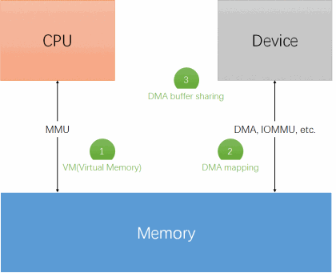

# 直接内存访问

在软件层面，应用程序可以通过虚拟地址访问内存。在硬件层面，一些外设也有内存的需求，它们希望可以直接访问内存而不需要经过CPU，或者经过某种方式可以映射成CPU的视角，从而让CPU访问，实现与应用程序的交互。

在编写设备驱动时，一些设备要求分配一大块连续的内存，比如图像、视频等外设。内核提供了DMA mapping的功能，以便这些内存可以直接被设备访问。在某些应用场景下，不同设备之间可以共享内存，这就是DMA buffer sharing机制：



## 交换数据

1.单变量访问：

```C

get_user(type val, type *address);

put_user(type val, type *address);

```

2.数组访问：

```C
unsigned long copy_to_user(void *to, const void *from, unsigned long n);

unsigned long copy_from_user(void *to, const void *from, unsigned long n);
```

3.内存映射I/O访问

将硬件地址映射为虚拟地址：

```C
void __iomem *ioremap(phys_addr_t phys_addr, size_t size);

void iounmap(volatile void __iomem *addr);
```

访问I/O虚拟地址：

```C
unsigned int ioread8(void __iomem *addr);
unsigned int ioread16(void __iomem *addr);
unsigned int ioread32(void __iomem *addr);

void iowrite8(u8 value, void __iomem *addr);
void iowrite16(u16 value, void __iomem *addr);
void iowrite32(u32 value, void __iomem *addr);
```


