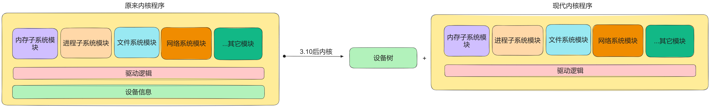
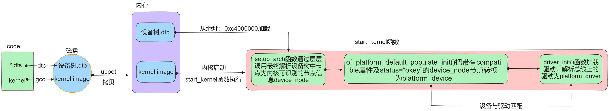

# 设备树

设备树是一种特殊的专门用于描述硬件信息的数据结构，它由一系列节点（node）和属性（property）组成，节点本身还可以包含子节点，就像一棵树状结构一样。设备树中可以描述的信息包括：

- CPU 的数量和类别
- 内存基地址和大小
- 总线和桥的配置
- 硬件外设的地址
- 中断控制器和中断使用情况
- GPIO 控制器和 GPIO 使用情况
- 时钟控制器和时钟使用情况

## 设备树的由来

现代驱动模型：<font color="blue"> 设备 </font> + <font color="blue"> 总线 </font> + <font color="blue"> 驱动 </font>，设备树就是用来替换驱动模型中的设备模块的，目的是为了实现设备资源信息与内核分离。



分离之后，由 uboot 或者其他 bootloader 将内核镜像及设备树二进制文件加载到不同的内存地址处，内核负责解析设备树，并根据设备树中的信息配置设备。



详细过程见：[setup_arch](../../arm/boot.md/#setup_arch)

## DTS、DTB和DTC

- dtsi：描述设备共有信息
- dts：描述设备独有信息
- dtc：设备树编译器
- dtb：设备树二进制文件

使用 DTC 工具编译生成 .dtb 文件：

```SHELL
dtc -I dts -O dtb -o [output].dtb [input].dts
```

反过来可以生成 .dts 文件：

```SHELL
dtc -I dtb -O dts -o [output].dts [input].dtb
```

`make dtbs`会编译所有的 .dts 文件，如果要编译指定的 .dtb，请使用`make board_name.dtb`。

## DTS基本语法

!!! info "设备树绑定文档"

	位于<Documentation/devicetree/bindings\>目录下，主要内容包括：

   	- 该模块的基本描述
   	- 必须属性
   	- 可选属性
   	- 一个例子

设备树就是由一系列 node 和 child node 组成的，每个 node 都包含一些属性用来描述这个 node 的信息。

```DTS
/dts-v1/;
/{
	node1 {
		property1 = "xxx";
		property2 = "xxx;
	};

	node2 {

	};
};
```

属性值标识了设备的特性，它的值可以是以下几种：

1. 可能为空。
2. 可能是一个 u32、u64 的数值，也可以是数组。
3. 可能是一个字符串，或者是 string list。

### 节点命名

每个节点必须有个命名，格式为 label:name@unit-address。

- label：节点别名
- name：节点名称
- unit-address：节点地址

### 特殊节点

别名节点`aliases`：用来给 device-node 定义别名，因为每次写一长串路径比较麻烦。

`chosen`节点：用来定义启动参数，其父节点必须是根节点。内核的一些启动参数可以通过`chosen`节点下的`bootargs`属性来设置，它可以被 bootloader 读取：

```DTS
chosen {
	bootargs = "root=/dev/nfs rw nfsroot=192.168.1.1 console=ttyS0,115200";
};
```

### 属性

节点由一堆属性组成，SoC 厂商有各自不同的定义，这里只介绍常用属性，更具体的可以参考相关手册。

#### compatible

`compatible`属性指定了设备的型号，用来与驱动匹配。它的格式为：(制造商，型号)。`compatible`也可以有多个属性值，按照优先级的顺序进行匹配。

对于`platform_drvier`而言，在程序中指明一个 of 匹配表之后，就可以和对应的设备树节点进行匹配，然后调用`probe()`函数，做一些初始化操作：

```C
static const struct of_device_id rockchip_rk3399_match[] = {
	{ .compatible = "rockchip,rk3399" },
	{/*empty*/},
};
```

#### status

`status`属性的值与设备状态有关，如果某节点的`status`属性为"okay"且有`compatible`属性，则内核会将其转换为`platform_device`设备，最终与驱动绑定。

#### reg

内存映射设备将有以下属性的节点映射到设备树中：

- reg
- \#address-cells
- \#size-cells

每个内存映射设备都有一个`reg`属性，格式为`reg=<address1 length1 [address2 length2] ....>`。每个地址值和长度都是一个 32 位的整数，称为 cells。`reg`属性的内容由父节点的 #address-cells 和 #size-cells 属性决定。

```DTS
cpus {
	#address-cells = <1>;
	#size-cells = <0>;
	cpu@0 {
		compatible = "arm, cortext-a9";
		reg = <0x0>;
	};

	cpu@1 {
		compatible = "arm, cortext-a9";
		reg = <0x1>;
	};
}
```

在 cpus 节点中，#address-cells 被设置为1，而 #size-cells 被设置为0。这意味着子节点的`reg`值是一个单独的u32，只表示地址，没有长度信息。

注意`reg`值必须匹配节点名称中的单元地址。

```DTS
/dts-v1/;

/ {
    #address-cells = <1>;
    #size-cells = <1>;

    ...

    serial@101f0000 {
        compatible = "arm,pl011";
        reg = <0x101f0000 0x1000 >;
    };

    serial@101f2000 {
        compatible = "arm,pl011";
        reg = <0x101f2000 0x1000 >;
    };

    gpio@101f3000 {
        compatible = "arm,pl061";
        reg = <0x101f3000 0x1000
               0x101f4000 0x0010>;
    };

    interrupt-controller@10140000 {
        compatible = "arm,pl190";
        reg = <0x10140000 0x1000 >;
    };

    spi@10115000 {
        compatible = "arm,pl022";
        reg = <0x10115000 0x1000 >;
    };

    ...

};
```

以上每个设备都被分配了一个长度为 32 位的基地址。还有一些设备依赖于外部总线：

```DTS
external-bus {
	#address-cells = <2>;
	#size-cells = <1>;

	ethernet@0,0 {
		compatible = "smc,smc91c111";
		reg = <0 0 0x1000>;
	};

	i2c@1,0 {
		compatible = "acme,a1234-i2c-bus";
		reg = <1 0 0x1000>;
		rtc@58 {
			compatible = "maxim,ds1338";
		};
	};

	flash@2,0 {
		compatible = "samsung,k8f1315ebm", "cfi-flash";
		reg = <2 0 0x4000000>;
	};
};
```

external-bus 使用 2 个地址单元来描述节点，第一位表示 chipselect 编号，第二位表示 offset。所以每个`reg`属性值包含了 3 个 cells。

还有一些设备并不由 CPU 访问，比如 i2c 总线上的节点：

```DTS
i2c@1,0 {
	compatible = "acme,a1234-i2c-bus";
	#address-cells = <1>;
	#size-cells = <0>;
	reg = <1 0 0x1000>;
	rtc@58 {
		compatible = "maxim,ds1338";
		reg = <58>;
	};
};
```

由于 i2c 总线访问设备需要地址号，但并不需要长度信息，因此`reg`属性只包含一个 cell。

#### ranges

`range`是地址映射表，按照（子地址，父地址，映射长度）的格式编写。

子地址由 ranges 所在节点的"#address-cells"属性决定，父地址由 ranges 父节点的"#address-cells"属性决定，映射长度由 ranges 父节点的"#size-cells"属性决定。

以 ranges=<0x0 0x10 0x20> 为例，表示将子地址的 0x0 映射到父地址的 0x10，共映射 0x20 个字节。

`ranges`属性用来指定某个设备的地址范围或者IO范围，这是对设备进行寻址的重要信息。操作系统通过`ranges`属性获知哪些内存区域或者IO端口是被硬件设备所占用的。

根据 ranges 属性的不同把设备分成三类：

- ranges 属性不为空：非内存映射型设备，CPU 不可以直接访问，需要通过地址映射
- ranges 属性为空：内存映射型设备，CPU 可以直接访问
- 没有 ranges 属性：只能被父节点访问

#### intc

用于表示中断控制器的相关信息，可以包含以下信息：

- interrupt-controller
- interrupt-cells
- interrupt-parent
- interrupts

中断控制器更详细的内容见[中断子系统](./interrupt.md)。

## 设备树操作函数

内核提供了一系列函数来操作设备树中的节点和属性信息，这些函数统一以`of`开头，定义在<include/linux/of.h\>中。

内核使用`device_node`结构体来描述一个节点：
```C
struct device_node {
	const char *name;
	phandle phandle;
	const char *full_name;
	struct fwnode_handle fwnode;

	struct	property *properties;
	struct	property *deadprops;	/* removed properties */
	struct	device_node *parent;
	struct	device_node *child;
	struct	device_node *sibling;
#if defined(CONFIG_OF_KOBJ)
	struct	kobject kobj;
#endif
	unsigned long _flags;
	void	*data;
#if defined(CONFIG_SPARC)
	unsigned int unique_id;
	struct of_irq_controller *irq_trans;
#endif
};
```

> name：节点中的name属性

> phandle：节点引用值，类似于引用计数

> full_name：节点的名字

> properties：属性

`struct property`的定义如下：

```C
struct property{
    char *name;    //属性名
    int length;    //属性值的长度
    void *value;   //指向属性值的指针
    struct property *next;      //指向下一个属性的指针
    unsigned long _flags;       //表示属性的类别
    unsigned int unique_id;     //标识设备的唯一属性
    struct bin_attribute attr;  //表示属性的一些元数据
};
```

### 查找节点

1. 通过节点名字查找指定节点

    ```C
	struct device_node *of_find_node_by_name(struct device_node *from, const char *name);
	```

	> from：开始查找的节点，NULL则表示从根节点开始查找

	> name：要查找的节点名

	> 返回值：找到的节点，NULL表示失败


2. 通过`device_type`和`compatible`两个属性来查找指定节点

	```C
	struct device_node *of_find_compatible_node(struct device_node *from, const char *type, const char *compatible)
	```

3. 通过`of_device_id`匹配表来查找指定节点

	```C
	struct device_node *of_find_matching_node_and_match(struct device_node *from, const struct of_device_id *matches, const struct of_device_id **match)
	```

4. 通过路径来查找指定节点

	```C
	inline struct device_node *of_find_node_by_path(const char *path)
	```

	> path：带有全路径的节点名，可以使用节点的别名


5. 通过亲缘关系来查找节点：

	```C
	struct device_node *of_get_parent(const struct device_node *node)

	struct device_node *of_get_next_child(const struct device_node *node, struct device_node *prev)

	struct device_node *of_get_child_by_name(const struct device_node *node, const char *name)
	```

### 提取属性值

6. 查找指定的属性

	```C
	struct property *of_find_property(const struct device_node *np, const char *name, int *lenp)
	```

	> np：设备节点

	> name：属性名字

	> lenp：属性值的字节数

7. 获取属性中元素的数量

	```C
	int of_property_count_elems_of_size(const struct device_node *np, const char *propname, int elem_size)
	```

8. 从属性中获取指定标号的 u32 类型数据

	```C
	int of_property_read_u32_index(const struct device_node *np, const char *propname, u32 index, u32 *out_value)
	```

	> propname：要读取的属性名

	> index：读取该属性下的第几个值

	> out_value：读取到的值

9. 读取 u32 数组类型的数据

	```C
	int of_property_read_u32_array(const struct device_node *np, const char *propname, u32 *out_values, size_t sz_min, size_t sz_max)
	```

10. 读取属性中字符串的值

	```C
	int of_property_read_string_index(const struct device_node *np,const char *propname, int index,const char **out_string)
	```

11. 内存映射

	该函数可以自动完成物理地址到虚拟地址的转换：

	```C
	void __iomem *of_iomap(struct device_node *np, int index)
	```