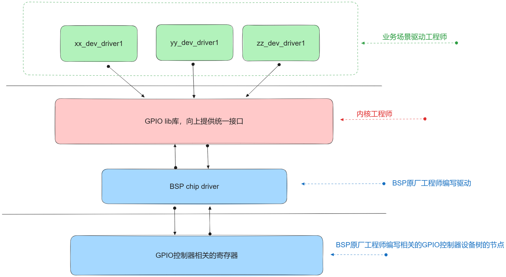
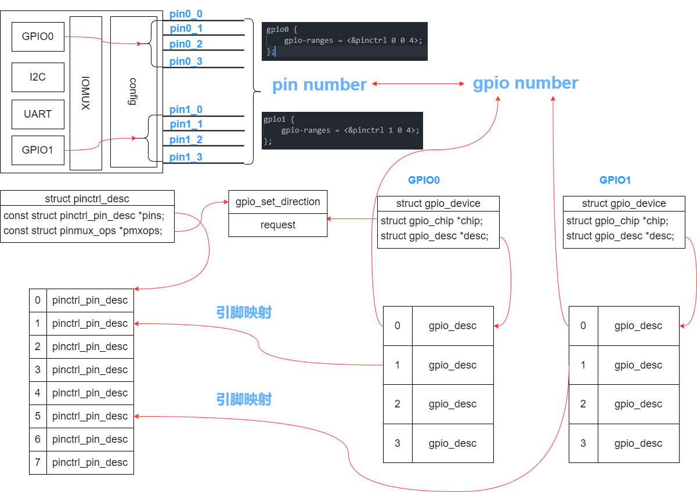

# GPIO子系统

对于像 LED 这样直接连接到 GPIO 控制器的设备，可以直接使用 GPIO 子系统的方式来描述设备所使用的 GPIO 资源。



## 设备树描述

对于 GPIO 控制器，对应的设备节点需要声明 gpio-controller 属性，并设置 #gpio-cells 的大小，比如 rk3399 的 GPIO 控制器而言，由原厂 BSP 工程师编写代码如下：

```DTS title="rk3399.dtsi"
gpio0: gpio0@ff720000 {
	compatible = "rockchip,gpio-bank";
	reg = <0x0 0xff720000 0x0 0x100>;
	clocks = <&pmucru PCLK_GPIO0_PMU>;
	interrupts = <GIC_SPI 14 IRQ_TYPE_LEVEL_HIGH 0>;

	gpio-controller;
	#gpio-cells = <0x2>;

	interrupt-controller;
	#interrupt-cells = <0x2>;
};

gpio1: gpio1@ff730000 {
	compatible = "rockchip,gpio-bank";
	reg = <0x0 0xff730000 0x0 0x100>;
	clocks = <&pmucru PCLK_GPIO1_PMU>;
	interrupts = <GIC_SPI 15 IRQ_TYPE_LEVEL_HIGH 0>;

	gpio-controller;
	#gpio-cells = <0x2>;

	interrupt-controller;
	#interrupt-cells = <0x2>;
};
```

驱动开发人员如果需要让某个设备引用 GPIO 资源，则可以在设备树中直接添加描述。注意，这种方式只能在 BSP 原厂工程师已经添加了 GPIO 控制器的描述时使用：

```DTS title="rk3399-firefly.dts"
leds {
	compatible = "gpio-leds";
	pinctrl-names = "default";
	pinctrl-0 = <&work_led_pin>, <&diy_led_pin>;

	work_led: led-0 {
		label = "work";
		default-state = "on";
		gpios = <&gpio2 RK_PD3 GPIO_ACTIVE_HIGH>;
	};

	diy_led: led-1 {
		label = "diy";
		default-state = "off";
		gpios = <&gpio0 RK_PB5 GPIO_ACTIVE_HIGH>;
	};
};
```

GPIO 还可以有其他属性，比如：

- ngpios=<18>：表示该 GPIO 控制器有 18 个引脚
- gpio-ranges=<&pinctrl1 0 20 10>：表示该 GPIO 的 0 ~ 9 引脚映射到 pinctrl1 的 20 ~ 29 引脚

## 数据结构

```C
struct gpio_device {
	int			id;
	struct device		dev;
	struct cdev		chrdev;
	struct device		*mockdev;
	struct module		*owner;
	struct gpio_chip	*chip;
	struct gpio_desc	*descs;
	int			base;
	u16			ngpio;
	const char		*label;
	void			*data;
	struct list_head        list;
	struct blocking_notifier_head notifier;
	struct rw_semaphore	sem;

#ifdef CONFIG_PINCTRL
	/*
	 * If CONFIG_PINCTRL is enabled, then gpio controllers can optionally
	 * describe the actual pin range which they serve in an SoC. This
	 * information would be used by pinctrl subsystem to configure
	 * corresponding pins for gpio usage.
	 */
	struct list_head pin_ranges;
#endif
};
```

每个 GPIO controller 都会用一个`struct gpio_device`结构体来表示，其中：

- 在`struct gpio_chip`中提供引脚操作函数

- 在`struct gpio_desc`中提供每个引脚的信息

```C
struct gpio_chip {
	const char		*label;
	struct gpio_device	*gpiodev;
	struct device		*parent;
	struct module		*owner;

	int			(*request)(struct gpio_chip *gc,
						unsigned int offset);
	void			(*free)(struct gpio_chip *gc,
						unsigned int offset);
	int			(*get_direction)(struct gpio_chip *gc,
						unsigned int offset);
	int			(*direction_input)(struct gpio_chip *gc,
						unsigned int offset);
	int			(*direction_output)(struct gpio_chip *gc,
						unsigned int offset, int value);
	int			(*get)(struct gpio_chip *gc,
						unsigned int offset);
	int			(*get_multiple)(struct gpio_chip *gc,
						unsigned long *mask,
						unsigned long *bits);
	void			(*set)(struct gpio_chip *gc,
						unsigned int offset, int value);
	void			(*set_multiple)(struct gpio_chip *gc,
						unsigned long *mask,
						unsigned long *bits);
	int			(*set_config)(struct gpio_chip *gc,
					      unsigned int offset,
					      unsigned long config);
	int			(*to_irq)(struct gpio_chip *gc,
						unsigned int offset);

	void			(*dbg_show)(struct seq_file *s,
						struct gpio_chip *gc);

	int			(*init_valid_mask)(struct gpio_chip *gc,
						   unsigned long *valid_mask,
						   unsigned int ngpios);

	int			(*add_pin_ranges)(struct gpio_chip *gc);

	int			base;
	u16			ngpio;
	u16			offset;
	const char		*const *names;
	bool			can_sleep;
};
```

> label：GPIO控制器名称

> gpiodevice：GPIO控制器设备

> parent：GPIO控制器父设备

> base：GPIO引脚基值

> ngpio：GPIO引脚数量

> offset：GPIO引脚偏移

> names：GPIO引脚名称

> can_sleep：是否可以在睡眠状态下访问GPIO

使用`gpiochip_add_data()`宏来注册`struct gpio_chip`。

GPIO 中的每个引脚都对应一个`struct gpio_desc`，引脚信息被保存在一个链表中：

```C
struct gpio_desc {
	struct gpio_device	*gdev;
	unsigned long		flags;
/* flag symbols are bit numbers */
#define FLAG_REQUESTED	0
#define FLAG_IS_OUT	1
#define FLAG_EXPORT	2	/* protected by sysfs_lock */
#define FLAG_SYSFS	3	/* exported via /sys/class/gpio/control */
#define FLAG_ACTIVE_LOW	6	/* value has active low */
#define FLAG_OPEN_DRAIN	7	/* Gpio is open drain type */
#define FLAG_OPEN_SOURCE 8	/* Gpio is open source type */
#define FLAG_USED_AS_IRQ 9	/* GPIO is connected to an IRQ */
#define FLAG_IRQ_IS_ENABLED 10	/* GPIO is connected to an enabled IRQ */
#define FLAG_IS_HOGGED	11	/* GPIO is hogged */
#define FLAG_TRANSITORY 12	/* GPIO may lose value in sleep or reset */
#define FLAG_PULL_UP    13	/* GPIO has pull up enabled */
#define FLAG_PULL_DOWN  14	/* GPIO has pull down enabled */
#define FLAG_BIAS_DISABLE    15	/* GPIO has pull disabled */
#define FLAG_EDGE_RISING     16	/* GPIO CDEV detects rising edge events */
#define FLAG_EDGE_FALLING    17	/* GPIO CDEV detects falling edge events */
#define FLAG_EVENT_CLOCK_REALTIME	18 /* GPIO CDEV reports REALTIME timestamps in events */

	/* Connection label */
	const char		*label;
	/* Name of the GPIO */
	const char		*name;
#ifdef CONFIG_OF_DYNAMIC
	struct device_node	*hog;
#endif
#ifdef CONFIG_GPIO_CDEV
	/* debounce period in microseconds */
	unsigned int		debounce_period_us;
#endif
};
```

> gdev：属于哪个GPIO controller

> flags：标志位，表示引脚的状态

> label：一般等于`struct gpio_chip`的label

> name：引脚名

## GPIO函数接口

GPIO 的函数接口有两套：legacy 模式和基于 descriptor 的。由于第一套已被废弃，这里只介绍基于 descriptor 的。

### 获取GPIO描述符

```C
struct gpio_desc *gpiod_get(struct device *dev,
					 const char *con_id,
					 enum gpiod_flags flags);
struct gpio_desc *gpiod_get_index(struct device *dev,
					       const char *con_id,
					       unsigned int idx,
					       enum gpiod_flags flags);
struct gpio_descs *gpiod_get_array(struct device *dev,
						const char *con_id,
						enum gpiod_flags flags);

struct gpio_desc *devm_gpiod_get(struct device *dev,
					      const char *con_id,
					      enum gpiod_flags flags);
struct gpio_desc *devm_gpiod_get_index(struct device *dev,
						    const char *con_id,
						    unsigned int idx,
						    enum gpiod_flags flags);
struct gpio_descs *devm_gpiod_get_array(struct device *dev,
						     const char *con_id,
						     enum gpiod_flags flags);
```

其中 gpiod_flags 如下：
```C
enum gpiod_flags {
	GPIOD_ASIS	= 0,
	GPIOD_IN	= GPIOD_FLAGS_BIT_DIR_SET,
	GPIOD_OUT_LOW	= GPIOD_FLAGS_BIT_DIR_SET | GPIOD_FLAGS_BIT_DIR_OUT,
	GPIOD_OUT_HIGH	= GPIOD_FLAGS_BIT_DIR_SET | GPIOD_FLAGS_BIT_DIR_OUT |
			  GPIOD_FLAGS_BIT_DIR_VAL,
	GPIOD_OUT_LOW_OPEN_DRAIN = GPIOD_OUT_LOW | GPIOD_FLAGS_BIT_OPEN_DRAIN,
	GPIOD_OUT_HIGH_OPEN_DRAIN = GPIOD_OUT_HIGH | GPIOD_FLAGS_BIT_OPEN_DRAIN,
};
```

!!! info "重要标志位"

	- GPIOD_ASIS：不初始化GPIO
	- GPIOD_IN：将GPIO初始化为输入端
	- GPIOD_OUT_LOW：将GPIO初始化为输出端，并将值设置为0
	- GPIOD_OUT_HIGH：将GPIO初始化为输出端，并将值设置为1

假如有设备树描述如下所示：
```DTS
foo_device {
	compatible = "acme, foo";
	...
	led-gpios  <&gpioa 15 GPIO_ACTIVE_HIGH>,	/*red*/
			   <&gpiob 16 GPIO_ACTIVE_HIGH>,	/*green*/
			   <&gpioc 17 GPIO_ACTIVE_HIGH>;	/*blue*/

	power-gpios = <&gpiob 1 GPIO_ACTIVE_LOW>;	
};
```

这里 led-gpios 中的 led 就是 function，&gpioa 是特定 GPIO 控制器节点的 pointer handle，数字 15、16、17 是每个 GPIO 控制器的编号，GPIO_ACTIVE_HIGH 就是标志位。在驱动程序中获取 GPIO 资源可以这么做：

```C
struct gpio_desc *gpio_red = gpiod_get_index(dev, "led", 0, GPIO_ACTIVE_HIGH);
struct gpio_desc *gpio_green = gpiod_get_index(dev, "led", 1, GPIO_ACTIVE_HIGH);
struct gpio_desc *gpio_blue = gpiod_get_index(dev, "led", 2, GPIO_ACTIVE_HIGH);
struct gpio_desc *gpio_power = gpiod_get(dev, "power", GPIO_ACTIVE_LOW);
```

### 设置GPIO方向

编写需要控制 GPIO 的驱动程序时，必须指定方向。可以直接使用带 flags 参数的`devm_gpio_get()`函数，或者如果 flags 设置为 GPIOD_ASIS 时，就可以在随后调用`gpiod_direction_input()`或`gpiod_direction_output()`来设置方向：

```C
int gpiod_direction_input(struct gpio_desc *desc);
int gpiod_direction_output(struct gpio_desc *desc, int value);
```

### 获取GPIO电平

```C
int gpiod_get_value(const struct gpio_desc *desc);
void gpiod_set_value(struct gpio_desc *desc, int value);
```

Linux 驱动程序不关注物理电路的实现，所有的`gpoid_set_value_xxx()`函数均使用逻辑值进行操作——将参数 value 解释为“有效”（“1”）或者“无效”（“0”），函数会自动地设置响应的物理电路。

在 GPIO 的世界中，有两种常见的逻辑电平：

- 高电平有效（High Active）：在这个模式下，逻辑高（通常是1或3V以上）表示引脚的激活状态。
- 低电平有效（Low Active）：在这个模式下，逻辑低（通常是0V或GND）表示引脚的激活状态。

如果一条物理线路被设置为低电平有效，当调用`gpio_set_value(gpio, 1)`时，会自动设置物理电路为低电平。

!!! note "相关函数汇总"

	| 函数名 | 电平有效属性 | 物理线路 |
	|-------|-------------|----------|
	| gpiod_set_value(gpio, 0) | 高电平有效 | 配置为低电平 |
	| gpiod_set_value(gpio, 1) | 高电平有效 | 配置为高电平 |
	| gpiod_set_value(gpio, 0) | 低电平有效 | 配置为高电平 |
	| gpiod_set_value(gpio, 1) | 低电平有效 | 配置为低电平 |
	
### 获取GPIO中断号

中断请求可以通过 GPIO 触发，使用以下函数获取与给定 GPIO 对应的 irq 号：
```C
int gpiod_to_irq(const struct gpio_desc *desc);
```

该函数通过传递一个 GPIO descriptor，返回 irq 号，如果该 GPIO 没有与中断控制器连接，则返回 -EINVAL。

该函数返回的 irq 号可以用在`request_irq()`和`free_irq()`函数中。

释放GPIO：
```C
void gpiod_put(struct gpio_desc *desc);
void gpiod_put_array(struct gpio_descs *descs);
```

## 与Pinctrl子系统交互

1. 在 GPIO 设备树中使用`gpio-ranges`来描述它们之间的联系
2. 解析这些联系，在注册`struct gpio-chip`时自动调用
3. 在 GPIO 驱动程序中，提供`gpio_chip->request`函数；在 Pinctrl 子系统中，提供`pmxops->gpio_request_enable()`函数或者`pmxops->request()`函数



## 简单示例

```C
#include <linux/init.h>
#include <linux/module.h>
#include <linux/kernel.h>
#include <linux/platform_device.h>      /* For platform devices */
#include <linux/gpio/consumer.h>        /* For GPIO Descriptor interface */
#include <linux/interrupt.h>            /* For IRQ */
#include <linux/of.h>                   /* For DT*/

/*
 * Let us consider the bellow mapping
 *
 *    foo_device {
 *       compatible = "packt,gpio-descriptor-sample";
 *       led-gpios = <&gpio2 15 GPIO_ACTIVE_HIGH>, // red 
 *                   <&gpio2 16 GPIO_ACTIVE_HIGH>, // green 
 *
 *       btn1-gpios = <&gpio2 1 GPIO_ACTIVE_LOW>;
 *       btn2-gpios = <&gpio2 1 GPIO_ACTIVE_LOW>;
 *   };
 */

static struct gpio_desc *red, *green, *btn1, *btn2;
static int irq;

static irqreturn_t btn1_pushed_irq_handler(int irq, void *dev_id)
{
    int state;

    /* read the button value and change the led state */
    state = gpiod_get_value(btn2);
    gpiod_set_value(red, state);
    gpiod_set_value(green, state);

    pr_info("btn1 interrupt: Interrupt! btn2 state is %d)\n", state);
    return IRQ_HANDLED;
}

static const struct of_device_id gpiod_dt_ids[] = {
    { .compatible = "packt,gpio-descriptor-sample", },
    { /* sentinel */ }
};


static int my_pdrv_probe (struct platform_device *pdev)
{
    int retval;
    struct device *dev = &pdev->dev;

    /*
     * We use gpiod_get/gpiod_get_index() along with the flags
     * in order to configure the GPIO direction and an initial
     * value in a single function call.
     *
     * One could have used:
     *  red = gpiod_get_index(dev, "led", 0);
     *  gpiod_direction_output(red, 0);
     */
    red = gpiod_get_index(dev, "led", 0, GPIOD_OUT_LOW);
    green = gpiod_get_index(dev, "led", 1, GPIOD_OUT_LOW);

    /*
     * Configure Button GPIOs as input
     *
     * After this, one can call gpiod_set_debounce()
     * only if the controller has the feature
     * For example, to debounce  a button with a delay of 200ms
     *  gpiod_set_debounce(btn1, 200);
     */
    btn1 = gpiod_get(dev, "btn1", GPIOD_IN);
    btn2 = gpiod_get(dev, "btn2", GPIOD_IN);

    irq = gpiod_to_irq(btn1);
    retval = request_threaded_irq(irq, NULL,
                            btn1_pushed_irq_handler,
                            IRQF_TRIGGER_LOW | IRQF_ONESHOT,
                            "gpio-descriptor-sample", NULL);
    pr_info("Hello! device probed!\n");
    return 0;
}

static int my_pdrv_remove(struct platform_device *pdev)
{
    free_irq(irq, NULL);
    gpiod_put(red);
    gpiod_put(green);
    gpiod_put(btn1);
    gpiod_put(btn2);
    pr_info("good bye reader!\n");
    return 0;
}

static struct platform_driver mypdrv = {
    .probe      = my_pdrv_probe,
    .remove     = my_pdrv_remove,
    .driver     = {
        .name     = "gpio_descriptor_sample",
        .of_match_table = of_match_ptr(gpiod_dt_ids),  
        .owner    = THIS_MODULE,
    },
};
module_platform_driver(mypdrv);

MODULE_AUTHOR("John Madieu <john.madieu@gmail.com>");
MODULE_LICENSE("GPL");
```

