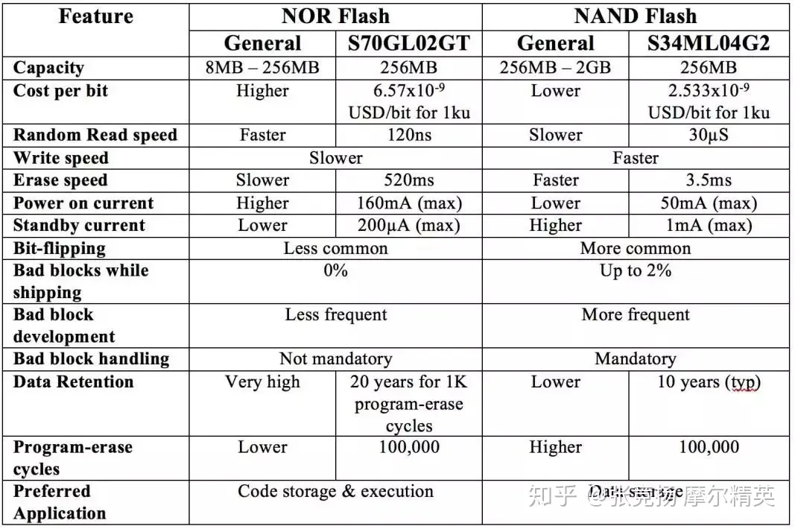

# 硬件知识

## 闪存

嵌入式系统设计人员在选择闪存时必须考虑许多因素：使用哪种类型的Flash架构，是选择串行接口还是并行接口，是否需要校验码（ECC）等。如果处理器或控制器仅支持一种类型的接口，则会限制选项，因此可以轻松选择内存。但是，情况往往并非如此。例如，一些FPGA支持串行NOR闪存、并行NOR闪存和NAND闪存来存储配置数据，同样，它们也可以用来存储用户数据，这使得选择正确的存储器件更加困难。本文将讨论闪存的不同方面，重点放在NOR Flash和NAND Flash的差异方面。

### 存储架构

闪存将信息存储在由浮栅晶体管制成的存储单元中。这些技术的名称解释了存储器单元的组织方式。在NOR闪存中，每个存储器单元的一端连接到源极线，另一端直接连接到类似于NOR门的位线。在NAND闪存中，几个存储器单元（通常是8个单元）串联连接，类似于NAND门。

NOR Flash架构提供足够的地址线来映射整个存储器范围。这提供了随机访问和短读取时间的优势，这使其成为代码执行的理想选择。另一个优点是100％已知的零件寿命。缺点包括较大的单元尺寸导致每比特的较高成本和较慢的写入和擦除速度。

相比之下，与NOR闪存相比，NAND闪存具有更小的单元尺寸和更高的写入和擦除速度。缺点包括较慢的读取速度和I / O映射类型或间接接口，这更复杂并且不允许随机访问。值得注意的是，NAND Flash中的代码执行是通过将内容映射到RAM来实现的，这与直接从NOR Flash执行代码不同。另一个主要缺点是存在坏块。NAND闪存通常在部件的整个生命周期内出现额外的位故障时具有98％的良好位，因此，器件内需要ECC功能。

### 存储容量

与NOR Flash相比，NAND Flash的密度要高得多，主要是因为其每比特成本较低。NAND Flash通常具有1Gb至16Gb的容量。NOR Flash的密度范围从64Mb到2Gb。由于NAND Flash具有更高的密度，因此主要用于数据存储应用。

### 擦除/读写

在NOR和NAND闪存中，存储器被组织成擦除块。该架构有助于在保持性能的同时保持较低的成本，例如，较小的块尺寸可以实现更快的擦除周期。然而，较小块的缺点是芯片面积和存储器成本增加。由于每比特成本较低，与NOR闪存相比，NAND闪存可以更经济高效地支持更小的擦除块。目前，NAND闪存的典型块大小为8KB至32KB，NOR Flash为64KB至256KB。

NAND闪存中的擦除操作非常简单，而在NOR闪存中，每个字节在擦除之前都需要写入“0”。这使得NOR闪存的擦除操作比NAND闪存慢得多。例如，NAND闪存S34ML04G2需要3.5ms才能擦除128KB块，而NOR闪存S70GL02GT则需要约520ms来擦除类似的128KB扇区。这相差近150倍。

如前所述，NOR闪存具有足够的地址和数据线来映射整个存储区域，类似于SRAM的工作方式。例如，具有16位数据总线的2Gbit（256MB）NOR闪存将具有27条地址线，可以对任何存储器位置进行随机读取访问。在NAND闪存中，使用多路复用地址和数据总线访问存储器。典型的NAND闪存使用8位或16位多路复用地址/数据总线以及其他信号，如芯片使能，写使能，读使能，地址锁存使能，命令锁存使能和就绪/忙碌。NAND Flash需要提供命令（读，写或擦除），然后是地址和数据。这些额外的操作使NAND闪存的随机读取速度慢得多。例如，NAND闪存S34ML04G2需要30μS，而NOR闪存S70GL02GT需要120nS。因此，NOR比NAND快250倍。

为了克服或减少较慢读取速度的限制，通常以NAND闪存中的页方式读取数据，每个页是擦除块的较小子部分。仅在每个读取周期开始时使用地址和命令周期顺序读取一页的内容。NAND闪存的顺序访问持续时间通常低于NOR闪存设备中的随机访问持续时间。利用NOR Flash的随机访问架构，需要在每个读取周期切换地址线，从而累积随机访问以进行顺序读取。随着要读取的数据块的大小增加，NOR闪存中的累积延迟变得大于NAND闪存。因此，NAND Flash顺序读取可以更快。但是，由于NAND Flash的初始读取访问持续时间要长得多，两者的性能差异只有在传输大数据块时才是明显的，通常大小要超过1 KB。

在两种Flash技术中，只有在块为空时才能将数据写入块。NOR Flash的慢速擦除操作使写操作更慢。在NAND Flash中，类似于读取，数据通常以页形式编写或编程（通常为2KB）。例如，单独使用NAND闪存S34ML04G2 写入页面需要300μS。

为了加快写入操作，现代NOR Flashes还采用类似于页面写入的缓冲区编程。例如，前文所述的NOR闪存S70GL02GT，支持缓冲器编程，这使其能够实现与单词相似写入超时多字节编程。例如，512字节数据的缓冲区编程可以实现1.14MBps的吞吐量。

### 能耗

NOR闪存在初始上电期间通常需要比NAND闪存更多的电流。但是，NOR Flash的待机电流远低于NAND Flash。两个闪存的瞬时有功功率相当。因此，有效功率由存储器活动的持续时间决定。NOR Flash在随机读取方面具有优势，而NAND Flash在擦除，写入和顺序读取操作中消耗的功率相对较低。

### 可靠性

保存数据的可靠性是任何存储设备的重要性能指标。闪存会遭遇称为位翻转的现象，其中一些位可以被反转。这种现象在NAND闪存中比在NOR闪存中更常见。出于产量考虑，NAND闪存随附着散布的坏块，随着擦除和编程周期在NAND闪存的整个生命周期中持续，更多的存储器单元变坏。因此，坏块处理是NAND闪存的强制性功能。另一方面，NOR闪存带有零坏块，在存储器的使用寿命期间具有非常低的坏块累积。因此，当涉及存储数据的可靠性时，NOR Flash具有优于NAND Flash的优势。

可靠性的另一个方面是数据保留，这方面，NOR Flash再次占据优势，例如，NOR Flash闪存S70GL02GT提供20年的数据保留，最高可达1K编程/擦除周期，NAND闪存S34ML04G2提供10年的典型数据保留。

编程和擦除周期的数量曾是一个需要考虑的重要特性。这是因为与NOR闪存相比，NAND闪存用于提供10倍更好的编程和擦除周期。随着技术进步，这已不再适用，因为这两种存储器在这方面的性能已经很接近。例如，S70GL02GT NOR和S34ML04G2 NAND都支持100,000个编程 - 擦除周期。但是，由于NAND闪存中使用的块尺寸较小，因此每次操作都会擦除较小的区域。与NOR Flash相比，其整体寿命更长。

通常，NOR闪存是需要较低容量、快速随机读取访问和更高数据可靠性的应用的理想选择，例如代码执行所需。NAND闪存则非常适用于需要更高内存容量和更快写入和擦除操作的数据存储等应用。
