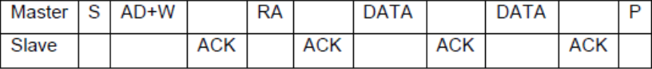

# I2C子系统


## I2C协议

i2c物理总线示意图如下所示：


i2c支持主从模式，其中一个主设备、多个从设备，各设备地址独立。主设备负责调度总线，决定某个事件和其中一个从设备通信，其他从设备要想通信只能等待。当SCL与SDA同为高电平时，为空闲态。

i2c物理总线使用两条总线线路：

- SCL:时钟线，传输CLK信号
- SDA：数据线，通信数据都通过SDA

通信特征：

- 串行：只有一根数据线
- 同步：主从设备在同一个时钟频率下工作
- 非差分：因为I2C通信速率不高，而且通信双方距离很近，一般是板级通信，所以使用电平信号通信
- 低速率：传输的数据量不大，本身通信速率很低

i2c的通信过程：

1. 开始信号（S）：SDA线从高电平到低电平跳变，同时SCL线保持高电平。
2. 发送地址和读/写位：主设备通过SDA线发送一个7位设备地址，后面跟着一个读/写位。
3. 响应信号(ACK)：每一次传输必须伴有一个响应信号，在SCL为高时，通过拉低SDA并保持低来实现。如果从设备忙，它可以使SCL保持在低电平，这会强制使主设备进入等待状态。当从设备空闲后，并且释放时钟线，原来的数据传输才会继续。
4. 数据传输：SDA上传输的数据必须在SCL为高电平期间保持稳定，SDA上的数据只能在SCL为低电平时变化。
5. 停止信号(P)：数据传输结束时，SDA线从低电平到高电平的跳变，同时SCL线保持高电平，表示通信结束。

对于第4点解释一下：

SDA上传输的数据必须在SCL为高电平期间保持稳定：

- 在I2C通信中，SCL负责同步数据传输。当SCL线处于高电平时，表示数据线SDA上的数据稳定有效。
- 这意味着在SCL为高电平的期间，SDA线上的数据必须保持不变，任何试图改变SDA线状态的操作都必须等到SCL线变为低电平。

SDA上的数据只能在SCL为低电平时变化：

- 当SCL线处于低电平时，表示数据线SDA可以变化，此时主机或从设备可以改变SDA线的状态，比如发送或接收数据。
- 数据线SDA上的变化（比如从高电平到低电平，或从低电平到高电平）都必须发生在SCL线的上升沿或下降沿。


  
连续字节的写入如下图所示：



## 设备树描述

```C
i2c0: i2c@fdd40000 {
	compatible = "rockchip,rk3568-i2c", "rockchip,rk3399-i2c";
	reg = <0x0 0xfdd40000 0x0 0x1000>;
	interrupts = <GIC_SPI 46 IRQ_TYPE_LEVEL_HIGH>;
	clocks = <&pmucru CLK_I2C0>, <&pmucru PCLK_I2C0>;
	clock-names = "i2c", "pclk";
	pinctrl-0 = <&i2c0_xfer>;
	pinctrl-names = "default";
	#address-cells = <1>;
	#size-cells = <0>;
	status = "disabled";
};
```

## 数据结构


- i2c核心：管理i2c驱动和i2c设备的匹配、删除
- i2c设备：i2c硬件设备的抽象
- i2c驱动：i2c设备的驱动程序
- i2c适配器：i2c控制器，用于驱动和设备之间的通信

i2c驱动中最核心的四个数据结构：

- `struct i2c_adapter`
- `struct i2c_algorithm`
- `struct i2c_client`
- `struct i2c-driver`

`struct i2c_adapter`对应一个i2c controller，所有的设备驱动都需要经过`struct i2c_adapter`对象的处理才能与物理设备通信：

```C
struct i2c_adapter {
	struct module *owner;
	unsigned int class;		  /* classes to allow probing for */
	const struct i2c_algorithm *algo; /* the algorithm to access the bus */
	void *algo_data;

	/* data fields that are valid for all devices	*/
	const struct i2c_lock_operations *lock_ops;
	struct rt_mutex bus_lock;
	struct rt_mutex mux_lock;

	int timeout;			/* in jiffies */
	int retries;
	struct device dev;		/* the adapter device */
	unsigned long locked_flags;	/* owned by the I2C core */
#define I2C_ALF_IS_SUSPENDED		0
#define I2C_ALF_SUSPEND_REPORTED	1

	int nr;
	char name[48];
	struct completion dev_released;

	struct mutex userspace_clients_lock;
	struct list_head userspace_clients;

	struct i2c_bus_recovery_info *bus_recovery_info;
	const struct i2c_adapter_quirks *quirks;

	struct irq_domain *host_notify_domain;
	struct regulator *bus_regulator;
};
```

`struct i2c_algorithm`定义了i2c控制器与i2c设备之间通信的算法，最重要的成员是`master_xfer()`函数，用来将数据发送到i2c controller：
```C
struct i2c_algorithm {
	/*
	 * If an adapter algorithm can't do I2C-level access, set master_xfer
	 * to NULL. If an adapter algorithm can do SMBus access, set
	 * smbus_xfer. If set to NULL, the SMBus protocol is simulated
	 * using common I2C messages.
	 *
	 * master_xfer should return the number of messages successfully
	 * processed, or a negative value on error
	 */
	int (*master_xfer)(struct i2c_adapter *adap, struct i2c_msg *msgs,
			   int num);
	int (*master_xfer_atomic)(struct i2c_adapter *adap,
				   struct i2c_msg *msgs, int num);
	int (*smbus_xfer)(struct i2c_adapter *adap, u16 addr,
			  unsigned short flags, char read_write,
			  u8 command, int size, union i2c_smbus_data *data);
	int (*smbus_xfer_atomic)(struct i2c_adapter *adap, u16 addr,
				 unsigned short flags, char read_write,
				 u8 command, int size, union i2c_smbus_data *data);

	/* To determine what the adapter supports */
	u32 (*functionality)(struct i2c_adapter *adap);

#if IS_ENABLED(CONFIG_I2C_SLAVE)
	int (*reg_slave)(struct i2c_client *client);
	int (*unreg_slave)(struct i2c_client *client);
#endif
};
```

> master_xfer：作为主设备时的发送函数

> smbus_xfer：作为从设备时的接收函数

`struct i2c_client`表示连接到i2c总线上的设备，是具体硬件设备的抽象：

```C
struct i2c_client {
	unsigned short flags;		/* div., see below		*/
	unsigned short addr;		/* chip address - NOTE: 7bit	*/
	char name[I2C_NAME_SIZE];
	struct i2c_adapter *adapter;	/* the adapter we sit on	*/
	struct device dev;		/* the device structure		*/
	int init_irq;			/* irq set at initialization	*/
	int irq;			/* irq issued by device		*/
	struct list_head detected;
#if IS_ENABLED(CONFIG_I2C_SLAVE)
	i2c_slave_cb_t slave_cb;	/* callback for slave mode	*/
#endif
	void *devres_group_id;		/* ID of probe devres group	*/
};
```

`struct i2c_driver`表示i2c设备所对应的驱动程序：

```C
struct i2c_driver {
	unsigned int class;

	/* Standard driver model interfaces */
	int (*probe)(struct i2c_client *client, const struct i2c_device_id *id);
	int (*remove)(struct i2c_client *client);

	/* New driver model interface to aid the seamless removal of the
	 * current probe()'s, more commonly unused than used second parameter.
	 */
	int (*probe_new)(struct i2c_client *client);

	/* driver model interfaces that don't relate to enumeration  */
	void (*shutdown)(struct i2c_client *client);

	/* Alert callback, for example for the SMBus alert protocol.
	 * The format and meaning of the data value depends on the protocol.
	 * For the SMBus alert protocol, there is a single bit of data passed
	 * as the alert response's low bit ("event flag").
	 * For the SMBus Host Notify protocol, the data corresponds to the
	 * 16-bit payload data reported by the slave device acting as master.
	 */
	void (*alert)(struct i2c_client *client, enum i2c_alert_protocol protocol,
		      unsigned int data);

	/* a ioctl like command that can be used to perform specific functions
	 * with the device.
	 */
	int (*command)(struct i2c_client *client, unsigned int cmd, void *arg);

	struct device_driver driver;
	const struct i2c_device_id *id_table;

	/* Device detection callback for automatic device creation */
	int (*detect)(struct i2c_client *client, struct i2c_board_info *info);
	const unsigned short *address_list;
	struct list_head clients;
};
```

在[平台设备驱动](./platform.md)一章中我们描述了平台总线的概念，i2c总线有类似的功能，用来管理i2c设备和i2c驱动的匹配和删除操作：

```C
/*drivers/i2c/i2c-core.c*/
struct bus_type i2c_bus_type = {
    .name       = "i2c",
    .match      = i2c_device_match,
    .probe      = i2c_device_probe,
    .remove     = i2c_device_remove,
    .shutdown   = i2c_device_shutdown,
};
```

多个设备可以挂在同一个i2c总线上，i2c总线驱动由芯片厂商提供。

`struct i2c_msg`结构体表示i2c传输的消息。

```C
struct i2c_msg {
	__u16 addr;
	__u16 flags;
	...
	__u16 len;
	__u8 *buf;
};
```

> addr：从设备地址

> flags：标志位

> len：传输数据的长度

> buf：传输数据缓冲区

## I2C函数接口

向内核注册/注销一个i2c_adapter：
```C
int i2c_add_adapter(struct i2c_adapter *adap)
int i2c_del_adapter(struct i2c_adapter *adap)
```

注册/注销一个i2c驱动：
```C
int i2c_add_driver(struct i2c_driver *driver)
int i2c_del_driver(struct i2c_driver *driver)
```

传输数据：
```C
int i2c_transfer(struct i2c_adapter *adap, struct i2c_msg *msgs, int num)
```


