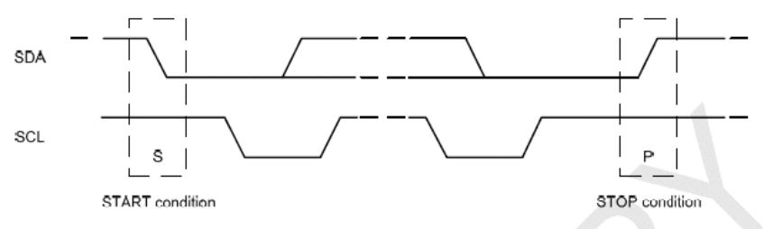

# I2C子系统

## I2C协议

I2C总线主要用于短距离、低速的芯片之间的通信。它有两根信号线，数据线SDA用于收发数据，时钟线SCL用于时钟同步。将芯片与总线对应的线相连即可通信。

I2C物理总线示意图如下所示：


I2C支持主从模式，一个主设备、多个从设备，各设备地址独立。主设备负责调度总线，决定某个事件和其中一个从设备通信，其他从设备要想通信只能等待。当SCL与SDA同为高电平时，为空闲态。

主机在发送起始信号后，必须先发送一个字节(8bit)的数据，该数据的前7位表示从机地址，最后一位表示字节的传送方向。总线上所有的从机都会收到该数据，然后与自己的地址进行比较，如果符合就返回一个ACK信号，再根据数据传送方向将自己定位为发送器或者接收器。

通信特征：

- 串行：只有一根数据线
- 同步：主从设备在同一个时钟频率下工作
- 半双工：只能单向通信，不能同时收发数据
- 非差分：因为I2C通信速率不高，而且通信双方距离很近，一般是板级通信，所以使用电平信号通信
- 低速率：传输的数据量不大，本身通信速率很低

I2C的通信过程：

1. 开始信号（S）：SDA线从高电平到低电平跳变，同时SCL线保持高电平。
2. 发送地址和读/写位：主设备通过SDA线发送一个7位设备地址，后面跟着一个读/写位。
3. 响应信号(ACK)：每一次传输必须伴有一个响应信号，在SCL为高时，通过拉低SDA并保持低来实现。如果从设备忙，它可以使SCL保持在低电平，这会强制使主设备进入等待状态。当从设备空闲后，并且释放时钟线，原来的数据传输才会继续。
4. 数据传输：SCL为低电平时，SDA可以变化高低电平来传输数据。
5. 数据读取：SCL为高电平时，读取一位数据，SDA不允许变化。
6. 停止信号(P)：数据传输结束时，SDA线从低电平到高电平的跳变，同时SCL线保持高电平，表示通信结束。


  
连续字节的写入如下图所示：


## 设备树描述

```DTS
i2c0: i2c@fdd40000 {
	compatible = "rockchip,rk3568-i2c", "rockchip,rk3399-i2c";
	reg = <0x0 0xfdd40000 0x0 0x1000>;
	interrupts = <GIC_SPI 46 IRQ_TYPE_LEVEL_HIGH>;
	clocks = <&pmucru CLK_I2C0>, <&pmucru PCLK_I2C0>;
	clock-names = "i2c", "pclk";
	pinctrl-0 = <&i2c0_xfer>;
	pinctrl-names = "default";
	#address-cells = <1>;
	#size-cells = <0>;
	status = "disabled";
};
```

## 数据结构


- I2C核心：管理I2C驱动和I2C设备的匹配、删除 
- I2C设备：I2C硬件设备的抽象
- I2C驱动：I2C设备的驱动程序
- I2C适配器：I2C控制器，用于驱动和设备之间的通信

### I2C总线驱动

`struct i2c_adapter`用于描述一个特定的I2C总线控制器：

```C
struct i2c_adapter {
	struct module *owner;
	unsigned int class;		  /* classes to allow probing for */
	const struct i2c_algorithm *algo; /* the algorithm to access the bus */
	void *algo_data;

	/* data fields that are valid for all devices	*/
	const struct i2c_lock_operations *lock_ops;
	struct rt_mutex bus_lock;
	struct rt_mutex mux_lock;

	int timeout;			/* in jiffies */
	int retries;
	struct device dev;		/* the adapter device */
	unsigned long locked_flags;	/* owned by the I2C core */
#define I2C_ALF_IS_SUSPENDED		0
#define I2C_ALF_SUSPEND_REPORTED	1

	int nr;
	char name[48];
	struct completion dev_released;

	struct mutex userspace_clients_lock;
	struct list_head userspace_clients;

	struct i2c_bus_recovery_info *bus_recovery_info;
	const struct i2c_adapter_quirks *quirks;

	struct irq_domain *host_notify_domain;
	struct regulator *bus_regulator;
};
```

`struct i2c_adapter`中最重要的成员——`struct i2c_algorithm`，它规定了I2C控制器与I2C设备之间通信的算法，而`MASTER_XFER()`函数，用来规定如何将数据发送到I2C设备：
```C
struct i2c_algorithm {
	/*
	 * If an adapter algorithm can't do I2C-level access, set master_xfer
	 * to NULL. If an adapter algorithm can do SMBus access, set
	 * smbus_xfer. If set to NULL, the SMBus protocol is simulated
	 * using common I2C messages.
	 *
	 * master_xfer should return the number of messages successfully
	 * processed, or a negative value on error
	 */
	int (*master_xfer)(struct i2c_adapter *adap, struct i2c_msg *msgs,
			   int num);
	int (*master_xfer_atomic)(struct i2c_adapter *adap,
				   struct i2c_msg *msgs, int num);
	int (*smbus_xfer)(struct i2c_adapter *adap, u16 addr,
			  unsigned short flags, char read_write,
			  u8 command, int size, union i2c_smbus_data *data);
	int (*smbus_xfer_atomic)(struct i2c_adapter *adap, u16 addr,
				 unsigned short flags, char read_write,
				 u8 command, int size, union i2c_smbus_data *data);

	/* To determine what the adapter supports */
	u32 (*functionality)(struct i2c_adapter *adap);

#if IS_ENABLED(CONFIG_I2C_SLAVE)
	int (*reg_slave)(struct i2c_client *client);
	int (*unreg_slave)(struct i2c_client *client);
#endif
};
```

> master_xfer：作为主设备时的发送函数

> smbus_xfer：实现SMBus协议的发送函数

`struct i2c_algorithm`中的通信函数以`struct i2c_msg`为基本单位：

```C
struct i2c_msg {
	__u16 addr;
	__u16 flags;
#define I2C_M_RD		0x0001	/* guaranteed to be 0x0001! */
#define I2C_M_TEN		0x0010	/* use only if I2C_FUNC_10BIT_ADDR */
#define I2C_M_DMA_SAFE		0x0200	/* use only in kernel space */
#define I2C_M_RECV_LEN		0x0400	/* use only if I2C_FUNC_SMBUS_READ_BLOCK_DATA */
#define I2C_M_NO_RD_ACK		0x0800	/* use only if I2C_FUNC_PROTOCOL_MANGLING */
#define I2C_M_IGNORE_NAK	0x1000	/* use only if I2C_FUNC_PROTOCOL_MANGLING */
#define I2C_M_REV_DIR_ADDR	0x2000	/* use only if I2C_FUNC_PROTOCOL_MANGLING */
#define I2C_M_NOSTART		0x4000	/* use only if I2C_FUNC_NOSTART */
#define I2C_M_STOP		0x8000	/* use only if I2C_FUNC_PROTOCOL_MANGLING */
	__u16 len;
	__u8 *buf;
};
```

> addr：从设备地址

> flags：标志位

> len：传输数据的长度

> buf：传输数据缓冲区

### I2C设备驱动

`struct i2c_client`表示挂载到I2C总线上的设备，是具体硬件设备的抽象：

```C
struct i2c_client {
	unsigned short flags;		/* div., see below		*/
	unsigned short addr;		/* chip address - NOTE: 7bit	*/
	char name[I2C_NAME_SIZE];
	struct i2c_adapter *adapter;	/* the adapter we sit on	*/
	struct device dev;		/* the device structure		*/
	int init_irq;			/* irq set at initialization	*/
	int irq;			/* irq issued by device		*/
	struct list_head detected;
#if IS_ENABLED(CONFIG_I2C_SLAVE)
	i2c_slave_cb_t slave_cb;	/* callback for slave mode	*/
#endif
	void *devres_group_id;		/* ID of probe devres group	*/
};
```

`struct i2c_driver`表示I2C设备所对应的驱动程序：

```C
struct i2c_driver {
	unsigned int class;

	/* Standard driver model interfaces */
	int (*probe)(struct i2c_client *client, const struct i2c_device_id *id);
	int (*remove)(struct i2c_client *client);

	/* New driver model interface to aid the seamless removal of the
	 * current probe()'s, more commonly unused than used second parameter.
	 */
	int (*probe_new)(struct i2c_client *client);

	/* driver model interfaces that don't relate to enumeration  */
	void (*shutdown)(struct i2c_client *client);

	/* Alert callback, for example for the SMBus alert protocol.
	 * The format and meaning of the data value depends on the protocol.
	 * For the SMBus alert protocol, there is a single bit of data passed
	 * as the alert response's low bit ("event flag").
	 * For the SMBus Host Notify protocol, the data corresponds to the
	 * 16-bit payload data reported by the slave device acting as master.
	 */
	void (*alert)(struct i2c_client *client, enum i2c_alert_protocol protocol,
		      unsigned int data);

	/* a ioctl like command that can be used to perform specific functions
	 * with the device.
	 */
	int (*command)(struct i2c_client *client, unsigned int cmd, void *arg);

	struct device_driver driver;
	const struct i2c_device_id *id_table;

	/* Device detection callback for automatic device creation */
	int (*detect)(struct i2c_client *client, struct i2c_board_info *info);
	const unsigned short *address_list;
	struct list_head clients;
};
```

在[平台设备驱动](./platform.md)一章中我们描述了平台总线的概念，I2C总线有类似的功能，用来管理I2C设备和I2C驱动的匹配和删除操作：

```C
/*drivers/i2c/i2c-core.c*/
struct bus_type i2c_bus_type = {
    .name       = "i2c",
    .match      = i2c_device_match,
    .probe      = i2c_device_probe,
    .remove     = i2c_device_remove,
    .shutdown   = i2c_device_shutdown,
};
```

多个设备可以挂在同一个I2C总线上，I2C总线驱动由芯片厂商提供。


## I2C函数接口

向内核注册/注销一个i2c_adapter：
```C
int i2c_add_adapter(struct i2c_adapter *adap)
int i2c_del_adapter(struct i2c_adapter *adap)
```

注册/注销一个I2C驱动：
```C
int i2c_add_driver(struct i2c_driver *driver)
int i2c_del_driver(struct i2c_driver *driver)
```

传输数据：
```C
int i2c_transfer(struct i2c_adapter *adap, struct i2c_msg *msgs, int num)
```

## 使用i2c tools

i2c tools是一个命令行工具，可以用来操作I2C设备。输入`sudo apt install i2c-tools`安装。

- i2cdetect：扫描I2C总线上的设备

```SHELL
Usage: i2cdetect [-y] [-a] [-q|-r] I2CBUS [FIRST LAST]
       i2cdetect -F I2CBUS
       i2cdetect -l
  I2CBUS is an integer or an I2C bus name
  If provided, FIRST and LAST limit the probing range.
  
  y:关闭交互式，不会显示警告信息
  a:扫描总线上所有设备
  q:使用SMBus的"quick write"命令进行检测，不建议使用
  r:使用SMBus的"receive byte"命令进行检测，不建议使用
  i2cbus:指定查询某个总线编号
  first、last：扫描的地址范围
```

- i2cset：向I2C设备某个寄存器写入值

```SHELL
Usage: i2cset [-f] [-y] [-m MASK] [-r] [-a] I2CBUS CHIP-ADDRESS DATA-ADDRESS [VALUE] ... [MODE]
  I2CBUS is an integer or an I2C bus name
  ADDRESS is an integer (0x03 - 0x77, or 0x00 - 0x7f if -a is given)
  MODE is one of:
    c (byte, no value)
    b (byte data, default)
    w (word data)
    i (I2C block data)
    s (SMBus block data)
    Append p for SMBus PEC
    
    f:强制访问
    y:指令执行自动yes，否则会提示确认执行Continue? [Y/n] Y，不加参数y会有很多执行提示，可以帮助判断
    r:写入后立即回读寄存器的值，并将结果与写入的值进行比较
    i2cbus：总线编号
    chip-address:i2c设备地址
    data-address:i2c寄存器地址
    value 要写入的值
    mode：指定读取的大小，b字节，w字，s是SMBus块，i是i2c块
```

- i2cget：从I2C设备某个寄存器读取值

```SHELL
Usage: i2cget [-f] [-y] [-a] I2CBUS CHIP-ADDRESS [DATA-ADDRESS [MODE]]
  I2CBUS is an integer or an I2C bus name
  ADDRESS is an integer (0x03 - 0x77, or 0x00 - 0x7f if -a is given)
  MODE is one of:
    b (read byte data, default)
    w (read word data)
    c (write byte/read byte)
    Append p for SMBus PEC
    
    f:强制访问
    y:关闭交互模式，不会提示警告信息
    i2cbus:总线编号
    chip-address:i2c设备地址
    data-address:i2c寄存器地址
    mode:指定读取的大小，b字节，w字，s是SMBus块，i是i2c块
```

- i2cdump：读取某个I2C设备所有寄存器的值

```SHELL
Usage: i2cdump [-f] [-y] [-r first-last] [-a] I2CBUS ADDRESS [MODE [BANK [BANKREG]]]
  I2CBUS is an integer or an I2C bus name
  ADDRESS is an integer (0x03 - 0x77, or 0x00 - 0x7f if -a is given)
  MODE is one of:
    b (byte, default)
    w (word)
    W (word on even register addresses)
    s (SMBus block)
    i (I2C block)
    c (consecutive byte)
    Append p for SMBus PEC
    
    r:指定寄存器范围，只能扫描从 first 到 last 区域
    f:强制访问设备
    y:关闭人机交互模式
    i2cbus:总线编号
    address:指定设备地址
    mode:指定读取的大小，b字节，w字，s是SMBus块，i是i2c块
```

一般寄存器都是8位地址的，i2cdump、i2cget、i2cset也是设置读取8位的地址，如果一次超过8位，需要用i2ctransfer。

- i2ctransfer：一次性读写多个字节

```SHELL
Usage: i2ctransfer [-f] [-y] [-v] [-V] [-a] I2CBUS DESC [DATA] [DESC [DATA]]...
  I2CBUS is an integer or an I2C bus name
  DESC describes the transfer in the form: {r|w}LENGTH[@address]
    1) read/write-flag 2) LENGTH (range 0-65535) 3) I2C address (use last one if omitted)
  DATA are LENGTH bytes for a write message. They can be shortened by a suffix:
    = (keep value constant until LENGTH)
    + (increase value by 1 until LENGTH)
    - (decrease value by 1 until LENGTH)
    p (use pseudo random generator until LENGTH with value as seed)
```

## 简单示例


```C
#include <linux/version.h>
#include <linux/module.h>
#include <linux/init.h>
#include <linux/kernel.h>
#include <linux/slab.h>
#include <linux/fs.h>
#include <linux/errno.h>
#include <linux/cdev.h>
#include <linux/device.h>
#include <linux/mutex.h>
#include <linux/i2c.h>
#include <linux/delay.h>
#include <asm/uaccess.h>

/* 
 * The structure to represent 'eep_dev' devices.
 *  data - data buffer;
 *  buffer_size - size of the data buffer;
 *  block_size - maximum number of bytes that can be read or written 
 *    in one call;
 *  eep_mutex - a mutex to protect the fields of this structure;
 *  cdev - character device structure.
 */
struct eep_dev {
	unsigned char *data;
	struct i2c_client *client;
	struct mutex eep_mutex;
	int current_pointer;
	struct cdev cdev;
};

#define EEP_DEVICE_NAME     "packt-mem"
#define EEP_PAGE_SIZE           128
#define EEP_SIZE            1024*64 /* 24LC512 is 64KB sized */


static unsigned int eep_major = 0;
static unsigned int minor = 0;
static struct class *eep_class = NULL;

int  eep_open(struct inode *inode, struct file *filp)
{
	struct eep_dev *dev = NULL;
	dev = container_of(inode->i_cdev, struct eep_dev, cdev);
	
	if (dev == NULL){
	    pr_err("Container_of did not found any valid data\n");
		return -ENODEV; /* No such device */
	}
    dev->current_pointer = 0;
    /* store a pointer to struct eep_dev here for other methods */
    filp->private_data = dev;

    if (inode->i_cdev != &dev->cdev){
        pr_err("Device open: internal error\n");
        return -ENODEV; /* No such device */
    }

    dev->data = (unsigned char*)kzalloc(EEP_SIZE, GFP_KERNEL);
    if (dev->data == NULL){
        pr_err("Error allocating memory\n");
        return -ENOMEM;
    }
    return 0;
}

/*
 * Release is called when device node is closed
 */
int eep_release(struct inode *inode, struct file *filp)
{
    struct eep_dev *dev = filp->private_data;
    if (dev->data != NULL){
        kfree(dev->data);
        dev->data = NULL ;
    }
    dev->current_pointer = 0;
    return 0;
}

ssize_t  eep_read(struct file *filp, char __user *buf,
                    size_t count, loff_t *f_pos)
{
    int _reg_addr;
    u8 reg_addr[2];
    struct i2c_msg msg[2];
    struct eep_dev *dev = filp->private_data;
    ssize_t retval = 0;

    if (mutex_lock_killable(&dev->eep_mutex))
        return -EINTR;

    if (*f_pos >= EEP_SIZE) /* EOF */
        goto end_read;

    if(dev->current_pointer >= EEP_SIZE){
        retval = 0; /* EOF */
        goto end_read;
     }
	
    if (dev->current_pointer + count > EEP_SIZE)
        count = EEP_SIZE - dev->current_pointer;

    if (count > EEP_SIZE)
        count = EEP_SIZE;

    _reg_addr = dev->current_pointer;
    reg_addr[0] = (u8)(_reg_addr >> 8);
    reg_addr[1] = (u8)(_reg_addr & 0xFF);

    msg[0].addr = dev->client->addr;
    msg[0].flags = 0;                    /* Write */
    msg[0].len = 2;                      /* Address is 2byte coded */
    msg[0].buf = reg_addr;          
    msg[1].addr = dev->client->addr;
    msg[1].flags = I2C_M_RD;             /* We need to read */
    msg[1].len = count; 
    msg[1].buf = dev->data;

    if (i2c_transfer(dev->client->adapter, msg, 2) < 0)
        pr_err("ee24lc512: i2c_transfer failed\n"); 
 
    if(copy_to_user(buf, dev->data, count) != 0){
        retval = -EIO;
        goto end_read;
    }

    retval = count;
    dev->current_pointer += count ;

end_read:
    mutex_unlock(&dev->eep_mutex);
    return retval;
}

int transacWrite(struct eep_dev *dev,
        int _reg_addr, unsigned char *data,
        int offset, unsigned int len)
{    
    unsigned char tmp[len + 2];
    struct i2c_msg msg[1];
    
    tmp[0] =  (u8)(_reg_addr >> 8);
    tmp[1] =  (u8)(_reg_addr & 0xFF);
    memcpy (tmp + 2, &(data[offset]), len);
    msg[0].addr = dev->client->addr;
    msg[0].flags = 0;                    /* Write */
    msg[0].len = len + 2; /* Address is 2 bytes coded */
    msg[0].buf = tmp;

    if (i2c_transfer(dev->client->adapter, msg, 1) < 0){
        pr_err("ee24lc512: i2c_transfer failed\n");  
        return -1;
     }
     return len;  
}

ssize_t  eep_write(struct file *filp, const char __user *buf,
                    size_t count,  loff_t *f_pos)
{
    int _reg_addr, offset, remain_in_page, nb_page, last_remain, i;
    struct eep_dev *dev = filp->private_data;
    ssize_t retval = 0;

    if (mutex_lock_killable(&dev->eep_mutex))
        return -EINTR;

    if(dev->current_pointer >= EEP_SIZE){
        retval = -EINVAL;
        goto end_write;
    }

    if (*f_pos >= EEP_SIZE) {
        /* Writing beyond the end of the buffer is not allowed. */
        retval = -EINVAL;
        goto end_write;
    }

    if (dev->current_pointer + count >= EEP_SIZE)
        count = EEP_SIZE - dev->current_pointer;

    if (count > EEP_SIZE)
        count = EEP_SIZE;

    if (copy_from_user(dev->data, buf, count) != 0){
        retval = -EFAULT;
        goto end_write;
    }

    _reg_addr =  dev->current_pointer;
    offset = 0;
    remain_in_page = (EEP_PAGE_SIZE - (dev->current_pointer % EEP_PAGE_SIZE)) % EEP_PAGE_SIZE;
    nb_page = (count - remain_in_page) / EEP_PAGE_SIZE;
    last_remain = (count - remain_in_page) % EEP_PAGE_SIZE ;

    if (remain_in_page > 0){
        retval = transacWrite(dev, _reg_addr, dev->data, offset, remain_in_page);
        if (retval < 0)
            goto end_write;
        offset += remain_in_page;
        dev->current_pointer += remain_in_page;
        _reg_addr += remain_in_page;
        retval = offset;
        mdelay(10);
    }

    if (nb_page < 1 && last_remain < 1)
        goto end_write;

    for (i=0; i < nb_page; i++){
        retval = transacWrite(dev, _reg_addr, dev->data, offset, EEP_PAGE_SIZE);
        if (retval < 0)
            goto end_write;
        offset += EEP_PAGE_SIZE;
        _reg_addr += EEP_PAGE_SIZE;
        dev->current_pointer += EEP_PAGE_SIZE;
        retval = offset;
        mdelay(10);
    }

    if (last_remain > 0){
        retval = transacWrite(dev, _reg_addr, dev->data, offset, last_remain);
        if (retval < 0)
            goto end_write;
        offset += last_remain;
        _reg_addr += last_remain;
        dev->current_pointer += last_remain;
        retval = offset;
        mdelay(10);
    }

end_write:
    mutex_unlock(&dev->eep_mutex);
    return retval;
}

loff_t eep_llseek(struct file *filp, loff_t off, int whence)
{
	struct eep_dev *dev = (struct eep_dev *)filp->private_data;
	loff_t newpos = 0;
	
	switch(whence) {
	  case 0: /* SEEK_SET */
		newpos = off;
		break;

	  case 1: /* SEEK_CUR */
		newpos = filp->f_pos + off;
		break;

	  case 2: /* SEEK_END - Not supported */
		return -EINVAL;

	  default: /* can't happen */
		return -EINVAL;
	}
	if (newpos < 0 || EEP_SIZE)
		return -EINVAL;
	
	dev->current_pointer = newpos;	
	filp->f_pos = newpos;
	return newpos;
}

struct file_operations eep_fops = {
	.owner =    THIS_MODULE,
	.read =     eep_read,
	.write =    eep_write,
	.open =     eep_open,
	.release =  eep_release,
	.llseek =   eep_llseek,
};

static const struct of_device_id ee24lc512_ids[] = {
	{ .compatible = "microchip,ee24lc512", },
	{ /* sentinel */ }
};

static int ee24lc512_probe(struct i2c_client *client,
			    const struct i2c_device_id *id)
{
    unsigned char data[5];
    u8 reg_addr[2];
    struct i2c_msg msg[2];
    int err = 0;
    dev_t devno = 0;
    struct eep_dev *eep_device = NULL;
    struct device *device = NULL;

    if (!i2c_check_functionality(client->adapter, I2C_FUNC_SMBUS_BYTE_DATA))
        return -EIO;

   /* 
    * We send a simple i2c transaction. If it fails,
    * it meants there is no eeprom
    */
    
    reg_addr[0] =  0x00;
    reg_addr[1] =  0x00;

    msg[0].addr = client->addr;
    msg[0].flags = 0;                    /* Write */
    msg[0].len = 2;                      /* Address is 2byte coded */
    msg[0].buf = reg_addr;          

    msg[1].addr = client->addr;
    msg[1].flags = I2C_M_RD;             /* We need to read */
    msg[1].len = 5; //count; 
    msg[1].buf = data;

    if (i2c_transfer(client->adapter, msg, 2) < 0)
        pr_err("ee24lc512: i2c_transfer failed\n");

    /* Get a range of minor numbers (starting with 0) to work with */
    err = alloc_chrdev_region(&devno, 0, 1, EEP_DEVICE_NAME);
    if (err < 0) {
        pr_err("alloc_chrdev_region() failed for %s\n", EEP_DEVICE_NAME);
        return err;
    }
    eep_major = MAJOR(devno);

    /* Create device class */
    eep_class = class_create(THIS_MODULE, EEP_DEVICE_NAME);
    if (IS_ERR(eep_class)) {
        err = PTR_ERR(eep_class);
        goto fail;
    }

    eep_device = (struct eep_dev *)kzalloc(sizeof(struct eep_dev), GFP_KERNEL);
    if (eep_device == NULL) {
        err = -ENOMEM;
        goto fail;
    }

    /* Memory is to be allocated when the device is opened the first time */
    eep_device->data = NULL;
    eep_device->client = client;
    eep_device->current_pointer = 0;
    mutex_init(&eep_device->eep_mutex);

    cdev_init(&eep_device->cdev, &eep_fops);
    eep_device->cdev.owner = THIS_MODULE;
    err = cdev_add(&eep_device->cdev, devno, 1);

    if (err){
        pr_err("Error while trying to add %s", EEP_DEVICE_NAME);
        goto fail;
    }

    device = device_create(eep_class, NULL, /* no parent device */
                            devno, NULL, /* no additional data */
                            EEP_DEVICE_NAME);

    if (IS_ERR(device)) {
        err = PTR_ERR(device);
        pr_err("failure while trying to create %s device", EEP_DEVICE_NAME);
        cdev_del(&eep_device->cdev);
        goto fail;
    }

    i2c_set_clientdata(client, eep_device);
    return 0; /* success */

fail:
    if(eep_class != NULL){
        device_destroy(eep_class, MKDEV(eep_major, minor));
        class_destroy(eep_class);
    }
    if (eep_device != NULL)
        kfree(eep_device);
    return err;
}

static int ee24lc512_remove(struct i2c_client *client)
{
    struct eep_dev *eep_device = i2c_get_clientdata(client);
    device_destroy(eep_class, MKDEV(eep_major, 0));

    kfree(eep_device->data);
    mutex_destroy(&eep_device->eep_mutex);
    kfree(eep_device);
    class_destroy(eep_class);
    unregister_chrdev_region(MKDEV(eep_major, 0), 1);
	return 0;
}

static const struct i2c_device_id ee24lc512_id[] = {
	{"ee24lc512", 0},
	{},
};

MODULE_DEVICE_TABLE(i2c, ee24lc512_id);

static struct i2c_driver ee24lc512_i2c_driver = {
	.driver = {
		.owner = THIS_MODULE,
		.name = "ee24lc512",
		.of_match_table = of_match_ptr(ee24lc512_ids),
	},
	.probe = ee24lc512_probe,
	.remove = ee24lc512_remove,
	.id_table = ee24lc512_id,
};

module_i2c_driver(ee24lc512_i2c_driver);

MODULE_AUTHOR("John Madieu <john.madieu@gmail.com>");
MODULE_LICENSE("GPL");
```


