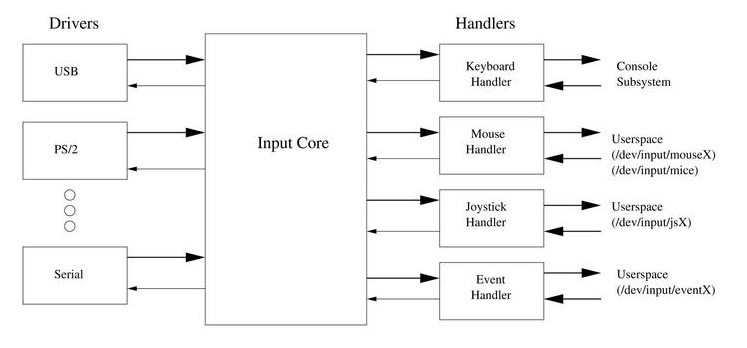

# Input子系统

input 子系统就是 Linux 专门为输入类设备编写的一个框架，目的是为了规范驱动开发，降低开发难度，提高驱动的通用型和兼容性。

常见的输入设备有鼠标、键盘、游戏杆、触摸屏等，由用户直接操作设备而产生输入电信号的设备都是输入设备。

Linux 为了统一输入设备，将 input 子系统分为了驱动层、核心层和事件处理层三个部分：



- 驱动层：实现对硬件设备的读写访问，设置中断，并将硬件事件告知核心层
- 核心层：为驱动层提供规范接口，并通知事件处理层
- 事件处理层：不涉及硬件设备的操作，只处理软件事件

所有输入设备的输入信息将被抽象成输入事件`input_event`：

```C
struct input_event {
    struct timeval time; /* 事件发生的时间 */
    __u16 type; /* 事件类型 */
    __u16 code; /* 事件代码 */
    __s32 value; /* 事件值 */
}
```

`struct input_dev`结构体代表一个具体的输入设备，它包含了输入设备的基本信息：

```C
struct input_dev {
    const char *name;  //提供给用户的输入设备的名称
    const char *phys;  //提供给编程者的设备节点的名称
    const char *uniq;   //指定唯一的ID号
    struct input_id id; //输入设备标识ID

    unsigned long propbit[BITS_TO_LONGS(INPUT_PROP_CNT)];

    unsigned long evbit[BITS_TO_LONGS(EV_CNT)];  //指定设备支持的事件类型
    unsigned long keybit[BITS_TO_LONGS(KEY_CNT)]; //记录支持的键值
    unsigned long relbit[BITS_TO_LONGS(REL_CNT)]; //记录支持的相对坐标位图
    unsigned long absbit[BITS_TO_LONGS(ABS_CNT)]; //记录支持的绝对坐标位图

    /*----------以下结构体成员省略----------------*/
};
```

- evbit：指定设备支持的事件类型，可选类型有：

```C
#define EV_SYN			0x00    //同步事件
#define EV_KEY			0x01    //按键事件
#define EV_REL			0x02    //相对坐标事件
#define EV_ABS			0x03    //绝对坐标事件
#define EV_MSC			0x04    //其他杂项事件
#define EV_SW			0x05    //二进制开关事件
#define EV_LED			0x11    //LED事件
#define EV_SND			0x12    //声音事件
#define EV_REP			0x14    //重复按键事件
#define EV_FF			0x15    //Force feedback事件
#define EV_PWR			0x16    //电源事件
#define EV_FF_STATUS		0x17    
#define EV_MAX			0x1f
#define EV_CNT			(EV_MAX+1)
```

- keybit：记录支持的键值，可选键值有：

```C
#define KEY_RESERVED                0
#define KEY_ESC                     1
#define KEY_1                       2
#define KEY_2                       3
#define KEY_3                       4
#define KEY_4                       5
/*-----------以下内容省略-------------*/
```

- relbit、absbit：记录支持的相对坐标和绝对坐标位

## 使用方法

### 申请和释放

```C
struct input_dev *input_allocate_device(void);

void input_free_device(struct input_dev *dev);
```

### 注册和注销

```C
int input_register_device(struct input_dev *dev);

void input_unregister_device(struct input_dev *dev);
```

### 事件处理

通用的上报事件处理函数：

```C
void input_event(struct input_dev *dev, unsigned int type, unsigned int code, int value);
```

上报按键事件以及同步事件的处理函数：

```C
static inline void input_report_key(struct input_dev *dev, int code, int value)
{
    input_event(dev, EV_KEY, code, value);
}

static inline void input_sync(struct input_dev *dev)
{
    input_event(dev, EV_SYN, SYN_REPORT, 0);
}
```

input 子系统对不同输入事件提供了不同的函数接口，这些函数只是对`input_event()`函数的简单封装。


