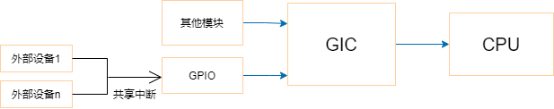

# 中断子系统


## 在设备树中声明

## 顶层GIC中断控制器

```devicetree title="rk3568.dtsi"
gic: interrupt-controller@fd400000 {
	compatible = "arm,gic-v3";
	reg = <0x0 0xfd400000 0 0x10000>, /* GICD */
	      <0x0 0xfd460000 0 0x80000>; /* GICR */
	interrupts = <GIC_PPI 9 IRQ_TYPE_LEVEL_HIGH>;
	interrupt-controller;
	#interrupt-cells = <3>;
};
```

> compatible：表明使用ARM GIC-V3中断控制器

> reg：该中断控制器的基地址和大小

> interrupts：表明该中断控制器的中断信息，这里使用GIC_PPI的第9号中断，高电平触发

> interrupt-controller：表明这是一个中断控制器，属性为空

> \#interrupt-cells：表明它的“子”中断控制器需要多少个cells来描述一个中断

## 子中断控制器



对于GPIO，可以将其视为中断控制器，但除了以上三个属性之外，还需要指定，使用上一级的哪一个中断控制器和哪一个中断：

1. interrupt-parent属性：指定上一级的中断控制器
2. interrupts属性：指定具体的中断号，第一个单元格定义了控制器内中断的索引，第二个单元格用于指定以下标志之一：

- 1：上升沿触发
- 2：下降沿触发
- 3：高电平触发
- 4：低电平触发

如果支持extended语法，则可以直接使用interrupts-extended属性来取代以上两个属性：

```devicetree
interrupts-extended = <&gpio1 5 RISING>, <&gpio2 6 RISING>;
```

## 在代码中获得中断

设备树中的某些节点可以被转换为platform_device，可以使用`platform_get_resource()`函数获得中断资源。

对于I2C设备，I2C总线驱动在处理设备树的I2C节点时，会自动将其保存在`struct i2c_client`结构体中的irq成员里。SPI设备也是类似的原理。

如果你的设备节点既不能转换为platform_device，它也不是I2C设备、SPI设备，那么在驱动程序中可以自行调用`of_irq_get()`函数去解析设备树，得到中断号。

对于GPIO设备，可以使用`gpiod_get_irq()`函数获得中断号。