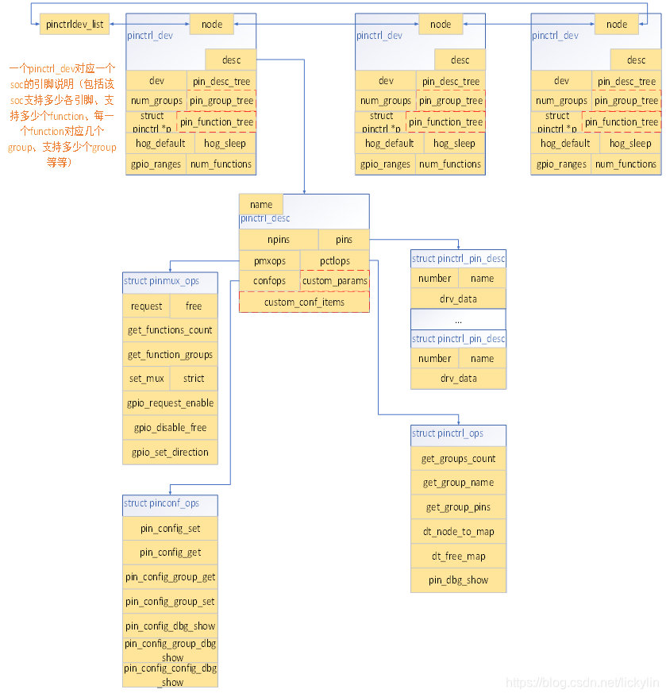
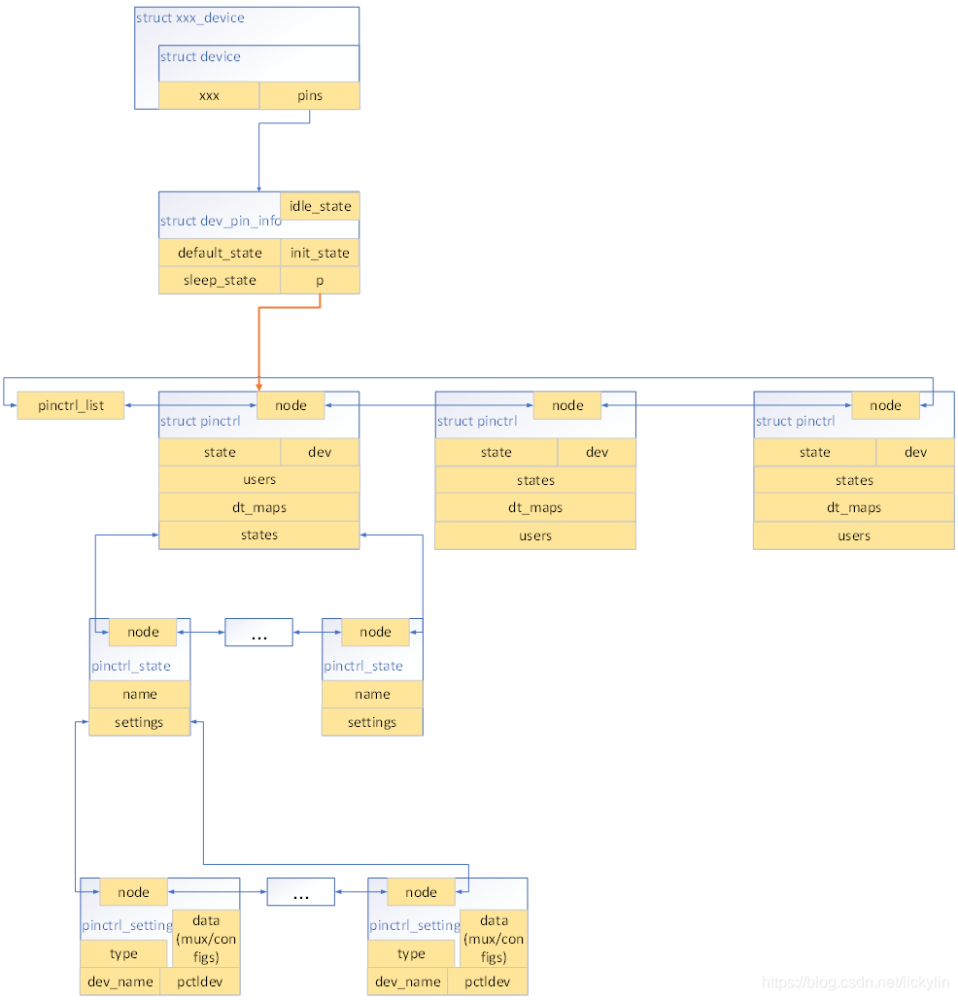
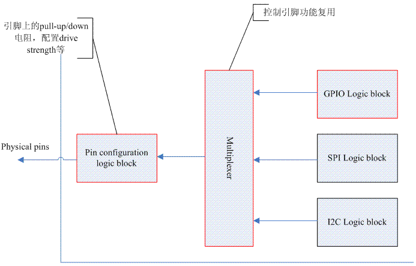
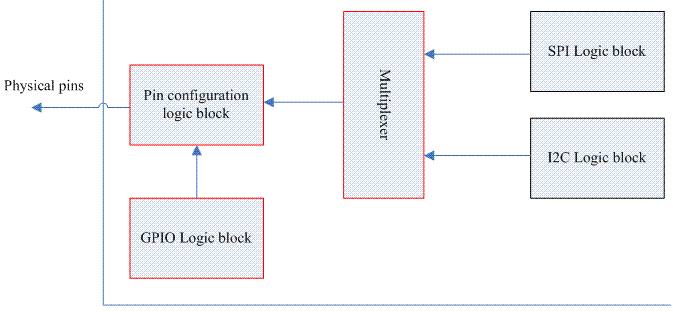

# Pinctrl子系统

Pinctrl：Pin Controller，即引脚控制，通俗地来说就是一组可以控制引脚的寄存器集合。它主要有以下三种功能：

- 引脚枚举与命名，每个pin的ID唯一
- 引脚复用，比如单个引脚可以配置成GPIO，多个引脚还可以组成一个pin group，形成特定的功能
- 引脚配置，比如使能或禁止引脚的上拉、下拉电阻

pinctrl子系统涉及到两个对象：

- {==pin controller device==}：提供引脚的配置信息，由原厂工程师提供。

- {==client device==}：使用pinctrl子系统的设备，需要描述使用的引脚，由驱动工程师编写。

内核分别抽象出`struct pinctrl_dev`和`struct device`来表示上面两个对象。

## 源文件列表

pinctrl子系统相关的源代码文件如下：

1.源文件列表

| 文件名 | 描述 |
| ------ | ------ |
| core.h | 核心数据结构头文件 |
| pinctrl.h | 接口文件 |
| pinmux.h | 引脚复用头文件 |
| pinconf.h | 引脚配置头文件 |

2.和其他内核模块接口文件列表

| 文件名 | 描述 |
| ------ | ------ |
| consumer.h | 其他的driver要使用pinctrl子系统时，需要包含这个头文件 |
| devinfo.h | linux内核驱动设备模型模块使用的接口 |
| machine.h | 和machine模块的接口 |

3.low level pin controller driver接口文件列表

| 文件名 | 描述 |
| ------ | ------ |
| pinconf-generic.h | 引脚配置的通用接口 |
| pinconf.h | 引脚配置的接口 |
| pinctrl-state.h | 保存pin controller的状态 |

## 设备树描述

引脚配置的设备树描述如下：

```C title="s5pv210-pinctrl.dtsi"

&pinctrl0 {
	gpa0: gpa0 {
		gpio-controller;		/*这是一个GPIO控制器*/
		#gpio-cells = <2>;		/*需要2个32位的数来描述这个GPIO*/

		interrupt-controller;	/*这是一个中断控制器*/
		#interrupt-cells = <2>;
	};

	gpa1: gpa1 {
		gpio-controller;
		#gpio-cells = <2>;

		interrupt-controller;
		#interrupt-cells = <2>;
	};
};

/*省略其他引脚配置*/

```

除了单个引脚的描述，还可以将多个引脚组合在一起以实现特定的功能，比如SPI接口、I2C接口等，这被称为引脚组（pin group），其设备树描述如下：

```C title="s5pv210-pinctrl.dtsi"

uart0_data: uart0-data {
	samsung,pins = "gpa0-0", "gpa0-1";
	samsung,pin-function = <EXYNOS_PIN_FUNC_2>;
	samsung,pin-pud = <S3C64XX_PIN_PULL_NONE>;
	samsung,pin-drv = <EXYNOS4_PIN_DRV_LV1>;
};

...
i2c0_bus: i2c0-bus {
	samsung,pins = "gpd1-0", "gpd1-1";
	samsung,pin-function = <EXYNOS_PIN_FUNC_2>;
	samsung,pin-pud = <S3C64XX_PIN_PULL_UP>;
	samsung,pin-drv = <EXYNOS4_PIN_DRV_LV1>;
};
```

在这个例子中，uart0的引脚组配置需要用到"gpa0-0, gpa0-1"，i2c0的引脚组配置需要用到"gpd1-0", "gpd1-1"。一旦选择了某个功能，pins中定义的所有引脚都需要在pin-function中做相应的功能设定，具体设定的值需要在芯片手册中查找。

还有一些引脚配置属性比如：

- samsung,pin-val：引脚输出缓冲区的初始值
- samsung,pin-pud：上下拉配置
- samsung,pin-drv：驱动器强度配置
- samsung,pin-pud-pdn：低功耗模式下的上下拉配置
- samsung,pin-drv-pdn：低功耗模式下的驱动器强度配置

具体的配置信息每个SOC厂商都有不同的标准，除非你是原厂工程师，否则只需要依葫芦画瓢即可。

一个典型的client device引用引脚配置的实例如下：

```C
device-node-name {  
    pinctrl-names = "default", "init", "sleep";   
    pinctrl-0 = <pin-config-0-a>; 
    pinctrl-1 = <pin-config-1-b>; 
	pinctrl-2 = <pin-config-2-c>;        
};
```

这里pinctrl-names就表示引脚的state——default, init, sleep等。对于某个client device，它使用的一组引脚应该同时处于某种state下，state的定义与电源管理系统相关（Power Management）。比如当设备进入睡眠状态时，我们可以精确控制引脚状态以节省功耗。每个state由下面的0、1、2配置对应。pinctrl-x是一个句柄（phandle）列表，每个句柄指向一个pin configuration。

由设备树的知识我们知道，每个设备树描述的device node最终会形成一个树状结构，在内核初始化的过程中，会扫描这个树状结构，并根据每个device node的配置信息，初始化对应的设备并加入到内核中。类似地，pin controller driver的初始化也是从设备树节点开始的：

```C
pinctrl@56000000{
	reg=<0x56000000 0x1000="">;
	compatible="samsung, s3c2416-pinctrl";
}
```

compatible属性用来指示内核选用哪一个pin controller driver来驱动该设备。pinctrl子系统要想进行控制，必须有一个控制对象，在软件层面需要提供一个方法将硬件信息注册到pinctrl子系统中去。

## 数据结构

学习pinctrl子系统，首先要了解其内部的数据结构，然后再去研究源码就比较轻松。

主要涉及到的数据结构是：

- pin controller device相关：pinctrl_desc, pinctrl_ops, pinmux_ops, pinconf_ops, pinctrl_dev
- client device相关：pinctrl, pinctrl_state, pinctrl_setting, pinctrl_map, pinctrl_dt_map

由于涉及到的结构体比较多，每个结构体的成员也非常复杂，这里省略了一部分不太重要的内容，对于重复性的内容也不再说明，感兴趣的读者可自行阅读源码进行学习。

### pin controller device

`struct pinctrl_dev`结构体用来表示一个pin controller device，负责管理引脚，后续的许多数据结构都需要与此关联：

```C
struct pinctrl_dev {
	struct list_head node;
	struct pinctrl_desc *desc;
	struct list_head gpio_ranges;
	struct device *dev;
	struct module *owner;
	void *driver_data;
	struct pinctrl *p;
	struct pinctrl_state *hog_default;
	struct pinctrl_state *hog_sleep;
};
```

> desc：pin controller描述符，用于描述引脚信息。

> gpio_range：此pin controller处理的GPIO范围列表。

> dev：pin controller的父设备，一般设置为平台设备的dev成员。

> owner：所有者。

> driver_data：驱动程序的私有数据。

> p：该pin controller对应的client device。

> hog_default：此设备占用的引脚的默认状态。

> hog_sleep：此设备占用的引脚的睡眠状态。

`struct pinctrl_desc`用来定义和配置pin controller的描述信息：

```C
struct pinctrl_desc {
    const char *name;
    const struct pinctrl_pin_desc *pins;
    unsigned int npins;
    const struct pinctrl_ops *pctlops;
    const struct pinmux_ops *pmxops;
    const struct pinconf_ops *confops;
    struct module *owner;
};
```

> name：pin controller的名称。

> pins：该pin controller处理的所有引脚的描述符数组。

> npins：数组中描述符的数量，一般等于ARRAY_SIZE(pins)。

> pctlops：引脚控制操作。

> pmxops：引脚复用操作。

> confops：引脚配置操作。

对于某个pin controller device来说，它要搞明白自己管理多少引脚，并使用自然数为这些引脚编号。系统中的引脚信息，都由`struct pinctrl_pin_desc`来描述，包括编号、名字和数据：

```C
struct pinctrl_pin_desc {
	unsigned number;
	const char *name;
	void *drv_data;
};
```

> number：引脚编号。

> name：引脚名称。

> drv_data：引脚的私有数据。

`struct pinctrl_pin_desc`结构体中的编号和名称完全由驱动开发人员自己决定，当然，需要符合一定的规范。

这么说有点枯燥，我们看官方文档的一个示例。假设引脚阵列如下图所示：

```
        A   B   C   D   E   

   5    o   o   o   o   o  

   4    o   o   o   o   o  

   3    o   o   o   o   o  

   2    o   o   o   o   o  

   1    o   o   o   o   o  
```

要在驱动程序中注册一个引脚控制器并为这个封装上的所有引脚命名，我们可以这样做：

```C
#include <linux/pinctrl/pinctrl.h>
const struct pinctrl_pin_desc foo_pins[] = {
	PINCTRL_PIN(0, "A5"),
	PINCTRL_PIN(1, "B5"),
	PINCTRL_PIN(2, "C5"),
	...
	PINCTRL_PIN(23, "C1"),
	PINCTRL_PIN(24, "D1"),
	PINCTRL_PIN(25, "E1"),
};
```

在定义了引脚配置数组之后，我们需要告诉`struct pinctrl_desc`结构体引脚的信息，然后调用`pinctrl_register_and_init()`函数注册。

```C
static struct pinctrl_desc foo_desc = {
	.name = "foo",
	.pins = foo_pins,
	.npins = ARRAY_SIZE(foo_pins),
	.owner = THIS_MODULE,
};

struct pinctrl_dev *pctl;

pinctrl_register_and_init(&foo_desc, <PARENT>, NULL, &pctl);

pinctrl_enable(pctl);
```

在SoC系统中，为了实现特定的功能，需要将多个引脚进行组合。因此pinctrl子系统提供以group为单位，同时地访问和控制多个引脚的功能，这就是pin group的概念，这些操作定义在`struct pinctrl_ops`结构体中：

```C
struct pinctrl_ops {
	int (*get_groups_count) (struct pinctrl_dev *pctldev);
	const char *(*get_group_name) (struct pinctrl_dev *pctldev, unsigned selector);
	int (*get_group_pins) (struct pinctrl_dev *pctldev, unsigned selector,
			       		   const unsigned **pins, unsigned *num_pins);
	void (*pin_dbg_show) (struct pinctrl_dev *pctldev, struct seq_file *s,
			   			  unsigned offset);
	int (*dt_node_to_map) (struct pinctrl_dev *pctldev, struct device_node *np_config,
			       		   struct pinctrl_map **map, unsigned *num_maps);
	void (*dt_free_map) (struct pinctrl_dev *pctldev, struct pinctrl_map *map, 
	   					 unsigned num_maps);
};
```

> get_groups_count()：获取pin group的数量。

> get_group_name()：获取pin group的名称。

> get_group_pins()：获取pin group的引脚信息。

> dt_node_to_map()：为设备树中的pin controller子节点创建映射，即将devic_node转换为一系列的`struct pinctrl_map`。

> dt_free_map()：释放dt_node_to_map()创建的映射。

SoC中的很多引脚可以配置为不同的功能，这被称为引脚的复用（pinmux），pinctrl子系统使用`struct pinmux_ops`结构体来抽象复用的有关操作：

```C
struct pinmux_ops {
	int (*request) (struct pinctrl_dev *pctldev, unsigned offset);
	int (*free) (struct pinctrl_dev *pctldev, unsigned offset);
	int (*get_functions_count) (struct pinctrl_dev *pctldev);
	const char *(*get_function_name) (struct pinctrl_dev *pctldev, unsigned selector);
	int (*get_function_groups) (struct pinctrl_dev *pctldev, unsigned selector,
				  				const char * const **groups, unsigned *num_groups);
	int (*set_mux) (struct pinctrl_dev *pctldev, unsigned func_selector,
					unsigned group_selector);
	int (*gpio_request_enable) (struct pinctrl_dev *pctldev, 
								struct pinctrl_gpio_range *range, unsigned offset);
	void (*gpio_disable_free) (struct pinctrl_dev *pctldev, 
							   struct pinctrl_gpio_range *range, unsigned offset);
	int (*gpio_set_direction) (struct pinctrl_dev *pctldev,
				   			   struct pinctrl_gpio_range *range, unsigned offset,
				        	   bool input);
	bool strict;
};
```

> request：由核心调用，以查看特定引脚是否可以用于引脚复用。在选择任何实际的复用设置之前，应由核心调用此函数来获取引脚。如果该驱动程序无法处理表述的引脚，则应返回负错误代码来拒绝请求。

> free：在申请后释放引脚。

> get_functions_count：返回pin controller device支持的function数目。

> get_function_name：给定一个function selector，返回指定function的名称。

> get_function_groups：给定一个function selector，返回指定function的pin group信息。

> set_mux：启用某个复用功能与特定的引脚组。驱动程序不需要弄清楚启用这个功能是否与该组引脚的其他用途冲突，这样的冲突由引脚复用子系统处理。func_selector选择一个特定的功能，而group_selector选择一组要使用的特定引脚。在简单的控制器上，后者参数可能被忽略。

> gpio_request_enable：在某些引脚上请求并启用GPIO。仅当你能够将每个引脚单独复用为GPIO时，才实现这一点。受影响的GPIO范围连同偏移量（引脚号码）一起传递到特定的GPIO范围——功能选择器和引脚组与此独立，但是核心将确保引脚不会冲突。

> gpio_disable_free：在某个引脚上释放GPIO复用。

> gpio_set_direction：设置GPIO的输入或输出方向。

> strict：为true时，不允许某个引脚作为GPIO和其他功能同时使用。

什么是function？function是引脚功能的抽象，SPI是一个function，I2C也是一个function。但是即便知道具体的function name，我们也不能确定其使用引脚的情况。比如一个SPI0的功能可能使用了引脚组{A8, A7, A6, A5}，也可能使用了引脚组{G4, G3, G2, G1}。但毫无疑问，这两个引脚组不能同时处于激活状态，因为芯片内部SPI0的逻辑功能电路只有一个。因此，只有给出function selector（就像数组的一个索引）和function的pin group selector才能进行function mux的设定。

引脚的配置，比如上拉、下拉、高阻抗等，pinctrl子系统使用`struct pinconf_ops`结构体来抽象配置的操作：

```C
struct pinconf_ops {
#ifdef CONFIG_GENERIC_PINCONF
	bool is_generic;
#endif
	int (*pin_config_get) (struct pinctrl_dev *pctldev, unsigned pin,
			    		   unsigned long *config);
	int (*pin_config_set) (struct pinctrl_dev *pctldev, unsigned pin,
			       		   unsigned long *configs, unsigned num_configs);
	int (*pin_config_group_get) (struct pinctrl_dev *pctldev, unsigned selector,
				     			 unsigned long *config);
	int (*pin_config_group_set) (struct pinctrl_dev *pctldev, unsigned selector,
				     			 unsigned long *configs, unsigned num_configs);
	void (*pin_config_dbg_show) (struct pinctrl_dev *pctldev, struct seq_file *s,
							 	 unsigned offset);
	void (*pin_config_group_dbg_show) (struct pinctrl_dev *pctldev, struct seq_file *s,
					   				   unsigned selector);
	void (*pin_config_config_dbg_show) (struct pinctrl_dev *pctldev, struct seq_file *s,
					    				unsigned long config);
};
```

> is_generic：对于希望使用通用接口的引脚控制器，该标志告诉框架它是通用的。

> pin_config_get：获取某个引脚的配置。

> pin_config_set：配置单个引脚。

> pin_config_group_get：获取某个引脚组的配置。

> pin_config_group_set：配置某个引脚组中的所有引脚。

下图描述了pin controller device类别下几个数据结构之间的关系：



### client device

在内核启动阶段，device_node一般会被转换为`platform_device`结构体，或者其他结构体比如`i2c_client`、`spi_device`，它们内部都有一个`struct device`成员（也即继承了struct device的属性和方法）。

在`struct device`结构体里有一个`struct dev_pin_info`结构体，用来保存设备的引脚信息：

```C
struct device {
	struct kobject kobj;
	struct device *parent;
	struct device_private *p;
	...
#ifdef CONFIG_PINCTRL
	struct dev_pin_info *pins;
#endif
	....
};
```

`struct dev_pin_info`是一个用于存储client device引脚信息的结构体：

```C
struct dev_pin_info {
	struct pinctrl *p;
	struct pinctrl_state *default_state;
	struct pinctrl_state *init_state;
#ifdef CONFIG_PM
	struct pinctrl_state *sleep_state;
	struct pinctrl_state *idle_state;
#endif
};
```

> p：保存该设备的所有状态信息，包括自定义的状态。

> default_state：表示该设备上引脚的默认状态。

> init_state：表示初始化引脚的状态。

> sleep_state/idle_state：如果启用了电源管理模块（Power Management），分别表示睡眠和空闲状态。

pinctrl子系统又抽象了`struct pinctrl`来描述一个client device的所有状态：

```C
struct pinctrl {
	struct list_head node;
    struct device *dev;
	struct list_head states;
    struct pinctrl_state *state;
	struct list_head dt_maps;
    struct kref users;
};
```

> node：用于将该pin controller挂入到一个链表中。

> dev：该pin controller对应的device。

> states：保存该pin controller的所有状态信息，这些状态信息都保存在一个链表中。

> state：当前pin controller的状态。

> dt_maps：保存该pin controller对应的所有设备节点信息，这些设备节点信息都保存在一个链表中。

> users：引用计数。

系统中的每一个需要和pinctrl子系统进行交互的设备在进行配置之前都需要首先获取这个`struct pinctrl`结构体，属于该设备的所有的状态都将被挂入到一个链表中，链表头就是states成员。

单个状态的定义如下：

```C
struct pinctrl_state {
	struct list_head node;
	const char *name;
	struct list_head settings;
};
```

> name：此状态的名称。

> settings：属于该状态的所有settings。

设备在单个状态下的pinctrl控制信息，由`struct pinctrl_setting`结构体描述：

```C
struct pinctrl_setting { 
    struct list_head node; 
    enum pinctrl_map_type type; 
    struct pinctrl_dev *pctldev; 	//对应的pin controller device
    const char *dev_name;   		//设备名称
    union { 
        struct pinctrl_setting_mux mux;   			//mux配置数据
        struct pinctrl_setting_configs configs;  	//config配置数据
    } data; 
};
```

当某个driver设定一个pin state的时候，pinctrl子系统内部会遍历该state的settings链表，将一个一个的setting进行设定。这些settings有各种类型，定义如下：

```C
enum pinctrl_map_type { 
    PIN_MAP_TYPE_INVALID, 
    PIN_MAP_TYPE_DUMMY_STATE, 
    PIN_MAP_TYPE_MUX_GROUP,     // 功能复用的setting
    PIN_MAP_TYPE_CONFIGS_PIN,   // 设定单一一个pin的电气特性 
    PIN_MAP_TYPE_CONFIGS_GROUP, // 设定单pin group的电气特性 
};
```

`struct pinctrl_setting_mux`结构体用来描述pin mux相关的设定（PIN_MAP_TYPE_MUX_GROUP）：

```C
struct pinctrl_setting_mux {
	unsigned group;
	unsigned func;
};
```

> group：pin group selector。

> function：pin function selector。

`struct pinctrl_setting_config`结构体用来描述pin config相关的设定（PIN_MAP_TYPE_CONFIGS_PIN和PIN_MAP_TYPE_CONFIGS_GROUP）：

```C
struct pinctrl_setting_configs {
	unsigned group_or_pin;
	unsigned long *configs;
	unsigned num_configs;
};
```

> group_or_pin：要配置的pin编号或者pin group selector。

> configs：指向一个数组，该数组存储了一组配置参数或值，用于设置特定引脚或引脚组的硬件参数。

> num_configs：需要写入的配置参数个数。


`struct pinctrl_map`用于描述client device的映射配置，使用pin controller device的`pinctrl_desc->pctlops->dt_node_to_map`来处理设备树中的引脚配置节点。例如某配置节点——`pinctrl-0 = <&uart0_xfer &uart0_cts &uart0_rts>`，那么uart0_xfer 、uart0_cts 、uart0_rts节点均会被`dt_node_to_map()`函数解析为一系列的`struct pinctrl_map`，然后被转换为`struct pinctrl_setting`，存入`struct pinctrl_state.settings`链表中。

```C
struct pinctrl_map {
    const char *dev_name;
    const char *name;
    enum pinctrl_map_type type;
    const char *ctrl_dev_name;
    union {
        struct pinctrl_map_mux mux;
        struct pinctrl_map_configs configs;
    } data;
};
```

> dev_name：设备名称，需要与该client device中struct device中的名称一致。

> name：状态名称。

> type：映射项的类型。

> ctrl_dev_name：设备名称。

> data：该映射项的具体数据，包括mux和configs两种类型，分别代表复用选择和引脚配置。

`struct pinctrl_map_mux`结构体用来描述pin mux相关的设定（PIN_MAP_TYPE_MUX_GROUP）：

```C
struct pinctrl_map_mux {
	const char *group;
	const char *function;
};
```

> group：需要配置复用功能的pin group的名称。

> function:复用功能的名称。

`struct pinctrl_map_configs`结构体用来描述pin config相关的设定（PIN_MAP_TYPE_CONFIGS_PIN和PIN_MAP_TYPE_CONFIGS_GROUP）：

```C
struct pinctrl_map_configs {
    const char *group_or_pin;
    unsigned long *configs;
    unsigned num_configs;
};
```

> group_or_pin：需要配置的pin或者pin group的名称。

> configs：指向一个数组，该数组存储了一组配置参数或值，用于设置特定引脚或引脚组的硬件参数。

> num_configs：需要写入的配置参数个数。

`struct pinctrl_maps`结构体用来描述映射表（mapping table）的部分项：

```C
struct pinctrl_maps {
	struct list_head node;
	const struct pinctrl_map *maps;
	unsigned num_maps;
};
```

> maps：指向一个数组，该数组存储了一组映射表项。

> num_maps：需要写入的映射表项个数。

在前面我们说过，引脚配置节点会被`dt_node_to_map()`函数解析为`struct pinctrl_map`，并以数组指针形式返回。
而`struct pinctrl_dt_map`就是一个用于存储从设备树解析出来的映射表数据的结构体，其成员map指向这个`struct pinctrl_map`数组：

```C
struct pinctrl_dt_map {
    struct list_head node;
    struct pinctrl_dev *pctldev;
    struct pinctrl_map *map;
    unsigned num_maps;
};
```

> pctldev：指向分配该映射表的pin controller device。

> map：实际映射表数据。

> num_maps：映射表中的数目。

下图描述了client device类别下几个数据结构之间的关系：



## 与GPIO子系统交互

作为软件工程师，我们期望的硬件设计应该如下图所示：



GPIO的HW block应该与其他子系统的block是平级关系，它们共同输入到一个复用器block，由该block的寄存器控制哪一条电路被接通。而pin configuration应该是全局的，不论哪种block处于active状态，只要提供统一的接口供它们使用即可。在软件层面，我们当然可以让pinctrl子系统和GPIO子系统完全独立，各自进行初始化，但是实际的SOC设计并非总是和软件工程师所期望的那样，比如有的SOC设计框架如下图所示：



此时的GPIO block并没有和其他block独立，而是永远处于active状态，红色边框的三个block被紧密地联系在一起，它们的寄存器占据了一个memory range。这个时候，对于软件工程师来说，不得不在pinctrl子系统中进行一些额外的操作，才能正确地控制GPIO block。任何一个gpio chip，在使用GPIO功能时，都必须要先向系统的pinctrl子系统申请引脚，并将引脚配置为GPIO功能。

pinctrl子系统为GPIO提供的接口定义在<linux/pinctrl/consumer.h\>中：

```C
int pinctrl_gpio_request(unsigned gpio);
void pinctrl_gpio_free(unsigned gpio);
int pinctrl_gpio_direction_input(unsigned gpio);
int pinctrl_gpio_direction_output(unsigned gpio);
int pinctrl_gpio_set_config(unsigned gpio, unsigned long config);
```

> pinctrl_gpio_request：向pinctrl子系统申请一个gpio。

> pinctrl_gpio_free：释放一个gpio。

> pinctrl_gpio_direction_input：将一个gpio设置为输入模式。

> pinctrl_gpio_direction_output：将一个gpio设置为输出模式。

> pinctrl_gpio_set_config：设置一个gpio的配置。

当GPIO驱动程序需要使用某个引脚时，直接调用`pinctrl_gpio_request()`函数，向pinctrl子系统申请。pinctrl子系统会维护一个gpio number到pin number的映射，将GPIO子系统的gpio number转换为pin number，并调用`struct pinmux_ops`结构体中有关GPIO的回调函数即可。

毫无疑问，申请GPIO资源本应该是GPIO子系统的责任，但是由于之前描述的缘由，pinctrl子系统不得不提供接口函数供GPIO驱动程序使用。当然，其他的驱动程序不应该调用此接口。

如何提供gpio number到pin number的映射呢？是通过一个`struct pinctrl_gpio_range`结构体来实现的：

```C
struct pinctrl_gpio_range {
	struct list_head node;
	const char *name;
	unsigned int id;
	unsigned int base;
	unsigned int pin_base;
	unsigned int npins;
	unsigned const *pins;
	struct gpio_chip *gc;
};
```

> name：区域的名字。

> id：区域ID。

> base：区域起始的GPIO ID。

> pin_base：区域起始的pin ID

> npins：区域包含的引脚数。

> pins：区域包含的引脚列表。

> gc：区域对应的gpio_chip。

一个`struct gpio_chip`结构体可以以如下的方式添加到pin controller device中：

```C
struct gpio_chip chip_a;
struct gpio_chip chip_b;

static struct pinctrl_gpio_range gpio_range_a = {
	.name = "chip a",
	.id = 0,
	.base = 32,
	.pin_base = 32,
	.npins = 16,
	.gc = &chip_a;
};

static struct pinctrl_gpio_range gpio_range_b = {
	.name = "chip b",
	.id = 0,
	.base = 48,
	.pin_base = 64,
	.npins = 8,
	.gc = &chip_b;
};

{
	struct pinctrl_dev *pctl;
	...
	pinctrl_add_gpio_range(pctl, &gpio_range_a);
	pinctrl_add_gpio_range(pctl, &gpio_range_b)
}
```

以上是一个pin controller device的示例，它包含两个gpio_chip结构体，分别对应两个gpio_chip实例。"chip a"和"chip b"的起始GPIO ID分别为32和48，起始pin ID分别为32和64。"chip a"有16个引脚，"chip b"有8个引脚。

chip a:
- GPIO range: 32-47
- Pin range: 32-47

chip b:
- GPIO range: 48-55
- Pin range: 64-71

上述例子假定GPIO和pin的映射是线性的，否则我们必须得手动定义引脚信息：

```C
static const unsigned range_pins[] = {14, 1, 22, 17, 10, 8, 6, 2};

static struct pinctrl_gpio_range gpio_range_ = {
	.name = "chip",
	.id = 0,
	.base = 32,
	.pins = &range_pins,
	.npins = ARRAY_SIZE(range_pins),
	.gc = &chip;
};
```

在上面这个例子中，pin_base属性会被忽略。

