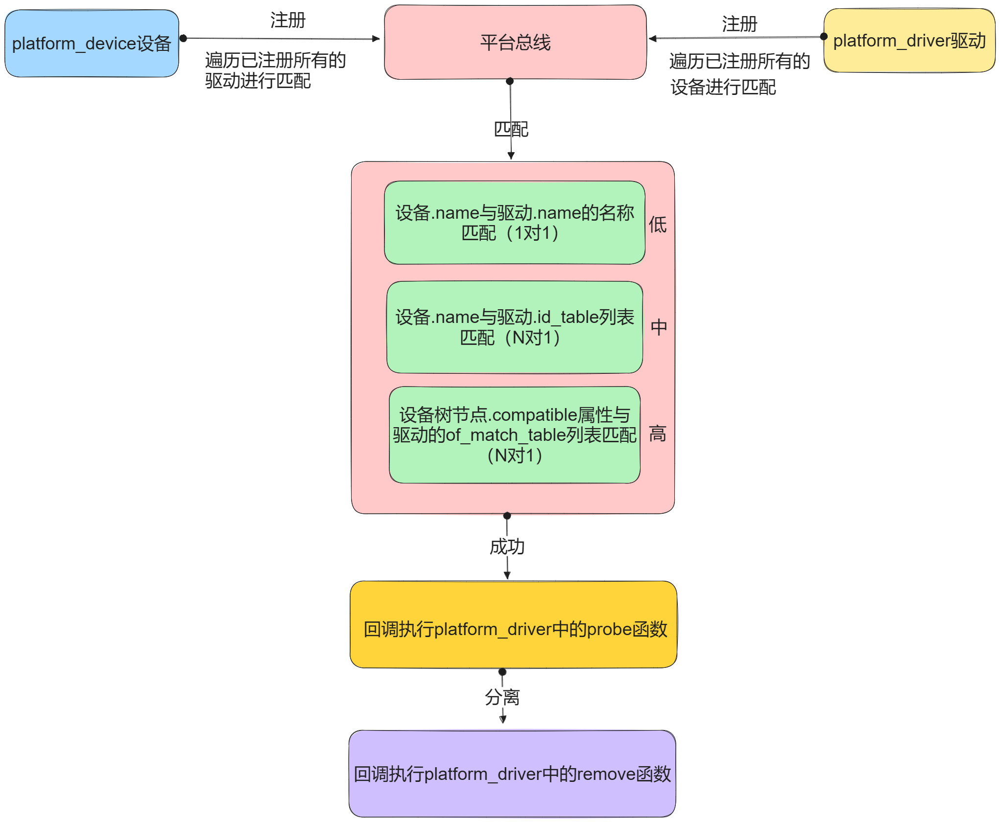

# 平台总线模型

Platform 总线是 Linux 虚拟出来的一种总线，它是连接设备与驱动的抽象模型。该模型是 Linux 中所有总线的基本模型，体现了内核模块的解耦思想。后面的实际物理总线模型如 IIC、SPI、USB 等总线模型均基于此模型实现。

Platform 架构图如下所示：



- platform_device.c：描述硬件信息，比如寄存器地址、中断号。
- platform_driver.c：描述驱动程序，比如如何操作 GPIO、如何申请中断。

## 平台总线

在 Linux 平台设备驱动模型中，总线是最重要的一环，负责匹配设备和驱动。它维护着两个链表，里面记录着各个已经注册的平台设备和平台驱动。每当有新的设备或者是驱动加入到总线时，便会调用`platform_match()`函数对新增的设备或驱动进行配对。`struct bus_type platform_bus_type`用来描述平台总线——内核初始化的时候自动注册：

```C
sturct bus_type platform_bus_type{
	.name = "platform",
	.dev_groups = platform_dev_groups,
	.match = platform_match,
	.uevent = platform_uevent,
	.pm = &platform_dev_pm_ops,
};
```

对`platform_bus_type`的初始化来说，`match`函数指针最为重要，它指向的函数负责实现平台总线和平台设备的匹配过程。其他的驱动总线，也必须实例化该函数指针。

## 平台设备

`platform_device`结构体用来描述平台设备：

```C
struct platform_device {
	const char	*name;
	int		id;
	bool		id_auto;
	struct device	dev;
	......
	u32		num_resources;
	struct resource	*resource;

	const struct platform_device_id	*id_entry;
	char *driver_override; /* Driver name to force a match */
	......
};
```

> name：设备的名称，用来匹配驱动

> id：设备的id号，用来区分同一类型的多个设备

> id_auto：是否由内核自动分配id号

> dev：通用设备结构体，用来描述设备的基本信息

> num_resources：存储的硬件资源的个数

> resource：描述硬件资源信息

> id_entry：与驱动匹配成功后，被填充的匹配信息

平台设备的工作是为驱动程序提供硬件信息，包括寄存器地址，中断号等。

对于硬件信息，使用结构体`struct resource`来保存设备所提供的资源，比如设备使用的中断编号，寄存器物理地址等，结构体原型如下：

```C
struct resource {
    resource_size_t start;
    resource_size_t end;
    const char *name;
    unsigned long flags;
	unsigned long desc;
	struct resrouce *parent, *sibling, *child;
};
```

> start、end： 硬件资源的起始地址以及结束地址

> name： 硬件资源名称

> flags： 用于指定该资源的类型，在Linux中，资源包括I/O、Memory、Register、IRQ、DMA、Bus等多种类型，最常见的有以下几种：

| 资源宏定义 | 描述 |
| ---  | --- |
| IORESOURCE_IO | 用于IO地址空间，对应于IO端口映射方式 |
| IORESOURCE_MEM | 用于外设的可直接寻址的地址空间 |
| IORESOURCE_IRQ | 用于指定该设备使用某个中断 |
| IORESOURCE_DMA | 用于指定使用的DMA通道 |

设备驱动程序的主要目的是操作设备的寄存器。不同架构的计算机提供不同的操作接口，主要有{==IO端口映射==}和{==IO內存映射==}两种方式。对应于 IO 端口映射方式，只能通过专门的接口函数（如inb、outb）才能访问；采用 IO 内存映射的方式，可以像访问内存一样，去读写寄存器。在嵌入式设备中，基本上没有 IO 地址空间，所以通常使用`IORESOURCE_MEM`。

注册/注销平台设备用到的函数如下：

```C
int platform_device_register(struct platform_device *pdev);
void platform_device_unregister(struct platform_device *pdev);
```

这两个函数应该在模块的进入与退出函数中被调用。

## 平台驱动

`platform_driver`结构体用来描述平台驱动：

```C
struct platform_driver {
	int (*probe)(struct platform_device *);
	int (*remove)(structg platform_device *);
	void (*shutdown)(struct platform_device *);
	int (*suspend)(struct platform_device *, pm_message_t state);
	int (*resume)(struct platform_device *);
	struct device_driver driver;
	const struct platform_device_id *id_table;
	bool prevent_deferred_probe;
};
```

> probe：设备与驱动匹配成功后执行该函数

> remove：设备与驱动分离后执行该函数

> shutdown：设备关闭后执行该函数

> suspend/resume：设备进入/退出休眠状态后执行该函数

除了以上几个回调函数，最关键的还有一个`id_table`的指针。这个指针指向了存放该驱动可以匹配设备的数组信息。

我们来看一下`struct platform_device_id`结构体的定义：

```C
struct platform_device_id {
	char name[PLATFORM_NAME_SIZE];
	kernel_ulong_t driver_data;
};
```

> name：该名字必须与设备树中要转换为platform_device节点的compatible属性值相同，否则无法进行匹配。

> driver_data：保存设备的配置。为了减少代码的冗余，一个驱动可以匹配多个设备。

示例代码如下：

```C
static platform_device_id my_device_ids[] = {
	{ "my-device1", 0 },
	{ "my-device2", 1 },
	{/*必须以空结尾表示结束*/}
};
```

这里插个题外话，当手动实现`probe()`函数时涉及到内存分配的问题。很多驱动程序都使用`devm_kzalloc()`函数来分配内存。我们接触比较多的是`kmalloc()`或者`kzalloc()`来分配内存，但是这会带来一些潜在的问题。比如在初始化过程中如果失败了，那么就需要开发人员小心地释放内存。而`devm_kzalloc()`函数则可以自动地释放内存。其设计的核心思想就是资源由设备管理，一旦不需要也由设备来释放，这其实有点 C++ 中 RAII 的思想。

注册/注销平台驱动的函数如下：

```C
int platform_driver_register(struct platform_device *drv);
void platform_driver_unregister(struct platform_device *drv);
```

## 设备树的转换

在旧版内核中，`platform_device`是静态定义的，硬件资源由`struct resource`描述。

在设备树出现之后，描述硬件资源的工作就由设备树来完成，内核会将满足规则的`device_node`转换为`platform_device`：

1. 根节点下包含`compatible`属性的子节点
2. 节点中`compatible`属性的值为"simple-bus"、"simple-mfd"、"isa"之一，且包含`compatible`属性的子节点

假设有`struct resource`代码如下：

```C
static struct resource my_resources[] = {
	[0] = {
		.start = 0xFDD60000,
		.end = 0xFDD60004,
		.flags = IORESOURCE_MEM,
	},
	[1] = {
		.start = 0xFDD60008,
		.end = 0xFDD6000C,
		.flags = IORESOUCE_IRQ,
	},
};
```

那么在设备树中就可以这样描述该资源：

```DTS
/{
	topnode{
		#address-cells=<1>;
		#size-cells=<1>;
		compatible="simple-bus";
		myled{
			compatible="my node";
			reg=<0xFDD60000 0x00000004>;
		};
	};

};
```

## 获取资源

`platform_get_resource()`函数可以用来获取平台设备的资源，通常在`probe()`函数中执行：

```C
struct resource *platform_get_resource(struct platform_device *dev, unsigned int type, unsigned int num);
```

> dev：指定要获取的平台设备。

> type：指定获取资源的类型，比如IORESOURCE_IRQ。

> num：指定要获取资源的编号，这个编号指的是同flags下的索引。

如果资源类型是 IORESOURCE_IRQ，可以使用以下接口还获取中断资源：

```C
int platform_get_irq(struct platform_device *pdev, unsigned int num);
```

总结：在平台设备驱动模型中，驱动的入口函数变成了`probe()`函数，在这里我们需要实现驱动的初始化与注册。一旦平台总线成功将`platform_device`和`platform_driver`匹配，就会调用该函数。

