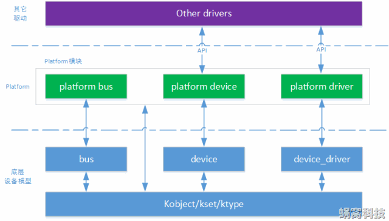

# 平台设备驱动

对于I2C、SPI、USB这些常见的设备来说，Linux内核都会创建与之相对应的驱动总线。但是有些结构简单的设备，比如led、rtc时钟、蜂鸣器等，内核就不会自己创建驱动总线。为了使这部分设备的驱动开发也能遵循设备驱动模型，Linux内核引入了虚拟的总线——平台总线（platform bus）。平台总线用于管理和挂载那些没有相应物理总线的设备，这些设备被称为平台设备，对应的设备驱动被称为平台驱动。平台设备对于Linux驱动工程师是非常重要的，因为大多数的驱动代码，实际就是为了驱动平台设备。

Platform架构图如下所示：



从图片中我们可以看到：

- platform bus：继承自bus模块，用于挂载platform设备。
- platform device：继承自device模块，用于描述platform设备。
- platform drvier：继承自device_driver模块，用于驱动platform设备。

!!! info "查看platform节点"

	platform的节点可以在/sys/bus/platform/devices下查看。

## 平台总线

在Linux平台设备驱动模型中，总线是最重要的一环，负责匹配设备和驱动。它维护着两个链表，里面记录着各个已经注册的平台设备和平台驱动。每当有新的设备或者是驱动加入到总线时，便会调用`platform_match()`函数对新增的设备或驱动进行配对。`struct bus_type platform_bus_type`用来描述平台总线——内核初始化的时候自动注册：

```C
sturct bus_type platform_bus_type{
	.name = "platform",
	.dev_groups = platform_dev_groups,
	.match = platform_match,
	.uevent = platform_uevent,
	.pm = &platform_dev_pm_ops,
};
```

对`platform_bus_type`的初始化来说，`match`函数指针最为重要，它指向的函数负责实现平台总线和平台设备的匹配过程。其他的驱动总线，也必须实例化该函数指针。

## 平台设备

`platform_device`结构体用来描述平台设备：

```C
 struct platform_device {
     const char *name;    //设备名称，匹配时会比较驱动的名字
     int id;              //内核允许存在多个
     struct device dev;   //继承的device结构体
     u32 num_resources;   //记录资源的数目
     struct resource *resource;    //平台设备提供给驱动的资源
     const struct platform_device_id *id_entry;    
 };
```

平台设备的工作是为驱动程序提供设备信息,设备信息包括硬件信息和软件信息两部分。

1. 硬件信息：驱动程序需要使用到什么寄存器，占用哪些中断号、内存资源、IO口等等

2. 软件信息：以太网卡设备中的MAC地址、I2C设备中的设备地址、SPI设备的片选信号线等等

对于硬件信息，使用结构体`struct resource`来保存设备所提供的资源，比如设备使用的中断编号，寄存器物理地址等，结构体原型如下：

```C
struct resource {
    resource_size_t start;
    resource_size_t end;
    const char *name;
    unsigned long flags;
};
```

> start、end： 指定资源的起始地址以及结束地址

> name： 指定资源的名字，可以设置为NULL

> flags： 用于指定该资源的类型，在Linux中，资源包括I/O、Memory、Register、IRQ、DMA、Bus等多种类型，最常见的有以下几种：

| 资源宏定义 | 描述 |
| ---  | --- |
| IORESOURCE_IO | 用于IO地址空间，对应于IO端口映射方式 |
| IORESOURCE_MEM | 用于外设的可直接寻址的地址空间 |
| IORESOURCE_IRQ | 用于指定该设备使用某个中断 |
| IORESOURCE_DMA | 用于指定使用的DMA通道 |

设备驱动程序的主要目的是操作设备的寄存器。不同架构的计算机提供不同的操作接口，主要有{==IO端口映射==}和{==IO內存映射==}两种方式。对应于IO端口映射方式，只能通过专门的接口函数（如inb、outb）才能访问；采用IO内存映射的方式，可以像访问内存一样，去读写寄存器。在嵌入式中，基本上没有IO地址空间，所以通常使用`IORESOURCE_MEM`。

注册/注销平台设备用到的函数如下：

```C
int platform_device_register(struct platform_device *pdev);
void platform_device_unregister(struct platform_device *pdev);
```

这两个函数应该在模块的进入与退出函数中被调用。


!!! example "内核platform的注册"

	```C
	int __init platform_bus_init(void)
	{
		int error;

		early_platform_cleanup();

		error = device_register(&platform_bus);
		if (error) {
			put_device(&platform_bus);
			return error;
		}
		error =  bus_register(&platform_bus_type);
		if (error)
			device_unregister(&platform_bus);
		of_platform_register_reconfig_notifier();
		return error;
	}

	```

## 平台驱动

`platform_driver`结构体用来描述平台驱动：

```C
struct platform_driver {
	int (*probe)(struct platform_device *);
	int (*remove)(structg platform_device *);
	int (*suspend)(struct platform_device *, pm_message_t state);
	int (*resume)(struct platform_device *);
	struct device_driver driver;
	const struct platform_device_id *id_table;
};
```

> probe：初始化平台设备

> remove：释放平台设备

> suspend/resume：设备进入/退出休眠状态，电源管理相关

除了以上四个回调函数，最关键的还有一个`id_table`的指针。这个指针指向用来表示该驱动匹配的`platform_device`。

我们来看一下`struct platform_device_id`结构体的定义：

```C
struct platform_device_id {
	char name[PLATFORM_NAME_SIZE];
	kernel_ulong_t driver_data;
};
```

> name：该名字必须与设备树中要转换为platform_device节点的compatible属性值相同，否则无法进行匹配。

> driver_data：保存设备的配置。为了减少代码的冗余，一个驱动可以匹配多个设备。

这里插个题外话，当手动实现`probe()`函数时涉及到内存分配的问题。很多驱动程序都使用`devm_kzalloc()`函数来分配内存。我们接触比较多的是`kmalloc()`或者`kzalloc()`来分配内存，但是这会带来一些潜在的问题。比如在初始化过程中如果失败了，那么就需要开发人员小心地释放内存。而`devm_kzalloc()`函数则可以自动地释放内存。其设计的核心思想就是资源由设备管理，一旦不需要也由设备来释放，这其实有点C++中RAII的思想。

注册/注销平台驱动的函数如下：

```C
int platform_driver_register(struct platform_device *drv);
void platform_driver_unregister(struct platform_device *drv);
```

## 设备树的转换

在旧版内核中，`platform_devcie`是静态定义的，硬件资源放在`struct resource`中。

设备树替换了平台总线模型中对硬件资源描述的部分，内核将满足规则的device_node转换为platform_device：

1. 根节点下包含compatible属性的子节点
2. 节点中compatible属性的值为"simple-bus"、"simple-mfd"、"isa"之一，且包含compatible属性的子节点

假设有`struct resource`定义如下：

```C
static struct resource my_resources[] = {
	[0] = {
		.start = 0xFDD60000,
		.end = 0xFDD60004,
		.flags = IORESOURCE_MEM,
	},
	[1] = {
		.start = 0xFDD60008,
		.end = 0xFDD6000C,
		.flags = IORESOUCE_IRQ,
	},
};
```

那么可以在设备树中描述该资源：

```devicetree
/{
	topnode{
		#address-cells=<1>;
		#size-cells=<1>;
		compatible="simple-bus";
		myled{
			compatible="my node";
			reg=<0xFDD60000 0x00000004>;
		};
	};

};
```


## 获取资源

在平台设备中，`struct resource`结构体用来表示设备资源，可以通过`platform_get_resource()`函数来获取，它通常在`probe()`函数中执行：

```C
struct resource *platform_get_resource(struct platform_device *dev, unsigned int type, unsigned int num);
```

> dev：指定要获取的平台设备。

> type：指定获取资源的类型，比如IORESOURCE_IO。

> num：指定要获取的资源编号。

如果资源类型是IORESOURCE_IRQ，可以使用以下接口还获取中断引脚：

```C
int platform_get_irq(struct platform_device *pdev, unsigned int num);
```

对于存放在`device`结构体中platform_data，可以使用`dev_get_platdata()`函数来获取：

```C
static inline void *dev_get_platdata(const struct device *dev)
{
    return dev->platform_data;
}
```

总结：在平台设备驱动模型中，驱动的入口函数变成了`probe()`函数，在这里我们需要实现驱动的初始化与注册。一旦平台总线成功将`platform_device`和`platform_driver`匹配，就会调用该函数。

