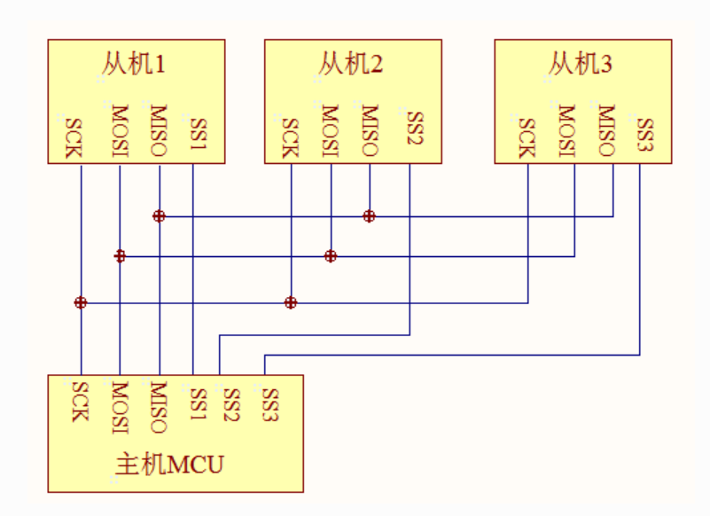

# SPI子系统

## SPI协议

SPI 是全双工同步通信总线，可以在同一时间发送和接收数据，通常由一个主模块和一个或多个从模块组成（ SPI 不支持多主机），主模块选择一个从模块进行同步通信，从而完成数据的交换。提供时钟的为主设备（Master），接收时钟的设备为从设备（Slave），SPI 接口的读写操作，都是由主设备发起，当存在多个从设备时，通过各自的片选信号进行管理。

SPI物理总线示意图如下所示：

SPI有四根控制线，包括：

- SCK：时钟线，数据收发同步
- MOSI：数据线，主设备发送、从设备接收
- MISO：数据线，主设备接收、从设备发送
- CS：片选线，低电平表示选中

SPI主设备和从设备都有一个串行移位寄存器，主设备通过向它的SPI串行寄存器写入一个字节来发起一次传输。数据通信流程可以分为以下几步：

1. 主设备发起信号，将CS/SS拉低，启动通信。

2. 主设备通过发送时钟信号，来告诉从设备进行写数据或者读数据操作（采集时机可能是时钟信号的上升沿或下降沿，因为SPI有四种模式，后面会讲到），它将立即读取数据线上的信号，这样就得到了一位数据（1bit）。

3. 主机（Master）将要发送的数据写到发送数据缓存区，缓存区经过串行移位寄存器和MOSI信号线将字节一位一位传送给从机，同时主机通过MISO接口将接收到的数据经过移位寄存器一位一位的移到接收缓存区。

4. 从机（Slave）也将自己的串行移位寄存器中的内容通过MISO信号线返回给主机。同时通过MOSI信号线接收主机发送的数据，这样，两个移位寄存器中的内容就被交换。

