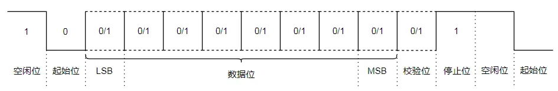

# UART子系统

## UART协议

UART是通用异步收发器，通信双方只要采用相同的帧格式和波特率，就可以在无需时钟信号的情况下，仅使用两根信号线(RX和TX)，就能实现全双工的发送和接收。

UART使用标准的TTL/CMOS逻辑电平来表示数据，1表示高电平，0表示低电平。数据传输速率用波特率来表示，双方的波特率必须要保持一致。

- 空闲位：高电平，表示没有数据传输
- 起始位：低电平，开始传送数据
- 数据位：5~8位，先发数据的低位，再发高位
- 校验位：奇偶校验(非必须)，将数据位加上校验位，1的位数为偶数（偶校验），1的位数为奇数（奇校验）
- 停止位：高电平，表示数据传输结束

UART的缺点：

1.电气接口不统一

UART只对信号时序进行了定义，而未定义接口的电气特性；

UART通信时一般直接使用处理器使用的电平，即TTL电平，不同处理器不能直接通信；

UART没有规定不同器件连接时连接器的标准，所以不同器件之间通过UART通信时连接很不方便。

2.抗干扰能力差

UART使用TTL信号来表示0和1，但TTL信号的抗干扰能力很差，数据在传输过程中很容易出错。

3.通信距离极短

因为TTL信号抗干扰能力差， 所以其通信距离也很短，一般只能用于一个电路板上的两个不同芯片之间的通信。