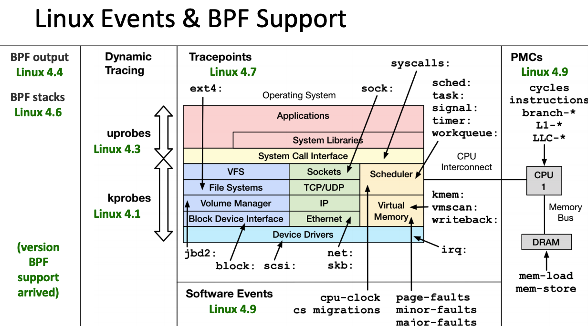
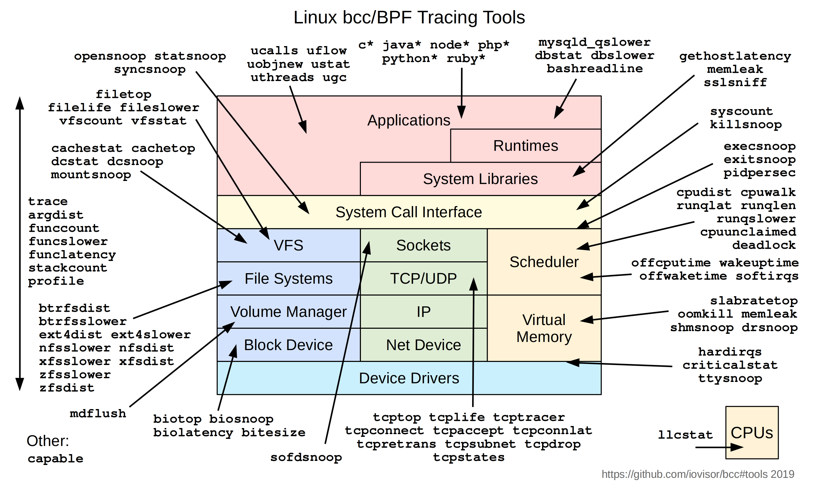

# eBPF入门

对于eBPF的介绍可以参考这篇文章：[eBPF简介](https://eunomia.dev/zh/tutorials/0-introduce/)。

由于eBPF还在快速发展期，内核中的功能也日趋增强，一般推荐基于Linux 4.4+ (4.9 以上会更好) 内核的来使用eBPF。部分Linux Event和BPF版本支持见下图：

eBPF技术主要用于以下场景：

1.追踪和性能分析(Tracing & Profiling)

将eBPF程序附加到跟踪点以及内核和用户应用探针点的能力，使得应用程序和系统本身的运行时行为具有前所未有的可见性。通过赋予应用程序和系统两方面的检测能力，可以将两种视图结合起来，从而获得强大而独特的洞察力来排除系统性能问题。先进的统计数据结构允许以高效的方式提取有意义的可见性数据，而不需要像类似系统那样，通常需要导出大量的采样数据。

2.观测和监控(Obervability & Monitoring)

eBPF不依赖于操作系统暴露的静态计数器和测量，而是实现了自定义指标的收集和内核内聚合，并基于广泛的可能来源生成可见性事件。这扩展了实现的可见性深度，并通过只收集所需的可见性数据，以及在事件源处生成直方图和类似的数据结构，而不是依赖样本的导出，大大降低了整体系统的开销。

3.网络(Network)

可编程性和效率的结合使得eBPF自然而然地满足了网络解决方案的所有数据包处理要求。eBPF的可编程性使其能够在不离开Linux内核的包处理上下文的情况下，添加额外的协议解析器，并轻松编程任何转发逻辑以满足不断变化的需求。JIT编译器提供的效率使其执行性能接近于本地编译的内核代码。

4.安全(Security)

在看到和理解所有系统调用的基础上，将其与所有网络操作的数据包和套接字级视图相结合，可以采用革命性的新方法来确保系统的安全。虽然系统调用过滤、网络级过滤和进程上下文跟踪等方面通常由完全独立的系统处理，但eBPF允许将所有方面的可视性和控制结合起来，以创建在更多上下文上运行的、具有更好控制水平的安全系统。

eBPF的整体架构如图所示：

eBPF分为用户空间和内核空间两部分：

- 用户空间的程序被编译成BPF字节码然后送至内核空间
- 内核空间的verifier检测字节码安全性，然送至BPF虚拟机执行，将执行的结果通过perf-event或者maps回传给用户空间

其中，BPF相关的程序类型可以是kprobes/uprobes/tracepoint/perf_events中的一个或多个：

- kprobes：内核级别动态跟踪，可以跟踪Linux内核中的函数入口或返回点，但是不是稳定的ABI接口。
- uprobes：用户级别动态跟踪，类似kprobes，只不过跟踪的函数为用户程序中的函数。
- tracepoints：内核静态跟踪，tracepoints是内核开发人员维护的跟踪点，能够提供稳定的ABI接口，但是由于是研发人员维护，数量和场景可能受限。
- perf_events：定时采样和PMC。

内核中运行的BPF字节码可以使用两种方式将测量数据回传给用户空间：

- maps：内核中实现的统计摘要信息（比如测量延迟、堆栈信息）等。
- perf-event：内核采集的事件实时发送至用户空间，用户空间程序实时读取分析。

在 Linux 观测方面，eBPF总是会拿来与内核模块方式进行对比，eBPF在安全性、入门门槛上比内核模块都有优势，这两点在观测场景下对于用户来讲尤其重要。

| 维度 | 内核模块 | eBPF |
|----|----|----|
| kprobes/tracepoints | 支持 | 支持 |
| 安全性 | 可能引入安全漏洞或导致内核Panic | 通过验证器进行检查，可以保障内核安全 |
| 内核函数 | 可以调用内核函数 | 只能通过BPF Helper函数调用 |
| 编译性 | 需要编译内核 | 不需要编译内核，只需要引入头文件 |
| 运行 | 必须是相同内核版本 | 基于稳定ABI的BPF程序可以编译一次，各处运行 |
| 与应用程序交互 | 打印日志或文件 | 通过perf_event或maps结构 |
| 数据结构丰富性 | 一般 | 丰富 |
| 入门门槛 | 高 | 低 |
| 升级 | 需要卸载和加载，可能导致处理流程中断 | 原子替换升级，不会造成处理流程中断 | 
| 内核内置 | 视情况而定 | 内核内置支持 |

要编写BPF程序可以有以下几种方式：

- BCC：即BPF Compiler Collection，可以让用户采用Python、C和Lua等高级语言快速开发BPF程序。
- bpftrace：采用类似于awk语言快速编写eBPF程序。
- libbpf库：需要使用LLVM clang编译成BPF字节码，门槛较高。

## BCC工具

BCC是一个开源的工具集，用于简化eBPF程序的编写与调试，它提供了一系列的工具和库，包括C库API和Python前端，适用于许多场景，比如性能分析和网络流量控制等。

安装BCC请参考官方文档：[Installing BCC](https://github.com/iovisor/bcc/blob/master/INSTALL.md)

安装完之后运行[hello_world.py](https://github.com/iovisor/bcc/tree/master/examples/hello_world.py)，同时在另一个窗口运行一些命令(比如"ls")，你应该能看到窗口会打印"Hello, World!"。如果没有，那说明BCC安装失败。

## bpftrace

