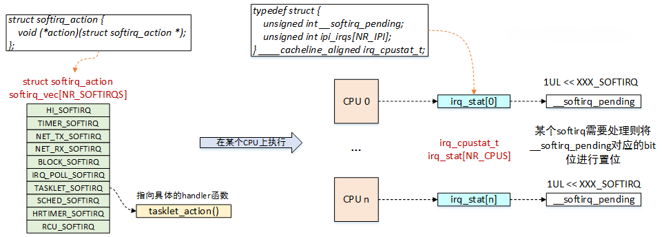

# 中断下半部

!!! tips

    内核中有些与中断相关的函数，名字中带着_bh，一般与下半部有关。

## 软中断

!!! note

    软中断的英文名是softirq，与软件中断（software irq）没有任何关系。

软中断的本质就是在硬件中断执行完毕后，通过`wakeup_softirqd()`的方式唤醒一个softirq队列，然后中断程序返回，softirq队列在适当的时候开始执行。

普通的驱动程序一般不会用到软中断，只有那些对于性能要求非常高的比如网卡驱动会用到。由于tasklet是基于软中断实现的，所以了解软中断是理解tasklet的关键。

为了性能，同一类型的软中断有可能在不同的CPU上并发执行，这给使用者带来了极大的痛苦，因为驱动工程师在撰写软中断的回调函数的时候要考虑重入，考虑并发，要引入同步机制。

### 软中断的实现

软中断在编译期间由内核静态分配：

```C
/*内核只支持10种软中断类型*/
enum {
    HI_SOFTIRQ=0,       /* 高优先级tasklet */
	TIMER_SOFTIRQ,      /* Timer定时器软中断 */
	NET_TX_SOFTIRQ,     /* 发送网络数据包软中断 */
	NET_RX_SOFTIRQ,     /* 接收网络数据包软中断 */
	BLOCK_SOFTIRQ,      /* 块设备软中断 */
	IRQ_POLL_SOFTIRQ,   /* 块设备软中断 */
	TASKLET_SOFTIRQ,    /* 普通tasklet */
	SCHED_SOFTIRQ,      /* 进程调度及负载均衡的软中断 */
	HRTIMER_SOFTIRQ,    /*高精度timer定时器软中断 */
	RCU_SOFTIRQ,        /* Preferable RCU should always be the last softirq， RCU相关的软中断 */
	NR_SOFTIRQS
};

/*软中断描述符，只包含一个handler指针*/
struct softirq_action {
    void (*action)(struct softirq_action *);
};

/*软中断描述符表，一个全局数组*/
static struct softirq_action softirq_vec[NR_SOFTIRQS]__cacheline_aligned_in_smp;

/*CPU软中断状态描述，当某个软中断触发时，__softirq_pending会置位对应的bit*/
typedef struct {
    unsigned int __softirq_pending;
    unsigned int ipi_irqs[NR_IPI];
}__cacheline_aligned irq_cpustat_t;

/*每个CPU维护一个状态信息*/
irq_cpustat_t irq_stat[NR_CPUS];

/*每个CPU创建一个ksoftirq线程*/
DEFINE_PER_CPU(struct task_struct *, ksoftirqd);
```



软中断可以在不同的CPU上并发运行，但是在同一个CPU上只能串行运行。

### 触发软中断

调用`open_softirq()`函数注册softirq action回调函数：

```C
void open_softirq(int nr, void (*action)(struct softirq_action*))
{
    softirq_vec[nr].action = action;
}
```

`raise_softirq()`函数用来触发本地CPU上的软中断：

```C
void raise_softirq(unsigned int nr)
{
    unsigned long flagss;

    local_irq_save(flags);
    raise_softirq_irqoff(nr);
    local_irq_restore(flags);
}
```

虽然大部分场景是在中断处理程序中(本地CPU中断已关闭)执行软中断的触发动作，但是其他上下文也可以调用`raise_softirq()`函数。因此触发软中断的函数有两个接口，我们来看没有中断保护的`raise_softirq_irqoff()`函数：

```C
inline void raise_softirq_irqoff(unsigned int nr)
{
	__raise_softirq_irqoff(nr);

	if (!in_interrupt() && should_wake_ksoftirqd())
		wakeup_softirqd();
}
```

- `__raise_softirq_irqoff()`函数会设置`__softirq_pending`的对应bit位，表示软中断已经挂起。

- 如果不是在中断上下文，我们必须要调用`wakeup_softirqd()`函数来唤醒ksoftirqd线程。

软中断执行的时候，允许响应中断，本地软中断被禁止，但在其他CPU上可以执行相同的软中断。因此大部分软中断处理，都通过采取单处理器数据来避免加锁，从而提供更出色的性能。

### 执行软中断

前面我们说到，在调用`raise_softirq()`函数触发软中断之后，内核就会选择合适的时机来执行软中断。那么具体延迟到什么时候呢？

软中断在内核中执行的入口函数是`invoke_softirq()`，它的实现如下：

```C
static inline void invoke_softirq(void)
{
	if (ksoftirqd_running(local_softirq_pending()))
		return;

	if (!force_irqthreads() || !__this_cpu_read(ksoftirqd)) {
#ifdef CONFIG_HAVE_IRQ_EXIT_ON_IRQ_STACK
		__do_softirq();
#else
		do_softirq_own_stack();
#endif
	} else {
		wakeup_softirqd();
	}
}
```

`invoke_softirq()`函数首先会检查当前CPU是否正在执行软中断，如果正在执行软中断，则直接返回。

`force_irqthread()`是与强制线程化相关，也就是说如果对软中断线程化处理，则直接调用`wakeup_softirqd()`函数来唤醒ksoftirqd线程。

核心的处理逻辑在`__do_softirq()`函数中，它会遍历softirq_vec中的每一个bit，处理pending的软中断。

软中断的触发场景有：

1. 在中断返回用户空间时，如果有pending的软中断，执行对应的处理函数。
2. 在中断返回内核态，如果`local_bh_enable()`，则执行pending的软中断。
3. 系统过于繁忙，不断产生软中断，则推迟到kosftirq内核线程中执行。

## tasklet

tasklet是利用软中断实现的一种下半部机制，但是它的接口更简单，锁保护要求较低。大多数情况都可以使用tasklet来完成你需要的工作。

tasklet有一些比较有意思的特性：

- 一个tasklet可在稍后被禁止或者重新启用；只有启用的次数和禁止的次数相同时，tasklet才会被执行。

- tasklet可以注册自己本身。

- tasklet可被调度在正常优先级或者更高优先级执行。

- 当系统负载低时，tasklet会被立刻执行，但再晚不会晚于下一个定时器tick。

- 一个tasklet可以与其他tasklet并发，但是同一个tasklet永远不会在多个CPU上同时运行。

### tasklet的实现

tasklet由两类软中断代表：HI_SOFTIRQ和TASKLET_SOFTIRQ。前者优先级比后者高。

tasklet结构体如下：

```C
struct tasklet_struct {
    struct tasklet_struct *next;    //链表中下一个tasklet
    unsigned long state;            //tasklet的状态
    atomic_t count;                 //引用计数器
    void (*func)(unsigned long);    //处理函数
    unsigned long data;             //传递给函数的参数
};
```

state成员只能在0、TASKLET_STATE_SCHED和TASKLET_STATE_RUN之间取值。TASKLET_STATE_SCHED表明tasklet已被调度，正准备投入运行，TASKLET_STATE_RUN表明该tasklet正在运行。TASKLET_STATE_RUN只有在多处理器的系统上才会作为一种优化来使用，单处理器系统任何时候都清楚单个tasklet是不是正在运行(它要么就是当前正在执行的代码，要么不是)。

count成员是tasklet的引用计数器。如果它不为0，则tasklet被禁止；只有当它为0时，tasklet才被激活。

已调度（或者叫已激活）的tasklet存放在tasklet_vec（普通tasklet）和tasklet_hi_vec（高优先级的tasklet）链表中，每个元素都是一个`tasklet_struct`结构体。

tasklet由`tasklet_schedule()`和`tasklet_hi_schedule()`函数进行调度，区别是后者将以高优先级运行指定的tasklet。

### 使用tasklet

| 函数 | 描述 |
| ---- | ---- |
| DECLARE_TASKLET | 定义tasklet，并将count初始化为0 |
| DECLARE_TASKLET_DISABLED | 定义tasklet，但是将count初始化为1 |
| tasklet_init | 初始化tasklet |
| tasklet_enable | 使能tasklet |
| tasklet_disable | 禁用tasklet，会等待正在执行的tasklet |
| tasklet_hi_schedule | 调度高优先级的tasklet |
| tasklet_schedule | 调度普通的tasklet |
| tasklet_kill | 清除tasklet的调度和运行状态 |

在内核中，tasklet对象由单向链表链接，`struct tasklet_head`存储了链表的头部和尾部，新的tasklet对象会被插入到链表尾部。内核会遍历链表中的每一个tasklet，如果tasklet没有执行，且其count字段为0，则调用tasklet->fun函数。被执行的tasklet会从链表中删除。

!!! example "tasklet示例代码"

    ```C
    int irq;

    void do_tasklet(unsigned long);
    DECLARE_TASKLET(my_tasklet, do_tasklet, 0);

    void do_tasklet(unsigned long data)
    {
        printk("This is tasklet!\n");
    }

    irqreturn_t do_interrupt(int irq, void *dev_id)
    {
        printk("interrupt handled!\n");
        /*在中断处理程序中调度tasklet*/
        tasklet_schedule(&do_tasklet);
        return IRQ_HANDLED;
    }

    static int __init my_init(void)
    {
        int ret;
        irq = gpio_to_irq(13);
        printk("irq is %d\n", irq);
       
        result = requset_irq(irq, do_interrupt, IRQF_TRIGGER_RISING, "my_irq", NULL);

        /*动态初始化tasklet可以在这里声明*/
        return 0;
    }

    static void __exit my_exit(void)
    {
        free_irq(irq, do_interrupt);
        tasklet_kill(&my_tasklet);
    }

    module_init(my_init);
    module_exit(my_exit);
    ```

### ksoftirqd

每个处理器都有一组辅助处理软中断（和tasklet）的内核线程。当内核中出现大量软中断的时候，内核线程就会选择合适的时机来处理软中断。

在大流量的网络通信中，软中断的触发频率可能很高，甚至还会自行重复触发，这会导致用户空间的进程无法获得足够的处理器时间。如果软中断和重复触发的软中断都被立即处理，那么当负载很高的时候，系统就会出现明显的卡顿现象。如果选择不处理重新触发的软中断，又会浪费闲置的系统资源，导致软中断出现饥饿现象。

内核中的方案时不会立即处理重复触发的软中断。当大量软中断出现的时候，内核会唤醒一组内核线程来处理这些负载。这些线程在最低优先级（nice=19）运行，避免与其他任务抢占资源。

每个处理器都有一个这样的线程，名字为{==ksoftirqd/n==}，n为处理器编号。只要有待处理的软中断，ksoftirqd就会调用`do_softirq()`函数来处理它们。

## 工作队列

工作队列是一种延后执行的机制，可以将后续的工作交给一个内核线程执行——这个下半部分总是在进程上下文中执行。这样，通过工作队列实现的代码就能享受进程上下文的所有优势，比如可以重新调度甚至是睡眠。

如果推后执行的任务需要睡眠，那么在下半部中就只能选择工作队列，否则优先选择tasklet。

内核的工作队列分为两种：共享工作队列和自定义工作队列。

内核提供了缺省的工作者线程（worker thread）{==events/n==}来执行工作队列中的任务，n为处理器的编号。

### 工作队列的实现

工作队列用`workqueue_struct`结构体表示：

```C
struct workqueue_struct {
    struct cpu_workqueue_struct cpu_wq[NR_CPUS]；
    struct list_head list;
    const char *name;
    int singlethread;
    int freezeable;
    int rt;
};
```

该结构体内有一个`cpu_workqueue_struct`结构组成的数组，数组的每一项对应系统中的一个处理器。也就是说系统中每个处理器对应一个工作者线程。

`struct work_struct`描述的就是要延迟执行的工作：

```C
struct work_struct {
    atomic_long_t data;
    struct list_head entry;
    work_func_t func;
};
```

这些`work_struct`被连接成链表，每个处理器上的每种类型的队列都对应这样一个链表。当一个工作者线程被唤醒时，它会执行链表上的所有工作，当没有剩余的操作时，它就会继续休眠。

### 使用工作队列

创建一个`work_struct`结构体：

```C
/*静态创建*/
DECLARE_WORK(name, func);

/*动态创建*/
INIT_WORK(name, func);
```

将工作推送到内核默认的共享工作队列：

```C
bool schedule_work(struct work_struct *work);
bool schedule_delayed_work(struct work_struct *work, unsigned long delay);
```

取消已经调度的工作：

```C
bool cancel_work_sync(struct work_struct *work);
```

如果要自定义一个工作队列，则可以使用宏：
```C
create_workqueue(name);
create_singlethread_workqueue(name);
```

这两个宏都会返回一个`struct workqueue_struct`的指针。区别是：第一个宏在每个处理器上为该工作队列创建专用的线程，第二个宏只创建一个工作者线程。

注意：不管使用哪个宏，在创建自定义工作队列后，必须在退出时，调用以下函数确保资源的释放：

```C
/*刷新工作队列，告诉内核尽快处理*/
void flush_workqueue(struct work_struct *work);

/*删除工作队列*/
void destroy_workqueue(struct workqueue_struct *wq);
```

提交工作给自定义工作队列：

```C
int queue_work(struct workqueue_struct *queue, struct work_struct *work);
int queue_delayed_work(struct workqueue_struct *queue, struct work_struct *work, unsigned long delay);
```

在多核系统中，每个CPU上都有一个工作队列，这两个函数不会指定提交至哪个CPU，但会优先选择本地CPU。

### 延迟工作

`struct delayed_work`结构体用来描述一个延迟工作，它实际上是`work_struct`和`timer_list`的组合体：
    
```C
struct delayed_work {
	struct work_struct work;
	struct timer_list timer;

	/* target workqueue and CPU ->timer uses to queue ->work */
	struct workqueue_struct *wq;
	int cpu;
};
```

创建延迟工作：

```C
/*静态定义*/
DECLARE_DELAYED_WORK(name, func);

/*动态定义*/
INIT_DELAYED_WORK(name, func);
```

在共享工作队列上调度延迟工作：

```C
bool schedule_delayed_work(struct delayed_work *work, unsigned long delay);
```

在自定义工作队列上调度延迟工作：

```C
bool queue_delayed_work(struct workqueue_struct *queue, struct delayed_work *work, unsigned long delay);
```

取消已经调度的延迟工作：

```C
bool cancel_delayed_work_sync(struct delayed_work *work);
```

## CMWQ

CMWQ全称Concurrency Managed Workqueue，它属于工作队列，主要是为了解决旧的工作队列机制存在的一些问题而被开发出来的。

!!! question "为何需要CMWQ？"

旧的工作队列机制存在着一些问题：

1. 调度问题：工作由单个工作者线程处理，队列中的工作必须等待之前的工作完成。
2. 并发性能问题：每个CPU运行一个独立的工作队列，如果某个CPU上的工作阻塞，不能转移到其他空闲的CPU上去执行。
3. 死锁问题：假如某个驱动模块比较复杂，需要用到两个工作A和B，工作A依赖工作B，当调度到同一个工作队列上时，就会出现死锁。

旧的工作队列机制中，工作是与工作线程紧密相关的，创建就必须绑定。在CMWQ中，将这种固定关系打破，提出了worker pool的概念。将系统中划分为不同的worker pool，所有的工作队列共享。用户可以自己创建工作队列并通过标志位来约束挂入该工作队列上工作的处理方式。工作队列会根据标志位将工作交付给系统中某个worker pool处理。


## 下半部的同步

在上半部中，不应该调用disable/enable下半部来保护共享数据，因为下半部不能抢占上半部。`local_bh_disable()`和`local_bh_enable()`是给进程上下文使用的，用于防止下半部抢占进程上下文。

还有一种更强劲的同步——{==关本地中断==}，它实际上是同时禁止了上半部和下半部的抢占。

需要注意的是，软中断在同一个CPU上只可能串行执行，但是有可能在不同CPU上并发执行。而两个相同类型的tasklet不允许同时执行，即便是不同的处理器也不行。tasklet之间的同步，只需要正确使用锁机制即可。

于是同步场景可以分为：

- 进程上下文和下半部共享数据：禁止下半部
- 中断上下文和下半部共享数据：禁止中断并获取锁
- 工作队列中的共享数据：获取锁


