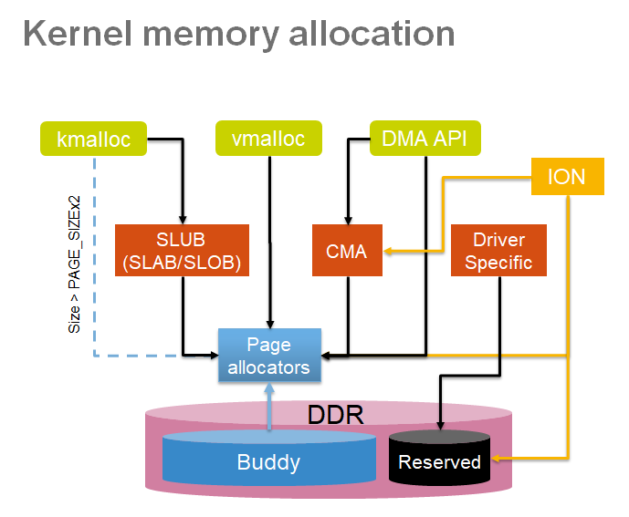
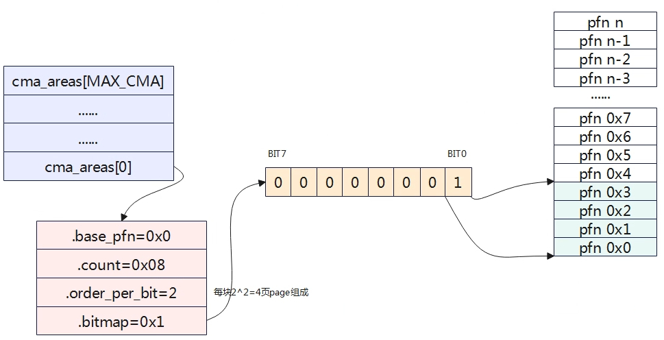
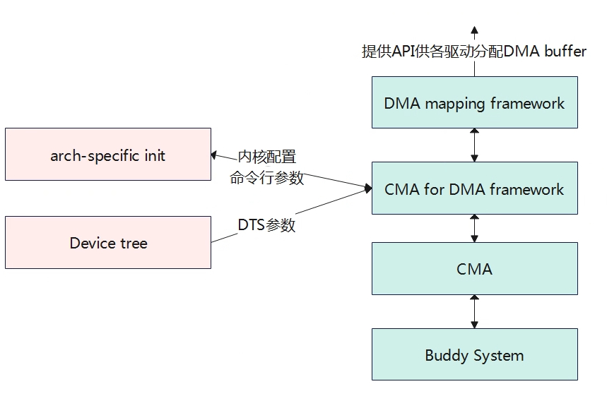

# 连续内存分配



在嵌入式环境中，许多设备都需要连续内存块的操作，比如相机、视频解码器、音频设备等，早期内核驱动只能通过预留专属内存的方式，在映射后作为设备私有内存使用。这样的后果就是当设备不工作时，预留的内存页无法被当作通用内存使用，造成了内存的浪费。

连续内存分配(CMA)就是为了解决上述困境而被引入的。当一个驱动模块想要申请大块连续内存时，内存管理系统将CMA区域的内存进行迁移，空出连续内存给驱动使用。而当驱动模块释放时，它又被归还给操作系统管理，可以分配给其他使用者。

## 设备树配置

CMA的每个区域实际就是一个reserved memory，分为两种：

- 通用的CMA区域，分配给整个系统
- 专用的CMA区域，分配给某个特定的模块

下面定义了两段CMA区域：

1. 全局CMA区域，节点名"cma_reserved"，包含"reusable"属性
2. 私有CMA区域，节点名"ion_cma"

```DTS
reserved-memory{
	#address-cells = <0x2>;
	#size-cells = <0x2>;
	ranges;

	cma_reserved: cma_reserved{
		compatible = "shared-dma-pool";		//define standard dma-pool
        reusable;		//this region can be used by other clients
        size = <0x0 0x80000000>; 
        alignment = <0x0 0x2000>; 
	};

	ion_cma: ion_cma{
		compatible = "ion-region";
		size = <0x0 0x04000000>;
		alignment = <0x0 0x2000>;	
	};

};
```

## 数据结构

`struct cma`用于管理一个CMA区域：

```C
struct cma {
	unsigned long   base_pfn;
	unsigned long   count;
	unsigned long   *bitmap;
	unsigned int order_per_bit; 
	struct mutex    lock;
#ifdef CONFIG_CMA_DEBUGFS
	struct hlist_head mem_head;
	spinlock_t mem_head_lock;
#endif
	const char *name;
};

//全局CMA数组
extern struct cma cma_areas[MAX_CMA_AREAS];
```

> base_pfn：物理地址起始页帧号

> count：区域的总页数

> bitmap：0表示free，1表示已分配

> order_per_bit：每个bit代表page的order值，以2^order为单位



## MIGRATE_CMA

在<include/linux/mmzone.h\>中定义了如下migrate type：

```C
enum migratetype {
	MIGRATE_UNMOVABLE,
	MIGRATE_MOVABLE,
	MIGRATE_RECLAIMABLE,
	MIGRATE_PCPTYPES,	/* the number of types on the pcp lists */
	MIGRATE_HIGHATOMIC = MIGRATE_PCPTYPES,
	MIGRATE_CMA,

#ifdef CONFIG_MEMORY_ISOLATION
	MIGRATE_ISOLATE,	/* can't allocate from here */
#endif
	MIGRATE_TYPES
};
```

被标记为{==MIGRATE_MOVABLE==}的页，表示该页面上的数据是可以迁移的。也就是说，如果需要，我们可以分配一个新的页，将数据拷贝到这个新的页上，然后释放旧的页。这样的拷贝操作对系统没有任何的影响。

[伙伴系统](./mm.md/#_5)不会跟踪每一个页框的migrate type，这样成本太高了，它是基于{==页块==}(多个页框的组合)来管理的。在处理内存分配请求的时候，一般会优先从相同migrate type的页块中分配页面。如果分配不成功，不同migrate type的页块也会考虑，甚至可能改变页块的migrate type属性。这意味着UNMOVABLE的页面分配请求是有可能从MOVABLE的页块中分配的，这一点对于CMA来说是不可接受的。因此内核引入了{==MIGRATE_CMA==}，这种类型具有一个重要性质：只有MOVABLE的页面可以从MIGRATE_CMA的页块中分配。

## 分配内存

```C
struct page *cma_alloc(struct cma *cma, size_t count, unsigned int align,
		       bool no_warn)
{
	unsigned long mask, offset;
	unsigned long pfn = -1;
	unsigned long start = 0;
	unsigned long bitmap_maxno, bitmap_no, bitmap_count;
	size_t i;
	struct page *page = NULL;
	int ret = -ENOMEM;

	if (!cma || !cma->count || !cma->bitmap)
		return NULL;

	pr_debug("%s(cma %p, count %zu, align %d)\n", __func__, (void *)cma,
		 count, align);

	if (!count)
		return NULL;

	mask = cma_bitmap_aligned_mask(cma, align);
	offset = cma_bitmap_aligned_offset(cma, align);
	bitmap_maxno = cma_bitmap_maxno(cma);
	bitmap_count = cma_bitmap_pages_to_bits(cma, count);

	if (bitmap_count > bitmap_maxno)
		return NULL;

	for (;;) {
		mutex_lock(&cma->lock);

        //查找连续多个为0的bit位
		bitmap_no = bitmap_find_next_zero_area_off(cma->bitmap,
				bitmap_maxno, start, bitmap_count, mask,
				offset);
		if (bitmap_no >= bitmap_maxno) {
			mutex_unlock(&cma->lock);
			break;
		}

        //将查找到的多个bit设为1，表示内存被占用
		bitmap_set(cma->bitmap, bitmap_no, bitmap_count);
		/*
		 * It's safe to drop the lock here. We've marked this region for
		 * our exclusive use. If the migration fails we will take the
		 * lock again and unmark it.
		 */
		mutex_unlock(&cma->lock);

        //计算分配的起始页的页号
		pfn = cma->base_pfn + (bitmap_no << cma->order_per_bit);
		mutex_lock(&cma_mutex);

        //向伙伴系统申请内存，并标记为MIGRATE_CMA
		ret = alloc_contig_range(pfn, pfn + count, MIGRATE_CMA,
				     GFP_KERNEL | (no_warn ? __GFP_NOWARN : 0));
		mutex_unlock(&cma_mutex);

        //分配成功，返回起始页
		if (ret == 0) {
			page = pfn_to_page(pfn);
			break;
		}

		cma_clear_bitmap(cma, pfn, count);
		if (ret != -EBUSY)
			break;

		pr_debug("%s(): memory range at %p is busy, retrying\n",
			 __func__, pfn_to_page(pfn));
		/* try again with a bit different memory target */
		start = bitmap_no + mask + 1;
	}

	trace_cma_alloc(pfn, page, count, align);

	/*
	 * CMA can allocate multiple page blocks, which results in different
	 * blocks being marked with different tags. Reset the tags to ignore
	 * those page blocks.
	 */
	if (page) {
		for (i = 0; i < count; i++)
			page_kasan_tag_reset(page + i);
	}

	if (ret && !no_warn) {
		pr_err("%s: alloc failed, req-size: %zu pages, ret: %d\n",
			__func__, count, ret);
		cma_debug_show_areas(cma);
	}

	pr_debug("%s(): returned %p\n", __func__, page);
	return page;
}
```

## 释放内存

```C
bool cma_release(struct cma *cma, const struct page *pages, unsigned int count)
{
	unsigned long pfn;

	if (!cma || !pages)
		return false;

	pr_debug("%s(page %p)\n", __func__, (void *)pages);

	pfn = page_to_pfn(pages);

	if (pfn < cma->base_pfn || pfn >= cma->base_pfn + cma->count)
		return false;

	VM_BUG_ON(pfn + count > cma->base_pfn + cma->count);

    //释放回buddy系统
	free_contig_range(pfn, count);

    //清零bit位，表示cma内存可用
	cma_clear_bitmap(cma, pfn, count);
	trace_cma_release(pfn, pages, count);

	return true;
}
```

## 应用



CMA向下基于伙伴系统，向上提供给DMA的封装接口，最终用户通过操作DMA buffer来分配和释放内存：


```C
//DMA的申请
struct page *dma_alloc_from_contiguous(struct device *dev, size_t count,
                       unsigned int align, bool no_warn)
{
    if (align > CONFIG_CMA_ALIGNMENT)
        align = CONFIG_CMA_ALIGNMENT;

    return cma_alloc(dev_get_cma_area(dev), count, align, no_warn);
}

//DMA的释放
bool dma_release_from_contiguous(struct device *dev, struct page *pages,
                 int count)
{
    return cma_release(dev_get_cma_area(dev), pages, count);
}
```