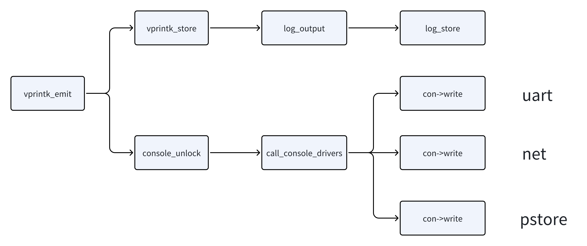

# 调试技术

## 内核日志系统

### log_buf

`log_buf`是一个循环缓冲区，用于存储内核日志消息，定义在<kernel/printk/printk.c\>中：

```C 
#define LOG_ALIGN __alignof__(unsigned long)
#define __LOG_BUF_LEN (1 << CONFIG_LOG_BUF_SHIFT)
#define LOG_BUF_LEN_MAX (u32)(1 << 31)
static char __log_buf[__LOG_BUF_LEN] __aligned(LOG_ALIGN);
static char *log_buf = __log_buf;
static u32 log_buf_len = __LOG_BUF_LEN;
```

`vprintk_emit()`函数从`log_buf`中获取log，然后输出至console，过程如下：



`console_unlock()`函数遍历每个注册的console，输出log，是在持有spinlock和关中断状态下执行的。因此如果串口一直在打印log，会导致CPU一直处于关中断状态，其他进程无法获得调度机会导致卡死：

```C
void console_unlock(void)
{
	static char ext_text[CONSOLE_EXT_LOG_MAX];
	static char text[LOG_LINE_MAX + PREFIX_MAX];
	unsigned long flags;
	bool do_cond_resched, retry;
	struct printk_info info;
	struct printk_record r;

	if (console_suspended) {
		up_console_sem();
		return;
	}

	prb_rec_init_rd(&r, &info, text, sizeof(text));

	/*
	 * Console drivers are called with interrupts disabled, so
	 * @console_may_schedule should be cleared before; however, we may
	 * end up dumping a lot of lines, for example, if called from
	 * console registration path, and should invoke cond_resched()
	 * between lines if allowable.  Not doing so can cause a very long
	 * scheduling stall on a slow console leading to RCU stall and
	 * softlockup warnings which exacerbate the issue with more
	 * messages practically incapacitating the system.
	 *
	 * console_trylock() is not able to detect the preemptive
	 * context reliably. Therefore the value must be stored before
	 * and cleared after the "again" goto label.
	 */
	do_cond_resched = console_may_schedule;
again:
	console_may_schedule = 0;

	/*
	 * We released the console_sem lock, so we need to recheck if
	 * cpu is online and (if not) is there at least one CON_ANYTIME
	 * console.
	 */
	if (!can_use_console()) {
		console_locked = 0;
		up_console_sem();
		return;
	}

	for (;;) {
		size_t ext_len = 0;
		size_t len;

		printk_safe_enter_irqsave(flags);
		raw_spin_lock(&logbuf_lock);
skip:
		if (!prb_read_valid(prb, console_seq, &r))
			break;

		if (console_seq != r.info->seq) {
			console_dropped += r.info->seq - console_seq;
			console_seq = r.info->seq;
		}

		if (suppress_message_printing(r.info->level)) {
			/*
			 * Skip record we have buffered and already printed
			 * directly to the console when we received it, and
			 * record that has level above the console loglevel.
			 */
			console_seq++;
			goto skip;
		}

		/* Output to all consoles once old messages replayed. */
		if (unlikely(exclusive_console &&
			     console_seq >= exclusive_console_stop_seq)) {
			exclusive_console = NULL;
		}

		/*
		 * Handle extended console text first because later
		 * record_print_text() will modify the record buffer in-place.
		 */
		if (nr_ext_console_drivers) {
			ext_len = info_print_ext_header(ext_text,
						sizeof(ext_text),
						r.info);
			ext_len += msg_print_ext_body(ext_text + ext_len,
						sizeof(ext_text) - ext_len,
						&r.text_buf[0],
						r.info->text_len,
						&r.info->dev_info);
		}
		len = record_print_text(&r,
				console_msg_format & MSG_FORMAT_SYSLOG,
				printk_time);
		console_seq++;
		raw_spin_unlock(&logbuf_lock);

		/*
		 * While actively printing out messages, if another printk()
		 * were to occur on another CPU, it may wait for this one to
		 * finish. This task can not be preempted if there is a
		 * waiter waiting to take over.
		 */
		console_lock_spinning_enable();

		stop_critical_timings();	/* don't trace print latency */
		call_console_drivers(ext_text, ext_len, text, len);
		start_critical_timings();

		if (console_lock_spinning_disable_and_check()) {
			printk_safe_exit_irqrestore(flags);
			return;
		}

		printk_safe_exit_irqrestore(flags);

		if (do_cond_resched)
			cond_resched();
	}

	console_locked = 0;

	raw_spin_unlock(&logbuf_lock);

	up_console_sem();

	/*
	 * Someone could have filled up the buffer again, so re-check if there's
	 * something to flush. In case we cannot trylock the console_sem again,
	 * there's a new owner and the console_unlock() from them will do the
	 * flush, no worries.
	 */
	raw_spin_lock(&logbuf_lock);
	retry = prb_read_valid(prb, console_seq, NULL);
	raw_spin_unlock(&logbuf_lock);
	printk_safe_exit_irqrestore(flags);

	if (retry && console_trylock())
		goto again;
}
EXPORT_SYMBOL(console_unlock);
```

`call_console_drivers()`函数负责调用每个console的write接口，将日志写入对应的console：

```C
static void call_console_drivers(const char *ext_text, size_t ext_len,
				 const char *text, size_t len)
{
	static char dropped_text[64];
	size_t dropped_len = 0;
	struct console *con;

	trace_console_rcuidle(text, len);

	if (!console_drivers)
		return;

	if (console_dropped) {
		dropped_len = snprintf(dropped_text, sizeof(dropped_text),
				       "** %lu printk messages dropped **\n",
				       console_dropped);
		console_dropped = 0;
	}

	for_each_console(con) {
		if (exclusive_console && con != exclusive_console)
			continue;
		if (!(con->flags & CON_ENABLED))
			continue;
		if (!con->write)
			continue;
		if (!cpu_online(smp_processor_id()) &&
		    !(con->flags & CON_ANYTIME))
			continue;
		if (con->flags & CON_EXTENDED)
			con->write(con, ext_text, ext_len);
		else {
			if (dropped_len)
				con->write(con, dropped_text, dropped_len);
			con->write(con, text, len);
		}
	}
}
```

### 访问log

1. `syslog()`系统调用和`klogctl()`接口
    - `klogctl()`是`syslog()`系统调用的封装，可以通过man查看用法
2. /dev/kmsg
    - `cat /dev/kmsg`：查看原始log数据
    - `echo xxx > /dev/kmsg`：插入log
3. /proc/kmsg
    - `cat /proc/kmsg`：只显示新产生的log
4. dmesg命令
    - `dmesg -c`：记录显示位置，下次不会显示之前的log
    - `dmesg -n 8`：设置日志等级为8
    - `dmesg -r`：打印log时附带log level

### log_level

log_level用来控制哪些log可以在串口控制台被打印：

| 日志等级 | 描述|
| ----- | ----- |
| KERN_EMERG | System is unusable |
| KERN_ALERT | Action must be taken immediately |
| KERN_CRIT | Critial conditions |
| KERN_ERR | Error conditions |
| KERN_WARNING | Warning conditions |
| KERN_NOTICE | Normal but significant condition |
| KERN_INFO | Informational |
| KERN_DEBUG | Debug-level mesasges |

```shell
$ cat /proc/sys/kernel/printk
4       4       1       7
```

上面四个数字分别对应：

- console_loglevel：控制台输出等级
- default_message_loglevel：默认消息输出等级
- minimum_console_loglevel：最低控制台输出等级
- default_console_loglevel：默认控制台输出等级

### 打印函数

- printk：不建议直接使用
- pr_debug, pr_xxx：内核非设备驱动使用
- dev_dbg, dev_xxx：内核驱动中使用

### 调试函数

- dump_stack()：打印当前调用栈
- BUG()：触发panic，输出log
- BUG_ON(condition)：触发panic，输出log
- WARN(condition, fmt...)：当condition为真时，打印信息，不触发panic
- WARN_ON（condition)：调用`dump_stack()`
- panic(fmt...)：系统crash，输出log

## 动态打印

/sys/kernel/debug/dynamic_debug/control 是 Linux 系统中的一个特殊文件，用于动态调试内核代码。开发者可以在运行时动态地启用或禁用内核中的调试信息，而不需要重新编译内核。所有通过`pr_debug()`和`dev_debug()`打印的信息都可以动态的显示或不显示。

/sys/kernel/debug/dynamic_debug/control 文件接受以下格式的命令：

```SHELL
module <module_name> <flags>
file <file_name> <flags>
func <function_name> <flags>
line <line_number> <flags>
format <format_string> <flags>
```

例如，下面这条命令会启用`my_driver.c`文件中所有使用`pr_debug()`和`dev_dbg()`宏输出的调试信息。命令中的`+p`参数表示启用打印。

```SHELL
echo 'file my_driver.c +p' > /sys/kernel/debug/dynamic_debug/control
```

## 常用调试功能

### KASAN

### strace

`strace`用于跟踪程序的系统调用情况，它的基本用法是：`strace [options] command [command-args]`。

启动选项：

- `-E`：设置环境变量
- `-p`：跟踪指定进程
- `-u`：以指定用户启动

过滤：

- `-e`：指定过滤条件，参数trace设置指定追踪事件，signal设置指定信号，status设置指定返回状态

输出格式：

- `-c`：统计每个系统调用的时间、次数和错误
- `-o filename`：将输出写入指定文件
- `-t `：在每行系统调用输出前显示时间戳
- `-tt`：显示微妙级的时间戳
- `-T`：显示每个系统调用的执行时间
- `-v`：详细输出，包括所有结构和符号常量
- `-x`：以十六进制格式显示非ASCII字符串
- `-y`：显示每个文件描述符对应的文件路径


