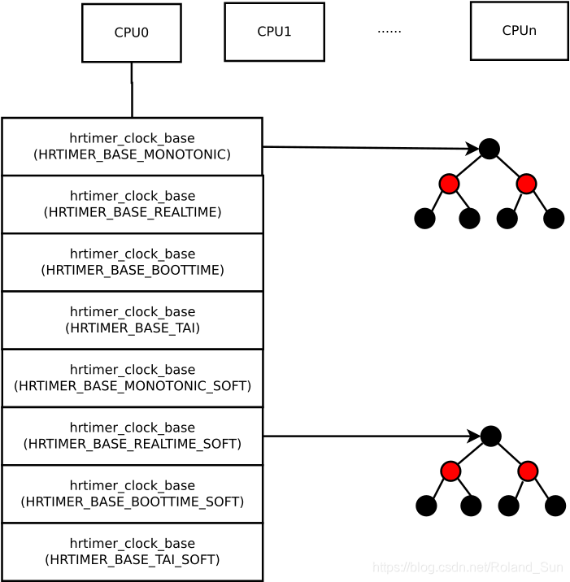

# 高精度定时器

传统的定时器精度不足，只能支持 Tick 级别的精度(ms级别)。为了支持更高的精度(ns级别)，内核独立设计了一个 hrtimer(high resolution timer)：使用红黑树来组织，新的定时器按顺序被插入到红黑树中，树的最左边的节点就是最快到期的定时器。

高精度定时器建立在 Per CPU 变量上，每个 CPU 都有一个独立的定时器。它有两种工作模式：低精度模式和高精度模式。

## 关键数据结构

`struct hrtimer`结构体表示一个高精度定时器：

```C
struct hrtimer {
	struct timerqueue_node		node;
	ktime_t				_softexpires;
	enum hrtimer_restart		(*function)(struct hrtimer *);
	struct hrtimer_clock_base	*base;
	u8				state;
	u8				is_rel;
	u8				is_soft;
	u8				is_hard;
};
```

> node：红黑树节点

> _softexpires：软超时时间

> function：定时器到期时调用的回调函数，该函数的返回值决定了定时器是否需要重新启动

> base：指向包含该高精度定时器的hrtimer_clock_base结构体

> state：高精度定时器状态，有两种状态：HRTIMER_STATE_INACTIVE（未激活）和HRTIMER_STATE_ACTIVE（激活）

> is_rel：表示到期时间是否是相对时间

> is_soft：表示定时器是否是软定时器

> is_hard：表示定时器是否是硬定时器


高精度定时器的到期时间有以下几种：

```C
enum  hrtimer_base_type {
	HRTIMER_BASE_MONOTONIC,
	HRTIMER_BASE_REALTIME,
	HRTIMER_BASE_BOOTTIME,
	HRTIMER_BASE_TAI,
	HRTIMER_BASE_MONOTONIC_SOFT,
	HRTIMER_BASE_REALTIME_SOFT,
	HRTIMER_BASE_BOOTTIME_SOFT,
	HRTIMER_BASE_TAI_SOFT,
	HRTIMER_MAX_CLOCK_BASES,
};
```

出于效率的考虑，每个 CPU 都需要管理自己的高精度定时器，为此专门定义了一个结构`struct hrtimer_cpu_base`：

```C
struct hrtimer_cpu_base {
		......
	struct hrtimer_clock_base   clock_base[HRTIMER_MAX_CLOCK_BASES];
};
```

`clock_base`数组为每种时间基准系统(hrtimer_base_type)都定义了`struct hrtimer_clock_base`结构体：


```C
struct hrtimer_clock_base {
	struct hrtimer_cpu_base	*cpu_base;
	unsigned int		index;
	clockid_t		clockid;
	seqcount_raw_spinlock_t	seq;
	struct hrtimer		*running;
	struct timerqueue_head	active;
	ktime_t			(*get_time)(void);
	ktime_t			offset;
} __hrtimer_clock_base_align;
```

其中 active 字段封装了红黑树：

```C
struct timerqueue_head {
	struct rb_root_cached rb_root;
};

struct rb_root_cached {
	struct rb_root rb_root;
	struct rb_node *rb_leftmost;
};
```

`rb_leftmost`指针指向了红黑树中最先到期的定时器。



## 使用方法

创建一个高精度定时器：

```C
struct hrtimer hr_timer;
```

初始化定时器：

```C
void hrtimer_init(struct hrtimer *timer, clockid_t which_clock, 
                  enum hrtimer_mode mode);
```

定时器初始化时，需要指定定时模式和时钟类型。

定时模式有以下几种：

- HRTIMER_MODE_ABS：绝对定时模式。定时器将在一个特定的未来时间点到期。
- HRTIMER_MODE_REL：相对定时模式。定时器将在当前时间点之后的指定时间间隔到期。
- HRTIMER_MODE_PINNED：固定定时模式。定时器将绑定到某个 CPU 上
- HRTIMER_MODE_SOFT：软定时模式。定时器回调函数将在软中断上下文中执行。
- HRTIMER_MODE_HARD：硬定时模式。定时器回调函数将在硬中断上下文中执行。

时钟类型主要有以下几种：

- CLOCK_REALTIME：系统实时时间，即日历时间
- CLOCK_MONOTONIC：从系统启动开始到现在为止的时间，休眠不会增加
- CLOCK_PROCESS_CPUTIME_ID：当前进程启动到执行到当前代码，系统花费的时间
- CLOCK_THREAD_CPUTIME_ID：当前线程启动到执行到当前代码，系统花费的时间
- CLOCK_BOOTTIME：系统从上电开始到现在为止的时间，休眠也会增加

启动一个高精度定时器：
```C
int hrtimer_start(struct hrtimer *timer, ktime_t time,
                  const enum hrtimer_mode mode);
```

如果需要制定到期范围，则可以使用`hrtimer_start_range_ns()`函数激活定时器：

```C
void hrtimer_start_range_ns(struct hrtimer *timer, ktime_t tim,
				    u64 range_ns, const enum hrtimer_mode mode);
```

取消一个正在运行的高精度定时器：
```C
int hrtimer_cancel(struct hrtimer *timer);
```

!!! example "高精度定时器的使用"
    ```C
    #include <linux/hrtimer.h>
    #include <linux/ktime.h>

    // 定义一个高精度定时器的回调函数
    static enum hrtimer_restart my_hrtimer_callback(struct hrtimer *timer_for_my_hrtimer)
    {
        // 定时器到期的处理逻辑
        // ...

        // 如果需要，重新启动定时器
        // hrtimer_start(timer_for_my_hrtimer, ktime_set(0, 1000000), HRTIMER_MODE_REL);

        return HRTIMER_NORESTART; // 或者 HRTIMER_RESTART
    }

    void my_hrtimer_function(void)
    {
        struct hrtimer hr_timer;
        ktime_t ktime;

        // 初始化定时器
        hrtimer_init(&hr_timer, CLOCK_MONOTONIC, HRTIMER_MODE_REL);

        // 设置定时器的回调函数
        hr_timer.function = &my_hrtimer_callback;

        // 设置定时时间（例如，1毫秒后）
        ktime = ktime_set(0, 1000000); // 0秒，1000000纳秒

        // 启动定时器
        hrtimer_start(&hr_timer, ktime, HRTIMER_MODE_REL);
    }
    ```


