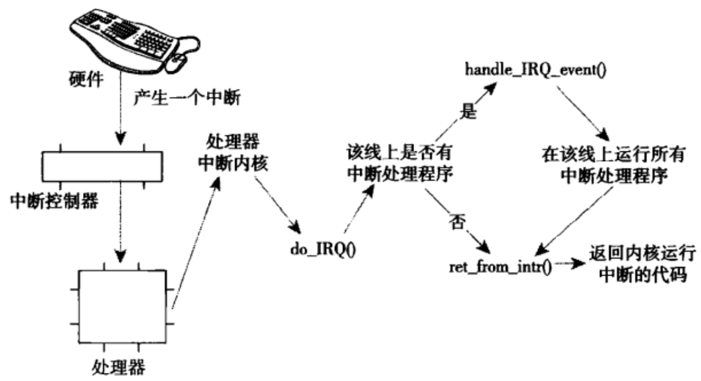

# 中断和中断处理

中断是一种事件，该事件改变处理器执行指令的顺序。这种方式有同步和异步之分。同步中断也被称为异常。在处理器执行到由于编程失误而导致的错误指令（比如除以0）的时候，或者是在执行期间出现特殊情况（比如缺页），必须靠内核处理的时候，处理器就会产生一个异常。异步中断则是由硬件引起的。

中断又可以分为可屏蔽中断和不可屏蔽中断。通常，I/O设备发出的所有中断请求都是可屏蔽的，而部分危急事件（比如硬件故障）是不可屏蔽的。每个中断和异常都是由0 ~ 255之间的一个数来标识，这个数被称作为是向量（vector）。不可屏蔽中断的向量是固定的，而可屏蔽中断的向量可以通过对中断控制器的编程来改变。

显然，中断信号提供了一种特殊的方式，让处理器去执行正常运行代码之外的逻辑。当一个中断信号到来时，CPU必须停下它当前正在做的事情，转而去处理中断代码。为了做到这一点，就需要在内核态堆栈保存当前上下文环境，并且把触发了何种中断也放进寄存器中。

你可能会把中断处理与进程切换联系起来。确实这两者有部分相似之处，但是中断执行的代码不是进程环境。它是一个内核控制的特殊路径，必须快速处理，不能停留。由于中断处理是内核最为敏感的任务之一，为了提高系统的性能，它必须有以下约束：

- 中断必须尽可能快地处理。为此，中断处理通常分为两部分：关键而紧急的部分，内核立即执行；其余部分推迟执行。

- 中断必须可以嵌套执行。由于中断随时会到来，在内核处理其中一个中断时，另一个中断也会发生。当中断处理完成后，内核必须能恢复被中断进程的执行。

- 在临界区中，中断必须被禁止。

## 中断处理程序

在响应一个特定的中断时，内核会执行一个函数，该函数叫中断处理程序（interrupt handler）或中断服务例程（interrupt service routine, ISR）。产生中断的每个设备都有一个响应的中断处理程序，一个设备的中断处理程序是它驱动程序的一部分。

中断处理程序处于特殊的中断上下文中。在解释中断上下文之前，我们先回忆一下进程上下文。在进程上下文中，可以使用`current`宏关联当前进程，可以睡眠，也可以调用调度程序。与之相反，中断上下文与进程没有什么关联。因为中断的触发是随时到来的，并不知道当前处于哪个进程。因为没有后备进程，所以中断上下文不可睡眠，也不能调用任何可以引起睡眠的函数。

中断随时有可能发生，因此中断处理程序必须快速执行。但是，中断处理程序往往还要完成大量其他的工作。尤其体现在网络设备上，除了对硬件应答之外，还需要把来自硬件的网络数据拷贝到内存，显然这种工作量不会小。

又想中断处理程序运行得快，又要其完成的工作多。鉴于这两者之间的矛盾关系，我们一般把中断处理的过程切分为两个部分：上半部和下半部。通常所说的中断处理程序是指上半部——当接收到一个中断后，它立刻被执行，但只做有严格时限的工作。例如对接收到的中断进行应答。而稍后需要完成的工作则会被推迟到下半部去，在合适的时机执行。内核提供了多种下半部的机制，稍后会做说明。

设备驱动程序可以通过`request_irq()`函数注册一个中断处理程序，并且激活给定的中断线：

```C
int request_irq(unsigned int irq, irq_handler_t handler, unsigned long flags,
                const char *name, void *dev)
```

第一个参数irq表示要分配的中断号。

第二个参数handler是一个函数指针，指向处理这个中断的实际中断处理程序。

```C
typedef irqreturn_t (*irq_handler_t)(int, void*);
```

第三个参数flags可以为0，也可以是下列一个或多个标志的位掩码，更多的定义在<linux/interrupt.h\>：

- IRQF_TIMER——系统定时器标志
- IRQF_SHARED——在多个中断处理程序之间共享中断线。如果中断处理程序在同一条线上注册，那么必须指定这个标志。

第四个参数name是与中断相关的设备的ASCII文本表示。这些名字会被/proc/irq和/proc/interrupts文件使用。

第五个参数dev用于确定共享中断线的中断处理程序。当多个中断处理程序共享某条中断线，其中某个需要释放时，dev将提供唯一的标志信息以便确定是哪个程序需要删除。

`request_irq()`成功返回0，错误返回非0。最常见的错误是-EBUSY，表示给定的中断线已经被使用。

`request_irq()`可能会睡眠，因此不能在不允许阻塞代码中调用该函数。

卸载驱动程序时，需要注销响应的中断处理程序，并释放中断线：

```C
void free_irq(unsigned int irq, void *dev)
```

如果指定的中断线不是共享的，那么该函数删除处理程序的同时将禁用这条中断线。如果是共享的，那么仅删除所对应的中断处理程序，而这条中断线只有在删除了最后一个处理程序时才会被禁用。

要编写自己的中断处理程序，需要用到以下函数：


```C
static irqreturn_t intr_handler(int irq, void *dev)
```

参数irq已经没有什么用了，参数dev用来向中断处理程序传递数据结构。

Linux上的中断处理程序无需要求可重入。因为中断处理程序运行时相应中断线上的中断是屏蔽的，也就是不会发生相同中断的嵌套。但不同中断的嵌套有可能发生。

对于共享的中断处理程序，除了要指定`request_irq()`函数中的参数flags为IRQF_SHARED标志，还需要保证参数dev的唯一性。当内核接收一个中断后，它将依次调用在该中断线上注册的每一个处理程序。因此一个处理程序必须知道它是否该为这个中断负责，如果不是就要立即退出。

## 中断处理机制



中断处理系统在Linux中的实现依赖于体系结构。上图是中断从硬件到内核执行的过程。当一个设备产生中断后，通过总线把电信号发送给中断控制器。如果中断线是激活的，那么中断控制器就会把中断发送给处理器。在大多数体系结构中，这个工作就是通过电信号给处理器的特定管脚发送一个信号。除非处理器禁止了该中断，否则它会立刻停下当前执行的代码，关闭中断系统，然后跳到内存中预定义的位置开始执行那里的代码。这个预定义的位置由内核设置，是中断处理程序的入口点。

对于每条中断线，处理器都会跳到对应的一个唯一的位置。这样，内核就可以知道所接收中断的IRQ号了。初始入口点在栈中保存IRQ号，并存放当前寄存器的值（这些值属于被中断的任务）。然后，由内核调用`do_IRQ()`函数：

```C
unsigned int do_IRQ(struct pt_regs *regs)
```

由于初始入口点已经将IRQ号和寄存器的值保存在栈中了，所以函数`do_IRQ()`可以直接提取栈中的参数。

`do_IRQ()`执行完中断服务器程序后，会检查是否需要重新调度（need_resched标志位），然后判断返回哪个空间：

- 返回用户空间：调用`schedule()`函数。

- 返回内核空间：如果preempt_count标志为0，调用`schedule()`函数，否则不会触发调度。

> procfs是一个虚拟文件系统，可以通过读/proc/interrupts文件读取系统中与中断相关的统计信息。

## 中断控制

Linux内核提供了一组接口用于操作机器上的中断状态。这些接口为我们提供了能够禁止当前处理器的中断系统，或屏蔽掉整个机器的一条中断线的能力。这些操作都是与体系结构相关的。一般来说，控制中断系统的原因归根到底是需要同步。通过禁止中断，可以确保某个中断处理程序不会被抢占。此外，还可以禁止内核抢占。要注意的是，在编写驱动程序时，应该尽量减少中断，同时不要把这种技术当做互斥机制来使用。

禁止和激活本地中断的函数为：

```C
local_irq_disable();

local_irq_enable();
```

如果在调用`local_irq_disable()`函数前已经禁止了中断，那么该操作会带来潜在的危险。同样，`local_irq_enable()`函数也存在危险，因为它会无条件激活中断。当内核代码变得复杂时，我们并不知道当前处理器中断状态，所以我们需要一种机制，仅仅时把中断恢复到以前的状态而不是简单地禁止或者是激活。

```C
unsigned long flags;
local_irq_save(flags);
local_irq_restore(flags);
```

在前面的内容中，我们知道了禁止整个处理器上所有中断的函数。在某些情况下，需要禁止特定的中断线。相关函数如下：

```C
void disable_irq(unsigned int irq);
void disable_irq_nosync(unsigned int irq);
void enable_irq(unsigned int irq);
void synchronize_irq(unsigned int irq);
```

由于现代设备驱动程序的中断处理程序往往共享某个中断线，禁止了某条中断线也就禁止了这条线上所有设备的中断传递。因此这些接口函数不应该被使用。

## 下半部机制

操作系统需要有一个快速、异步且简单的机制负责对硬件迅速做出相应并完成那些时间要求很严格的操作。中断处理程序很适合于实现这些功能。而对于那些时间要求相对宽松的任务，应当放到下半部去处理。

理想情况下，最好让所有的工作都交给下半部去处理。但是，总有一些工作需要中断处理程序来完成，比如对中断的到达进行确认，从硬件拷贝数据等。如何区分上半部和下半部，完全由驱动程序开发者自行判断。如果任务满足以下要求，则适合放到中断处理程序执行。

- 如果这个任务对时间非常敏感。
- 如果这个任务和硬件相关。
- 如果这个任务不能被其他中断打断。

其他所有任务，考虑放在下半部执行。在编写程序时，中断处理程序仅执行最关键的紧急任务，随后便会触发下半部机制以处理后续的非紧急任务。

## 软中断

软中断的英文名是softirq，与软件中断（software irq）没有关系。

软中断使用比较少，tasklet是下半部更常用过的一种形式。但是，由于tasklet是通过软中断实现的，所以也有必要先研究软中断。

### 软中断的实现

软中断在编译期间静态分配，由`softirq_action`结构体表示：

```C
struct softirq_action{
    void (*action)(struct softirq_action*);
};
```

在<kernel/softirq.c\>中定义了一个包含有32个该结构体的数组：

```C
static struct softirq_action softirq_vec[NR_SOFTIRQS];
```

每个被注册的软中断都占据该数组的一项，因此最大有32个软中断。

软中断处理程序action的函数原型如下：

```C
void softirq_handler(struct softirq_action *)
```

当内核运行一个软中断处理程序时，就会执行这个action函数，其唯一的参数是指向相应`softirq_action`结构体的指针。例如，如果my_softirq指向softirq_vec数组的某项，那么内核就会用如下的方式调用软中断处理程序中的函数：

```C
my_softirq->action(my_softirq);
```

一个注册的软中断必须在被标记后才会执行，这被称为触发软中断（raising the softirq）。通常，中断处理程序会在返回前标记它的软中断，使其在稍后被执行。`do_softirq()`函数会检查softirq_vec数组中所有待处理的软中断，调用它们的处理程序。

### 使用软中断

软中断保留给系统中对时间要求最严格以及最重要的下半部使用。内核在<linux/interrupt.h\>中已经定义了一个枚举类型来静态地声明软中断，索引号表示其优先级。要建立一个新的软中断必须在此枚举类型中加入新的项，而且你必须根据它的优先级来决定加入的位置。下表列出了已有的tasklet类型。

| tasklet | 优先级 | 软中断描述 |
| --- | --- | --- |
| HI_SOFTIRQ | 0 | 优先级高的tasklets |
| TIMER_SOFTIRQ | 1 | 定时器的下半部 |
| NET_TX_SOFTIRQ | 2 | 发送网络数据包 |
| NET_RX_SOFTIRQ | 3 | 接收网络数据包 |
| BLOCK_SOFTIRQ | 4 | BLOCK装置 |
| TASKLET_SOFTIRQ | 5 | 正常优先权的tasklets |
| SCHED_SOFTIRQ | 6 | 调度程序 |
| HRTIMER_SOFTIRQ | 7 | 高分辨率定时器 |
| RCU_SOFTIRQ | 8 | RCU锁定 |

接着，在运行时通过调用`open_softirq()`函数注册软中断处理程序，该函数有两个参数，软中断索引号和处理函数：

```C
open_softirq(NET_TX_SOFTIRQ, net_tx_action)
```

软中断处理程序执行的时候，允许响应中断，但它自己不能休眠。在一个处理程序运行时，当前处理器上的软中断被禁止。但其他处理器仍然可以执行别的软中断。这意味着共享数据需要锁的保护。因此大部分软中断处理，都通过采取单处理器数据来避免加锁，从而提供更出色的性能。

在注册完之后，新的软中断处理程序就能够运行。`raise_softirq()`函数可以将一个软中断设置为挂起状态，让它在下次调用`do_softirq()`函数时投入运行。

在中断处理程序中触发软中断是最常见的形式。内核在执行完中断处理程序之后，马上就会调用`do_softirq()`函数，于是软中断开始执行给定的任务。

## tasklet

tasklet是利用软中断实现的一种下半部机制，但是它的接口更简单，锁保护要求较低。大多数情况都可以使用tasklet来完成你需要的工作。

tasklet有一些比较有意思的特性：

- 一个tasklet可在稍后被禁止或者重新启用；只有启用的次数和禁止的次数相同时，tasklet才会被执行。

- tasklet可以注册自己本身。

- tasklet可被调度在正常优先级或者更高优先级执行。

- 当系统负载低时，tasklet会被立刻执行，但再晚不会晚于下一个定时器tick。

- 一个tasklet可以与其他tasklet并发，但是同一个tasklet永远不会在多个CPU上同时运行，且只会在调度自己的同一CPU上运行。

### tasklet的实现

tasklet由两类软中断代表：HI_SOFTIRQ和TASKLET_SOFTIRQ。前者优先级比后者高。

tasklet结构体如下：

```C
struct tasklet_struct {
    struct tasklet_struct *next;    //链表中下一个tasklet
    unsigned long state;            //tasklet的状态
    atomic_t count;                 //引用计数器
    void (*func)(unsigned long);    //处理函数
    unsigned long data;             //传递给函数的参数
};
```

state成员只能在0、TASKLET_STATE_SCHED和TASKLET_STATE_RUN之间取值。TASKLET_STATE_SCHED表明tasklet已被调度，正准备投入运行，TASKLET_STATE_RUN表明该tasklet正在运行。TASKLET_STATE_RUN只有在多处理器的系统上才会作为一种优化来使用，单处理器系统任何时候都清楚单个tasklet是不是正在运行(它要么就是当前正在执行的代码，要么不是)。

count成员是tasklet的引用计数器。如果它不为0，则tasklet被禁止；只有当它为0时，tasklet才被激活。

已调度（或者叫已激活）的tasklet存放在tasklet_vec（普通tasklet）和tasklet_hi_vec（高优先级的tasklet）数组中。这两个数据结构都是由`tasklet_struct`结构体构成的链表，链表中每个元素代表一个不同的tasklet。

tasklet由`tasklet_schedule()`和`tasklet_hi_schedule()`函数进行调度，它们接受一个指向`tasklet_struct`结构的指针作为参数，后者将指定的tasklet以高优先级运行。

### 使用tasklet

如果是静态创建一个tasklet，可以使用以下两个宏中的一个：

```C
DECLARE_TASKLET(name, func, data)；
DECLARE_TASKLET_DISABLED(name, func, data)；
```

这两个宏都能静态创建一个`tasklet_struct`结构，区别在于引用计数count的初始值不同。第一个设为0，处于激活状态；第二个设为1，处于禁止状态。

如果是动态创建：

```C
tasklet_init(t, tasklet_handler, dev);
```

编写自己的tasklet处理程序：

```C
void tasklet_handler(unsigned long data)；
```

tasklet不能睡眠，两个相同的tasklet不会同时执行，但如果与其他tasklet或者是软中断共享了数据，那么必须进行锁保护。

通过调用`tasklet_schedule()`函数并传递给它相应的`tasklet_struct`指针，该tasklet就会被调度以便执行：

```C
tasklet_schedule(&my_tasklet);
```

一个tasklet总是在调度它的处理器上运行。要禁止/使能tasklet，可以使用这两个函数：

```C
tasklet_disable(&my_tasklet);   
tasklet_disable_nosync(&my_tasklet);         
```

第一个函数禁止指定的tasklet，如果正在运行，则会等待期执行完毕。第二个函数不会等待任何正在运行的tasklet。

使能tasklet：

```C
tasklet_enable(&my_tasklet);
```

移除tasklet，通常在设备关闭或者模块退出时调用该函数：

```C
tasklet_kill(&my_tasklet);
```

### ksoftirqd

每个处理器都有一组辅助处理软中断（和tasklet）的内核线程。当内核中出现大量软中断的时候，内核线程就会选择合适的时机来处理软中断。

在大流量的网络通信中，软中断的触发频率可能很高，甚至还会自行重复触发，这会导致用户空间的进程无法获得足够的处理器时间。如果软中断和重复触发的软中断都被立即处理，那么当负载很高的时候，系统就会出现明显的卡顿现象。如果选择不处理重新触发的软中断，又会浪费闲置的系统资源，导致软中断出现饥饿现象。

内核中的方案时不会立即处理重复触发的软中断。当大量软中断出现的时候，内核会唤醒一组内核线程来处理这些负载。这些线程在最低优先级（nice=19）运行，避免与其他任务抢占资源。

每个处理器都有一个这样的线程，名字为<font color="green">ksoftirqd/n</font>，n为处理器编号。只要有待处理的软中断，ksoftirqd就会调用`do_softirq()`函数来处理它们。

## 工作队列

工作队列是一种延后执行的机制，可以将后续的工作交给一个内核线程执行——这个下半部分总是在进程上下文中执行。这样，通过工作队列实现的代码就能享受进程上下文的所有优势，比如可以重新调度甚至是睡眠。

如果推后执行的任务需要睡眠，那么就选择工作队列。否则就选择软中断或tasklet。工作队列在你需要获得大量内存时，需要获取信号量时，需要执行阻塞式的I/O操作时，它都会非常有用。

### 工作队列的实现

工作队列子系统提供了缺省的工作者线程（worker thread）来处理需要推后的工作。缺省的工作者线程叫做<font color="green">events/n</font>，n为处理器的编号。你可以创建自己的工作者线程，不过一般使用缺省线程即可。然而，如果一个任务需要特别的处理，或者它对性能有非常严格的要求，那么创建一个专用的内核线程可能就是必要的。专用的工作者线程可以更好地控制和优化任务的执行，但也需要更多的资源和管理开销。

工作队列用`workqueue_struct`结构体表示：

```C
struct workqueue_struct {
    struct cpu_workqueue_struct cpu_wq[NR_CPUS]；
    struct list_head list;
    const char *name;
    int singlethread;
    int freezeable;
    int rt;
};
```

该结构体内有一个`cpu_workqueue_struct`结构组成的数组，数组的每一项对应系统中的一个处理器。也就是说系统中每个处理器对应一个工作者线程。

工作由`work_struct`结构体表示：

```C
struct work_struct {
    atomic_long_t data;
    struct list_head entry;
    work_func_t func;
};
```

这些结构体被连接成链表，每个处理器上的每种类型的队列都对应这样一个链表。当一个工作者线程被唤醒时，它会执行链表上的所有工作，当没有剩余的操作时，它就会继续休眠。

### 使用工作队列

静态创建一个`work_struct`结构体：

```C
DECLARE_WORK(name, void(*func)(void *), void *data);
```

动态创建：

```C
INIT_WORK(struct work_struct *work, void (*func)(void *), void *data);
```

处理工作的回调函数：

```C
void work_handler(struct work_struct *work);
```

使用工作队列时要注意，我们既可以使用系统全局的`system_wq`工作队列，也可以使用自定义的工作队列。

如果要自定义一个工作队列，可以使用宏：
```C
create_workqueue(name);
create_singlethread_workqueue(name);
```

这两个宏的区别是，第一个宏在每个处理器上为该工作队列创建专用的线程。第二个宏只创建一个工作者线程。

注意：不管使用哪个宏，在创建自定义工作队列后，必须在退出时，调用以下函数确保资源的释放：

```C
void flush_workqueue(struct work_struct *work);
void destroy_workqueue(struct workqueue_struct *wq);
```

提交工作给自定义工作队列：

```C
int queue_work(struct workqueue_struct *queue, struct work_struct *work);
int queue_delayed_work(struct workqueue_struct *queue, struct work_struct *work, unsigned long delay);
```

在多核系统中，每个CPU上都有一个工作队列，这两个函数不会指定提交至哪个CPU，但会优先选择本地CPU。

在许多情况下，驱动程序不需要单独的工作队列。如果我们只是偶尔需要向队列中提交任务，则可以使用内核默认的共享工作队列：

```C
bool schedule_work(struct work_struct *work);
bool schedule_delayed_work(struct work_struct *work, unsigned long delay);
```

## 下半部的同步

在使用下半部机制时，即便是一个单处理器，避免共享数据被同时访问也是至关重要的。使用tasklet的好处是：两个相同类型的tasklet不允许同时执行，即便是不同的处理器也不行。tasklet之间的同步（即不同类型的tasklet共享同一数据），正确使用锁机制即可。

如果是进程上下文和下半部共享数据，在访问这些数据之前，你需要禁止下半部的处理并获得锁的使用权，以防止死锁的出现。

如果是中断上下文和下半部共享数据，在访问这些数据之前，你需要禁止中断并获得锁的使用权，也是为了防止死锁的出现。

任何在工作队列中被共享的数据也需要使用锁机制。

一般单纯禁止下半部是不够的，更常见的做法是先获得一个锁再禁止下半部的处理。如果需要禁止所有下半部的处理，可以调用`local_bh_disable()`函数。允许下半部处理，调用`local_bh_enable()`函数。函数通过`preempt_count`（内核抢占也是这个计数器）为每个进程维护一个计数器。当计数器为0时，才可以处理下半部。

