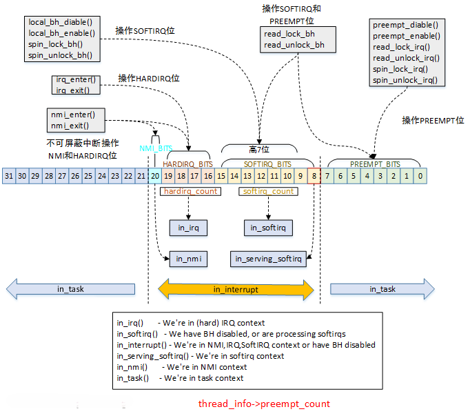

# 中断处理程序

中断，主要指的是外部硬件中断，它由外设产生，可以打断当前正在执行的程序，转而执行新的代码。中断的到来是随时随地、不可预测的，因此必须快进快出，以免影响正常的代码逻辑。

在响应一个特定的中断时，内核会执行一个函数，该函数叫中断处理程序（interrupt handler）或中断服务例程（interrupt service routine, ISR）。产生中断的每个设备都有一个响应的中断处理程序，一个设备的中断处理程序是它驱动程序的一部分。

中断处理程序处于特殊的{==中断上下文==}中。在解释中断上下文之前，我们先回忆一下进程上下文。在进程上下文中，可以使用`current`宏关联当前进程，可以睡眠，也可以调用调度程序。与之相反，中断上下文与进程没有什么关联。因为中断的触发是随时到来的，并不知道当前处于哪个进程。因为没有后备进程，所以中断上下文不可睡眠，也不能调用任何可以引起睡眠的函数。

中断处理程序必须快进快出，以免影响正常的代码逻辑。内核对于中断的处理分成了两个部分：上半部（Top Half）和下半部（Bottom Half）。通常所说的中断处理程序是指上半部——当接收到一个中断后，它立刻被执行，但只做有严格时限的工作。例如对接收到的中断进行应答等等。而下半部则执行延后的工作，由内核来选择合适的时机执行。

## 申请中断

在驱动程序中申请中断可以使用`request_irq()`函数：

```C
int request_irq(unsigned int irq, irq_handler_t handler, unsigned long flags,
                const char *name, void *dev)
{
	//实际就是调用中断线程化函数，但是将处理的线程置为NULL
    return request_threaded_irq(irq, handler, NULL, flags, name, dev);
}
```

`request_threaded_irq()`函数主要完成以下工作：

1. 根据`request_irq()`函数传递的参数，对`struct irqaction`中的字段赋值
2. 将新的`struct irqaction`链接到irq对应的`struct irq_desc`上。多个共享中断的设备必须设置IRQF_SHARED标志。
3. 如果`thread_fn != NULL`，调用`setup_irq_thread()`来新建一个独立线程处理中断。
4. 如果中断之前没有被激活，则激活中断。

中断处理程序涉及到两个关键的结构体：`struct irq_desc`和`struct irqaction`，二者是一对多的关系。`struct irq_desc`与irq号一一对应，而`struct irqaction`与设备对应，多个共享irq号的设备会挂在`struct irq_desc`的action链表上。

那么内核是如何管理这些外部中断的呢？

很容易想到，我们可以用一个静态数组来管理，数组中每个元素都是`struct irq_desc`结构体：`struct irq_desc irq_desc[NR_IRQS]`。

这个数组的关键就在于NR_IRQS的值，如果取一个很大的值，而外设对应的中断又不多的情况下就会很浪费内存。

还有一种方法是动态方法，用到了radix tree，在内核中由宏CONFIG_SPARSE_IRQ来控制。在ARM64中，这个宏是默认打开的。

执行完中断服务器程序后，会检查是否需要重新调度（need_resched标志位），然后判断返回哪个空间：

- 返回用户空间：调用`schedule()`函数。

- 返回内核空间：如果preempt_count标志为0，调用`schedule()`函数，否则不会触发调度。

## 中断控制

Linux内核提供了一组接口用于操作机器上的中断状态。这些接口为我们提供了能够禁止当前处理器的中断系统，或屏蔽掉整个机器的一条中断线的能力。这些操作都是与体系结构相关的。一般来说，控制中断系统的原因归根到底是需要同步。通过禁止中断，可以确保当前执行路径不会被中断打断。

下面这两个函数可以禁止/使能本地CPU中断：

```C
local_irq_disable();

local_irq_enable();
```

!!! warning

    中断对于内核的运行至关重要，在屏蔽中断期间所有中断都无法处理。所以在驱动程序中，不要使用这两个函数。

    如果只是想中断下半部，可以使用`local_bh_disable()`和`local_bh_enable()`。

如果在调用`local_irq_disable()`函数前已经禁止了中断，那么该操作会带来潜在的危险。同样，`local_irq_enable()`函数也存在危险，因为它会无条件激活中断。当内核代码变得复杂时，我们并不知道当前处理器中断状态，所以我们需要一种机制，仅仅时把中断恢复到以前的状态而不是简单地禁止或者是激活。

```C
unsigned long flags;
local_irq_save(flags);
local_irq_restore(flags);
```

在前面的内容中，我们知道了禁止整个处理器上所有中断的函数。如果只是禁止特定的中断线，相关函数如下：

```C
void disable_irq(unsigned int irq);
void disable_irq_nosync(unsigned int irq);
void enable_irq(unsigned int irq);
void synchronize_irq(unsigned int irq);
```

由于现代设备驱动程序的中断处理程序往往共享某个中断线，禁止了某条中断线也就禁止了这条线上所有设备的中断传递。因此这些接口函数不应该被使用。

## 下半部机制

操作系统需要有一个快速、异步且简单的机制负责对硬件迅速做出相应并完成那些时间要求很严格的操作。中断处理程序很适合于实现这些功能。而对于那些时间要求相对宽松的任务，应当放到下半部去处理。

理想情况下，最好让所有的工作都交给下半部去处理。但是，总有一些工作需要中断处理程序来完成，比如对中断的到达进行确认，从硬件拷贝数据等。如何区分上半部和下半部，完全由驱动程序开发者自行判断。如果任务满足以下要求，则适合放到中断处理程序执行。

- 如果这个任务对时间非常敏感。
- 如果这个任务和硬件相关。
- 如果这个任务不能被其他中断打断。

其他所有任务，考虑放在下半部执行。在编写程序时，中断处理程序仅执行最关键的紧急任务，将后续的非紧急任务放在下半部中处理。

`task_struct`中的`preempt_count`字段用于记录当前任务的上下文状态。



- PREEMPT_BITS：记录禁止抢占的次数
- SOFTIRQ_BITS：记录是否使能下半部
- HARDIRQ_BITS：记录是否处于硬件中断上下文中

其余内容，见[中断下半部](./bottom_half.md)。
