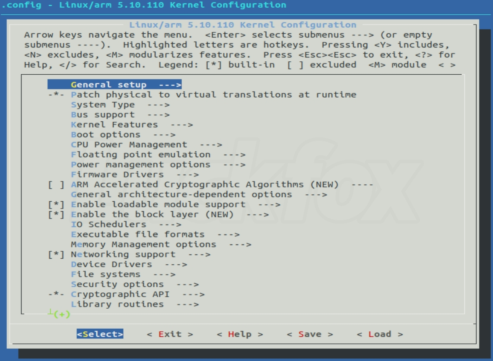

# 内核编程


内核开发的特点如下：

- 不能使用标准C库头文件，只能使用内核提供的头文件。与体系结构无关的头文件位于内核源码根目录下的include目录。与体系结构相关的头文件位于<arch/[architecture]/include/asm\>目录，内核代码以asm前缀的形式包含这些头文件。

- 必须使用GNU C。gcc编译器支持以asm()指令开头嵌入汇编代码。

- 没有内存保护机制。如果是内核访问了非法内存，后果不堪设想。

- 无法执行浮点运算。内核对于浮点运算的支持度不够。

- 必须考虑同步与并发。Linux内核是抢占式多任务处理系统，当前任务随时有可能被另一个任务抢占。

- 必须考虑可移植性。比如保持字节序、64 位对齐、不假定字长和页面长度等一系列准则。

!!! tip

    <Documentation/CodingStyle\>描述了Linux内核对编码风格的要求，<scripts/checkpatch.pl\>提供了检查代码风格的脚本。

## 源码结构

要获取内核源码，请使用`git`。

```
git clone git://git.ernel.org/pub/scm/linux/kernel/git/torvalds/[linux版本号].git
```

内核源码树由许多目录组成，一些比较重要的目录的描述如下：

| 目录名 | 描述 |
| --- | --- |
| arch | 体系结构相关的代码 |
| block | 块设备I/O层 |
| drivers | 设备驱动程序 |
| fs | 文件系统 |
| include | 内核头文件 |
| init | 初始化代码 |
| ipc | 进程间通信代码 |
| kernel | 内核核心代码 |
| lib | 内核库函数 |
| mm | 内存管理 |
| net | 网络系统 |

Linux内核可大致分为五个子系统——进程管理、内存管理、文件系统、网络系统和进程间通信。其中进程管理在系统中处于核心位置，内存管理主要用于控制进程安全的访问内存区域，虚拟文件系统则隐藏了各种文件系统的差异，为用户提供统一的接口；网络系统则提供了对各种网络设备、网络协议的支持；进程间通信协助进程之间的通信与同步。


## 编译内核

Linux驱动开发者需要牢固掌握Linux内核的编译方法，以及为嵌入式系统构建可运行的Linux系统操作镜像。要编译内核，可以使用以下指令：

```C
make config(基于文本)
make menuconfig(基于文本菜单)
make xconfig(要求安装QT)
make gconfig(要求安装GTK+)
```

其中最推荐的是`make menuconfig`，它不依赖于QT或者GTK+，且非常直观。运行`make menuconfig`后的界面（ARM）如下图所示：



运行`make menuconfig`后，配置工具首先查找<arch/[architecture]/Kconfig\>文件，该文件除了定义一系列CONFIG配置项，还通过关键字`source`语句引入了一系列Kconfig文件，这些文件定义了要用到的其他配置项，最终形成一个分层的树形结构。

在内核中添加程序需要完成以下三个步骤：

1. 将编写的源代码复制到对应的目录中。
2. 在目录的Kconfig文件中添加对于新代码的编译配置选项。
3. 在目录的Makefile文件中添加对于新代码的编译条目。

内核的各种配置，以CONFIG_FEATURE的形式写入主目录的.config文件。配置选项有三种：yes、no或module。分别对应编译、不编译、以模块形式编译。

假如MMU的源代码文件为：mmu.c，在该目录的Kconfig文件中有个条目config MMU，则在Makefile文件中关于此目录的编译条目为：obj-$(CONFIG_MMU) += mmu.o。如果关于MMU的配置选项选择为"Y"或者"M"，则编译mmu.o；如果选择为"N"，则不编译mmu.o。

!!! note

    - obj-y：编译进内核
    - obj-m：编译成模块
    - obj-n：不编译进内核

自己编写时可以仿照内核的写法。


!!! info "内核镜像"

    vmlinux: 原始的未经任何处理的Linux ELF镜像，无法烧写到开发板，需要通过`objcopy`命令生成二进制文件

    Image: 对vmlinux使用`objcopy`处理的可烧写到开发板的镜像，但是比较大

    zImage: 压缩Image后的镜像

    uImage: 由uboot的`mkimage`工具加工zImage得到64字节头的Image，供uboot启动


### Kconfig语法(待完成)


## 启动内核(待完成)

引导Linux系统有多种方式，这里只以Uboot启动ARM Linux为例来讲解。

SoC一般都内嵌了由厂家编写的bootrom，作为上电后运行的第一段代码，可以从SD、eMMC、NAND、USB等介质启动。对于多核CPU，bootrom首先去引导CPU0，其他CPU则睡眠。


### uboot命令


## 内核数据类型

