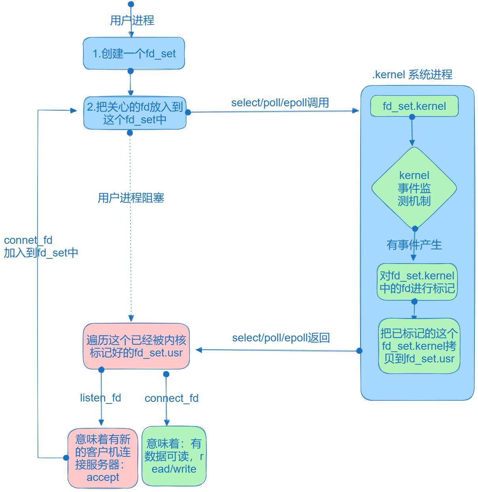

# I/O多路复用

用一个进程来维护多个socket，这就是 I/O 多路复用技术，类似于一个 CPU 并发多个进程。

select/poll/epoll 是 Linux 提供给用户的 I/O 多路复用的函数接口。

## select/poll

```C
int select(int numfds, fd_set *readfds, fd_set *writefds, fd_set *exceptfds, struct timeval *timeout);
```

其中 readfds、writefds、exceptfds 分别是被`select()`监视时，读、写、异常的文件描述符集合。

```C
int poll(struct pollfd *fds, nfds_t nfds, int timeout);
```

select 实现多路复用的方式是，将已连接的 socket 都放到一个文件描述符的集合，然后调用`select()`函数，将该集合拷贝到内核里，内核会遍历这个集合，检查是否有事件产生，然后标记产生事件的 socket。接着将整个集合拷贝回用户态，用户态继续遍历该集合找到可读写的 socket 然后再处理。



select 的缺点是：

1. 每次调用 select，都需要把 fd 集合从用户态拷贝到内核态，再从内核态拷贝至用户态，这个开销在 fd 很多时会很大
2. 同时每次调用 select 都需要在内核遍历传递进来的所有的 fd 集合
3. select 支持的文件描述符数量太小了，默认是 1024

poll 用链表的方式来组织 fd 集合，突破了文件描述符的限制，但是本质和 select 一样，都通过线性表的方式存储描述符，都需要遍历来找到可读写的 socket，时间复杂度为O(n)。

## epoll

```C title="epoll的函数接口"
/**
 * @param size 最大监听的描述符数量
 * @return 返回一个epool句柄
*/
int epoll_create(int size);


/**
 * @param epfd 用epoll_create创建的epoll句柄
 * @param op 事件操作类型
            EPOLL_CTL_ADD 注册新的描述符到epoll句柄中
            EPOLL_CTL_MOD 修改已经注册的描述符
            EPOLL_CTL_DEL 注销一个描述符
 * @param fd 要监听的描述符
 * @param event 告诉内核需要监听的事件，比如可读、可写等等
 * @return 成功返回0，失败返回-1并设置errno
 */
int epoll_ctl(int epfd, int op, int fd, struct epoll_event *event);

/**
 * @param epfd 用epoll_create创建的epoll句柄
 * @param events 用来存放触发的事件
 * @param maxevents 告诉内核最多可以获取多少事件
 * @param timeout 超时时间，-1表示阻塞，0表示不阻塞，大于0表示等待超时时间
 * @return 返回触发的事件数目，如果超时返回0，出错返回-1并设置errno
 */
int epoll_wait(int epfd, struct epoll_event *events, int maxevents, int timeout);
```

```C title="epoll的用法"
int epfd = epoll_create(1000);
epoll_ctl(epfd, EPOLL_CTL_ADD, listen_fd, &listen_event);

while(1) {
    //阻塞等待epoll中的fd触发
    int active_cnt = epoll_wait(epfd, events, MAX_EVENTS, -1);
    for(int i = 0; i < active_cnt; i++){
        if(events[i].data.fd == listen_fd){
            //处理新连接
        }else if(events[i].events & EPOLLIN){
            //处理读事件
        }else if(events[i].events & EPOLLOUT){
            //处理写事件
        }
    })
}
```

在上述代码中，先调用`epoll_create()`创建一个epoll对象，然后调用`epoll_ctl()`将需要监听的 socket 添加到对象中，最后调用`epoll_wait()`等待socket可读写。

epoll 通过两种方式，解决了 select 和 poll 的缺点：

1. 使用红黑树来跟踪待检测的文件描述符，将需要监控的 socket 通过`epoll_ctl()`函数加入到红黑树中。
2. 使用事件驱动机制，当 socket 可读写时，内核会发送一个事件给进程，进程只需要在事件到达时处理即可，无需遍历整个红黑树。


epoll 支持两种触发方式，分别是水平触发(ET)和边缘触发(LT)。

- 水平触发：只要有事件就绪，就会一直通知，直到事件处理完毕。
- 边缘触发：事件发生时，只会通知一次。

如果使用边缘触发模式，进程在收到通知后，要尽可能地读写数据，以免数据丢失。

在使用 I/O 多路复用时，最好搭配非阻塞 I/O 一起使用。

