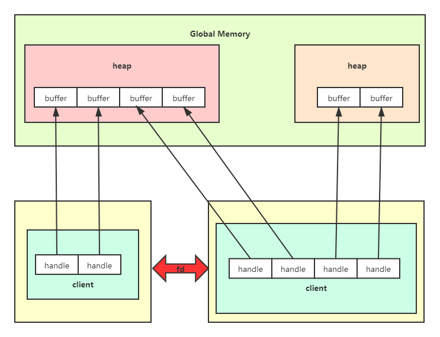
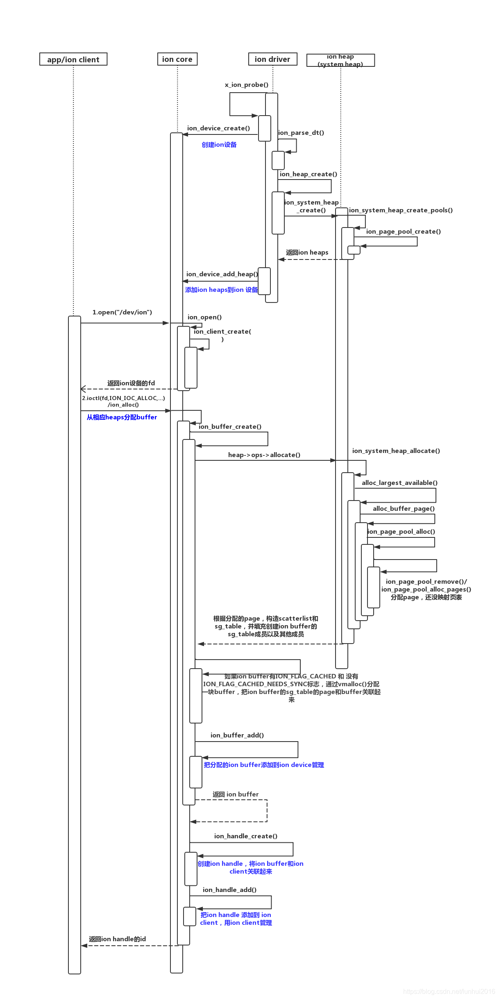

# ION内存管理器

- kernel版本：4.14
- 源码位置：<include/linux/ion.h\>，<drivers/staging/android/ion\>

!!! warning "ION内存分配器已经由DMA heap取代"

	
	
相关资料：

- [将 ION 堆转换为 DMA-BUF 堆](https://source.android.com/docs/core/architecture/kernel/dma-buf-heaps?hl=zh-cn)
- [Destaging ION](https://lwn.net/Articles/792733/)
- [DMA BUF Heap Transition in AOSP](https://www.linaro.org/blog/dma-buf-heap-transition-in-aosp/)
	
ION通用内存管理器是由谷歌开发的一个用于管理内存的子系统，通过在硬件设备和用户空间之间分配和共享内存，实现设备之间内存的零拷贝。它可以提供驱动之间、用户进程之间、内核空间和用户空间之间的共享内存。

在SoC中，许多设备都具有访问DMA的能力，但是其访问机制却各不相同，这就造成了管理上的混乱。ION提供了一种通用的内存分配方法，解决了不同设备之间内存管理碎片化的问题。

ION整体架构图如下图所示：



在用户层面，每个进程对应一个client，一个client下有多个handle，与内核层面的buffer一一对应。内核根据heap type管理不同的heap。不同的用户进程通过shared fd实现共享内存。

`struct ion_heap`结构体就表示一个heap，其中支持的heap type有：

- ION_HEAP_TYPE_SYSTEM：通过`vmalloc()`分配的内存
- ION_HEAP_TYPE_SYSTEM_CONTIG：通过`kmalloc()`分配的内存
- ION_HEAP_TYPE_CARVEOUT：启动时预留的内存
- ION_HEAP_TYPE_DMA：给DMA使用的内存

每种heap都必须要实现`struct ion_heap_ops`中的回调函数：

```C
struct ion_heap_ops {
	int (*allocate)(struct ion_heap *heap,
			struct ion_buffer *buffer, unsigned long len,
			unsigned long align, unsigned long flags);
	void (*free)(struct ion_buffer *buffer);
	int (*phys)(struct ion_heap *heap, struct ion_buffer *buffer,
		    phys_addr_t *addr, size_t *len);
	struct sg_table * (*map_dma)(struct ion_heap *heap,
				     struct ion_buffer *buffer);
	void (*unmap_dma)(struct ion_heap *heap, struct ion_buffer *buffer);
	void * (*map_kernel)(struct ion_heap *heap, struct ion_buffer *buffer);
	void (*unmap_kernel)(struct ion_heap *heap, struct ion_buffer *buffer);
	int (*map_user)(struct ion_heap *mapper, struct ion_buffer *buffer,
			struct vm_area_struct *vma);
	int (*shrink)(struct ion_heap *heap, gfp_t gfp_mask, int nr_to_scan);
};
```

> allocate：从buffer中分配内存

> phys：从物理地址连续的buffer中获取其物理地址

> map_dma：将buffer映射到DMA地址空间

> map_kernel：将buffer映射到内核地址空间

> map_user：将buffer映射到用户空间

> shrink：当内存紧张时，从heap中拆分buffer

## 关键数据结构

`struct ion_device`为内核管理ion的顶层数据结构，一个系统只能有一个`struct ion_device`对象：

```C
struct ion_device {
	struct miscdevice dev;
	struct rb_root buffers;
	struct mutex buffer_lock;
	struct rw_semaphore lock;
	struct plist_head heaps;
	long (*custom_ioctl)(struct ion_client *client, unsigned int cmd,
			     unsigned long arg);
	struct rb_root clients;
	struct dentry *debug_root;
	struct dentry *heaps_debug_root;
	struct dentry *clients_debug_root;
	struct rb_root share_buffers;
	struct mutex share_lock;
	struct idr idr;
	struct rb_root share_pool_buffers;
	struct dentry *ion_buf_debug_file;
};
```

`struct ion_client`表示用户空间创建的实例：

```C
struct ion_client {
	struct rb_node node;
	struct ion_device *dev;
	struct rb_root handles;
	struct idr idr;
	struct mutex lock;
	const char *name;
	char *display_name;
	int display_serial;
	struct task_struct *task;
	pid_t pid;
	struct dentry *debug_root;
	wait_queue_head_t wq;
	int wq_cnt;
	struct kfifo fifo;
	spinlock_t fifo_lock;
};
```

`struct ion_handle`表示用户空间申请的内存块，与内核的buffer对应：
```C
struct ion_handle {
	struct kref ref;
	struct ion_client *client;
	struct ion_buffer *buffer;
	struct rb_node node;
	unsigned int kmap_cnt;
	int id;
	int share_id;
	int import_cnt;
	struct ion_share_handle * sh_hd;
	int32_t import_consume_cnt;
};
```

`struct ion_heap`表示ION管理的内存池：

```C
struct ion_heap {
	struct plist_node node;
	struct ion_device *dev;
	enum ion_heap_type type;
	struct ion_heap_ops *ops;
	unsigned long flags;
	unsigned int id;
	const char *name;
	struct shrinker shrinker;
	struct list_head free_list;
	size_t free_list_size;
	spinlock_t free_lock;
	wait_queue_head_t waitqueue;
	struct task_struct *task;

	int (*debug_show)(struct ion_heap *heap, struct seq_file *, void *);
};
```

`struct ion_buffer`表示heap中真正的缓冲区内存：


```C
struct ion_buffer {
	struct kref ref;
	union {
		struct rb_node node;
		struct list_head list;
	};
	struct ion_device *dev;
	struct ion_heap *heap;
	unsigned long flags;
	unsigned long private_flags;
	size_t size;
	union {
		void *priv_virt;
		phys_addr_t priv_phys;
	};
	struct mutex lock;
	int kmap_cnt;
	void *vaddr;
	int dmap_cnt;
	struct sg_table *sg_table;
	struct page **pages;
	struct list_head vmas;
	/* used to track orphaned buffers */
	int handle_count;
	char task_comm[TASK_COMM_LEN];
	pid_t pid;
};
```


## 使用libion

> libion库是对底层ion_ioctl()的封装，谷歌推荐使用libion库而不是操作ion_ioctl()函数。

### 数据结构

```C
struct ion_allocation_data {
    uint64_t len;
    uint64_t align;
    unsigned int heap_mask;
    unsigned int flags;
    ion_user_handle_t handle;
    ion_share_handle_t sh_handle;
};
struct ion_fd_data {
    ion_user_handle_t handle;
    int fd;
};
struct ion_handle_data {
    ion_user_handle_t handle;
};
struct ion_share_handle_data {
    ion_user_handle_t handle;
    int64_t flags;
    ion_share_handle_t sh_handle;
};

/**
 * struct ion_share_info_data - a handle passed to/from the kernel
 * @handle: a handle
 */
struct ion_share_info_data {
    ion_user_handle_t handle;
    int64_t timeout;
    int32_t target_client_cnt;
    int32_t cur_client_cnt;
};
```

API接口

```C
int32_t ion_open(void);
int32_t ion_close(int32_t fd);
int32_t ion_alloc(int32_t fd, size_t len, size_t align, uint32_t heap_mask,
            uint32_t flags, ion_user_handle_t *handle);
int32_t ion_alloc_fd(int32_t fd, size_t len, size_t align, uint32_t heap_mask,
            uint32_t flags, int32_t *handle_fd);
int32_t ion_sync_fd(int32_t fd, int32_t handle_fd);
int32_t ion_free(int32_t fd, ion_user_handle_t handle);
int32_t ion_map(int32_t fd, ion_user_handle_t handle, size_t length, int32_t prot,
            int32_t flags, off_t offset, unsigned char **ptr, int32_t *map_fd);
int32_t ion_share(int32_t fd, ion_user_handle_t handle, int32_t *share_fd);
int32_t ion_import(int32_t fd, int32_t share_fd, ion_user_handle_t *handle);
int32_t ion_phys(int32_t fd, ion_user_handle_t handle, void **paddr, size_t *len);
int32_t ion_cache_invalid(int32_t fd, ion_user_handle_t handle, void *paddr, void *vaddr, size_t len);
int32_t ion_cache_flush(int32_t fd, ion_user_handle_t handle, void *paddr, void *vaddr, size_t len);
int32_t ion_memcpy(int32_t fd, ion_user_handle_t handle, void *dst_paddr, void *src_paddr, size_t len);
```

对于使用者来说，主要关心以下几个方面：

- 打开与关闭
- 分配与释放内存
- 映射与共享

### 打开与关闭

与ION交互需要打开/关闭ion_device，返回的形式为文件描述符fd，往后的操作都需要用到这个fd。

```C
int32_t ion_open(void)
{
    int32_t fd = open("/dev/ion", O_RDWR);
    if (fd < 0) {
        (void)printf("%s open /dev/ion failed!\n", LOG_TAG);
    }

    return fd;
}

int32_t ion_close(int32_t fd)
{
    return close(fd);
}
```

### 分配与释放

该函数根据传入的heap_mask去寻找合适的heap，然后分配buffer内存块，其中参数handle必须要设置，这是由内核空间返回给用户的操作ION内存的句柄。

```C
int32_t ion_alloc(int32_t fd, size_t len, size_t align, uint32_t heap_mask,
          uint32_t flags, ion_user_handle_t *handle)
{
    int32_t ret;
    if (handle == NULL) {
        (void)printf("%s Invalid handle!\n", LOG_TAG);
        return -EINVAL;
    }

    struct ion_allocation_data data = {
        .len = len,
        .align = align,
        .heap_mask = heap_mask,
        .flags = flags,
    };

    ret = ion_ioctl(fd, ION_IOC_ALLOC, (void *)&data);
    if (ret < 0) {
        (void)printf("%s Failed to do ION_IOC_ALLOC(ret=%d)!\n", LOG_TAG, ret);
        return ret;
    }

    *handle = data.handle;
    return ret;
}
```

该函数根据传入的handle，释放对应的buffer。

```C
int32_t ion_free(int32_t fd, ion_user_handle_t handle)
{
    struct ion_handle_data data = {
        .handle = handle,
    };
    return ion_ioctl(fd, ION_IOC_FREE, (void *)&data);
}
```

### 映射

该函数通过传入的handle找到对应的buffer，并将其映射到用户空间，ptr指向映射区域的地址。

```C
int32_t ion_map(int32_t fd, ion_user_handle_t handle, size_t length, int32_t prot,
            int32_t flags, off_t offset, unsigned char **ptr, int32_t *map_fd)
{
    int32_t ret;
    struct ion_fd_data data = {
        .handle = handle,
    };

    if (map_fd == NULL) {
        (void)printf("%s Invalid map_fd!\n", LOG_TAG);
        return -EINVAL;
    }
    if (ptr == NULL) {
        (void)printf("%s Invalid ptr!\n", LOG_TAG);
        return -EINVAL;
    }

    ret = ion_ioctl(fd, ION_IOC_MAP, (void *)&data);
    if (ret < 0) {
        (void)printf("%s map ioctl returned failed,handle[%ld](ret=%d)\n",
            LOG_TAG, handle, ret);
        return ret;
    }
    *map_fd = data.fd;
    if (*map_fd < 0) {
        (void)printf("%s map ioctl returned negative fd\n", LOG_TAG);
        return -EINVAL;
    }
    *ptr = mmap(NULL, length, prot, flags, *map_fd, offset);
    if (*ptr == MAP_FAILED) {
        (void)printf("%s ion mmap failed(ret=%d)\n", LOG_TAG, -errno);
        return -errno;
    }
    return ret;
}
```

### 共享

该函数通过创建一个share_fd，实现对同一个buffer的共享。

```C
int32_t ion_share(int32_t fd, ion_user_handle_t handle, int32_t *share_fd)
{
    int32_t ret;
    struct ion_fd_data data = {
        .handle = handle,
    };
    if (share_fd == NULL) {
        (void)printf("%s Invalid share_fd!\n", LOG_TAG);
        return -EINVAL;
    }

    ret = ion_ioctl(fd, ION_IOC_SHARE, (void *)&data);
    if (ret < 0) {
        (void)printf("%s Failed to do ION_IOC_SHARE(ret=%d)!\n", LOG_TAG, ret);
        return ret;
    }
    *share_fd = data.fd;
    if (*share_fd < 0) {
        (void)printf("%s share ioctl returned negative fd\n", LOG_TAG);
        return -EINVAL;
    }
    return ret;
}
```

## scatterlist

在继续深入之前，我们有必要了解下scatterlist——散列表，它用于组织分散的内存。

我们知道，CPU、DMA都有自己的访问内存的方式：

- CPU以MMU虚拟地址的方式
- DMA以直接物理地址的方式

于是，当内存要在这二者之间共享时，存在一个根本矛盾：在CPU的视角，由于有MMU机制，它根本不关心物理地址是否连续，只要虚拟地址连续即可。但是DMA没有MMU机制，其申请的内存必须是连续的，尤其是在传输图像、视频时，更是需要一大块连续的内存地址。

为了解决这个根本矛盾，scatterlist诞生了，它用来描述这一个个不连续的物理内存块：

```C 
struct scatterlist {
	unsigned long	page_link;
	unsigned int	offset;
	unsigned int	length;
	dma_addr_t	dma_address;
#ifdef CONFIG_NEED_SG_DMA_LENGTH
	unsigned int	dma_length;
#endif
};
```

> page_link：指示该内存块所在的页面

> offset：该内存块在页面中的偏移

> length：该内存块的长度

> dma_address：该内存块的起始地址

> dma_length：相应的长度信息

### struct sg_table

在实际场景中，单个scatterlist是无法使用的，我们需要多个scatterlist组成一个数组，以表示在物理上不连续的虚拟地址空间：

```C
struct sg_table {
	struct scatterlist *sgl;	/* the list */
	unsigned int nents;		/* number of mapped entries */
	unsigned int orig_nents;	/* original size of list */
};
```

> sgl：内存块数组的首地址

> nents：有效的内存块个数

> orig_nents：内存块数组的size

sg_table中到底有多少个有效内存块？其实是由`struct scatterlist`中的page_link字段决定的。如果它的 bit0 为1，表示它不是一个有效的内存块，而是指向另一个scatterlist数组。如果 bit1 为1，表示它是scatterlist数组中最后一个有效的内存块。

## 分配与释放内存

前面提到，ION对于管理的内存主要分成了四个区：

- 不连续内存
- 连续内存
- 保留区内存
- CMA内存

驱动层分配内存的函数是`ion_alloc()`函数，它主要做了以下事情：

1. 根据优先级，从某个heap开始，根据用户传入的heap_mask，查看是否有匹配的内存可以分配，遍历系统中所有的堆，直到找到可以分配的内存为止。
2. 真正的分配函数是`ion_buffer_create()`。
3. 核心语句`heap->ops->allocate(heap, buffer, len, align, flags)`，即根据不同的heap调用对应的分配函数。

这里重点讲一下system_heap的分配与释放，其他类型的heap留给读者自己去研究。

### 不连续内存

> 源码位于<drivers/staging/android/ion/ion_system_heap.c\>

system_heap管理着三种类型的内存块：`static const unsigned int orders[] = {8, 4, 0};`

这里的8、4、0代表的是页的数量，一页为4KB：

```SHELL
$ cat /sys/kernel/debug/ion/heaps/system

          client              pid             size
----------------------------------------------------
----------------------------------------------------
allocations (info is from last known client):
----------------------------------------------------
  total orphaned                0
          total                 0
   deferred free                0
----------------------------------------------------
0 order 8 highmem pages in pool = 0 total
0 order 8 lowmem pages in pool = 0 total
0 order 4 highmem pages in pool = 0 total
0 order 4 lowmem pages in pool = 0 total
0 order 0 highmem pages in pool = 0 total
0 order 0 lowmem pages in pool = 0 total

```

1. 分配：

	```C
	static int ion_system_heap_allocate(struct ion_heap *heap,
						struct ion_buffer *buffer,
						unsigned long size,
						unsigned long flags)
	{
		struct ion_system_heap *sys_heap = container_of(heap,
								struct ion_system_heap,
								heap);
		struct sg_table *table;
		struct scatterlist *sg;
		struct list_head pages;
		struct page *page, *tmp_page;
		int i = 0;
		unsigned long size_remaining = PAGE_ALIGN(size);
		unsigned int max_order = orders[0];

		if (size / PAGE_SIZE > totalram_pages() / 2)
			return -ENOMEM;

		INIT_LIST_HEAD(&pages);
		while (size_remaining > 0) {

			//核心分配函数
			page = alloc_largest_available(sys_heap, buffer, size_remaining,
							max_order);
			if (!page)
				goto free_pages;
			list_add_tail(&page->lru, &pages);
			size_remaining -= page_size(page);
			max_order = compound_order(page);
			i++;
		}

		//使用sg_table来管理分散的内存块
		table = kmalloc(sizeof(*table), GFP_KERNEL);
		if (!table)
			goto free_pages;

		if (sg_alloc_table(table, i, GFP_KERNEL))
			goto free_table;

		sg = table->sgl;

		//将内存块与scatterlist关联，并从buddy中删除
		list_for_each_entry_safe(page, tmp_page, &pages, lru) {
			sg_set_page(sg, page, page_size(page), 0);
			sg = sg_next(sg);
			list_del(&page->lru);
		}

		buffer->sg_table = table;
		return 0;

	free_table:
		kfree(table);
	free_pages:
		list_for_each_entry_safe(page, tmp_page, &pages, lru)
			free_buffer_page(sys_heap, buffer, page);
		return -ENOMEM;
	}
	```

`alloc_largest_available()`函数：

```C
static struct page *alloc_largest_available(struct ion_system_heap *heap,
					    struct ion_buffer *buffer,
					    unsigned long size,
					    unsigned int max_order)
{
	struct page *page;
	int i;

	//每次找到小于分配size的最大order
	for (i = 0; i < num_orders; i++) {
		if (size < order_to_size(orders[i]))
			continue;
		if (max_order < orders[i])
			continue;
		
		//先从pool中分配，如果没有就从buddy中分配
		page = alloc_buffer_page(heap, buffer, orders[i]);
		if (!page)
			continue;

		return page;
	}

	return NULL;
}
```

`alloc_buffer_page()`函数：

```C
static struct page *alloc_buffer_page(struct ion_system_heap *heap,
				      struct ion_buffer *buffer,
				      unsigned long order)
{
	bool cached = ion_buffer_cached(buffer);
	struct ion_page_pool *pool = heap->pools[order_to_index(order)];
	struct page *page;

	//system_heap有cached和uncached两种类型，对应不同的pool
	if (!cached) {
		page = ion_page_pool_alloc(pool);
	} else {
		gfp_t gfp_flags = low_order_gfp_flags;

		if (order > 4)
			gfp_flags = high_order_gfp_flags;
		page = alloc_pages(gfp_flags | __GFP_COMP, order);
		if (!page)
			return NULL;
		ion_pages_sync_for_device(NULL, page, PAGE_SIZE << order,
						DMA_BIDIRECTIONAL);
	}

	return page;
}
```

`ion_page_pool_alloc()`函数：

```C
struct page *ion_page_pool_alloc(struct ion_page_pool *pool)
{
	struct page *page = NULL;

	BUG_ON(!pool);

	mutex_lock(&pool->mutex);
	
	//先从high中分配，再从low中分配
	if (pool->high_count)
		page = ion_page_pool_remove(pool, true);
	else if (pool->low_count)
		page = ion_page_pool_remove(pool, false);
	mutex_unlock(&pool->mutex);

	//如果分配失败，则从buddy中分配
	if (!page)
		page = ion_page_pool_alloc_pages(pool);

	return page;
}
```

`ion_page_pool_alloc_pages()`函数：

```C
static void *ion_page_pool_alloc_pages(struct ion_page_pool *pool)
{
	struct page *page = alloc_pages(pool->gfp_mask, pool->order);

	if (!page)
		return NULL;
	return page;
}
```

至此，system_heap的分配流程结束。

2. 释放：

	```C
	static void ion_system_heap_free(struct ion_buffer *buffer)
	{
		struct ion_system_heap *sys_heap = container_of(buffer->heap,
								struct ion_system_heap,
								heap);
		struct sg_table *table = buffer->sg_table;
		struct scatterlist *sg;
		int i;

		/* zero the buffer before goto page pool */
		if (!(buffer->private_flags & ION_PRIV_FLAG_SHRINKER_FREE))
			ion_heap_buffer_zero(buffer);

		for_each_sgtable_sg(table, sg, i)

			//核心释放内存的函数
			free_buffer_page(sys_heap, buffer, sg_page(sg));
		sg_free_table(table);
		kfree(table);
	}
	```

`free_buffer_page()`函数：

```C
static void free_buffer_page(struct ion_system_heap *heap,
			     struct ion_buffer *buffer, struct page *page)
{
	unsigned int order = compound_order(page);
	bool cached = ion_buffer_cached(buffer);

	if (!cached && !(buffer->private_flags & ION_PRIV_FLAG_SHRINKER_FREE)) {
		struct ion_page_pool *pool = heap->pools[order_to_index(order)];

		//返还给pool
		ion_page_pool_free(pool, page);
	} else {
		
		//返回给buddy
		__free_pages(page, order);
	}
}
```

### 连续内存

> 源码位于<drivers/staging/android/ion/ion_system_heap.c\>

1. 分配：

	```C
	static int ion_system_contig_heap_allocate(struct ion_heap *heap,
						struct ion_buffer *buffer,
						unsigned long len,
						unsigned long flags)
	{
		int order = get_order(len);
		struct page *page;
		struct sg_table *table;
		unsigned long i;
		int ret;

		//直接从buddy中分配内存页
		//分配的内存页是可能比实际请求的大的，比如申请len是3个page大小，那么order就为2，实际申请了4个page
		page = alloc_pages(low_order_gfp_flags, order);
		if (!page)
			return -ENOMEM;

		//将申请到的连续内存页分割成一页页
		split_page(page, order);

		//由于在分配时可能多分配，因此需要将多余的page释放回去。比如申请3个page，实际分配了4个
		len = PAGE_ALIGN(len);
		for (i = len >> PAGE_SHIFT; i < (1 << order); i++)
			__free_page(page + i);

		//接着申请sg_table
		table = kmalloc(sizeof(*table), GFP_KERNEL);
		if (!table) {
			ret = -ENOMEM;
			goto free_pages;
		}

		//由于是连续的内存，因此只需要申请一个scatterlist
		ret = sg_alloc_table(table, 1, GFP_KERNEL);
		if (ret)
			goto free_table;

		//将连续内存首页地址存到sg_table中
		sg_set_page(table->sgl, page, len, 0);

		buffer->sg_table = table;

		return 0;

	free_table:
		kfree(table);
	free_pages:
		for (i = 0; i < len >> PAGE_SHIFT; i++)
			__free_page(page + i);

		return ret;
	}
	```

2. 释放：

	```C
	static void ion_system_contig_heap_free(struct ion_buffer *buffer)
	{
		struct sg_table *table = buffer->sg_table;
		struct page *page = sg_page(table->sgl);
		unsigned long pages = PAGE_ALIGN(buffer->size) >> PAGE_SHIFT;
		unsigned long i;

		//释放时就直接将内存页归还给buddy，__free_page是buddy system的接口
		for (i = 0; i < pages; i++)
			__free_page(page + i);
		sg_free_table(table);
		kfree(table);
	}
	```

### 保留区内存

1. 分配：

	```C
	static int ion_carveout_heap_allocate(struct ion_heap *heap,
						struct ion_buffer *buffer,
						unsigned long size, unsigned long align,
						unsigned long flags)
	{
		struct sg_table *table;
		phys_addr_t paddr;
		int ret;

		if (align > PAGE_SIZE) {
			pr_err("%s: align should <= page size\n", __func__);
			return -EINVAL;
		}

		table = kmalloc(sizeof(struct sg_table), GFP_KERNEL);
		if (!table)
			return -ENOMEM;

		ret = sg_alloc_table(table, 1, GFP_KERNEL);
		if (ret) {
			pr_err("%s: sg alloc table failed\n", __func__);
			goto err_free;
		}

		paddr = ion_carveout_allocate(heap, size, align);
		if (paddr == ION_CARVEOUT_ALLOCATE_FAIL) {
			ret = -ENOMEM;
			goto err_free_table;
		}

		sg_set_page(table->sgl, pfn_to_page(PFN_DOWN(paddr)), size, 0);
		buffer->priv_virt = table;

		if (buffer->flags & ION_FLAG_INITIALIZED) {
			ion_heap_buffer_zero_ex(table, buffer->flags);
		}

		return 0;

	err_free_table:
		sg_free_table(table);
	err_free:
		kfree(table);
		return ret;
	}
	```

2. 释放：

	```C
	static void ion_carveout_heap_free(struct ion_buffer *buffer)
	{
		struct ion_heap *heap = buffer->heap;
		struct sg_table *table = buffer->priv_virt;
		struct page *page = sg_page(table->sgl);
		phys_addr_t paddr = PFN_PHYS(page_to_pfn(page));

		ion_heap_buffer_zero(buffer);

		if (ion_buffer_cached(buffer)) {
			dma_sync_sg_for_device(NULL, table->sgl, table->nents,
								DMA_BIDIRECTIONAL);
			__flush_dcache_area(phys_to_virt(paddr), buffer->size);
		}

		ion_carveout_free(heap, paddr, buffer->size);
		sg_free_table(table);
		kfree(table);
	}
	```


### CMA内存

> 源码位于<drivers/staging/android/ion/ion_cma_heap.c\>

1. 分配：

	```C
	static int ion_cma_allocate(struct ion_heap *heap, struct ion_buffer *buffer,
					unsigned long len,
					unsigned long flags)
	{
		struct ion_cma_heap *cma_heap = to_cma_heap(heap);
		struct sg_table *table;
		struct page *pages;
		unsigned long size = PAGE_ALIGN(len);
		unsigned long nr_pages = size >> PAGE_SHIFT;
		unsigned long align = get_order(size);
		int ret;

		if (align > CONFIG_CMA_ALIGNMENT)
			align = CONFIG_CMA_ALIGNMENT;

		pages = cma_alloc(cma_heap->cma, nr_pages, align, false);
		if (!pages)
			return -ENOMEM;

		if (PageHighMem(pages)) {
			unsigned long nr_clear_pages = nr_pages;
			struct page *page = pages;

			while (nr_clear_pages > 0) {
				void *vaddr = kmap_atomic(page);

				memset(vaddr, 0, PAGE_SIZE);
				kunmap_atomic(vaddr);
				page++;
				nr_clear_pages--;
			}
		} else {
			memset(page_address(pages), 0, size);
		}

		table = kmalloc(sizeof(*table), GFP_KERNEL);
		if (!table)
			goto err;

		ret = sg_alloc_table(table, 1, GFP_KERNEL);
		if (ret)
			goto free_mem;

		sg_set_page(table->sgl, pages, size, 0);

		buffer->priv_virt = pages;
		buffer->sg_table = table;
		return 0;

	free_mem:
		kfree(table);
	err:
		cma_release(cma_heap->cma, pages, nr_pages);
		return -ENOMEM;
	}
	```

2. 释放：

	```C
	static void ion_cma_free(struct ion_buffer *buffer)
	{
		struct ion_cma_heap *cma_heap = to_cma_heap(buffer->heap);
		struct page *pages = buffer->priv_virt;
		unsigned long nr_pages = PAGE_ALIGN(buffer->size) >> PAGE_SHIFT;

		/* release memory */
		cma_release(cma_heap->cma, pages, nr_pages);
		/* release sg table */
		sg_free_table(buffer->sg_table);
		kfree(buffer->sg_table);
	}
	```

ION内存分配的总流程如下：


