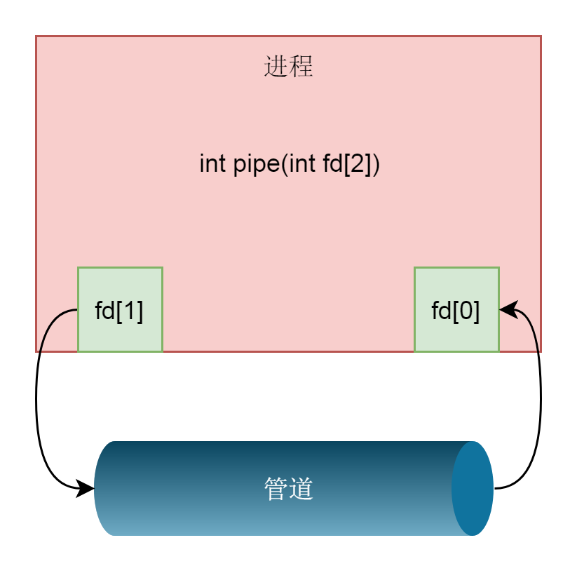
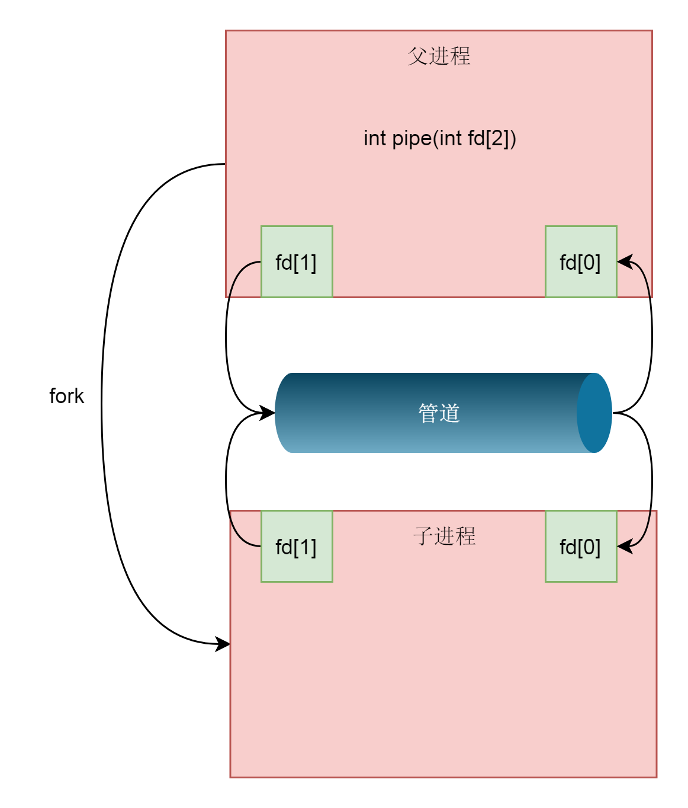
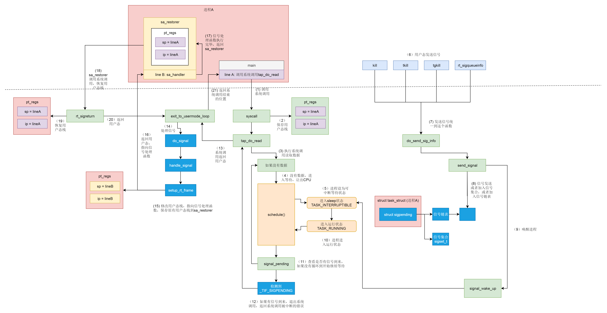

# 进程间通信

进程之间的地址空间相互独立，要实现进程间的通信，需要特殊的机制。

## 管道

下面的语句创建两个进程，并用管道把这两个进程连接在一起。

```SHELL
$ ps aux | grep kworker
```

第一个进程的标准输出被重定向到管道中，第二个进程从这个管道读取输入。

通过管道传递的数据是顺序的，也就是读和写的顺序一致。从管道中读取数据是一次性操作，读完了空间就被释放了。

上面这种管道由于没有名字，又叫做{==匿名管道==}。

匿名管道的创建需要经过以下这个函数：

```C
int pipe(int fd[2]);
```



fd[0]代表管道的读端，fd[1]代表管道的写端。

匿名管道可以用于父子进程之间的通信，`fork()`函数创建的子进程会复制父进程的文件描述符，这样每个进程就都有fd[0]和fd[1]两个文件描述符。由于管道只能一端读，一端写，所以我们可以：

- 父进程关闭fd[0]，只保留fd[1]
- 子进程关闭fd[1]，只保留fd[0]

这样父子进程就可以通过匿名管道通信了。



还有一种管道叫{==有名管道==}。它以一种特殊的文件形式存放在文件系统中，这样两个没有亲缘关系的进程都可以通过访问这个特殊文件的方式来进行通信。

创建有名管道需要用到这个函数：

```C
int mkfifo(const char *pathname, mode_t mode);
```

!!! note

    对于有名管道的读、写操作都会阻塞进程。

不论是匿名管道还是有名管道，其数据都存放在内存中，遵循先进先出的原则。

## 消息队列

消息队列的通讯方式就像邮件，发送数据时，会分成一个个独立的数据单元，也就是消息体，每个消息体都是固定大小的存储块，在字节流上不连续。消息体的定义如下：

```C
struct msg_buffer {
  long mtype;       
  char mtext[1024];   
};
```

使用消息队列前需要先调用`ftok()`函数，该函数会根据文件的`inode`生成一个唯一的key。只要在这个消息队列的生命周期内，这个文件不被删除，那么无论什么时刻，再调用`ftok`，也会得到同样的key。这种key的使用方式在其他System V IPC进程间通信机制体系中也适用。

常用函数：

| 函数名 | 说明 |
|------|------|
| msgget | 创建或访问一个消息队列 |
| msgsnd | 发送一个消息 |
| msgrcv | 接收一个消息 |
| msgctl | 控制消息队列 |

## 共享内存

共享内存是一种高效的通信方式，允许多个进程直接访问同一块内存空间。

常用函数：

| 函数名 | 说明 |
|------|------|
| shmget | 创建或访问一块共享内存 |
| shmat | 将共享内存连接到当前进程的地址空间 |
| shmdt | 将共享内存从当前进程的地址空间断开 |
| shmctl | 控制共享内存 |

## 信号

信号的机制与硬件中断非常相似，都是异步地发送一个请求，区别在于中断处理函数是在内核态，而信号处理函数是在用户态。信号可以在任何时刻发送给任何一个进程。

在Linux系统中，为了响应各种事件定义了非常多的信号。比如当我们发送`kill -9 ${pid}`时，其实就是发送SIGKILL信号给指定进程，将它杀死。我们可以通过`kill -l`命令查看所有的信号：

```SHELL
# kill -l
 1) SIGHUP       2) SIGINT       3) SIGQUIT      4) SIGILL       5) SIGTRAP
 6) SIGABRT      7) SIGBUS       8) SIGFPE       9) SIGKILL     10) SIGUSR1
11) SIGSEGV     12) SIGUSR2     13) SIGPIPE     14) SIGALRM     15) SIGTERM
16) SIGSTKFLT   17) SIGCHLD     18) SIGCONT     19) SIGSTOP     20) SIGTSTP
21) SIGTTIN     22) SIGTTOU     23) SIGURG      24) SIGXCPU     25) SIGXFSZ
26) SIGVTALRM   27) SIGPROF     28) SIGWINCH    29) SIGIO       30) SIGPWR
31) SIGSYS      34) SIGRTMIN    35) SIGRTMIN+1  36) SIGRTMIN+2  37) SIGRTMIN+3
38) SIGRTMIN+4  39) SIGRTMIN+5  40) SIGRTMIN+6  41) SIGRTMIN+7  42) SIGRTMIN+8
43) SIGRTMIN+9  44) SIGRTMIN+10 45) SIGRTMIN+11 46) SIGRTMIN+12 47) SIGRTMIN+13
48) SIGRTMIN+14 49) SIGRTMIN+15 50) SIGRTMAX-14 51) SIGRTMAX-13 52) SIGRTMAX-12
53) SIGRTMAX-11 54) SIGRTMAX-10 55) SIGRTMAX-9  56) SIGRTMAX-8  57) SIGRTMAX-7
58) SIGRTMAX-6  59) SIGRTMAX-5  60) SIGRTMAX-4  61) SIGRTMAX-3  62) SIGRTMAX-2
63) SIGRTMAX-1  64) SIGRTMAX
```

每个信号都有一个唯一的ID和其默认的操作：

```SHELL
Signal     Value     Action   Comment
──────────────────────────────────────────────────────────────────────
SIGHUP        1       Term    Hangup detected on controlling terminal
                              or death of controlling process
SIGINT        2       Term    Interrupt from keyboard
SIGQUIT       3       Core    Quit from keyboard
SIGILL        4       Core    Illegal Instruction


SIGABRT       6       Core    Abort signal from abort(3)
SIGFPE        8       Core    Floating point exception
SIGKILL       9       Term    Kill signal
SIGSEGV      11       Core    Invalid memory reference
SIGPIPE      13       Term    Broken pipe: write to pipe with no
                              readers
SIGALRM      14       Term    Timer signal from alarm(2)
SIGTERM      15       Term    Termination signal
SIGUSR1   30,10,16    Term    User-defined signal 1
SIGUSR2   31,12,17    Term    User-defined signal 2
...
```

进程对信号的处理方式有三种：

1. 执行默认操作。
2. 执行自定义信号处理函数。
3. 忽略信号。

!!! note

    注意，SIGKILL和SIGSTOP信号无法忽略。

Linux推荐使用`sigaction()`函数来自定义信号处理函数。它的定义如下：

```C
int sigaction(int signum, const struct sigaction *act, struct sigaction *oldact);
```

> signum：要处理的信号值

> act：指向sigaction结构体的指针，定义了信号处理函数和信号处理函数的附加信息，若为空则采用缺省方式

> oldact：指向sigaction结构体的指针，用于保存原来对信号的处理方式

而sigaction结构体的定义如下：

```C
struct sigaction {
  __sighandler_t sa_handler;
  unsigned long sa_flags;
  __sigrestore_t sa_restorer;
  sigset_t sa_mask;   
};
```

其中`sa_handler`就是你要定义的信号处理函数。

发送信号有两种方式，一种是发送给整个线程组的，还有一种是发送给某个单独线程的。信号分为不可靠信号和可靠信号。在`task_struct`中有一个结构体`sigpending`，它的定义如下：

```C
struct sigpending{
    struct list_head list;
    sigset_t signal;
};
```

对于不可靠信号，也就是编号小于32的信号，会放在`sigset_t signal`集合中，不论发送多少次，在被处理前都只会保留一份。所以不可靠信号会造成信号的丢失。对于可靠信号，则会挂在`struct sigpending`结构体中的链表里挨个处理。

一旦信号挂到了`task_struct`结构体中，就会设置一个TIF_SIGPENDING标志位，表示有信号等待处理。然后在系统调用结束，或者中断处理结束，都会检查这个标志位。如果设置了，就会调用`do_signal()`函数来处理信号。

```C
static void exit_to_usermode_loop(struct pt_regs *regs, u32 cached_flags)
{
  while (true) {
......
    if (cached_flags & _TIF_NEED_RESCHED)
      schedule();
......
    /* deal with pending signal delivery */
    if (cached_flags & _TIF_SIGPENDING)
      do_signal(regs);
......
    if (!(cached_flags & EXIT_TO_USERMODE_LOOP_FLAGS))
      break;
  }
}
```

信号处理流程如下图所示：



## netlink

netlink是一种用户态和内核态之间进行通信的机制，当然用户之间，甚至内核之间也是可以通信的，只不过这不是netlink的主要使用场景，因此不在此讨论。

netlink支持两种类型的通信方式：单播和多播。

- 单播：一个用户进程对应一个内核进程。
- 多播：多个用户进程对应一个内核进程。内核会创建一个多播组，然后将有需求的用户进程加入到该组中来接受内核消息。

如果只是单播，可以不用执行`bind()`函数，用`sendto()`和`recvfrom()`就可以完成数据的发送和接收。

如果涉及到多播，需要执行`bind()`函数将多个进程关联到某个多播组，用`sendmsg()`和`recvmsg()`来完成数据的发送和接收。

注意：从用户空间传递到内核的数据无需排队，但是反过来要。

### 地址结构体

在用户空间创建netlink套接字接口的方法与普通套接字一样：

```C
fd = socket(AF_NETLINK, SOCK_RAW, NETLINK_ATNLPROXY);
```

在套接字初始化后，必须使用netlink特有的地址结构体对当前进程进行标识。Netlink地址结构体如下所示:

```C
struct sockaddr_nl {
	__kernel_sa_family_t	nl_family;	/* AF_NETLINK	*/
	unsigned short	nl_pad;		/* zero		*/
	__u32		nl_pid;		/* port ID	*/
  __u32		nl_groups;	/* multicast groups mask */
};
```

> nl_family：协议族，必须为AF_NETLINK

> nl_pad：填充字段，必须为0

> nl_pid：在单播情况下，该字段为进程标识符PID，在多播情况下设置为0.

> nl_groups：多播组地址掩码。

```C
static u32 netlink_group_mask(u32 group)
{
  return group? 1 << (group - 1) : 0;
}
```

在用户空间的代码中，如果要加入到多播组1，就要设置nl_groups为1；多播组2的掩码为2，多播组3的掩码为4。如果设置为0，表示不希望加入任何多播组。

当程序执行时， `struct sockaddr_nl`结构体会被转化为标准的socket地址，通过`bind()`函数将其与netlink套接字进行绑定后，作为参数传递给用于发送和接受消息的接口`sendmsg()`和`recvmsg()`。

### 消息格式

消息由两部分组成：消息头和消息体。消息头为固定的16字节，定义如下：

```C
struct nlmsghdr {
  __u32 nlmsg_len;    /* Length of message including header */
  __u16 nlmsg_type;   /* Message content */
  __u16 nlmsg_flags;  /* Additional flags */
  __u32 nlmsg_seq;    /* Sequence number */
  __u32 nlmsg_pid;    /* Sending process port ID */
};
```

> nlmsg_len：整个消息的长度，包括消息头

> nlmsg_type：消息的类型，是数据还是控制。

> nlmsg_flags：附加在消息上的额外信息。

> nlmsg_seq：消息的序列号，确保数据不被丢失。当内核向用户空间发送广播消息时，该字段为0。

> nlmsg_pid：为数据交换的通道分配的数字标识，用于确保数据交互的正确性。

!!! example "填充消息头"

  ```C
  (void)osa_memset_s((char*)nlmsg, size, 0, size);
  nlmsg->nlmsg_len  = NLMSG_LENGTH(final_len + sizeof(*device_event));
  nlmsg->nlmsg_type = NLMSG_DONE;
  nlmsg->nlmsg_pid = getpid();
  nlmsg->nlmsg_seq = seq++;      /* seq暂时没有用到，后期可能会进行扩展使用 */
  ```

## zeromq

github地址：https://github.com/zeromq/libzmq。

zeromq是一个基于socket、开源的轻量级通信库。