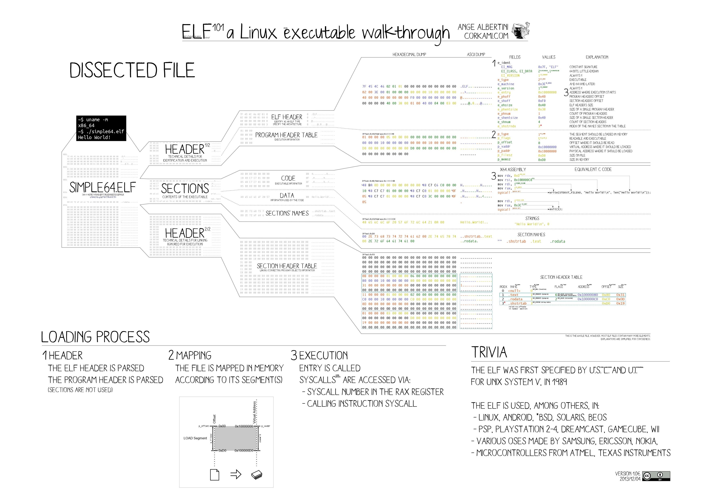

# 进程加载与启动

## 可执行文件格式

## shell启动进程

## execve系统调用

## 加载ELF文件

### ELF解析



ELF 文件是 Linux 系统上通用的可执行文件、共享库、核心转储文件格式。可以通过`file`命令查看 ELF 文件的信息：

```SHELL
$ file /usr/bin/ls
/usr/bin/ls: ELF 64-bit LSB pie executable, x86-64, version 1 (SYSV), dynamically linked, interpreter /lib64/ld-linux-x86-64.so.2, BuildID[sha1]=36b86f957a1be53733633d184c3a3354f3fc7b12, for GNU/Linux 3.2.0, stripped
```

`readelf`命令查看 ELF 文件的结构：

```SHELL
$ readelf -h /usr/bin/ls
ELF Header:
  Magic:   7f 45 4c 46 02 01 01 00 00 00 00 00 00 00 00 00 
  Class:                             ELF64
  Data:                              2's complement, little endian
  Version:                           1 (current)
  OS/ABI:                            UNIX - System V
  ABI Version:                       0
  Type:                              DYN (Position-Independent Executable file)
  Machine:                           Advanced Micro Devices X86-64
  Version:                           0x1
  Entry point address:               0x6aa0
  Start of program headers:          64 (bytes into file)
  Start of section headers:          136232 (bytes into file)
  Flags:                             0x0
  Size of this header:               64 (bytes)
  Size of program headers:           56 (bytes)
  Number of program headers:         13
  Size of section headers:           64 (bytes)
  Number of section headers:         31
  Section header string table index: 30
```

- 魔数：前4个字节固定为`7f 45 4c 46`，表示这是一个 ELF 文件(45=E，4c=L，46=F)。
- 类别：在 ELF 文件之后，定义了一个类别字段，这个值决定了该文件是 32(=01) 位架构还是 64(=02) 位架构。
- 大小端：后面跟着的数据决定了文件是大端还是小端，01 表示小端，02 表示大端。
- 版本：接下来的 01 表示版本号。

