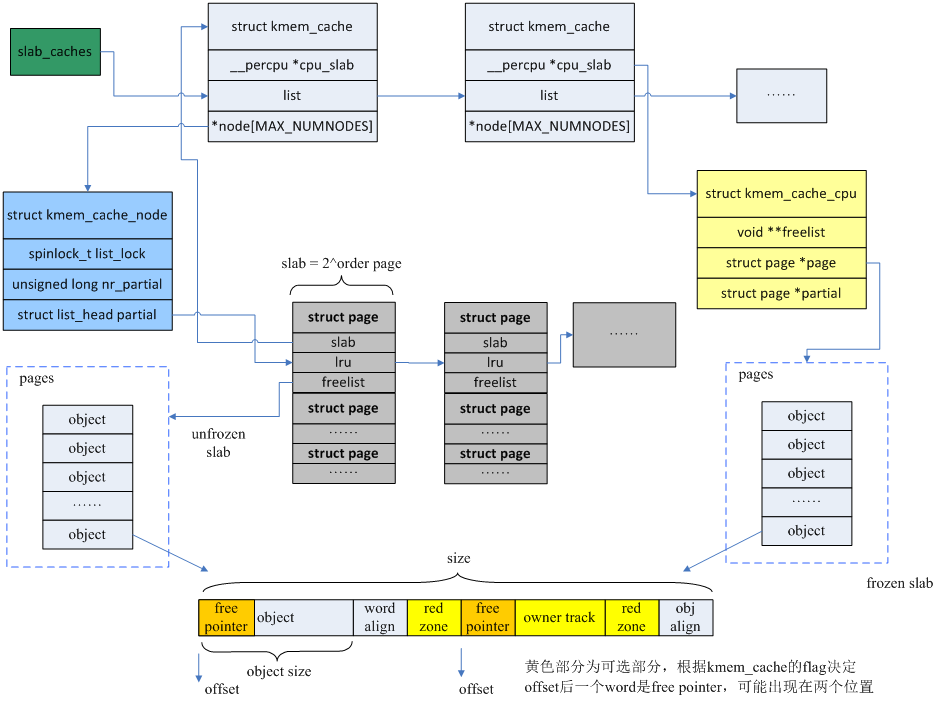

# 物理内存管理

现代多核处理器采用了NUMA架构，即非一致性内存访问架构。在这种架构下，每个cpu都有自己的本地node，而其他cpu的node就是远端node，cpu访问本地node的速度要比远端快很多。在NUMA架构中，一个node就代表一个CPU直接访问的本地内存区域。每个node又包含了许多zone，zone又被划分为page。

!!! info

    内核使用`struct pglist_data`来描述一个numa node的内存布局情况。

## 页和区

{==页==}（page）是内核物理内存管理的基本单位，每页通常包含4kb的空间。内核将物理内存划分成众多固定大小的页，主要是为了提升内核在内存分配和回收方面的效率，可以更加灵活地处理内存请求，优化资源分配，并简化了内存寻址和映射的过程，同时也为虚拟内存的管理提供了便利。page的内存区域我们称之为{==页帧==}，用`struct page`结构体表示，而page的编号就叫做{==页帧号==}(Page Frame Number)，内核定义了`page_to_pfn()`和`pfn_to_page()`两个函数用于相互转换：

```c
struct page {
    unsigned long flags;
    atomic_t _count;
    atomic_t _mapcount;
    unsigned long private;
    struct address_space *mapping;
    pgoff_t index;
    struct list_head lru;
    void *virtual;
};
```

> flags：存放页的状态，是不是脏页，是不是锁定在内存中等，每一位单独表示一种状态，定义在<linux/page-flags.h\>中。

> _count：存放页的引用计数，当页被分配给一个或多个进程时，这个计数器会增加。当页被释放时，计数器减少。直到计数器降至0，页才能被回收。

> _mapcount：用于记录页表项映射到该物理页的次数。这通常用于共享内存页，多个进程可能映射到同一个物理页。

> mapping：指向一个address_space结构的指针，这个结构体用于描述与文件相关的内存映射信息。如果页属于文件缓存，这个字段将指向相应的address_space结构。

> index：表示页在映射的文件中的偏移量，即页在文件中的索引号。

> lru：一个双向链表节点，用于将页链入到各种链表中，比如活跃链表、不活跃链表等。这是内核实现页置换算法（如lru）的一部分。

> virtual：页在虚拟内存中的地址。

为了更好地管理不同类型的内存和优化内存分配策略，内核还将页划分为不同的{==区==}(zone)，通常划分为以下几个区：

- zone_dma：用于dma操作的内存区，通常位于物理内存的低地址部分。

- zone_normal：普通的内存区，可以由内核和用户空间进程使用。

- zone_highmem：高端内存区，用于处理超过直接映射范围的内存。

区的使用和分布与体系结构密切相关，内核将页划分为区，就可以根据用途进行分配。区的划分没有物理意义，只是为了方便管理而采取的一种逻辑分组。

## 页的分配与释放

内核提供了一些以页为单位的连续内存分配与释放的函数，也被称为低级页分配器：

| 函数 | 描述 |
| --- | --- |
| alloc_page(gfp_mask) | 只分配一页，返回指向页的指针 |
| alloc_pages(gfp_mask, order) | 分配2<sup>order</sup>个页，返回指向第一页的指针 |
| __get_free_page(gfp_mask) | 只分配一页，返回指向其逻辑地址的指针 |
| __get_free_pages(gfp_mask, order) | 分配2<sup>order</sup>个页，返回指向第一页逻辑地址的指针 |
| get_zero_page(gfp_mask) | 只分配一页，填充为0，返回指向其逻辑地址的指针 |
| __free_pages(page, order) | 传入页的指针，释放2<sup>order</sup>个页 |
| free_pages(addr, order) | 传入第一页的逻辑地址，释放2<sup>order</sup>个页 |
| free_page(addr) | 释放单张页 |

## 字节的分配与释放

### kmalloc()

`kmalloc()`与用户空间的`malloc()`类似，都是分配以字节为单位的一块内存，区别在于`kmalloc()`多了一个flags参数：

!!! note

    使用`kmalloc()`函数分配的内存只能使用`kfree()`函数释放。

```c
void *kmalloc(size_t size, gfp_t flags)
```

该函数返回一个指向内存块的指针，至少有size大小。所分配的内存区在物理上是连续的且不清零。除非没有足够的内存可用，否则内核总能分配成功。`kmalloc()`分配函数总是调用`__get_free_pages()`来分配内存，通常来说其最大只能分配32个页，也就是128k大小。

当然，在对`kmalloc()`调用之后，你还是需要检查返回值是否为null：

!!! example

    ```c
    struct dog *p;
    p = kmalloc(sizeof(struct dog), gfp_kernel)；
    if(!p)
        /*处理错误*/
    ```

不管是在页分配函数还是在`kmalloc()`中，都用到了分配器标志。标志分为三类：行为修饰符、区修饰符和类型标志。类型标志组合了前两者，简化了修饰符的使用，我们只需要知道类型标志即可。内核中最常用的就是{==gfp_kernel==}，该标志适用于绝大多数内存分配场景。这种分配方式可能会引起睡眠，所以只能用在可以重新安全调度的进程上下文中。

另一个截然相反的标志是{==gfp_atomic==}，这个标志表示不能睡眠的内存分配。与gfp_kernel相比，它分配成功的机会较小，但是在一些无法睡眠的代码中，也只能选择gfp_atomic。{==gfp_dma==}标志表示分配器必须从zone_dma进行分配的请求，该标志用在需要dma的内存的设备驱动程序中。在编写的绝大多数代码中，要么是gfp_kernel，要么是gfp_atomic，其他标志用到的情况极少，就不做说明了。下面这张表格总结了标志的使用场景。

| 情形 | 相应标志 |
| --- | --- |
| 可以睡眠的进程上下文 | gfp_kernel |
| 不可以睡眠的进程上下文 | gfp_atomic |
| 中断处理程序 | gfp_atomic |
| 软中断 | gfp_atomic |
| tasklet | gfp_atomic |
| 可以睡眠的dma内存 | （gfp_dma \| gfp_kernel） |
| 不可以睡眠的dma内存 | （gfp_dma）\| gfp_atomic |

值得注意的是，尽管`kmalloc()`函数在没有空闲内存时会失败，但是内核总会尽可能满足这个内存分配请求。因此，如果一下子分配了很多内存，系统的响应性能就会降低——当系统为了满足`kmalloc()`的分配请求，会试图与磁盘交换尽可能多的页空间导致系统卡死。

基于页的分配策略能够更加精细地控制内存区域，而`kmalloc()`函数会因为分配粒度的问题浪费一定数量的内存。

### kzalloc()

`kzalloc()`等价于先用`kmalloc()`申请空间，然后调用`memset()`对内容清零：

```c
static inline void *kzalloc(size_t size, gfp_t flags)
{
    return kmalloc(size, flags | __gfp_zero);
}
```

### vmalloc()

`vmalloc()`函数与`kmalloc()`函数在内存分配方面具有相似的功能，但它们在物理地址连续性方面有所不同。与`kmalloc()`保证分配的内存页在物理地址上连续不同，`vmalloc()`分配的内存页在物理地址上可以是不连续的。这种现象与用户空间内存分配函数`malloc()`类似，`malloc()`返回的页在进程的虚拟地址空间中是连续的，但并不保证这些页在物理地址上也是连续的。

在大多数情况下，只有硬件设备需要访问物理地址连续的内存页。这是因为许多体系结构的硬件设备存在于内存管理单元（mmu）之外，它们无法处理虚拟地址。因此，硬件设备所使用的任何内存区域都必须是物理上连续的内存块。

相比之下，软件使用的内存块则没有这样的严格要求。软件通常可以通过虚拟地址来访问内存，即使这些虚拟地址对应的物理内存不是连续的。这是因为操作系统通过页表管理机制，可以将不连续的物理内存映射到连续的虚拟地址空间中。这种机制使得软件可以高效地使用分散的物理内存资源，而无需关心内存的物理布局。

由于`vmalloc()`需要对不连续的页进行专门的映射处理，所以其性能不如`kmalloc()`。仅在不得已的情形下才会使用，比如为了获得大块内存时。因为`kmalloc()`分配的内存块是连续的，当系统中的内存碎片较多时，尝试分配大块内存可能会失败，而`vmalloc()`则不会。

`vmalloc()`的分配和释放接口如下：

```c
void *vmalloc(unsinged long size)

void vfree(const void *addr)
```

这两个函数都会睡眠，因此不能在中断上下文中使用。

## 伙伴系统

伙伴系统（buddy system）是一种管理物理内存的算法，主要用于解决内存的碎片化问题。该算法将空闲页划分为11个组，对应11种大小不同的连续内存块，每个组中的内存块大小都相等：


当操作系统需要分配内存时，它会根据请求的大小找到最接近的且大小足够的块进行分配。如果分配的块比所需的大小大，那么这个块会被分成两个大小相等的子块，其中一个子块被用来满足内存分配请求，而另一个则成为它的"伙伴"。当一个块被最终释放时, 其伙伴将被检测出来, 如果伙伴也空闲则合并两者。

### 分配算法

在伙伴系统中，当需要分配一个特定大小的内存块时，系统会按照以下步骤操作：

1. 首先，确定所需内存块的大小。例如，如果需要128个页的块，系统会检查128个页的空闲块链表。

2. 如果在128个页的链表中没有找到空闲块，系统会寻找下一个更大的内存块尺寸，即256个页的块。

3. 如果在256个页的链表中找到了空闲块，系统会将这个块分成两个大小相等的块，每个块包含128个页。其中一个块被分配给请求者，另一个块作为新的空闲块插入到128个页的链表中。

4. 如果256个页的链表中也没有空闲块，系统会继续检查更大的块，比如512个页的块。

5. 如果在512个页的链表中找到了空闲块，系统会将这个块分裂成三个块：两个128个页的块和一个256个页的块。其中一个128个页的块被分配出去，其余两个块分别插入到相应的链表中。
通过这种方式，伙伴系统可以有效地管理内存，确保内存分配既高效又灵活。

### 回收算法

当内存块被释放时，系统会检查是否有与其物理地址连续的页块，如果存在且两者都是空闲的，则合并成一个大块，重复该过程直到不能合并为止。

### 内存块迁移

为了缓解内存碎片的问题，伙伴系统可以通过数据拷贝的方式将内存块进行迁移，从而"凑出"连续的物理页面。下面是内核中用于描述不同内存区域的迁移类型：

- MIGRATE_ISOLATE：不可移动，并且需要独立出来，例如用于设备DMA
- MIGRATE_CMA：连续内存分配，通常用于嵌入式系统中
- MIGRATE_HIGHATOMIC：高优先级分配操作
- MIGRATE_MOVABLE：可以被自由迁移
- MIGRATE_RECLAIMABLE：可以被回收，例如缓存页、匿名页
- MIGRATE_UNMOVABLE：不可移动，例如内核代码

## slab分配器

!!! info "内核配置界面"

    在general setup->choose slab allocator中，可以选择三种不同的slab分配技术：

    - config_slab：遗留版本
    - config_slob：简单的分配器，适用于内存受限的系统(配置config_embedded后可激活)
    - config_slub：默认分配器，比slab简单，扩展性更好

伙伴系统实现了以页为单位、大块内存的分配和释放，而在实际编程中，我们仅仅需要分配和释放单个对象，这些对象往往占据的内存很小，如果都采用伙伴系统会造成巨大的空间浪费。因此slab分配器应运而生。

slab分配器把不同的对象划分为{==高速缓存==}，其中每个高速缓存专门用于存储一种特定类型的对象。例如，一个高速缓存可能用于管理进程描述符（`task_struct`结构），而另一个则用于索引节点对象（`struct inode`）。当系统需要新的数据结构实例时，可以直接从高速缓存中获取一个现成的块，这样就避免了新内存的消耗。使用完毕后，该数据结构实例被归还到高速缓存中，而不是被直接释放。在这种机制下，高速缓存实际上是那些频繁被使用的数据结构类型的集合。这样的设计不仅提升了内存管理的效率，还减少了内存碎片，是一种非常实用的编程技巧。

整体的数据结构关系如下图所示：



!!! info "slab分配器的作用"

    - 减少伙伴算法在分配小内存时产生的碎片
    
    - 缓存频繁使用的对象，减少分配、初始化和释放的开销

    - 通过着色技术调整对象以更好的使用硬件高速缓存

slab可以处于三种状态之一：满、部分满或空。满的slab意味着所有对象都已分配出去，空的slab则表示所有对象都未被分配，而部分满的slab则包含了已分配和未分配的对象。当内核请求新对象时，优先从部分满的slab中分配。如果没有，则从空的slab中分配。如果连空的slab都没有，就会创建新的slab。

每个高速缓存都使用`struct kmem_cache`结构体表示。这个结构包含三个链表：slabs_full、slabs_partial、slabs_empty，这些链表包含了高速缓存中的所有slab。`struct slab`用来描述每个slab。

slab层的管理是在每个高速缓存的基础上，通过内核提供的统一接口来完成的：创建和撤销高速缓存，并在高速缓存内分配和释放对象。复杂的高速缓存机制和slab的管理完全由内部机制来处理，用户无须关心。

```C
struct kmem_cache *kmem_cache_create(const char *name, size_t size,
                                     size_t align, unsigned int flags,
                                     void (*ctor)(void *))              //创建一个新的高速缓存
int kmem_cache_destroy(struct kmem_cache *cachep)                       //撤销一个高速缓存
void *kmem_cache_alloc(struct kmem_cache *cachep, gfp_t flags)          //从缓存中分配对象
void kmem_cache_free(struct kmem_cache *cachep, void *objp)             //释放一个对象，将它返回给原先的slab
```

高速缓存的使用统计情况可以从/proc/slabinfo中获得。其中形如kmalloc-xxx的slab称为通用型slab，含有具体名字的slab称为专用slab，用来为特定的结构体分配内存。  

由于`fork()`系统调用用来创建一个进程，而进程的创建与销毁是非常频繁的，因此我们可以在文件<kernel/fork.c\>中，看到许多高速缓存的实现：

```c
/* slab cache for signal_struct structures (tsk->signal) */
static struct kmem_cache *signal_cachep;

/* slab cache for sighand_struct structures (tsk->sighand) */
struct kmem_cache *sighand_cachep;

/* slab cache for files_struct structures (tsk->files) */
struct kmem_cache *files_cachep;

/* slab cache for fs_struct structures (tsk->fs) */
struct kmem_cache *fs_cachep;

/* slab cache for vm_area_struct structures */
static struct kmem_cache *vm_area_cachep;

/* slab cache for mm_struct structures (tsk->mm) */
static struct kmem_cache *mm_cachep;
```

