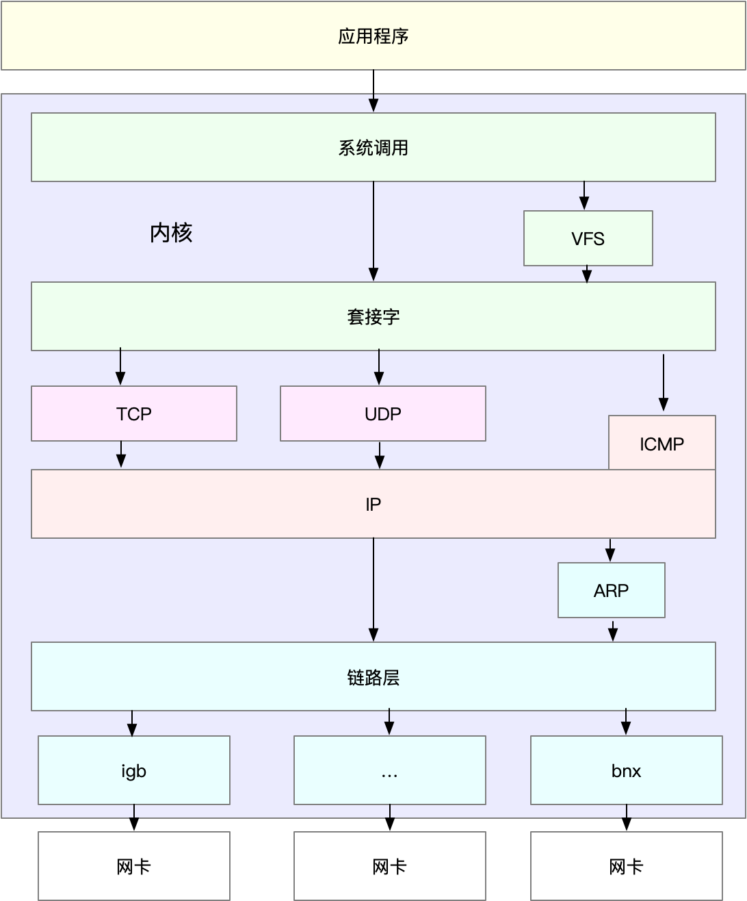
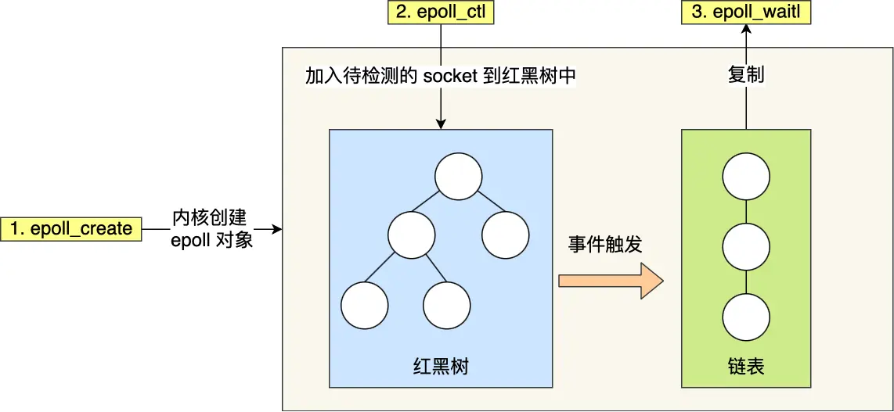

# 网络系统



## I/O多路复用

用一个进程来维护多个socket，这就是I/O多路复用技术，类似于一个CPU并发多个进程。

select/poll/epoll是内核提供给用户态的多路复用的系统调用函数，进程可以从一个系统调用中获取多个事件。

## select/poll

```C
int select(int numfds, fd_set *readfds, fd_set *writefds, fd_set *exceptfds, struct timeval *timeout);
```

其中readfds、writefds、exceptfds分别是被`select()`监视时，读、写、异常的文件描述符集合。

```C
int poll(struct pollfd *fds, nfds_t nfds, int timeout);
```

select实现多路复用的方式是，将已连接的socket都放到一个文件描述符的集合，然后调用`select()`函数，将该集合拷贝到内核里，内核会遍历这个集合，检查是否有事件产生，然后标记产生事件的socket。接着将整个集合拷贝回用户态，用户态继续遍历该集合找到可读写的socket然后再处理。

select的缺点是：

1. 每次调用select，都需要把fd集合从用户态拷贝到内核态，再从内核态拷贝至用户态，这个开销在fd很多时会很大
2. 同时每次调用select都需要在内核遍历传递进来的所有的fd集合
3. select支持的文件描述符数量太小了，默认是1024

poll用链表的方式来组织fd集合，突破了文件描述符的限制，但是本质和select一样，都通过线性表的方式存储描述符，都需要遍历来找到可读写的socket，时间复杂度为O(n)。

## epoll

```C title="epoll的函数接口"
int epoll_create(int size);

int epoll_ctl(int epfd, int op, int fd, struct epoll_event *event);

int epoll_wait(int epfd, struct epoll_event *events, int maxevents, int timeout);
```

```C title="epoll的用法"

int s = socket(AF_INET, SOCK_STREAM, 0);
bind(s, ...);
listen(s, ...)

int epfd = epoll_create(...);
epoll_ctl(epfd, ...); //将所有需要监听的socket添加到epfd中

while(1) {
    int n = epoll_wait(...);
    for(接收到数据的socket){
        //处理
    }
}
```

在上述代码中，先调用`epoll_create()`创建一个epoll对象，然后调用`epoll_ctl()`将需要监听的socket添加到对象中，最后调用`epoll_wait()`等待socket可读写。

epoll通过两种方式，解决了select和poll的缺点：

1. 使用红黑树来跟踪待检测的文件描述符，将需要监控的socket通过`epoll_ctl()`函数加入到红黑树中。
2. 使用事件驱动机制，当socket可读写时，内核会发送一个事件给进程，进程只需要在事件到达时处理即可，无需遍历整个红黑树。



epoll支持两种触发方式，分别是边缘触发和水平触发。

- 边缘触发：当一个文件描述符上有可读写的数据时，epoll_wait()会返回该文件描述符。如果该文件描述符可读写的数据没有读取完，那么下一次再调用epoll_wait()时，不会再次返回该文件描述符，而是继续等待该文件描述符可读写。

- 水平触发：当一个文件描述符上有可读写的数据时，epoll_wait()会返回该文件描述符。如果该文件描述符可读写的数据没有读取完，那么下一次再调用epoll_wait()时，会再次返回该文件描述符，直到该文件描述符的可读写数据被读取完毕。

如果使用边缘触发模式，进程在收到通知后，要尽可能地读写数据，以免数据丢失。

在使用I/O多路复用时，最好搭配非阻塞I/O一起使用。

