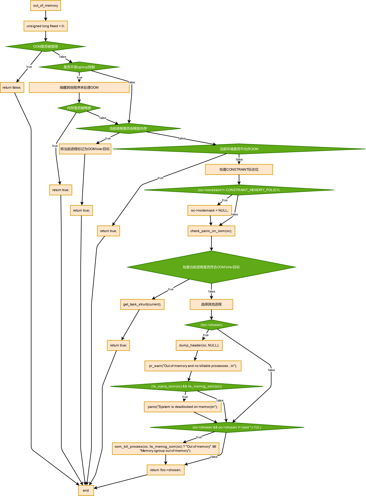

# OOM

OOM，即out of memory的缩写。尽管Linux内核有各种内存管理技巧来应对应用程序的内存需求，但是仍然会面临内存不够用的情况。最典型的就是某个程序编写不当造成了内存泄露，导致系统内存耗尽，不得不重启。

内核触发OOM后的流程如下：


相关代码如下：

```C
bool out_of_memory(struct oom_control *oc)
{
	unsigned long freed = 0;

    //如果禁用了oom killer，直接返回false
	if (oom_killer_disabled)
		return false;

    //如果当前路径不是由memory cgroup控制的，则唤醒其他程序来处理oom
	if (!is_memcg_oom(oc)) {
		blocking_notifier_call_chain(&oom_notify_list, 0, &freed);
		if (freed > 0)
			/* Got some memory back in the last second. */
			return true;
	}

	/*
	 * If current has a pending SIGKILL or is exiting, then automatically
	 * select it.  The goal is to allow it to allocate so that it may
	 * quickly exit and free its memory.
	 */
	if (task_will_free_mem(current)) {
		mark_oom_victim(current);
		queue_oom_reaper(current);
		return true;
	}

	/*
	 * The OOM killer does not compensate for IO-less reclaim.
	 * pagefault_out_of_memory lost its gfp context so we have to
	 * make sure exclude 0 mask - all other users should have at least
	 * ___GFP_DIRECT_RECLAIM to get here. But mem_cgroup_oom() has to
	 * invoke the OOM killer even if it is a GFP_NOFS allocation.
	 */
	if (oc->gfp_mask && !(oc->gfp_mask & __GFP_FS) && !is_memcg_oom(oc))
		return true;

	/*
	 * Check if there were limitations on the allocation (only relevant for
	 * NUMA and memcg) that may require different handling.
	 */
	oc->constraint = constrained_alloc(oc);
	if (oc->constraint != CONSTRAINT_MEMORY_POLICY)
		oc->nodemask = NULL;

    /*
    * 检查sysctl_panic_on_oom参数，是否要触发oom_panic，该值一般设为0，即不触发
    */
	check_panic_on_oom(oc);

    /*
    * 检查是否需要杀死当前进程
    */
	if (!is_memcg_oom(oc) && sysctl_oom_kill_allocating_task &&
	    current->mm && !oom_unkillable_task(current) &&
	    oom_cpuset_eligible(current, oc) &&
	    current->signal->oom_score_adj != OOM_SCORE_ADJ_MIN) {
		get_task_struct(current);
		oc->chosen = current;
		oom_kill_process(oc, "Out of memory (oom_kill_allocating_task)");
		return true;
	}

    /*
    * 如果当前进程没有被杀死，则选择其他进程
    */
	select_bad_process(oc);
	/* Found nothing?!?! */
	if (!oc->chosen) {
		dump_header(oc, NULL);
		pr_warn("Out of memory and no killable processes...\n");
		/*
		 * If we got here due to an actual allocation at the
		 * system level, we cannot survive this and will enter
		 * an endless loop in the allocator. Bail out now.
		 */
		if (!is_sysrq_oom(oc) && !is_memcg_oom(oc))
			panic("System is deadlocked on memory\n");
	}
	if (oc->chosen && oc->chosen != (void *)-1UL)
		oom_kill_process(oc, !is_memcg_oom(oc) ? "Out of memory" :
				 "Memory cgroup out of memory");
	return !!oc->chosen;
}
```

函数`check_panic_on_oom()`会根据`sysctl_panic_on_oom`参数做相应的处理：

```C
static void check_panic_on_oom(struct oom_control *oc)
{
	if (likely(!sysctl_panic_on_oom))
		return;
	if (sysctl_panic_on_oom != 2) {
		/*
		 * panic_on_oom == 1 only affects CONSTRAINT_NONE, the kernel
		 * does not panic for cpuset, mempolicy, or memcg allocation
		 * failures.
		 */
		if (oc->constraint != CONSTRAINT_NONE)
			return;
	}
	/* Do not panic for oom kills triggered by sysrq */
	if (is_sysrq_oom(oc))
		return;
	dump_header(oc, NULL);
	panic("Out of memory: %s panic_on_oom is enabled\n",
		sysctl_panic_on_oom == 2 ? "compulsory" : "system-wide");
}
```

它有三种选择：

1. 当该参数为2时：产生kernel panic，即系统崩溃
2. 当该参数为0时：启动OOM killer，干掉一些进程，释放内存，让系统还能正常运转
3. 当该参数为1时：要分情况处理。`enum oom_constraint`定义了四种情况：

```C
enum oom_constraint {
    CONSTRAINT_NONE,
    CONSTRAINT_CPUSET,
    CONSTRAINT_MEMORY_POLICY,
    CONSTRAINT_MEMCG,
}; 
```

对于UMA架构而言，`oom_constraint`永远是CONSTRAINT_NONE，因为UMA架构，内存是统一管理的，触发OOM那就是内存不足。

对于NUMA架构就复杂得多，因为NUMA架构下，内存根据不同的node分区管理。当触发OOM，仅能说明当前分配内存的node出现了状况，而其它node可能有充足的内存。

- `CONSTRAINT_CPUSET`：cpuset是内核的一种机制，将特定的cpu和memory node分配给特定的进程。

- `CONSTRAINT_MEMORY_POLICY`：NUMA架构下的memory node的分配策略，可以针对特定的进程。

- `CONSTRAINT_MEMCG`：memcg就是memory control group，可以限制进程的cpu和内存资源。

## killer策略

经过了一系列的参数和环境检查，系统终于来到了关键的killer process。一个很头疼的问题就是，到底杀掉哪个进程？

随之又引申出另一个问题：是不是所有的进程都可以杀？

函数`oom_unkillable_task()`会检查当前进程是否可以被杀死：

```C
static bool oom_unkillable_task(struct task_struct *p)
{
	if (is_global_init(p))
		return true;
	if (p->flags & PF_KTHREAD)
		return true;
	return false;
}
```

显然，有两种进程不能被杀：

- 全局的系统初始化进程
- 内核进程

除了这些，剩下的进程都是可以杀的，杀掉哪个才合适呢？内核有两种选择：

- 谁触发了OOM就干掉谁
- 谁最耗费性能就干掉谁

`sysctl_oom_kill_allocating_task`参数为0时选择策略2，否则选择策略1。

函数`select_bad_process()`会遍历每一个进程，然后调用`oom_evaluate_task()`对其打分，选择一个分数最高的杀死。计算分数的代码如下：

```C
long oom_badness(struct task_struct *p, unsigned long totalpages)
{
    ......

	/*
	 * Do not even consider tasks which are explicitly marked oom
	 * unkillable or have been already oom reaped or the are in
	 * the middle of vfork
	 */
	adj = (long)p->signal->oom_score_adj;
	if (adj == OOM_SCORE_ADJ_MIN ||
			test_bit(MMF_OOM_SKIP, &p->mm->flags) ||
			in_vfork(p)) {
		task_unlock(p);
		return LONG_MIN;
	}

	/*
	 * The baseline for the badness score is the proportion of RAM that each
	 * task's rss, pagetable and swap space use.
	 */
	points = get_mm_rss(p->mm) + get_mm_counter(p->mm, MM_SWAPENTS) +
		mm_pgtables_bytes(p->mm) / PAGE_SIZE;
	task_unlock(p);

	/* Normalize to oom_score_adj units */
	adj *= totalpages / 1000;
	points += adj;

	return points;
}
```

一个进程的oom_score分为两个部分：

- 系统打分：主要根据该进程的内存使用情况
- 用户打分：主要根据该进程的oom_score_adj参数，可以由用户设置


