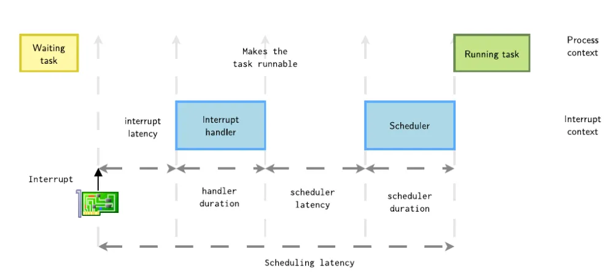
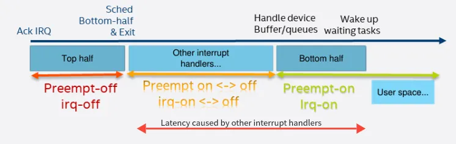

# 内核抢占

内核抢占允许高优先级任务抢占正在执行的低优先级任务，从而减少调度延迟，提升系统响应性能，在多任务处理和实时响应方面至关重要。

在老版本的内核中(2.6以前)，Linux是不支持内核态抢占的，也就是说抢占只能发生在用户态，其执行过程如下：


这张图展示了两种情况：

1. 中断发生在用户态，此时进入内核空间，在返回用户空间时，内核检查TIF_NEED_RESCHED标志位，如果为true，则触发进程调度。
2. 中断发生在内核态，中断返回前不会进行调度，因为返回的是内核空间，只有在内核空间返回至用户空间时才会检查标志位并进行调度。

内核抢占，顾名思义，就是在内核态对当前进程抢占，调度其他进程运行。


当然，为了确保安全，内核还会额外检查内核抢占标志位是否被设置。

## 抢占标志位

ARM64中对`struct thread_info`结构体的定义如下：

```C
/*
 * low level task data that entry.S needs immediate access to.
 */
struct thread_info {
	unsigned long		flags;		/* low level flags */
#ifdef CONFIG_ARM64_SW_TTBR0_PAN
	u64			ttbr0;		/* saved TTBR0_EL1 */
#endif
	union {
		u64		preempt_count;	/* 0 => preemptible, <0 => bug */
		struct {
#ifdef CONFIG_CPU_BIG_ENDIAN
			u32	need_resched;
			u32	count;
#else
			u32	count;
			u32	need_resched;
#endif
		} preempt;
	};
#ifdef CONFIG_SHADOW_CALL_STACK
	void			*scs_base;
	void			*scs_sp;
#endif
};
```

### TIF_NEED_RESCHED

内核对于进程的调度并不是立即进行的，而是设置TIF_NEED_RESCHED标志位，由调度程序选择合适的时机，检查该标志位。如果为真，则触发调度程序。

```C
static inline void set_tsk_need_resched(struct task_struct *tsk)
{
    set_tsk_thread_flag(tsk, TIF_NEED_RESCHED);
}
```

### PREEMPT_COUNT

为了正确协调系统中所有任务能正确运行，内核必须跟踪当前线程的执行状态，每个`task_struct`中都存储了`preempt_count`计数值，可以通过`preempt_count()`函数来访问：

```C
static inline int preempt_count(void)
{
    return READ_ONCE(current_thread_info()->preempt_count);
}
```

该计数值用来指示当前线程的状态、它是否可以被抢占，以及它是否被允许睡眠。`preempt_count`用多个字段来记录：


- 最低位的这个 byte 是用来记录`preempt_disable()`嵌套调用的次数。

- SOFTIRQ：当CPU进入软中处理程序时，对该位域加1，退出时减1。

- HARDIRQ：当CPU进入硬件中断处理函数时，对该位域加1，退出时减1，位域数值表示中断嵌套层级。

- NMI：CPU进入不可屏蔽中断处理函数时，此位置1，退出时清0。

- 最后，最高位表示当前进程是否需要被调度。

下面是一些`preempt_count`相关的条件判断函数，在判断是否要抢占时会被频繁使用到：

```C
#define in_nmi()		(nmi_count())
#define in_hardirq()		(hardirq_count())
#define in_serving_softirq()	(softirq_count() & SOFTIRQ_OFFSET)
#define in_task()		(!(in_nmi() | in_hardirq() | in_serving_softirq()))

#define in_softirq()		(softirq_count())
#define in_interrupt()		(irq_count())
```

- `in_nmi()`：当前CPU是否处于不可屏蔽中断，返回NMI计数值
- `in_hardirq()`：当前CPU是否处于硬件中断，返回HARDIRQ计数值
- `in_serving_softirq()`：当前CPU是否处于软中断处理程序中，返回SOFTIRQ计数值
- `in_task()`：当前CPU是否处于进程上下文中
- `in_softirq()`：当前CPU是否处于禁用下半部或者软中断处理程序中，返回SOFTIRQ计数值
- `in_interrupt()`：当前CPU是否处于中断处理程序内

总结一下内核的四类context：

- 中断
- 软中断(包括softirq和tasklet)
- 进程上下文的spinlock
- 进程上下文的其他情形

在上面四类context中，前三者都是原子的，只有第四类支持抢占调度。

## 抢占配置选项

Linux内核支持多种抢占配置，可以根据具体场景灵活选择：

- CONFIG_PREEMPT_NONE=y：不允许内核抢占
- CONFIG_PREEMPT_VOLUNTARY=y：允许内核抢占，但是只有当进程主动调用调度函数时才会触发
- CONFIG_PREEMPT=y：除了持有spinlock的时候，都允许抢占
- CONFIG_PREEMPT_RT：实时内核抢占补丁，可以认为随时可被抢占

## 调度延迟

从内核触发进程调度，到进程真正被调度运行，中间的时间差被称为调度延迟。那么内核中有哪些情况会产生调度延迟？

从理论上来讲，调度延迟应该等于调度程序处理时间 + 进程切换处理时间，但是实际情况要比这复杂很多，主要是因为在执行调度程序的时候，中断可以随时发生，因此真正的调度延迟 = 中断延迟 + 中断处理时间 + 调度程序处理时间 + 进程切换处理时间。



### 中断延迟

当中断发生，进入真正的中断处理程序之前，内核还需要处理一些其他操作，这被统称为中断延迟。

中断延迟主要包含以下操作：

1. 中断必须保证并发安全，因此当中断发生时，内核处于关中断状态。
2. 中断控制器对中断的优先级进行仲裁，保证对高优先级中断的响应。
3. 中断需要保存现场，切换执行模式。
4. 当多个设备共享一个中断号时，还需要识别不同的中断源。

### 中断处理时间

内核中的中断处理分为上半部和下半部：

- 上半部，在禁止中断的情况下运行，做到快进快出
- 下半部，由上半部执行完毕后开始，此时为开中断，可以被其他中断打断执行

在处理上半部后，如果有其他外设中断发生，整个过程如下图所示：



### 调度程序处理时间

这个比较好理解，调度器选择哪个进程去执行，也是需要时间的。但是，调度器选择进程去执行时，并不是所有进程都可以立即执行的。假如进程A和进程B共享了某个临界区的资源，在进程A执行期间调度器选择进程B去执行，那么进程B只能等待进程A释放资源才能执行，这种情况也会增加调度延迟，并且很难被发现。

### 进程切换处理时间

在最后时刻，还需要进行上下文切换后才能执行进程。上下文切换也是个比较耗时的过程，需要刷新缓存、重建页表等，这里就不细讲了。


