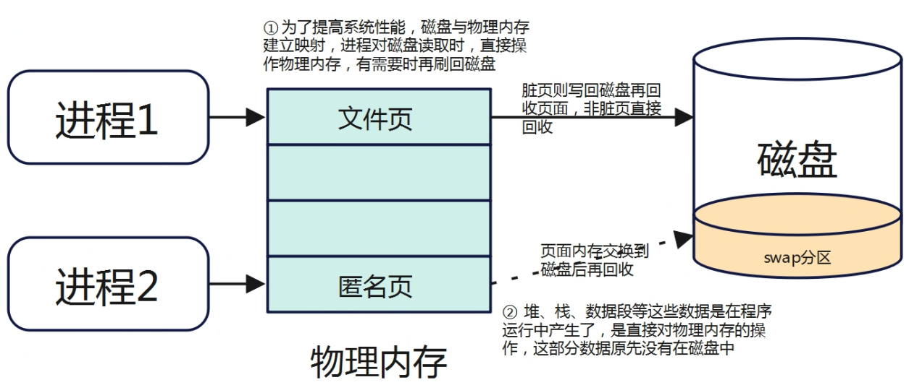
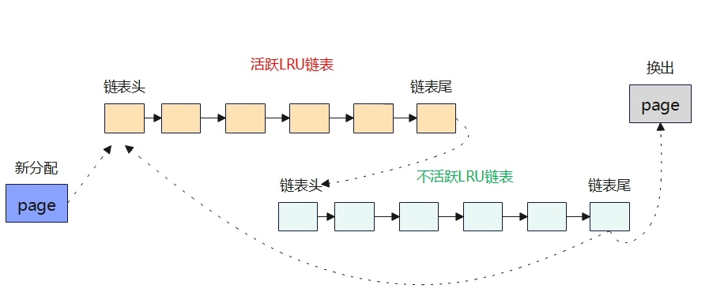
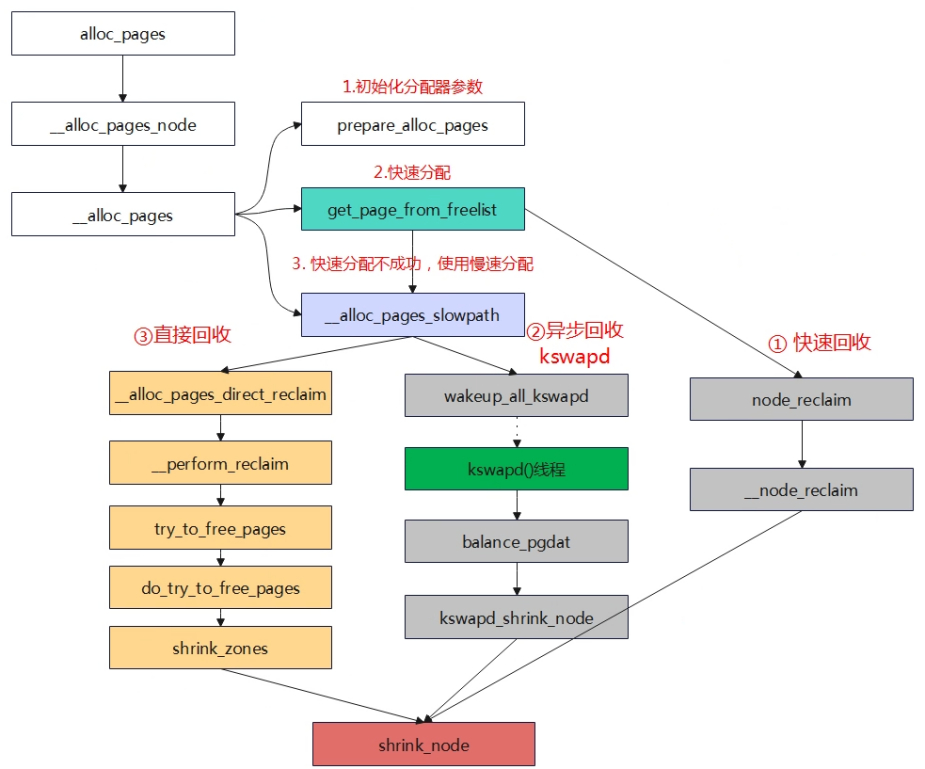

# 内存回收

Linux系统会尽可能地将内存都使用起来，比如将剩余内存作为文件缓存(page cache)从而提供系统的性能。当内存不足时，则会进行内存回收。内存回收是个很复杂的过程，而且并不是回收得越多越好，因为Linux的设计哲学是与其让内存空着还不如都利用起来(当做缓存)。

对于用户空间来说，页可以分为文件页和匿名页：

- 文件页：与磁盘存在映射关系的页，比如进程的代码段。可以直接释放给磁盘，需要时再读取即可。
- 匿名页：与磁盘不存在映射关系的页，比如堆、栈。不能直接丢弃，要先转义到swap分区。



## overcommit

进程提交自己虚拟地址空间的请求，称之为 committed virtual memory。当进程请求分配内存时，获得的只是一块虚拟地址的使用权，而不是实际的物理地址。只有当进程去访问申请的虚拟地址时，内核才会通过{==缺页异常==}分配实际的物理内存。

如果分配了过多的虚拟地址，超出了物理内存可以承受的上限，这种状况称之为 overcommit。

内核对于内存分配按照以下原则：

- 用户空间：执行严格的物理内存申请以及宽松的虚拟地址申请
- 内核空间：总是满足其要求。

在该原则下，进程申请内存是有可能失败的。好在内核有"拆东墙补西墙"的机制，也就是当进程申请内存失败时，内核会尝试回收一些内存，从而让进程申请内存成功。

拆东墙是门技术活，不是所有的进程虚拟地址都可以拆。比如磁盘的缓存就可以拆，大不了就重新从磁盘中读取。但是堆、栈这些没有磁盘文件对应的(又叫匿名页)，就不可以拆。还有一些进程锁定的页，也没办法拆。

拆东墙补西墙在大部分情况下运转良好，但是某些情况下却会成为性能瓶颈。比如进程A正在进行密集的I/O操作，本来已经通过补西墙的机制拿到了需要的内存，但是系统调度到了进程B。进程B也需要大量内存，怎么办？系统只能继续寻找空闲的内存，极端情况下，有可能把刚刚分配给进程A的内存回收给进程B，导致整个系统性能显著下降。

## LRU算法

内存回收是通过LRU链表实现的。LRU链表对页进行排序，将频繁使用的页放到头部，将使用频率低的页放到尾部。内存回收其实就是将尾部的页从内存转存到磁盘中，然后将页释放给伙伴系统。

Linux内核采用了改进的LRU算法，被称为{==双链策略==}——维护两个链表：活跃链表（active list）和不活跃链表（inactive list）。在活跃链表中使用频率最低的页将会被移到尾部，然后再转移到不活跃链表中，最后换出页面。

预读页先加入到不活跃链表的头部，当页被真正访问的时候，才将页插入到活跃链表的头部。



```C title="mmzone.h"
enum lru_list {
	LRU_INACTIVE_ANON = LRU_BASE,
	LRU_ACTIVE_ANON = LRU_BASE + LRU_ACTIVE,
	LRU_INACTIVE_FILE = LRU_BASE + LRU_FILE,
	LRU_ACTIVE_FILE = LRU_BASE + LRU_FILE + LRU_ACTIVE,
	LRU_UNEVICTABLE,
	NR_LRU_LISTS
};
```

根据这个枚举体我们可以看到，内存回收主要针对的是匿名页和文件页的活跃和非活跃总计四种链表。

页面回收时，会优先回收不活跃链表的页，然后才考虑活跃链表。

## 水位线

内核通过设置内存水位线来控制内存回收的时机。当系统中可用内存低于WMARK_LOW时，就会唤醒内核线程kswapd进行内存回收，回收的过程是异步的。


以下三种页面回收方式，最终都会调用`shrink_node()`函数：

- 快速回收：调用`node_reclaim()`函数，不回收脏文件页，避免耗时的IO操作
- 异步回收：唤醒kswapd内核线程，在后台进行页面回收
- 直接回收：慢速路径内存分配时失败，触发直接回收



## 回收策略