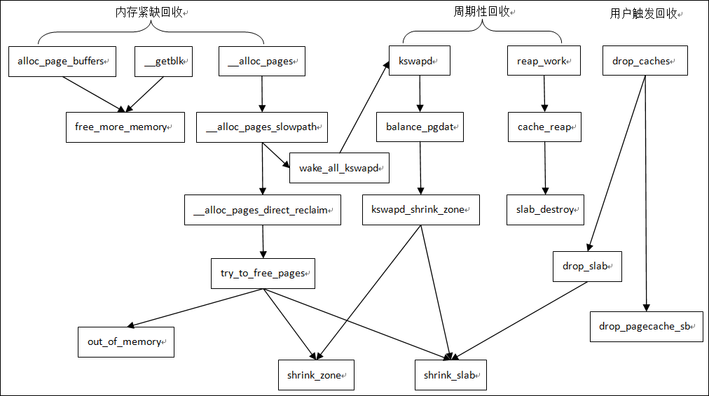
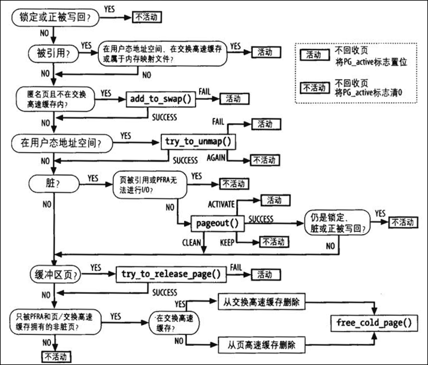
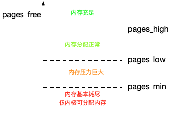

# 内存回收

在Linux操作系统中，当内存充足的时候，内核会尽量使用内存作为文件缓存，这样就可以避免耗时的I/O操作，从而提高系统的性能。

因此，内核需要一种机制来回收内存以保证系统的正常运行，内存回收的流程如下图所示：



## overcommit

进程提交自己虚拟地址空间的请求，称之为committed virtual memory。当进程请求分配内存时，获得的只是一块虚拟地址的使用权，而不是实际的物理地址。只有当进程真正去访问申请的虚拟地址，产生"{==缺页异常==}"时，才会分配实际的物理内存。

如果分配了过多的虚拟地址，超出了物理内存可以承受的上限，这个状况称之为overcommit。

内核对于内存分配按照以下原则：

对于用户空间，执行严格的物理内存申请以及宽松的虚拟地址申请。对于内核空间，则总是满足其要求。

在该原则下，进程申请内存是有可能失败的。好在内核有"拆东墙补西墙"的机制，所谓拆东墙补西墙，就是当进程申请内存失败时，内核会尝试回收一些内存，从而让进程申请内存成功。

拆东墙是门技术活，不是所有的进程虚拟空间都可以拆。比如磁盘的缓存就可以拆，大不了就重新从磁盘中读取嘛。但是堆、栈这些没有磁盘文件对应的(又叫匿名页)，就不可以拆。还有一些进程锁定的页，也没办法拆。

拆东墙补西墙在大部分情况下运转良好，但是某些情况下却会成为性能瓶颈。比如进程A正在进行密集的I/O操作，本来已经通过补西墙的机制拿到了需要的内存，但是系统调度到了进程B。进程B也需要大量内存，怎么办？系统只能继续寻找空闲的内存，极端情况下，有可能把刚刚分配给进程A的内存回收给进程B，导致整个系统性能显著下降。

## 页高速缓存

页高速缓存是一种把磁盘的数据缓存到物理内存中的机制，使得对磁盘的访问变为对物理内存的访问。高速缓存的重要性体现在：

1. 访问磁盘的速度远远低于访问内存的速度。

2. 数据一旦被访问，就很有可能在短期内再次被访问。这就是{==局部性原理==}。

当内核开始一个读操作，它首先会检查需要的数据是否在页高速缓存中。如果在，放弃访问磁盘，而直接从内存中读取。这个行为称为{==缓存命中==}（cache hit）。否则称为{==缓存未命中==}（cache miss），那么内核必须调度块I/O操作去磁盘中读取数据，然后将数据放入页缓存中。

内核采用{==预读机制==}：即当从磁盘中读取数据时，一次性将多个块的数据都加入到缓存中。

## 改进的LRU算法

当内存资源紧张时，内核就会对一些内存进行回收。但并不是所有的内存都可以回收，比如进程的代码段、数据段，如果回收了进程就没法运行了。还有一些是进程申请锁定的页，也不允许回收。内核回收的页，主要分为以下两类：

- 文件页：也就是文件在内存中的缓存，大部分可以直接回收，如果是脏页就先写入磁盘
- 匿名页：进程申请的内存，通过swap机制，写入磁盘后释放
  
Linux内核采用了改进的LRU算法，被称为{==双链策略==}——维护两个链表：活跃链表（active list）和不活跃链表（inactive list）。处于活跃链表上的页被认为是"热"的且不会换出，处于不活跃链表上的页被认为是"冷"的可以被换出。预读页先加入到不活跃链表的头部，当页被真正访问的时候，才将页插入到活跃链表的头部。

```C title="mmzone.h"
enum lru_list {
	LRU_INACTIVE_ANON = LRU_BASE,
	LRU_ACTIVE_ANON = LRU_BASE + LRU_ACTIVE,
	LRU_INACTIVE_FILE = LRU_BASE + LRU_FILE,
	LRU_ACTIVE_FILE = LRU_BASE + LRU_FILE + LRU_ACTIVE,
	LRU_UNEVICTABLE,
	NR_LRU_LISTS
};
```

根据这个枚举体我们可以看到，内存回收主要针对的是匿名页和文件页的活跃和非活跃总计四种链表。

页面回收时，会优先回收不活跃链表的页，然后才考虑活跃链表。

!!! question

	内存回收是不是越多越好？

答案是否定的。页面的回收是以丢弃缓存、swap分区为代价的，回收多了就会对系统的性能有影响。内核力图达到一种平衡——既要保证新内存的分配请求，又要保证旧内存的使用性能。

## 内存回收过程



## 内存回收方式

当有新的大块内存分配请求而剩余内存不足时，内核就会回收一部分内存，尽可能地满足新内存请求，这个过程被称为{==直接内存回收==}。

除了直接内存回收，还有{==定期内存回收==}——即创建一个专门的内核线程`kswapd`专门用来回收内存。为了衡量内存的使用情况，内核定义了三个内存阈值，分别是页最小阈值（pages_min）、页低阈值（pages_low）和页高阈值（pages_high），剩余内存，则用pages_free表示。



当系统空闲内存低于pages_low时，内核线程`kswapd`就会开始回收内存，直到空闲内存达到pages_high。如果申请内存的速度太快，导致空闲内存降低至pages_min，就会触发直接内存回收。由于直接内存回收涉及到I/O操作，因此会降低系统的性能。

在NUMA架构下，每个处理器都会被划分到不同的Node下，而每个Node都有自己的本地内存空间。因此，内核需要根据当前Node的内存使用情况来决定回收的目标。当某个Node内存不足时，内核可以从其他Node寻找空闲内存，也可以从本地回收内存，具体回收模式在/proc/sys/vm/zone_reclaim_mode文件中进行配置。

/proc/sys/vm/swappiness选项用来调整使用Swap的积极程度，范围是从0~100。数值越大越积极使用swap，也就是更倾向于回收匿名页；数值越小越消极使用swap，也就是更倾向于回收文件页。

如果以上这两种方式仍然不满足内存分配的要求，内核就会祭出终极大杀器——{==OOM killer==}，它会遍历内核中的所有进程，然后对其打分，最后kill掉得分最高的进程。

内存回收更详细的内容见[Linux内存管理](https://www.bilibili.com/cheese/play/ep119458?csource=common_myclass_purchasedlecture_null&spm_id_from=333.874.selfDef.mine_paid_list)