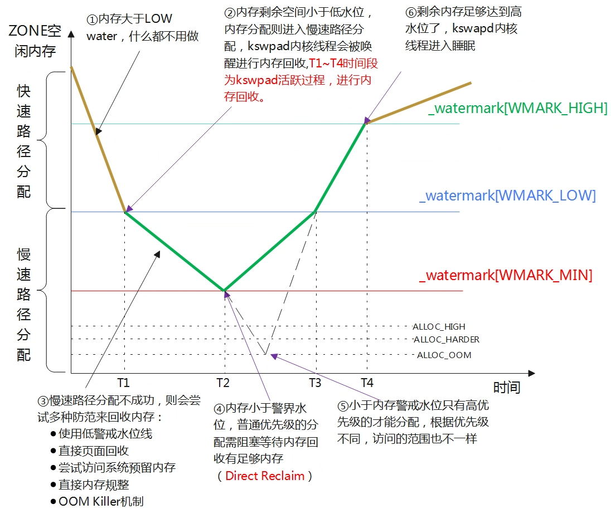

# 内存回收

Linux 的设计哲学是与其让内存空着不如都利用起来，比如将空余的内存作为文件缓存(page cache)从而提高读写IO的性能。当内存不足时，则会进行内存回收。内存回收是个很复杂的过程，而且并不是回收得越多越好。

## buffer/cache

`free`命令是最常用的查看内存状况的工具，buffer/cache 是指系统中用来存放数据的缓存页。buffer 表示块设备占用的缓存页，而 cache 表示普通文件占用的缓存页。

用户空间的进程的内存页分为两种：

- 文件页：即与文件存在映射关系的页，比如进程的代码段
- 匿名页：即不与文件关联的页，比如堆、栈


### swap cache

匿名页是不关联任何文件的，一旦发生换页，因为没有对应的文件可以执行回写操作，所以内核会将它们先写入到{==交换区==}。

交换区是一个特殊的分区，可以包括一个或多个交换区设备（裸盘、逻辑卷、文件都可以充当交换区设备），每一个交换区设备在内存里都有对应的 swap cache。

当一个匿名页即将被写入交换区以释放内存时，它首先被放入 swap cache。但这个过程很短暂，因为一旦页面写入完成，它就会从 swap cache 中移除。
    
如果一个匿名页曾经被写入交换区，后来又被读回内存（swap-in），那么它会在 swap cache 中保留，直到以下情况发生：

- 页面内容发生变化，此时对应的swap cache会被删除
- 之前使用的交换区空间被回收，这时swap cache也会被删除

## LRU算法

内存回收是通过 LRU 链表实现的。LRU 链表对页进行排序，将频繁使用的页放到头部，将使用频率低的页放到尾部。内存回收其实就是将尾部的页从内存转存到磁盘中，然后将页释放给伙伴系统。

Linux 内核采用了改进的 LRU 算法，被称为{==双链算法==}——维护两个链表：活跃链表（active list）和不活跃链表（inactive list）。在活跃链表中使用频率最低的页将会被移到尾部，然后再转移到不活跃链表中，最后换出页面。

预读页先加入到不活跃链表的头部，当页被真正访问的时候，才将页插入到活跃链表的头部。


```C title="mmzone.h"
enum lru_list {
	LRU_INACTIVE_ANON = LRU_BASE,
	LRU_ACTIVE_ANON = LRU_BASE + LRU_ACTIVE,
	LRU_INACTIVE_FILE = LRU_BASE + LRU_FILE,
	LRU_ACTIVE_FILE = LRU_BASE + LRU_FILE + LRU_ACTIVE,
	LRU_UNEVICTABLE,
	NR_LRU_LISTS
};
```

根据这个枚举体我们可以看到，内存回收主要针对的是匿名页和文件页的活跃和非活跃总计四种链表。

页面回收时，会优先回收不活跃链表的页，然后才考虑活跃链表。

## 水位线

内存水位线可以用来控制内存回收的时机。当系统中可用内存低于 WMARK_LOW 时，就会唤醒内核线程`kswapd`进行内存回收，回收的过程是异步的。



以下三种页面回收方式，最终都会调用`shrink_node()`函数：

- 快速回收：调用`node_reclaim()`函数，不回收脏文件页，避免耗时的IO操作
- 异步回收：唤醒`kswapd`内核线程，在后台进行页面回收
- 直接回收：慢速路径内存分配时失败，触发直接回收


## 回收策略