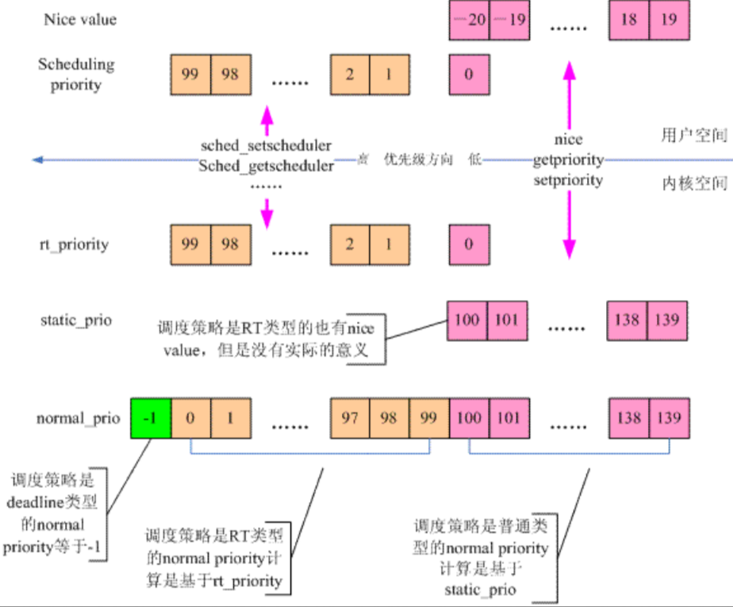

# 进程调度

操作系统的重要职责就是对各类进程进行合理的调度，在各个进程之间尽可能公平地共享 CPU 时间，而同时又要考虑不同的任务优先级。调度的两个核心问题是：

1. 如何决定下一个运行的进程？
2. 允许下一个进程运行多久？

而调度算法必须在以下几个目标之间实现平衡：

- 进程响应时间尽可能快
- 后台任务的吞吐量尽可能高
- 尽可能避免进程的饥饿现象
- 低优先级进程和高优先级进程的需求尽可能调和

传统的调度算法基于分时(time sharing)技术：将 CPU 的时间切分成片(slice)，给每个可运行的进程分配一块 CPU 时间片，单处理器同一时间只能运行单个进程。如果时间片耗尽，即使进程没有运行完，也会发生进程切换。进程的优先级则体现在对于时间片的占用量上。

## 进程的分类

一种分类方法将进程分为三类：

- 交互式进程：此类进程经常与用户交互，等待来自用户的鼠标或者键盘操作，当接受输入后，必须立即响应，否则用户会感觉系统反应迟钝
- 批处理进程：此类进程不与用户交互，只在后台运行
- 实时进程：此类进程有很强的调度需要，不会被低优先级的进程阻塞

Linux 内核可以明确地区分实时进程的身份，并实现了基于进程过去行为的启发算法，以区分交互式进程和批处理进程。为了提高系统的响应速度，调度算法会倾向于优先调度交互式进程。

## 调度器设计

Linux 设计了6种调度策略，5个调度器类和3个调度实体：

| 调度器类 | 调度策略 | 调度算法 | 调度实体 | 调度实体对应的调度对象 |
| ---- | ---- | ---- | ---- | ---- |
| stop_sched_class | 无 | 无 | 无 | 紧急的、需要立即执行的CPU任务 |
| dl_sched_class | SCHED_DEADLINE | 最早截止时间算法 | sched_dl_entity | 有截止时间的实时进程 |
| rt_sched_class | SCHED_RR, SCHED_FIFO | 时间片轮转算法，先进先出算法 | sched_rt_entity | 实时进程 |
| fair_sched_class | SCHED_OTHER| 完全公平调度算法 | sched_entity | 普通非实时进程 |
| idle_sched_class | SCHED_IDLE | 无 | 无 | 特殊进程idle |

为了让每个 CPU 核心都能参与进程任务处理，不需要考虑和其他处理器竞争的问题，也能充分利用本地硬件 cache 来对访问加速，Linux 内核为每个 CPU 核心都分配了一个运行队列，这就是`struct rq`结构体：

```C title="kernel/sched/core.c"
DEFINE_PER_CPU_SHARED_ALIGNED(struct rq, runqueues)
```

为了满足不同的调度策略，`strcut rq`中实现了不同的调度类(Scheduling Class)，将不同调度需求的进程放在不同的调度类中：

```C title="kernel/sched/sched.h"
struct rq{
	struct rt_rq rt;
	struct cfs_rq cfs;
	struct dl_rq dl;
};
```

`task_struct->sched_class`标识了当前进程的调度器类，`task_struct->policy`标识了当前进程的调度策略。整个调度器运行的场景如下：


## 进程优先级

Linux 定义了 0~139 之间的优先级，数值越低，优先级越高。其中 0~99 的 100 个优先级给实时进程使用，100~139 的 40 个优先级给普通进程使用。在调度优先级上，实时进程使用的是{==静态优先级==}，优先级高的进程拥有绝对的优先执行权。但是普通进程使用的是{==动态优先级==}，会随着进程的运行动态变化。这样可以保证每个普通进程都被调度到，不至于被饿死。

另外，对于普通进程还引入了 nice 值，-20~19 对应 100~139。



## 实时调度算法

实时进程的调度中，优先级是最重要的考虑因素，Linux 内核提供了两种实时调度策略：

- SCHED_FIFO：先来先服务
- SCHED_RR：时间片轮转

不管是哪种策略，优先级高的进程都可以抢占优先级低的进程。

这种调度方式实现起来比较简单，只需要定义一些优先级，然后为每个优先级分配一个链表当作队列即可，也叫多优先级队列：

```C
#define MAX_RT_PRIO 100

struct rt_prio_array{
	...
	struct list_head queue[MAX_RT_PRIO];
};
```

实时进程的优先级永远大于普通进程，但是 Linux 预留了 5% 的余量给普通进程使用：

```C
$ sysctl -a | grep sched_rt_
kernel.sched_rt_period_us = 1000000
kernel.sched_rt_runtime_us = 950000
```

## 完全公平调度算法

完全公平调度算法针对普通进程的调度进行了改进，其核心思想是"对于 N 个进程的系统，在时间周期 T 内，每个进程运行 T/N 的时间"。CFS 摒弃了固定时间片的思路，从固定分配时间片变成了按比例分配。该算法即保证了公平性，又兼顾了整体的调度延迟。

### vruntime

CFS 引入了虚拟运行时间 vruntime 的概念，调度器只需要保证所有进程的 vruntime 是基本平衡的即可。CFS 在选择下一个进程时，选择是任务队列的 vruntime 最小的那个进程。vruntime 是根据静态优先级和时间片综合计算得出的。一旦进程运行，其值就会增加。简单的来说，谁的 vruntime 小了，就要多运行；谁大了就要少运行。因此 CFS 调度的核心就是如何找到那个 vruntime 值最小的进程。

内核选择使用红黑树来管理进程，其中节点的 key 就是 vruntime 的值。所有进程中 vruntime 值最小的那个，就是红黑树中最左侧的叶子节点。于是 CFS 的进程调度算法可简单总结为“运行 rbtree 中最左边叶子节点所代表的那个进程”。

CFS 依赖 vruntime 来维持公平调度，vruntime 的值与 nice 值有关。Linux 建立了 nice 值与时间片分配比例的关系表：

```C
const int sched_prio_to_weight[40] = {
/* -20 */     88761,     71755,     56483,     46273,     36291,
/* -15 */     29154,     23254,     18705,     14949,     11916,
/* -10 */      9548,      7620,      6100,      4904,      3906,
/*  -5 */      3121,      2501,      1991,      1586,      1277,
/*   0 */      1024,       820,       655,       526,       423,
/*   5 */       335,       272,       215,       172,       137,
/*  10 */       110,        87,        70,        56,        45,
/*  15 */        36,        29,        23,        18,        15,
};
```

普通进程的 nice 值一般为0，对应的权重为 1024。

注意：nice 值并不是优先级，只是一个时间片分配的比例。nice 值越高，代表这个进程越谦让，占用的时间片越少。

### 调度节拍

Linxu 每隔固定时间就会发出 timer interrupt，对于调度器来说，由定时器驱动的调度节拍是一个重要的调度时机。调度节拍的核心入口是`scheduler_tick()`函数：

```C
void scheduler_tick(void){
	int cpu = smp_processor_id();
	struct rq *rq = cpu_rq(cpu);
	struct task_struct *curr = rq->curr;

	//1.将每个进程执行过的时间累计起来
	//2.判断是否需要调度下一个任务
	curr->sched_class->task_tick(rq, curr, 0);

	//3.触发负载均衡
	rq->idle_balance = idle_cpu(cpu);
	trigger_load_balance(rq);
}
```

`scheduler_tick()`中执行的`task_tick()`，对应到 CFS 中就是`task_tick_fair()`函数，该函数会将进程的执行时间累计到`vruntime`中，并判断是否需要进行调度：

```C
static void entity_tick(struct cfs_rq *cfs_rq, struct sched_entity *curr, int queued)
{
	update_curr(cfs_rq);
	......
	if(cfs_rq->nr_running > 1){
		check_preempt_tick(cfs_rq, curr);
	}
}
```

`check_preempt_tick()`函数会判断当前进程是否需要抢占，如果需要，则会调用`resched_curr()`函数，该函数会将设置`TIF_NEED_RESCHED`标志，然后调用`schedule()`函数进行调度。

### 调度器入口

选择并运行任务队列中下一个进程的核心入口是`schedule()`函数：

```C
static void __sched notrace __schedule(unsigned int sched_mode)
{
	......
	cpu = smp_processor_id();
	rq = cpu_rq(cpu);

	//1.获取下一个待执行的任务
	next = pick_next_task(rq);

	//2.执行上下文切换
	context_swtich(rq, prev, next);
}
```

由于大部分进程都是普通进程，因此`pick_next_task()`会执行`pick_next_task_fair()`函数，从当前任务队列的红黑树节点中，选择一个 vruntime 值最小的节点：

```C
static inline struct task_struct *
__pick_next_task(struct rq *rq, struct task_struct *prev, struct rq_flags *rf)
{
	const struct sched_class *class;
	struct task_struct *p;

	if (likely(prev->sched_class <= &fair_sched_class &&
		   rq->nr_running == rq->cfs.h_nr_running)) {

		p = pick_next_task_fair(rq, prev, rf);
		return p;
	}
	......
}
```

### 负载均衡

现代计算机通常由几十个 CPU 核心，每个核心都有自己的运行队列。因此很有可能出现某个 CPU 上的任务已经多到处理不过来了，而有的 CPU 却很闲的情况。负载均衡模块就是为了解决这类问题而存在的。

在讨论负载均衡之前，必须先明确下{==调度域==}的概念。现代计算机通常把 CPU 划分为不同的域，域之间不共享缓存，因此迁移带来的性能消耗比较高。内核定义了`struct sched_domain`结构体来对应这种逻辑关系：

```C
struct sched_domain{
	struct sched_domain __rcu *parent;
	struct sched_domain *child;
	struct struct sched_group *groups;
};

struct sched_group{
	......
	unsigned long cpumask[0];
};
```

调度域是分级的，越是下层的调度域中的核心，其共享缓存的特性越好。负载均衡的目的就是尽量在下层的调度域中进行调度。CFS 通过在调度节拍中触发一个预先注册好的软中断函数`rebalance_domains()`来实现负载均衡。

## 进程调度时机

内核只调度处于`TASK_RUNNING`状态的进程，其他进程都不会进入调度器参与调度。系统发生调度的时机如下：

- 主动调用`schedule()`函数，主动放弃 CPU
- 被更高优先级的进程抢占，被动放弃 CPU
- 从系统调用或中断上下文返回用户空间
- 从系统调用或中断上下文返回内核空间(开启内核抢占选项)

### TIF_NEED_RESCHED

内核在`need_resched()`函数中会检查抢占标志位`TIF_NEED_RESCHED`来判断是否需要进行一次调度。如果该标志位被设置，则会在合适的时机调用`schedule()`函数触发调度。

### 上下文切换

所谓上下文切换，就是从一个可执行进程切换到另一个可执行进程的过程，由`context_switch()`函数负责执行，该函数与体系结构相关，它主要完成两件事：

- 调用`switch_mm()`函数切换进程的地址空间
- 调用`switch_to()`函数切换进程的栈和寄存器

### 用户抢占

当内核即将返回用户空间时，如果`TIF_NEED_RESCHED`被设置，就会导致`schedule()`函数被调用，此时就会发生用户抢占。从内核返回用户空间是安全的，既然它可以继续执行当前进程，它当然也可以去调度一个新的进程运行。不论是从内核态返回还是从中断返回，`TIF_NEED_RESCHED`标志都会被检查。

### 内核抢占

对于不支持内核抢占的操作系统而言，内核代码可以一直执行直到它完成为止。而 Linux 支持内核抢占——只要重新调度是安全的。相对于用户抢占，内核抢占显然首先需要保证安全性，为此 Linux 引入了`preempt_count`计数器，初始值为0。每当使用锁的时候数值加1，释放锁的时候数值减1。从中断返回内核空间的时候，内核会同时检查`TIF_NEED_RESCHED`和`preempt_count`标志：如果`need_resched`被设置，并且`preempt_count`为0，才会调用`schedule()`函数。

## 调度相关的用户接口

`chrt`命令可以查看和修改进程的调度策略，`taskset`命令可以为进程设置亲和性。

| 系统调用 | 描述 |
|--|--|
| nice | 设置进程的`nice`值 |
| getpriority | 获取进程的优先级 |
| setpriority | 设置进程
| sched_setscheduler | 设置进程的调度策略 |
| sched_getscheduler | 获取进程的调度策略 |
| sched_setparam | 设置进程的实时优先级 |
| sched_getparam | 获取进程的实时优先级 |
| sched_get_priority_max | 获取进程的调度策略的最大优先级 |
| sched_get_priority_min | 获取进程的调度策略的最小优先级 |
| sched_rr_get_interval | 获取进程的时间片长度 |
| sched_setaffinity | 设置进程的处理器亲和性 |
| sched_getaffinity | 获取进程的处理器亲和性 |
| sched_yield | 主动让出处理器 |

Linux调度程序提供强制的处理器绑定机制，可以让进程强制运行在某个处理器上。这种强制的亲和性保存在`task_struct`的`cpus_allowed`这个位掩码标志中。每一位都对应一个系统可用的处理器。默认情况下，所有位都被设置以允许进程在系统的所有处理器上执行。

Linux提供了两个最全的接口函数，可以完成上述接口的所有功能：

```C
int sched_setattr(pid_t pid, const struct sched_attr *attr, unsigned int flags);
int sched_getattr(pid_t pid, const struct sched_attr *attr, unsigned int size, unsigned int flags); 
```

`struct sched_attr`结构体囊括了关于调度的一切控制参数：policy，nice，value，rt_priority，period，deadline等。

