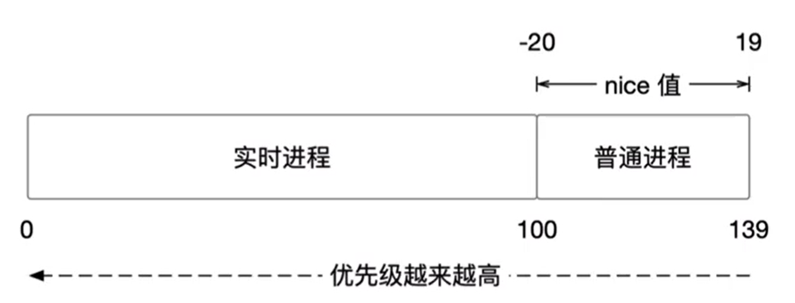
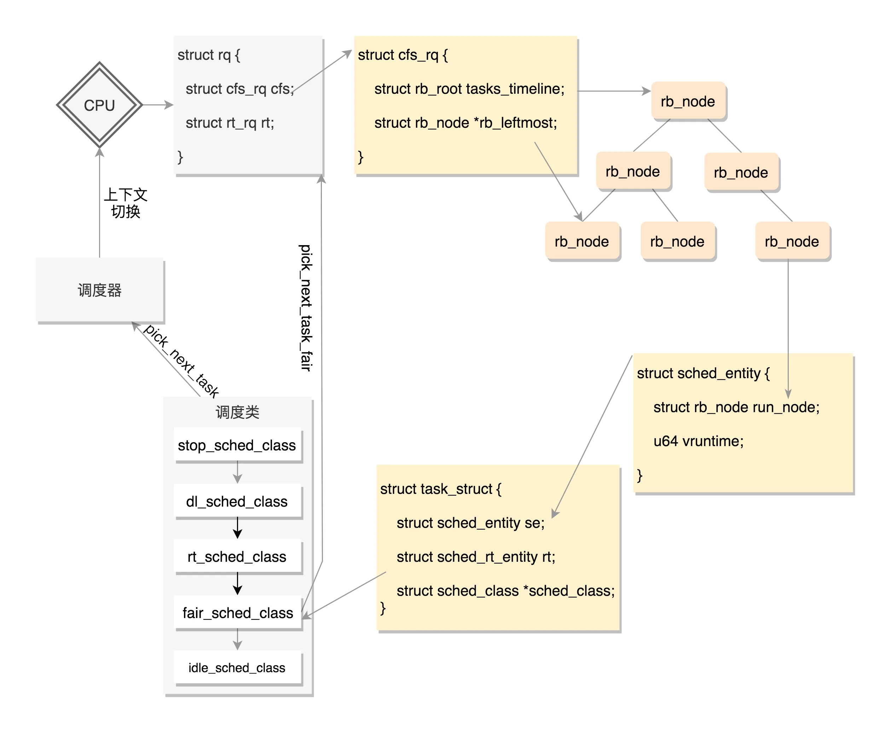

# 进程调度

操作系统的重要职责就是对各类进程进行合理的调度，有效分配CPU的时间，既要保证进程得到最快的响应，也要保证进程之间的公平性。

Linux内核是多任务的操作系统，能并发地执行多个进程。但是单个CPU在某段时间内只能运行一个进程，内核为每个进程分配一小段非常短的时间片，并让不同的进程切换执行，造成了多进程并发运行的假象。在当前进程时间片用完之前，其他进程可能处于睡眠或阻塞状态。

!!! info "抢占式多任务操作系统"

	一个进程在使用完其分配的时间片之前，可能会被调度程序强制挂起而运行其他的进程，这被称为是抢占。

## 操作系统的分类

1. 批处理系统(Batch Processing System)：用户将一批作业提交给操作系统后就不再干预，由操作系统控制它们自动运行。

2. 实时系统(Real-Time System)：实时系统保证计算的正确性以及程序的实时响应，一般应用在航天、汽车工业等。

3. 分时系统(Time Sharing System)：分时系统将计算机的资源进行时间上的分割，每个时间段称为一个时间片，每个用户依次轮流使用时间片。

Linux属于分时系统，也是目前互联网服务器的主流。

## 进程的分类

进程可以被分为{==I/O消耗型==}和{==处理器消耗型==}。前者指进程的大部分时间用来提交或者是等待I/O请求，这样的进程通常处于可运行状态，但只运行很短的时间就进入阻塞状态。比如图形界面程序就是典型的I/O消耗型程序，它们大部分时间都在等待来自鼠标或者是键盘的交互。

相反，处理器消耗型进程把时间大多用在执行代码上，它们通常连续不断地运行。比如某个程序从0开始一直不停地打印数字，这就是一个处理器消耗型进程。从系统性能的角度考虑，调度器应降低处理器消耗型进程的调度频率，而延长其运行时间。对于I/O消耗型进程应做到尽快调度运行。

调度策略实际上就是在两个矛盾的目标中间寻找平衡：进程响应速度和处理器利用率。Linux为了保证交互式应用和桌面系统的性能，对进程的响应做了优化，更倾向于优先调度I/O消耗型进程运行。

想象一下这样一个场景：在系统中有两个可运行的进程，一个是文字编辑程序，另一个是视频编码程序。前者是I/O消耗型，后者是处理器消耗型。用户总是希望文字编辑程序能够得到立刻响应——从键盘上输入一个字符就能马上显示在屏幕上，而视频解码程序的运行对于用户是无感知的，所以对响应时间要求没有那么高。

在理想情况下，我们希望文字编辑程序在被唤醒时能够立刻抢占视频解码程序，这样才能确保其良好的交互性能。在多数操作系统中，上述目标的达成是通过给文字编辑器分配更高的优先级以及更多的时间片实现的。Linux操作系统采用了不同的方法——分配一个给定的处理器使用比例。如果这两个程序的权重相同，则共享50%的处理器时间。但因为文本编辑程序肯定用不到这么多，于是当其被唤醒时，调度器注意到它的处理器时间比远小于50%，为了兑现进程公平分享处理器时间的承诺，它将立刻抢占视频解码程序。在处理了用户的输入后，又进入到睡眠状态。于是文本编辑程序总是在被需要时投入运行，而视频解码程序只能在剩下的时刻运行。

## 进程优先级

根据进程的重要性，通常可以分为实时进程和普通进程。由于实时进程对于时间的响应要求比较高，因此其优先级会比普通进程高。

在内核中，`task_struct`中有若干和进程优先级有关的成员：
```C
int prio, static_prio, normal_prio;
unsigned int rt_priority;
unsigned int policy;
```

### 调度策略

policy成员记录了该进程的调度策略。

### 静态优先级

static_prio表示静态优先级，特点是：

1. 值越小，进程优先级越高
2. 0 ~ 99用于实时进程(无实际意义)，100 ~ 139用于普通进程
3. 子进程继承父进程的静态优先级

静态优先级是所有其他优先级计算的起点，一改全改。

### 实时优先级

rt_priority表示实时优先级，0是普通进程，1 ~ 99是实时进程，99为最高优先级。

### 归一优先级

normal_prio表示归一优先级，根据静态优先级、实时优先级和调度策略计算得出。一个线程的normal_prio越小，其优先级越大。

### 动态优先级

prio表示动态优先级，也就是调度器在进程调度时使用的那个优先级。动态优先级可以被修改，比如在处理优先级翻转问题的时候，系统可能会临时提升一个普通进程的优先级。

!!! abstract

	实时进程与普通进程都拥有静态优先级[1~139]，两者都通过转换变为动态优先级，方式为：实时进程直接反转实时优先级，普通进程就等于静态优先级。



## 基本调度算法

调度算法经历了从简单到复杂的演进，目前没有一个调度算法是万能的，抛开场景来评判调度算法的优劣不可取。以下介绍了一些调度算法的思想，工程上使用的调度算法往往是多种算法的变形。

### 先来先服务

先来先服务是最简单的调度算法，哪个进程先来就先占用CPU，释放CPU之后再让第二个进程执行。该调度算法的缺点是如果先来一个耗时的进程，那么后续的进程都必须等待其执行完毕才能被调度，最终导致周转时间拉长。

### 最短任务优先

最短任务优先的思想是当多个进程同时出现时，优先安排执行时间最短的任务。该算法改善了周转时间的问题，但是太过理想化，因为大部分的场景下，进程都有个先来后到的顺序，而不是一起出现，更何况进程的运行时间难以预测。

### 抢占式最短任务优先

该方法改善了最短任务优先算法，增加了抢占式调度的功能，允许运行时间短的进程抢占运行时间长的进程。缺点是会造成运行时间长的进程饥饿现象。

### 时间片轮转

时间片轮转是最为经典的调度算法，它将CPU按照时钟脉冲进行切割，在一个时间片内CPU分配给一个进程，若时间片耗尽则调度选择下一个进程，即使进程没有执行完毕。

这种调度算法需要进程多次获取时间片才能完成任务，操作系统需要进行大量的上下文切换，这种切换非常消耗资源。因此时间片轮转算法就是找到一种平衡：上下文切换次数不能过多，同时进程响应时间不能太长。

### 多级反馈队列

多级反馈队列是一种里程碑式的调度算法，它旨在解决响应时间和周转时间的矛盾，具体做法是：

- 设置多个任务队列，每个队列的优先级不同
- 优先分配CPU给高优先级队列，同优先级队列中的任务采用轮转算法
- 追踪进程的运行状态来动态调整优先级，如果：

	- 进程在执行期间有较多I/O请求和等待，预测为交互进程，优先级保持或提升
	- 进程在执行期间有较多CPU计算，预测为非交互进程，优先级保持或下降

- 高优先级队列往往是I/O密集型任务，配置较小的时间片来保障响应时间
- 低优先级队列往往是CPU密集型任务，配置较长的时间片来保障运行时间

## 内核调度算法

### 调度器类

Linux调度器以模块的形式提供，允许不同类型的进程有针对性地选择调度算法。这种模块结构就被称为{==调度器类==}，在`task_struct`中，就有定义：

```C
const struct sched_class *sched_class;
```

`sched_class`有几种实现：

- `stop_sched_class`：优先级最高的任务
- `dl_sched_class`：对应SCHED_DEADLINE调度策略
- `rt_sched_class`：对应SCHED_FIFO和SCHED_RR调度策略
- `fair_sched_class`：对应SCHED_NORMAL和SCHED_BATCH调度策略
- `idle_sched_class`：对应SCHED_IDLE调度策略

!!! tip

	在选择下一个可运行进程时，内核调度器会按照优先级顺序依次遍历所有调度器类，直到在那个调度器类上找到一个可运行进程为止。

### CFS调度策略

完全公平调度策略在保证系统整体性能的前提下，将每个进程的运行时间平均分配，即每个进程能获得1/n的处理器时间——n为可运行进程的数量。`nice`值被作为进程获得的处理器运行比的权重，越高的`nice`值获得更低的处理器使用时间。调度器建立了`nice`值和权重的关系：

```C
const int sched_prio_to_weight[40] = {
/* -20 */     88761,     71755,     56483,     46273,     36291,
/* -15 */     29154,     23254,     18705,     14949,     11916,
/* -10 */      9548,      7620,      6100,      4904,      3906,
/*  -5 */      3121,      2501,      1991,      1586,      1277,
/*   0 */      1024,       820,       655,       526,       423,
/*   5 */       335,       272,       215,       172,       137,
/*  10 */       110,        87,        70,        56,        45,
/*  15 */        36,        29,        23,        18,        15,
};
```

这些值是通过实验和统计分析得出的，目的是为了实现一个合理的、能够平衡系统负载和进程优先级的调度策略。

!!! note

	普通进程的静态优先级范围是[100,139]，减去120就是nice值的范围[-20,19]，因此sched_prio=0相当于static_prio=120。

你一定注意到，如果一个系统中可运行进程趋于无穷呢？那么每个进程获得的处理器使用时间不就趋于0了么？为此，CFS规定了每个进程获得的时间片底线，这个底线称为{==最小粒度==}——默认为1ms。也就是说进程一旦被调度，都至少运行1ms时间。通常情况下，一个系统中可运行进程的数量是有限的，无疑，这时CFS可谓是相当公平。

### RT调度策略

Linux提供了两种实时调度策略：{==SCHED_FIFO==}和{==SCHED_RR==}。普通的、非实时的调度策略是SCHED_NORMAL。实时调度策略的实现在文件<kernel/sched_rt.c\>中。

SCHED_FIFO实现了一种简单的、先入先出的调度算法。它没有时间片的概念，只要一个SCHED_FIFO级别的进程处于可执行状态，它就会一直运行下去。直到它自己阻塞或者主动释放处理器为止。只有更高优先级的SCHED_FIFO或者SCHED_RR任务才能抢占SCHED_FIFO任务。

SCHED_RR是带有时间片的SCHED_FIFO，同一优先级的任务轮换执行，高优先级可以抢占低优先级。

这两种实时算法实现的都是静态优先级。内核不为实时进程计算动态优先级，这可以保证高优先级的实时进程总能抢占低优先级的实时进程。

实时优先级范围从0到MAX_RT_PIRO-1。默认情况下，MAX_RT_PRIO为100。

!!! warning

	Linux的实时调度算法是一种软实时的工作方式，对于实时任务的调度不做任何保证。


### DL调度策略

有一类进程比实时进程和普通进程的优先级更高，这类进程的特点是每隔固定的周期都会起来干活，需要一定的时间处理自己的事务，比如典型的系统定时器中断函数。

为了应对这种需求，3.14内核引入了一类新的进程叫做deadline进程，这类进程的调度策略是{==SCHED_DEADLINE==}。每个周期到来之时，调度器都要优先处理该deadline进程对于CPU时间的需求，然后在指定的deadline时间内调度该进程运行。


### IDLE调度策略

idle类进程的优先级非常低，实在没有进程运行时才会考虑idle类的进程。

## CFS的实现

### 时间记账

CFS使用调度器实体结构`struct sched_entity`来追踪进程运行时间：

```C
struct sched_entity {
	/* For load-balancing: */
	struct load_weight		load;
	struct rb_node			run_node;
	struct list_head		group_node;
	unsigned int			on_rq;

	u64				exec_start;
	u64				sum_exec_runtime;
	u64				vruntime;
	u64				prev_sum_exec_runtime;

	u64				nr_migrations;

#ifdef CONFIG_FAIR_GROUP_SCHED
	int				depth;
	struct sched_entity		*parent;
	/* rq on which this entity is (to be) queued: */
	struct cfs_rq			*cfs_rq;
	/* rq "owned" by this entity/group: */
	struct cfs_rq			*my_q;
	/* cached value of my_q->h_nr_running */
	unsigned long			runnable_weight;
#endif

#ifdef CONFIG_SMP
	/*
	 * Per entity load average tracking.
	 *
	 * Put into separate cache line so it does not
	 * collide with read-mostly values above.
	 */
	struct sched_avg		avg;
#endif
};
```

该结构体作为一个se的成员变量，嵌入到进程描述符`struct task_struct`中。

vruntime变量存放进程的虚拟运行时间，该变量由系统定时器周期性调用`update_curr()`函数更新。事实上，一个完美的多任务处理器，会保证所有进程的vruntime值一致。而CFS调度算法的核心就是选择具有最小vruntime的任务。那么问题就变成了如何找到最小vruntime值的进程？

内核使用红黑树来存储系统中所有可运行进程，其中节点的键值就是vruntime值。所有进程中vruntime值最小的那个，就是红黑树中最左侧的叶子节点。于是CFS的进程调度算法可简单总结为“运行rbtree中最左边叶子节点所代表的那个进程”。实现这一过程的函数是`__pick_next_entity()`。

每当有一个进程变为可运行状态或者是`fork()`第一次创建进行时，内核都会调用`enqueue_entity()`函数将该进程插入到红黑树中。而当进程变为不可运行状态或者终止时，内核调用`dequeue_entity()`函数将该进程从红黑树中删除。

### 调度器入口

进程调度的触发函数是`schedule()`，该函数会调用`pick_next_task()`函数选择下一个要运行的进程。`pick_next_task()`以优先级为序，从高到低依次检查每一个调度类，并且从最高优先级的调度类中，选择最高优先级的进程。

```C
asmlinkage __visible void __sched schedule(void)
{
	struct task_struct *tsk = current;

	sched_submit_work(tsk);
	do {
		preempt_disable();
		__schedule(SM_NONE);
		sched_preempt_enable_no_resched();
	} while (need_resched());
	sched_update_worker(tsk);
}
```

```C
static inline struct task_struct *
__pick_next_task(struct rq *rq, struct task_struct *prev, struct rq_flags *rf)
{
	const struct sched_class *class;
	struct task_struct *p;

	/*
	 * Optimization: we know that if all tasks are in the fair class we can
	 * call that function directly, but only if the @prev task wasn't of a
	 * higher scheduling class, because otherwise those lose the
	 * opportunity to pull in more work from other CPUs.
	 */
	if (likely(prev->sched_class <= &fair_sched_class &&
		   rq->nr_running == rq->cfs.h_nr_running)) {

		p = pick_next_task_fair(rq, prev, rf);
		if (unlikely(p == RETRY_TASK))
			goto restart;

		/* Assume the next prioritized class is idle_sched_class */
		if (!p) {
			put_prev_task(rq, prev);
			p = pick_next_task_idle(rq);
		}

		return p;
	}

restart:
	put_prev_task_balance(rq, prev, rf);

	for_each_class(class) {
		p = class->pick_next_task(rq);
		if (p)
			return p;
	}

	/* The idle class should always have a runnable task: */
	BUG();
}
```

### 睡眠与唤醒

睡眠的进程处于一个特殊的不可执行状态，常见原因就是在等待文件I/O。内核将需要睡眠的进程标记为睡眠状态，从红黑树中移除，加入等待队列，然后调用`schedule()`选择下一个进程。

等待队列是由等待某些事件发生的进程组成的简单链表。内核用`wait_queue_head_t`来表示等待队列。等待队列可以通过`DECLARE_WAITQUEUE()`静态创建或者是`init_waitqueue_head()`动态创建。

等待事件有以下函数：

```C title="include/linux/wait.h"
int wait_event(wait_queue_head_t q, int condition);
int wait_event_interruptible(wait_queue_head_t q, int condition);
int wait_event_timeout(wait_queue_head_t q, int condition, unsigned int timeout);
int wait_event_interruptible_timeout(wait_queue_head_t q, int condition, unsigned int timeout);
```

- condition == 0：休眠
- condition == 1：唤醒

它们都用于将进程加入到等待队列，直到某个事件发生。"interruptible"表示可以被信号唤醒，"timeout"表示等待超时时间。


唤醒操作通过`wake_up()`/`wake_up_interruptible()`完成，它将等待队列中的进程唤醒，将其设置为TASK_RUNNING状态，并加入到红黑树中。`wake_up_process()`用于唤醒特定的进程。

需要注意的是，`wake_up()`函数会将所有等待队列中的进程唤醒，如果这些进程需要争抢资源，则会引发严重的性能问题。替代方法是{==独占等待==}。

## 调度队列与调度实体

`task_struct`中包含了多种调度实体：

```C
struct sched_entity se;     //CFS调度实体
struct sched_rt_entity rt;  //RT调度实体
struct sched_dl_entity dl;  //dl调度实体
```

每个CPU都挂载了一个`struct rq`结构体，用于描述在此CPU上所运行的所有进程。在调度时，调度器会先去高优先级队列查找是否有进程需要运行，如果没有才会去低一级优先级的队列中查找。

```C
struct rq {
  /* runqueue lock: */
  raw_spinlock_t lock;
  unsigned int nr_running;
  unsigned long cpu_load[CPU_LOAD_IDX_MAX];
......
  struct load_weight load;
  unsigned long nr_load_updates;
  u64 nr_switches;


  struct cfs_rq cfs;
  struct rt_rq rt;
  struct dl_rq dl;
......
  struct task_struct *curr, *idle, *stop;
......
};
```

CFS调度队列的定义如下：

```C
/* CFS-related fields in a runqueue */
struct cfs_rq {
  struct load_weight load;
  unsigned int nr_running, h_nr_running;


  u64 exec_clock;
  u64 min_vruntime;
#ifndef CONFIG_64BIT
  u64 min_vruntime_copy;
#endif
  struct rb_root tasks_timeline;
  struct rb_node *rb_leftmost;


  struct sched_entity *curr, *next, *last, *skip;
......
};
```

对于每个调度队列，内核提供了调度类来实现自己的调度方法，它的定义如下：

```C
struct sched_class {
    const struct sched_class *next;


    void (*enqueue_task) (struct rq *rq, struct task_struct *p, int flags);
    void (*dequeue_task) (struct rq *rq, struct task_struct *p, int flags);
    void (*yield_task) (struct rq *rq);
    bool (*yield_to_task) (struct rq *rq, struct task_struct *p, bool preempt);


    void (*check_preempt_curr) (struct rq *rq, struct task_struct *p, int flags);


    struct task_struct * (*pick_next_task) (struct rq *rq, struct task_struct *prev, struct rq_flags *rf);
    void (*put_prev_task) (struct rq *rq, struct task_struct *p);


    void (*set_curr_task) (struct rq *rq);
    void (*task_tick) (struct rq *rq, struct task_struct *p, int queued);
    void (*task_fork) (struct task_struct *p);
    void (*task_dead) (struct task_struct *p);


    void (*switched_from) (struct rq *this_rq, struct task_struct *task);
    void (*switched_to) (struct rq *this_rq, struct task_struct *task);
    void (*prio_changed) (struct rq *this_rq, struct task_struct *task, int oldprio);
    unsigned int (*get_rr_interval) (struct rq *rq, struct task_struct *task);
    void (*update_curr) (struct rq *rq)
}
```

内核的的调度类：

```C
extern const struct sched_class stop_sched_class;
extern const struct sched_class dl_sched_class;
extern const struct sched_class rt_sched_class;
extern const struct sched_class fair_sched_class;
extern const struct sched_class idle_sched_class;
```

这些不同的调度类被放在一个链表中，在`pick_next_task()`函数中，for_each_class循环会依次遍历每个调度类，选择合适的进程运行。

```C
for_each_class(class){
    p = pick_next_task(rq, prev, rf);
    ...
}
```

于是整个运行场景就是，在每个CPU上有一个队列rq，这个队列里面包含多个子队列，例如rt_rq和cfs_rq，不同的队列实现了不同的方法。当CPU需要寻找下一个任务执行时，会按照优先级依次调用调度类，不同的调度类操作不同的队列。当rt_sched_class被调用时，它会在rt_rq上查找下一个任务。如果找不到就会轮到fair_sched_class，它会在cfs_rq上查找下一个任务。



## 抢占与上下文切换

调度分为{==主动调度==}与{==抢占式调度==}。主动调度一般发生在进程在等待某个事件的过程中，主动让出CPU，让内核选择下一个进程去运行。不管哪种调度，最后都会触发{==上下文切换==}。

所谓上下文切换，就是从一个可执行进程切换到另一个可执行进程的过程，由`context_switch()`函数负责执行，当触发进程调度时，就会调用该函数。它主要完成两件事：

- 切换虚拟内存空间
- 切换处理器状态，包括保存上一个进程的栈和寄存器信息，还有其他与体系结构相关的状态信息。

> 更详细的内容可以参考：https://blog.csdn.net/weixin_42135087/article/details/106479984。

内核提供了`need_resched`标志来表明是否需要重新执行一次调度。当某个进程应该被抢占时，该标志就会被设置，内核会在适当的时机调用`schedule()`函数，触发进程调度。`need_resched()`函数用来检查这个标志的值，如果被设置就返回真。

### 用户抢占

当内核即将返回用户空间时，如果`need_resched`标志被设置，就会导致`schedule()`函数被调用，此时就会发生用户抢占。从内核返回用户空间是安全的，既然它可以继续执行当前进程，它当然也可以去调度一个新的进程运行。不论是从内核态返回还是从中断返回，`need_resched`标志都会被检查。

### 内核抢占

对于不支持内核抢占的操作系统而言，内核代码可以一直执行直到它完成为止。而Linux支持内核抢占——只要重新调度是安全的。相对于用户抢占，内核抢占显然首先需要保证安全性，为此Linux引入了`preempt_count`计数器，初始值为0。每当使用锁的时候数值加1，释放锁的时候数值减1。从中断返回内核空间的时候，内核会同时检查`need_resched`和`preempt_count`标志：如果`need_resched`被设置，并且`preempt_count`为0，才会调用`schedule()`函数。

## 调度相关的用户接口

| 系统调用 | 描述 |
|--|--|
| nice | 设置进程的`nice`值 |
| getpriority | 获取进程的优先级 |
| setpriority | 设置进程的优先级 |
| sched_setscheduler | 设置进程的调度策略 |
| sched_getscheduler | 获取进程的调度策略 |
| sched_setparam | 设置进程的实时优先级 |
| sched_getparam | 获取进程的实时优先级 |
| sched_get_priority_max | 获取进程的调度策略的最大优先级 |
| sched_get_priority_min | 获取进程的调度策略的最小优先级 |
| sched_rr_get_interval | 获取进程的时间片长度 |
| sched_setaffinity | 设置进程的处理器亲和性 |
| sched_getaffinity | 获取进程的处理器亲和性 |
| sched_yield | 主动让出处理器 |

Linux调度程序提供强制的处理器绑定机制，可以让进程强制运行在某个处理器上。这种强制的亲和性保存在`task_struct`的`cpus_allowed`这个位掩码标志中。每一位都对应一个系统可用的处理器。默认情况下，所有位都被设置以允许进程在系统的所有处理器上执行。

Linux提供了两个最全的接口函数，可以完成上述接口的所有功能：

```C
int sched_setattr(pid_t pid, const struct sched_attr *attr, unsigned int flags);
int sched_getattr(pid_t pid, const struct sched_attr *attr, unsigned int size, unsigned int flags); 
```

`struct sched_attr`结构体囊括了关于调度的一切控制参数：policy，nice，value，rt_priority，period，deadline等。

