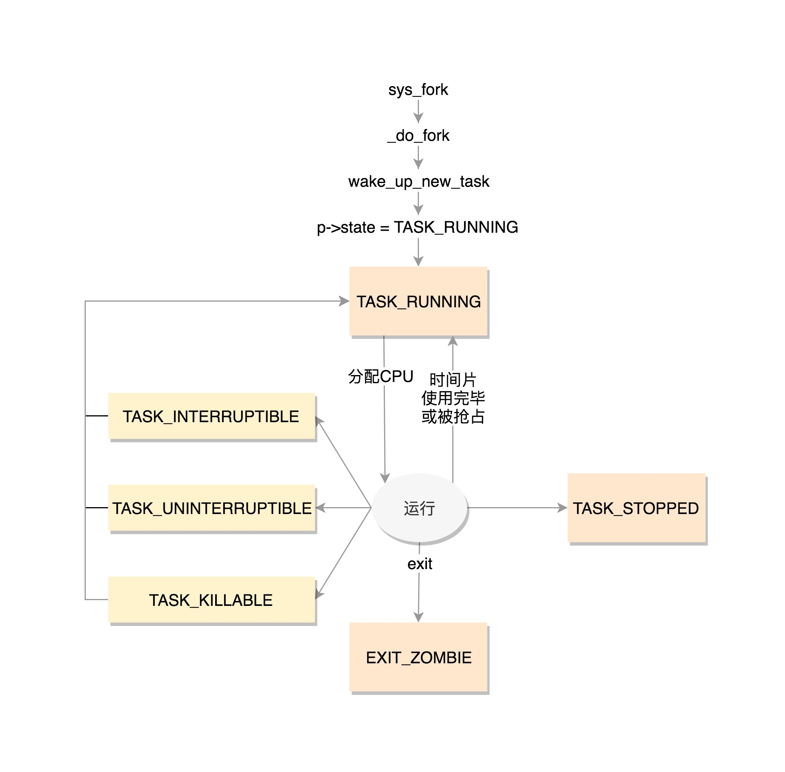

# 进程管理与调度

进程就是处于执行期的程序，当我们将代码编译成可执行文件时，输入./a.out，我们就开启了一个新的进程。进程从磁盘加载到内存的过程请参考[程序的装载](../../others/ld.md)。

一个进程相当于一个大型的项目组，这个项目组包含着许多资源，比如打开的文件信息，占用的内存空间，处理器的状态等。而线程就是项目组中执行具体任务的人。就像一个项目组至少得有一个人，一个进程必须得有一个主线程。你可以把所有的任务都交给主线程，但是大部分情况下，我们都会让把一个大的任务拆分成一个个小任务，然后另外开辟线程去处理它们。那么我们是否可以再创建几个进程去处理呢？可以，但是没有必要。首先，进程占用的资源空间很大，而线程是轻量级的，创建的速度非常快。其次，进程之间共享资源非常麻烦，而线程由于是同一个进程下的，他们可以共同访问某些资源。这就好比一个公司下面不同项目组之间交接工作容易扯皮，但是如果大家都在同一个项目组下相对来说就好很多。

## 进程描述符

为了管理进程，内核必须清晰地描述每一个进程。在Linux系统下，不管是进程还是线程，内核统一用task_struct结构体管理。这个结构体包含的成员非常复杂，我们一一分析。

### 进程状态

在task_struct中，涉及到进程状态的是这几个成员：

```C
 volatile long state;   
 int exit_state;
 unsigned int flags;
```

state可以取的值有：

```C
/* Used in tsk->state: */
#define TASK_RUNNING                    0
#define TASK_INTERRUPTIBLE              1
#define TASK_UNINTERRUPTIBLE            2
#define __TASK_STOPPED                  4
#define __TASK_TRACED                   8
/* Used in tsk->exit_state: */
#define EXIT_DEAD                       16
#define EXIT_ZOMBIE                     32
#define EXIT_TRACE                      (EXIT_ZOMBIE | EXIT_DEAD)
/* Used in tsk->state again: */
#define TASK_DEAD                       64
#define TASK_WAKEKILL                   128
#define TASK_WAKING                     256
#define TASK_PARKED                     512
#define TASK_NOLOAD                     1024
#define TASK_NEW                        2048
#define TASK_STATE_MAX                  4096
```

state字段的值用一个简单的赋值语句设置。

```C
p->state = TASK_RUNNING;
```

也可以使用set_task_state和set_current_state宏：它们分别设置指定进程的状态和当前执行进程的状态。

TASK_RUNNING表示进程正在执行或者准备执行。

当进程进入睡眠后，有两种状态：

TASK_INTERRUPTIBLE表示进程可以响应信号。也就是当一个信号来临时，唤醒该进程，然后执行信号处理函数。

TASK_UNINTERRUPTIBLE表示进程不可以响应信号。当进程等待某个事件完成而进入深度睡眠状态时，如果该事件因为某种原因无法完成，那么这个进程也将永远睡眠下去。

这是一个非常危险的事情，除非很有把握不然不会让进程进入深度睡眠态。

为了解决这个问题，有了一种新的状态：TASK_KILLABLE，可以终止的深度睡眠态。它的定义如下：

```C
#define TASK_KILLABLE (TASK_WAKEKILL | TASK_UNITERRUPTIBLE)
```

其中TASK_WAKEKILL表示在接收到致命信号时，唤醒进程。

TASK_STOPPED表示进程被暂停，当接收到SIGSTOP、SIGTSTP、SIGTTIN或SIGTTOU信号后，进入该状态。

TASK_TRACED表示进程被跟踪。这往往是调试程序暂时终止了进程的运行。

exit_state的取值有两种：

EXIT_ZOMBIE表示僵死状态。一个进程执行被终止，但是其父进程还没有调用*wait4()*或者*waitpid()*系统调用来回收资源时，进入该状态。

EXIT_DEAD是进程的最终状态。父进程回收子进程资源之后，进程由系统删除。

还有一些其他的状态，称为**标志**，放在flag字段中。

```C
#define PF_EXITING    0x00000004
#define PF_VCPU      0x00000010
#define PF_FORKNOEXEC    0x00000040
```

### 进程标识

Linux系统使用PID来标识一个进程，PID被顺序编号，新创建的进程的PID通常是前一个进程+1。但是PID的值有一个上限，系统管理员可以通过修改/proc/sys/kernel/pid_max文件的值来改变这个上限。这么一看似乎一个PID来唯一标识一个进程就够了，但是在task_struct中，涉及到进程标识的有以下几个成员。

```C
pid_t pid;
pid_t tgid;
struct task_struct *group_leader; 
```

你可能会疑惑，唯一标识一个进程，为什么需要用到这么多变量？这是因为之前提到，在Linux系统下，进程与线程并不特别区分，都是一个task_struct结构体。这就给管理带来了一些麻烦。比如我们希望同属于一个进程组的线程拥有共同的pid。当我们发送一个信号给指定pid时，我们希望这个信号能作用于该组中的所有线程。当杀死某个进程时，当然是连同该进程下的所有线程一起杀死，而不是只杀死了主进程，其他线程还在工作，这显然不合常理。事实上,POSIX标准也规定一个多线程应用程序的所有线程必须享有共同的pid。

遵照这个标准，Linux引入了线程组的概念。一个线程组中所有线程使用和该线程组领头线程（thread group leader）相同的pid，它被存入task_struct的tgid字段。当我们使用*getpid()*系统调用返回当前进程的pid时，返回的也是tgid的值。任何一个进程，如果只有主线程，那么pid = tgid， group_leader指向的就是自己。如果主线程创建了其他线程，那么每个线程都有自己的pid，但是tgid仍然是主线程。

### 进程间关系

进程之间有亲缘关系，如果一个进程创建了多个子进程，那么子进程之间还有兄弟关系。在task_struct中，使用以下字段来表示亲缘关系：

```C
struct task_struct __rcu *real_parent; /* real parent process */
struct task_struct __rcu *parent; /* recipient of SIGCHLD, wait4() reports */
struct list_head children;      /* list of my children */
struct list_head sibling;       /* linkage in my parent's children list */
```

这些字段根据名字就能猜到是什么意思。需要注意的是，通常情况下real_parent和parent是一样的，但是当我们启动GDB监视某个进程时，该进程的real_parent不变，但是parent变成了GDB。

进程之间还有其他关系，这里不详细展开。

### 运行统计

```C
u64        utime;//用户态消耗的CPU时间
u64        stime;//内核态消耗的CPU时间
unsigned long      nvcsw;//自愿(voluntary)上下文切换计数
unsigned long      nivcsw;//非自愿(involuntary)上下文切换计数
u64        start_time;//进程启动时间，不包含睡眠时间
u64        real_start_time;//进程启动时间，包含睡眠时间
```

### 内存管理

```C
struct mm_struct *mm;        
struct mm_struct *active_mm;            
```

### 文件与文件系统

```C
/* Filesystem information: */
struct fs_struct *fs;
/* Open file information: */
struct files_struct *files;
```

## 进程组织形式

要明白进程之间是如何组织的，首先要知道双向链表这个数据结构。双向链表就是同时有prev和next指针的链表，分别指向前一个和后一个元素。Linux使用双向链表将所有进程的描述符全部连接起来。

### 运行队列

当内核需要寻找一个新进程运行时，必须只考虑已处于TASK_RUNNING状态的进程，于是就有了运行队列。为了提高调度程序的运行速度，内核为每个优先级都维护了一个链表。在多处理器中，每个CPU都有自己的运行队列。运行队列是Linux调度算法的基础。更详细的内容请参考**进程调度**。

### 等待队列

等待队列在内核中有很多用途，尤其时用在中断处理、进程同步。运行中的进程往往需要等待某些事件的发生，希望等待特定事件的进程将自己放入合适的等待队列，然后进入睡眠状态。当事件发生后，由内核负责唤醒它们。

等待队列由双向链表实现，每个等待队列都有一个等待队列头（wait queue head），一个类型为wait_queue_head_t的数据结构：

```C
struct __wait_queue_head {
    spinlock_t lock;
    struct list_head task_list;
};

typedef struct __wait_queue_head wait_queue_head_t;
```

因为等待队列主要是由中断处理程序和内核函数修改的，因此必须有锁加以保护。等待队列链表中的元素为：

```C
struct __wait_queue {
    unsigned int flags;
    struct task_struct *task;
    wait_queue_func_t func;
    struct list_head task_list;
};
typedef struct __wait_queue wait_queue_t;
```

等待队列链表中的每个元素都代表一个睡眠中的进程，它的描述符存入task字段中。task_list负责将每一个元素链接到链表中。func表示等待队列中睡眠进程应该用什么方式唤醒。flags表示该进程是互斥进程还是非互斥进程。互斥进程表示多个进程在等待相同的事件，因此产生了竞争关系，此时内核只需要唤醒其中一个进程即可。而非互斥进程在发生指定事件后总是被唤醒。

等待队列的操作比较复杂，这里不详细展开，只讲一个比较重要的函数*sleep_on()*：这个函数将当前进程加入等待队列，并启动调度程序。

```C
void sleep_on(wait_queue_head_t *wq)
{
    wait_queue_t wait;  //声明一个等待队列元素
    init_waiqueue_entry(&wait, current);  //将current当前进程加入到wait中
    current->state = TAKS_UNINTERRUPTIBLE; //设置当前进程为深度睡眠态
    add_wait_queue(wq, &wait);  //将wait加入到等待队列wq中
    schedule();                //启动调度程序
    remove_wait_queue(wq, &wait);   //把当前进程从等待队列中删除
}
```

注意：在启动调度程序之前，调度器会记录当前进程上下文并保存至寄存器中，当该睡眠进程被唤醒时，调度程序从*sleep_on()*函数之前停止的位置继续执行——把该进程从等待队列删除。


## 进程生命周期

这里给出一张示意图方便理解。



## 进程切换

为了控制进程的运行，内核必须有能力挂起正在运行的进程，或者恢复以前挂起的进程。这种行为被称为进程切换（process switch）或上下文切换（context switch）。理解了进程切换，才有可能理解内核是如何对进程进行调度的。

### 硬件上下文

尽管每个进程拥有独立的虚拟地址空间，但所有进程都共享CPU的寄存器，因此在恢复一个进程执行之前，内核必须保证寄存器装入了挂起进程时的值。进程恢复执行前必须装入寄存器的一组数据称为*硬件上下文*（hardware context）。硬件上下文是进程执行上下文的一个子集，因为执行上下文包含进程执行需要的所有信息。

### thread字段

每个进程描述符包含一个类型为thread_struct的thread字段，只要进程被切换出去，内核就把其硬件上下文保存在这个结构中。这个数据结构包含了大量CPU寄存器信息。

### 执行进程切换

进程切换只会发生在以下两种情况：

1. 主动放弃CPU，调用*schedule()*函数。
2. 正在运行时，被更高优先级的进程抢占。

从本质上来说，进程切换有两个步骤：

1. 切换页全局目录以安装一个新的地址空间。
2. 切换内核态堆栈和硬件上下文。

进程切换由*switch_to*宏执行。该宏定义与体系结构密切相关。


