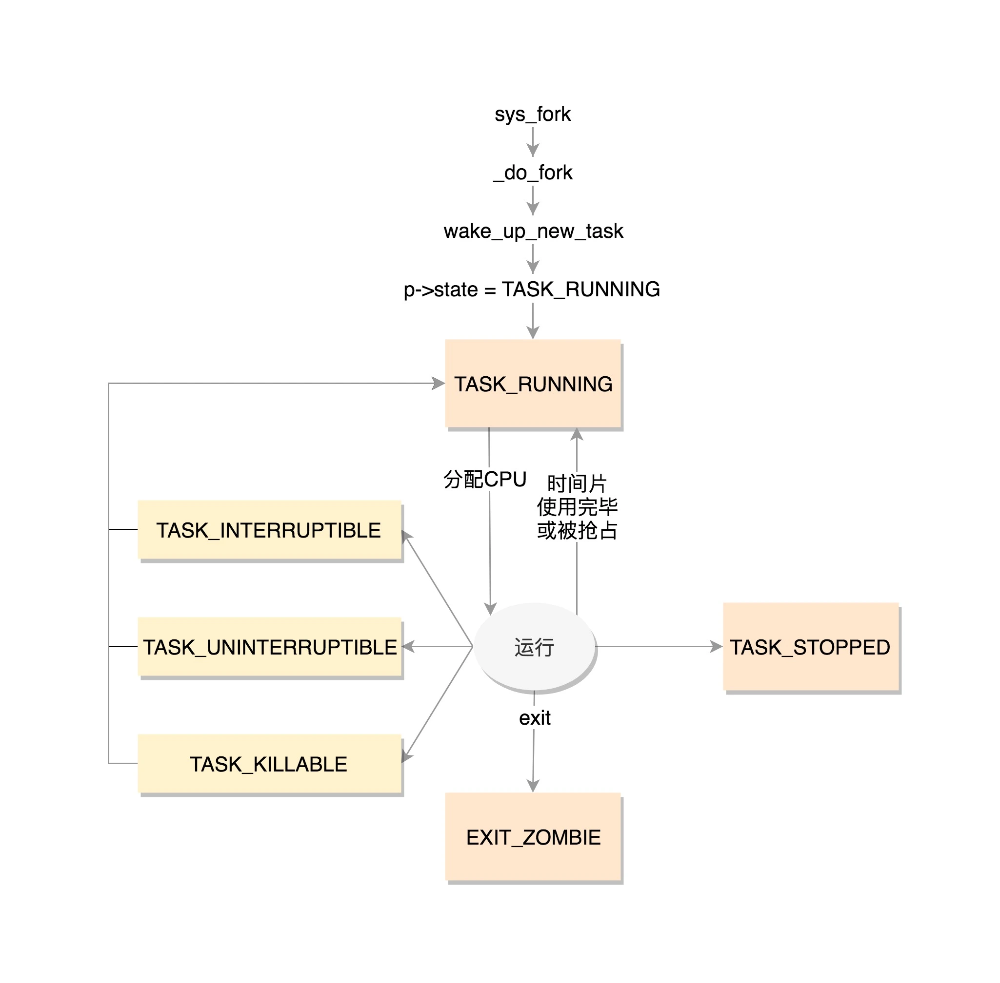

# 进程管理

进程就是处于执行期的程序，可以把一个进程想象成一个庞大的项目组，它包含了各种资源，例如打开的文件、占用的内存、处理器的状态等。而线程，就像是项目组中负责执行具体任务的个人。正如每个项目组至少需要一个人来执行任务，每个进程都必须有一个主线程。你可以选择将所有任务都交给主线程来完成，但在大多数情况下，我们会把一个大的任务分解成多个小任务，并创建额外的线程来并行处理这些小任务。那么，我们是否可以创建更多的进程来处理这些任务呢？从技术上来说，是可以的，但这通常并不是最佳选择。首先，进程占用的资源比线程多，而线程是轻量级的，创建的速度要快得多。其次，进程之间的资源共享相对复杂，而线程由于共享同一进程的资源，可以更容易地访问这些资源。这就像是在一个公司的不同项目组之间进行工作交接可能会很麻烦，但如果大家都属于同一个项目组，合作就会顺畅得多。

## 进程描述符

为了管理进程，内核必须清晰地描述每一个进程。在Linux系统下，不管是进程还是线程，内核统一用`task_struct`结构体管理。

### 内核栈

```C
void *stack;
```

每个进程都有一个专用的内核栈，用于保存进程在内核态执行时的临时数据和上下文信息。当创建新进程时，内核会为其分配一个合适大小的内核栈空间，并将其地址赋给`task_struct`中的stack成员。

### 线程描述符

线程描述符`struct thread_info`是一个用于存放线程相关信息、与体系结构相关的结构体，在ARM中的定义如下：

```C
struct thread_info {
	unsigned long		flags;		/* low level flags */
	int			preempt_count;	/* 0 => preemptable, <0 => bug */
	struct task_struct	*task;		/* main task structure */
	__u32			cpu;		/* cpu */
	__u32			cpu_domain;	/* cpu domain */
#ifdef CONFIG_STACKPROTECTOR_PER_TASK
	unsigned long		stack_canary;
#endif
	struct cpu_context_save	cpu_context;	/* cpu context */
	__u32			abi_syscall;	/* ABI type and syscall nr */
	__u8			used_cp[16];	/* thread used copro */
	unsigned long		tp_value[2];	/* TLS registers */
	union fp_state		fpstate __attribute__((aligned(8)));
	union vfp_state		vfpstate;
#ifdef CONFIG_ARM_THUMBEE
	unsigned long		thumbee_state;	/* ThumbEE Handler Base register */
#endif
};
```

它包含了很多与线程相关的字段，其中最重要的是`task`，它指向当前线程所属的进程描述符。内核提供了`current`宏可以直接访问当前CPU上正在运行的进程描述符，该宏本质上等于：

```C
current_thread_info()->task
```

### 进程状态

在`task_struct`中，涉及到进程状态的是这几个成员：

```C
 volatile long state;   
 int exit_state;
 unsigned int flags;
```

state可以取的值有：

```C
/* Used in tsk->state: */
#define TASK_RUNNING                    0
#define TASK_INTERRUPTIBLE              1
#define TASK_UNINTERRUPTIBLE            2
#define __TASK_STOPPED                  4
#define __TASK_TRACED                   8
/* Used in tsk->exit_state: */
#define EXIT_DEAD                       16
#define EXIT_ZOMBIE                     32
#define EXIT_TRACE                      (EXIT_ZOMBIE | EXIT_DEAD)
/* Used in tsk->state again: */
#define TASK_DEAD                       64
#define TASK_WAKEKILL                   128
#define TASK_WAKING                     256
#define TASK_PARKED                     512
#define TASK_NOLOAD                     1024
#define TASK_NEW                        2048
#define TASK_STATE_MAX                  4096
```

很明显可以看出，上述状态的设置是通过对应的位来实现的。

要改变进程的状态，可以使用`set_task_state`和`set_current_state`宏：前者用来设置指定进程的状态，后者用来设置当前进程的状态。

TASK_RUNNING表示进程正在执行或者准备执行。

!!! note

    在Linux中，TASK_RUNNING只是表示该进程已经准备好投入运行，而不是正在运行。内核调度的时候总是选择已处于TASK_RUNNING状态的进程去运行。

进程的睡眠状态有两种：

- TASK_INTERRUPTIBLE：浅睡眠状态，进程可以响应信号。也就是当一个信号来临时，唤醒该进程，然后执行信号处理函数。

- TASK_UNINTERRUPTIBLE：深睡眠状态，进程不可以响应信号。如果等待事件因为某种原因无法完成，那么这个进程将永远睡眠下去，比如等待I/O事件。

为了解决这个问题，有了一种新的状态：TASK_KILLABLE，可以终止的深睡眠状态。它的定义如下：`#define TASK_KILLABLE (TASK_WAKEKILL | TASK_UNITERRUPTIBLE)`。

其中TASK_WAKEKILL表示在接收到致命信号时，唤醒进程。

TASK_STOPPED表示进程被暂停，当接收到SIGSTOP、SIGTSTP、SIGTTIN或SIGTTOU信号后，进入该状态。

TASK_TRACED表示进程被跟踪。这往往是调试程序暂时终止了进程的运行。

{==exit_state==}的取值有两种：

- EXIT_ZOMBIE：僵尸状态。一个进程执行被终止，但是其父进程还没有调用`wait4()`或者`waitpid()`系统调用来回收资源时，进入该状态。

- EXIT_DEAD：进程退出的最终状态。父进程回收子进程资源之后，进程由系统删除。

进程的一些其他状态信息由`flags`控制，使用位掩码来表示不同的标记。一些常见的标记包括：

- 任务状态：例如是否正在运行、停止等
- 调度器相关：例如调度策略、优先级等
- 信号处理：例如挂起信号集
- 进程特性：是否为守护进程、是否允许被追踪等

flags成员的一些取值举例如下，这些宏以PF开头：

```C
#define PF_EXITING 0x00000004    //getting shut down
#define PF_WQ_WORKER 0x00000020  //I'm a workqueue worker
#define PF_KTHREAD 0x00200000    //I'm a kernel thread
```

### 进程标识

Linux系统使用pid来标识一个进程，pid被顺序编号，新创建的进程的pid通常是前一个进程+1。但是pid的值有一个上限，系统管理员可以通过修改/proc/sys/kernel/pid_max文件的值来改变这个上限。在`task_struct`中，涉及到进程标识的有以下几个成员。

```C
pid_t pid;
pid_t tgid;
struct task_struct *group_leader; 
```

!!! question "进程的标识"

    为什么标识一个进程，需要用到这么多成员？一个pid难道不够吗？

这是因为之前提到，在Linux系统下，进程与线程并不特别区分，都以`task_struct`结构体表示。这就给管理带来了一些麻烦。比如我们希望同属于一个进程组的线程拥有共同的pid。当我们发送终止信号给指定pid时，我们当然希望该进程以及下面的所有线程都收到该信号从而终止运行。事实上，POSIX标准中也规定一个多线程应用程序的所有线程必须享有共同的pid。

遵照这个标准，Linux引入了{==线程组==}的概念：主进程和创建的所有线程同属于一个线程组，它们共享tgid。

当我们使用`getpid()`系统调用返回当前进程的"pid"时，Linux其实耍了一个障眼法——它返回的是tgid的值。只有当调用`gettid()`时，返回的才是真实的pid值。任何一个进程，如果只有主进程，那么pid = tgid， group_leader指向的就是自己。如果主进程创建了其他线程，那么每个线程都有自己的pid，但是tgid是共有的。

### 进程间关系

Linux系统中所有的进程都是PID为1的{==init进程==}的后代，内核在系统启动的最后阶段启动init进程。该进程读取系统的初始化脚本并执行其他的相关程序，最后完成整个系统的启动。

每个进程必有一个父进程，如果一个进程创建了多个子进程，那么子进程之间还有兄弟关系。在`task_struct`中，使用以下字段来表示亲缘关系：

```C
struct task_struct __rcu *real_parent; /* real parent process */
struct task_struct __rcu *parent; /* recipient of SIGCHLD, wait4() reports */
struct list_head children;      /* list of my children */
struct list_head sibling;       /* linkage in my parent's children list */
```

这些字段根据名字就能猜到是什么意思。需要注意的是，通常情况下real_parent和parent是一样的，但是当我们启动GDB监视某个进程时，该进程的real_parent不变，但是parent变成了GDB。

进程之间还有其他关系，这里不详细展开。

### 运行统计

```C
u64        utime;//用户态消耗的CPU时间
u64        stime;//内核态消耗的CPU时间
unsigned long      nvcsw;//自愿(voluntary)上下文切换计数
unsigned long      nivcsw;//非自愿(involuntary)上下文切换计数
u64        start_time;//进程启动时间，不包含睡眠时间
u64        real_start_time;//进程启动时间，包含睡眠时间
```

这些统计信息用于性能分析，请查看[性能调优](../optimization/index.md)一节。

### 内存管理

```C
struct mm_struct *mm;        
struct mm_struct *active_mm;            
```

这些字段与[进程地址空间](./vma.md)相关。

### 文件与文件系统

```C
/* Filesystem information: */
struct fs_struct *fs;
/* Open file information: */
struct files_struct *files;
```

这些字段与[虚拟文件系统](./vfs.md)相关。

## 进程组织形式

要明白进程之间是如何组织的，首先要知道双向链表这个数据结构。双向链表就是同时有prev和next指针的链表，分别指向前一个和后一个元素。Linux使用双向链表将所有进程的描述符全部连接起来。

### 运行队列

当内核需要寻找一个新进程运行时，必须只考虑已处于TASK_RUNNING状态的进程，于是就有了运行队列。为了提高调度程序的运行速度，内核为每个优先级都维护了一个链表。在多处理器中，每个CPU都有自己的运行队列。运行队列是Linux调度算法的基础。更详细的内容请参考[进程调度](./sched.md/)。

### 等待队列

等待队列在内核中有很多用途，尤其是用在中断处理和进程同步。运行中的进程往往需要等待某些事件的发生，它可以主动将自己放入等待队列，然后进入睡眠状态。当事件发生后，由内核负责唤醒它们。

等待队列由双向链表实现，每个等待队列都有一个等待队列头（wait queue head），一个类型为`wait_queue_head_t`的数据结构：

```C
struct __wait_queue_head {
    spinlock_t lock;
    struct list_head task_list;
};

typedef struct __wait_queue_head wait_queue_head_t;
```

因为等待队列主要是由中断处理程序和内核函数修改的，因此必须有锁加以保护。等待队列链表中的元素为：

```C
struct __wait_queue {
    unsigned int flags;
    struct task_struct *task;
    wait_queue_func_t func;
    struct list_head task_list;
};
typedef struct __wait_queue wait_queue_t;
```

> flags：表示该进程是互斥还是非互斥进程。互斥进程表示多个进程在等待相同的事件，因此产生了竞争关系，此时内核只需要唤醒其中一个进程即可。而非互斥进程在发生指定事件后总是被唤醒。

> func：负责唤醒睡眠进程的函数。

> task_list：等待队列链表，链表中的每个元素都代表一个睡眠中的进程。

## 进程生命周期

进程的大致运行流程如下图所示：



### 进程创建

应用程序在用户空间创建进程有两种场景：

1. 子进程和父进程共享一个ELF文件
2. 子进程需要加载自己的elf文件，例如shell

为了应对这两个需求，内核采用了{==fork then exec==}两段式来创建进程。对于场景1，直接`fork()`即可；对于场景2，先`fork()`，然后再`exec()`。`fork()`用来拷贝当前进程并创建一个子进程，`exec()`负责读取可执行文件并将其载入地址空间开始运行。

完全复制一个父进程的资源开销非常大，特别是对于场景2，根本没有必要拷贝父进程的资源，因为新的进程会立即加载新的elf文件。不论是用户态还是内核态都存在着大量复制进程的操作，为了提升性能，Linux引入了{==写时拷贝==}(copy-on-write)技术，这意味着在创建进程时，内核并不复制整个进程地址空间，而是暂时让父子进程共享。只有在需要写入时，数据才会被复制，从而使得各个进程拥有自己的地址空间。这种优化可以避免大量根本就不会被使用的数据，从而使得进程的创建非常迅速。复制进程的主要开销都集中在了复制父进程的页表上。在特定场合下，如果连父进程页表也不想复制，则可以使用`vfork()`函数。

`fork()`函数底层由`clone()`系统调用实现，该函数更加灵活，可以通过设置一系列{==CLONE_FLAGS==}参数来指明父子进程需要共享的资源。Linux中进程与线程的最大区别就是在执行`clone()`系统调用时指定的共享资源不同。

线程在创建时传递的参数如下：

```C
clone(CLONE_VM | CLONE_FS | CLONE_FILES | CLONE_SIGHAND, 0);
```

上述代码指明了创建线程时需要共享地址空间、文件系统资源、文件描述符和信号处理程序。

相比之下，一个普通的`fork()`的实现：

```C
clone(SIGCHLD, 0);
```

### 进程终结

一个进程终结时，内核必须释放它所占用的资源并且告知父进程。一般来说，进程的终结是自身引起的，也可能是接收了一个不可忽略的信号或者是异常。

当进程相关联的所有资源都被释放后，它处于EXIT_ZOMBIE状态。该状态也被称为僵尸状态，它的进程描述符被保留，等待父进程使用`wait()`系列函数回收。

但是，如果父进程在子进程之前就退出了，那么必须有一个机制来保证子进程找到一个新的父进程，否则这些孤儿进程会永远处于僵尸状态，白白耗费资源。内核的解决办法是在当前线程组内找一个线程作为父进程，如果找不到，那就让init进程做父进程。


