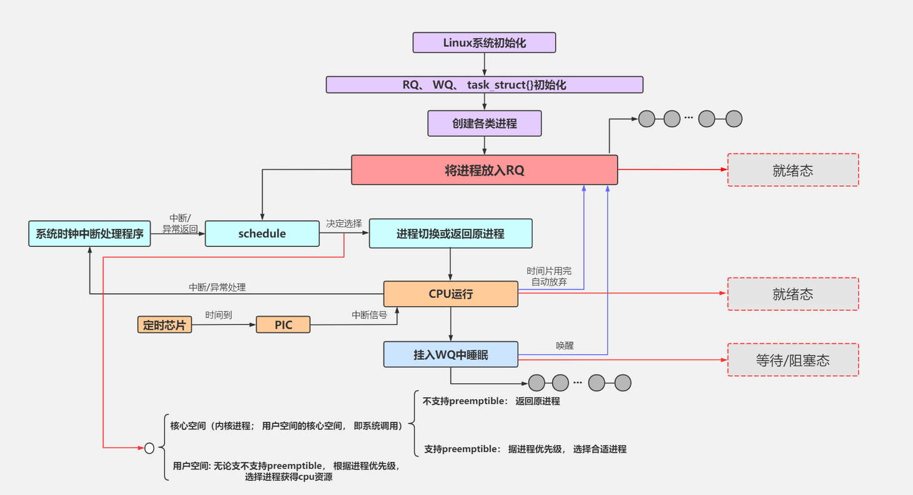

# 进程管理

一般而言，进程就是一个正在执行的程序，是由存储在磁盘上的二进制可执行文件，通过特殊的载入方法而运行起来成为进程。当程序成为进程的时候，它需要若干数据结构来描述程序的执行状态（硬件上下文和软件上下文）以及拥有的资源（如地址空间、打开的文件描述符等）。从内核的角度看，进程是一个和系统资源（CPU、内存等）分配相关的实体。

## 进程描述符

为了管理进程，内核必须清晰地描述每一个进程。在Linux系统下，不管是进程还是线程，内核统一用`task_struct`结构体管理。

### 进程标识

pid用来标识一个进程，它被顺序编号，新创建的进程的pid通常是前一个进程+1。在Linux系统中，`getpid()`函数的定义如下：

```C
asmlinkage long sys_getpid(void)
{
    return current->tgid;
}
```

tgid——thread group id，表示的是线程组的ID。在linux内核中，一个进程有多个线程组成，且进程和线程都是`task_struct`结构体，这就给管理带来了麻烦。

比如我们希望同属于一个进程组的线程拥有共同的pid。当我们发送终止信号给指定pid时，我们当然希望该进程以及下面的所有线程都收到该信号从而终止运行。事实上，POSIX标准中也规定一个多线程应用程序的所有线程必须享有共同的pid。

遵照这个标准，Linux引入了{==线程组==}的概念：主进程和创建的所有线程同属于一个线程组，它们共享tgid。

当我们使用`getpid()`系统调用返回当前进程的"pid"时，Linux其实耍了一个障眼法——它返回的是tgid的值。只有当调用`gettid()`时，返回的才是真实的pid值。任何一个进程，如果只有主进程，那么pid = tgid， group_leader指向的就是自己。如果主进程创建了其他线程，那么每个线程都有自己的pid，但是tgid是共有的。

### 进程状态

在`task_struct`中，涉及到进程状态的是这几个成员：

```C
volatile long state;   
int exit_state;
unsigned int flags;
```

state可以取的值有：

```C
/* Used in tsk->state: */
#define TASK_RUNNING                    0
#define TASK_INTERRUPTIBLE              1
#define TASK_UNINTERRUPTIBLE            2
#define __TASK_STOPPED                  4
#define __TASK_TRACED                   8
/* Used in tsk->exit_state: */
#define EXIT_DEAD                       16
#define EXIT_ZOMBIE                     32
#define EXIT_TRACE                      (EXIT_ZOMBIE | EXIT_DEAD)
/* Used in tsk->state again: */
#define TASK_DEAD                       64
#define TASK_WAKEKILL                   128
#define TASK_WAKING                     256
#define TASK_PARKED                     512
#define TASK_NOLOAD                     1024
#define TASK_NEW                        2048
#define TASK_STATE_MAX                  4096
```

TASK_RUNNING表示进程正在执行或者准备执行。

!!! note

    在Linux中，TASK_RUNNING只是表示该进程已经准备好投入运行，而不是正在运行。内核调度的时候总是选择已处于TASK_RUNNING状态的进程去运行。

进程的睡眠状态有两种：

- TASK_INTERRUPTIBLE：浅睡眠状态，进程可以响应信号。也就是当一个信号来临时，唤醒该进程，然后执行信号处理函数。

- TASK_UNINTERRUPTIBLE：深睡眠状态，进程不可以响应信号。如果等待事件因为某种原因无法完成，那么这个进程将永远睡眠下去，比如等待I/O事件。

为了解决这个问题，有了一种新的状态：TASK_KILLABLE，可以终止的深睡眠状态。它的定义如下：`#define TASK_KILLABLE (TASK_WAKEKILL | TASK_UNITERRUPTIBLE)`。

其中TASK_WAKEKILL表示在接收到致命信号时，唤醒进程。

TASK_STOPPED表示进程被暂停，当接收到SIGSTOP、SIGTSTP、SIGTTIN或SIGTTOU信号后，进入该状态。

TASK_TRACED表示进程被跟踪。这往往是调试程序暂时终止了进程的运行。

{==exit_state==}的取值有两种：

- EXIT_ZOMBIE：僵尸状态。一个进程执行被终止，但是其父进程还没有调用`wait4()`或者`waitpid()`系统调用来回收资源时，进入该状态。

- EXIT_DEAD：进程退出的最终状态。父进程回收子进程资源之后，进程由系统删除。

进程的一些其他状态信息由`flags`控制，使用位掩码来表示不同的标记。一些常见的标记包括：

- 任务状态：例如是否正在运行、停止等
- 调度器相关：例如调度策略、优先级等
- 信号处理：例如挂起信号集
- 进程特性：是否为守护进程、是否允许被追踪等

flags成员的一些取值举例如下，这些宏以PF开头：

```C
#define PF_EXITING 0x00000004    //getting shut down
#define PF_WQ_WORKER 0x00000020  //I'm a workqueue worker
#define PF_KTHREAD 0x00200000    //I'm a kernel thread
```

### 进程间关系

Linux系统中所有的进程都是PID为1的{==init进程==}的后代，内核在系统启动的最后阶段启动init进程。该进程读取系统的初始化脚本并执行其他的相关程序，最后完成整个系统的启动。

每个进程必有一个父进程，如果一个进程创建了多个子进程，那么子进程之间还有兄弟关系。在`task_struct`中，使用以下字段来表示亲缘关系：

```C
struct task_struct __rcu *real_parent; /* real parent process */
struct task_struct __rcu *parent; /* recipient of SIGCHLD, wait4() reports */
struct list_head children;      /* list of my children */
struct list_head sibling;       /* linkage in my parent's children list */
```

这些字段根据名字就能猜到是什么意思。需要注意的是，通常情况下real_parent和parent是一样的，但是当我们启动GDB监视某个进程时，该进程的real_parent不变，但是parent变成了GDB。

进程之间还有其他关系，这里不详细展开。

### 运行统计

```C
u64        utime;//用户态消耗的CPU时间
u64        stime;//内核态消耗的CPU时间
unsigned long      nvcsw;//自愿(voluntary)上下文切换计数
unsigned long      nivcsw;//非自愿(involuntary)上下文切换计数
u64        start_time;//进程启动时间，不包含睡眠时间
u64        real_start_time;//进程启动时间，包含睡眠时间
```

这些统计信息用于性能分析，请查看[性能调优](../optimization/index.md)一节。

### 内存管理

```C
struct mm_struct *mm;        
struct mm_struct *active_mm;            
```

这些字段的详细内容见[虚拟内存管理](./vma.md)。

### 文件与文件系统

```C
/* Filesystem information: */
struct fs_struct *fs;
/* Open file information: */
struct files_struct *files;
```

进程的文件位置等信息是由`fs_strcut`来描述的：

```C
struct fs_strcut {
	.......
	struct path root, pwd;
};

struct path {
	struct vfsmount *mnt;
	struct dentry *dentry;
};
```

`struct dentry`结构体是对一个目录项的描述，`fs_struct`中包含了进程的根目录和当前工作目录。

每个进程用`struct files_struct`来记录打开的文件描述符：

```C
struct files_struct {
	......
	struct fdtable __rcu *fdt;

	int next_fd;
};
```

`fdtable`数组的下标就是文件描述符，其中 0、1、2 总是分配给标准输入、标准输出、标准错误。

### 命名空间

命名空间是用来隔离进程的一种方式，进程只能看到与自己相关的一部分资源。

```C
struct nsproxy {
	atomic_t count;
	struct uts_namespace *uts_ns;
	struct ipc_namespace *ipc_ns;
	struct mnt_namespace *mnt_ns;
	struct pid_namespace *pid_ns;
	struct user_namespace *user_ns;
	struct net *net_ns;
	......
};
```

Linux 实现了多种不同的命名空间：

- UTS 命名空间：用来隔离主机名和域名
- IPC 命名空间：用来隔离进程间通信
- MNT 命名空间：用来隔离文件系统挂载点
- PID 命名空间：用来隔离进程ID
- USER 命名空间：用来隔离用户ID和组ID
- NET 命名空间：用来隔离网络资源

### 内核栈

```C
void *stack;
```

每个进程都有一个专用的内核栈，用于保存进程在内核态执行时的临时数据和上下文信息。当创建新进程时，内核会为其分配一个合适大小的内核栈空间，并将其地址赋给`task_struct`中的stack成员。

### 线程描述符

线程描述符`struct thread_info`是一个用于存放线程相关信息、与体系结构相关的结构体，在ARM中的定义如下：

```C
struct thread_info {
	unsigned long		flags;		/* low level flags */
	int			preempt_count;	/* 0 => preemptable, <0 => bug */
	struct task_struct	*task;		/* main task structure */
	__u32			cpu;		/* cpu */
	__u32			cpu_domain;	/* cpu domain */
#ifdef CONFIG_STACKPROTECTOR_PER_TASK
	unsigned long		stack_canary;
#endif
	struct cpu_context_save	cpu_context;	/* cpu context */
	__u32			abi_syscall;	/* ABI type and syscall nr */
	__u8			used_cp[16];	/* thread used copro */
	unsigned long		tp_value[2];	/* TLS registers */
	union fp_state		fpstate __attribute__((aligned(8)));
	union vfp_state		vfpstate;
#ifdef CONFIG_ARM_THUMBEE
	unsigned long		thumbee_state;	/* ThumbEE Handler Base register */
#endif
};
```

它包含了很多与线程相关的字段，其中最重要的是`task`，它指向当前线程所属的进程描述符。内核提供了`current`宏可以直接访问当前CPU上正在运行的进程描述符，该宏本质上等于：

```C
current_thread_info()->task
```

## 进程生命周期



### fork系统调用

`fork()`函数用来创建一个新的进程，Linux 6.1 版本对其进行了修改，之前的版本用`do_fork()`函数来实现：

```C title="linux-5.15:kernel/fork.c"
SYSCALL_DEFINE0(fork)
{
	return do_fork(SIGCHILD, 0, 0, NULL, NULL);
}
```

```C title="linux-6.1:kernel/fork.c"
SYSCALL_DEFINE0(fork)
{
	struct kernel_clone_args args = {
		.exit_signal = SIGCHLD,
	};

	return kernel_clone(&args);
}
```

无论是哪种实现，都需要传递一个 flag 参数，可以在<include/uapi/linux/sched.h\>中找到具体定义：

- CLONE_VM：表示共享地址空间。
- CLONE_FILES：表示共享文件描述符
- CLONE_FS：表示共享文件系统信息

两种版本都会调用`copy_process()`函数来创建新的进程，然后调用`wake_up_new_task()`函数将新的进程添加到运行队列中：

```C
static struct task_struct *copy_process(...)
{
	const u64 clone_flags = args->flags;
	struct nsproxy *nsp = current->nsproxy;
	......

	//1.复制task_struct
	struct task_struct *p;
	p = dup_task_struct(current);
	......

	//2.复制files_struct
	retval = copy_files(clone_flags, p);

	//3.复制fs_struct
	retval = copy_fs(clone_flags, p);

	//4.复制mm_struct
	retval = copy_mm(clone_flags, p);

	//5.复制namespaces
	retval = copy_namespaces(clone_flags, p);

	//6.申请PID号
	pid = alloc_pid(p->nsproxy->pid_ns_for_children, ...);
	p->pid = pid_nr(pid);
	if(clone_flags & CLONE_THREAD){
		p->tgid = current->tgid;
	}else{
		p->tgid = p->pid;
	}
	......
}
```

对于线程来说，与进程最重要的区别就是会不会拷贝父进程的地址空间。这是 Linux 系统中进程与线程的根本区别。


