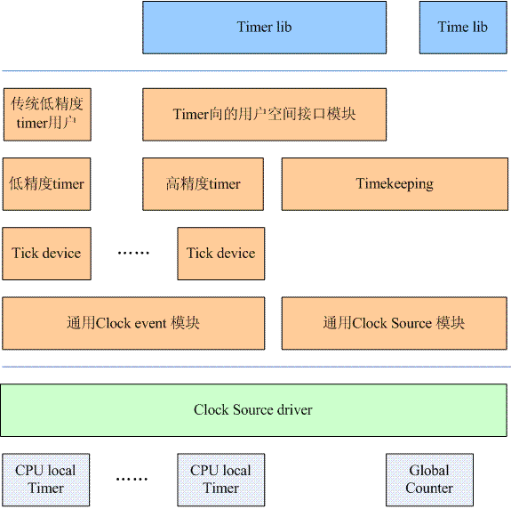

# 时间子系统

Linux采用了1970年1月1日0点0分0秒作为基准点(epoch)。

## 不同精度的时间

基于秒的时间定义：`typedef long time_t`。

基于微秒的时间定义：

```C
struct timeval {
    time_t tv_sec;
    suseconds_t tv_usec;
};
```

基于纳秒的时间定义：

```C
struct timespec {
    time_t tv_sec;
    long tv_nsec;
};
```

## 软件架构



如图所示，timer的功能被分成了两块：

- Global Counter：全局计数器，不属于任何一个CPU
- CPU Local Timer：CPU本地计数器

## 文件列表

| 文件名 | 描述 |
| ---- | ---- |
| time.c | 用户空间的接口 |
| timer.c | 低精度timer模块 |
| hrtimer.c | 高精度timer模块 |
| itimer.c | 周期性timer模块 |
| posix-timer.c | POSIX timer模块 |
| posix-clock.c | POSIX clock模块 |
| alarmtimer.c | alarm timer模块 |

## 用户空间接口

从应用程序的角度来看，对于时间相关的服务要求主要有三种：

1. 获取系统时间
2. 进程睡眠操作
3. 设置定时器事件

### 系统时间

1.秒级别的时间函数

```C
#include <time.h>

time_t time(time_t *t);

int stime(time_t *t);
```

`time()`函数返回当前时间点到epoch的秒数，`stime()`设定当前时间点到epoch的秒数。

2.微妙级别的时间函数

```C
#include <sys/time.h>

int gettimeofday(struct timeval *tv, struct timezone *tz);

int settimeofday(const struct timeval *tv, const struct timezone *tz);
```

这两个函数与上面类似，只不过精度可以达到微妙级别。

3.纳秒级别的时间函数

```C
#include <time.h>

int clock_getres(clockid_t clk_id, struct timespec *res);

int clock_gettime(clockid_t clk_id, struct timespec *tp);

int clock_settime(clockid_t clk_id, const struct timespec *tp);
```

clock ID为系统时钟的参数，定义如下：

| 时钟 | 描述 |
| ---- | ---- |
| CLOCK_REALTIME | 系统实时时间 |
| CLOCK_MONOTONIC | 系统启动后经过的时间 |
| CLOCK_PROCESS_CPUTIME_ID | 进程在CPU上运行的时间 |
| CLOCK_THREAD_CPUTIME_ID | 线程在CPU上运行的时间 |

当传入参数是CLOCK_REALTIME时，函数与之前行为类似，精度为纳秒级别。

CLOCK_MONOTONIC一般用于两个采样点之间的时间间隔。

对应用程序进行性能分析和统计时，内核提供了基于进程或线程的系统时钟：

```C
#include <time.h>
#include <pthread.h>

int clock_getcpuclockid(pid_t pid, clockid_t *clock_id);

int pthread_getcpuclockid(pthread_t thread, clockid_t *clock_id);
```

### 进程睡眠

1.秒级别的睡眠函数

```C
#include <unistd.h>

unsigned int sleep(unsigned int seconds);
```

该函数返回没有睡眠的时间。

2.{~~微秒级别的睡眠函数~~}

```C
#include <unistd.h>

int usleep(useconds_t usec);
```

该函数已被废弃。

3.纳秒级别的睡眠函数

```C
#include <time.h>

int nanosleep(const struct timespec *req, struct timespec *rem);
```

`nanosleep()`取代了`usleep()`，在req中设定你要睡眠的秒数和纳秒数。rem表示还有多少时间没有睡完。

4.更高级的睡眠函数

```C
#include <time.h>
int clock_nanosleep(clockid_t clk_id, int flags, const struct timespec *request, struct timespec *remain);
```

> clk_id：指明是种类型

> flag：0或者1，表示相对时间或绝对时间

### 定时器

1.alarm函数

```C
#include <unistd.h>

unsigned int alarm(unsigned int seconds);
```

该函数在制定秒数(基于CLOCK_REALTIME)过去后，向该进程发送SIGALRM信号。

2.POSIX timer

创建timer：

```C
#include <signal.h>
#include <time.h>

int timer_create(clockid_t clockid, struct sigevent *sevp, timer_t *timerid)
```

`struct sigevent`的定义如下：

```C
union sigval
{
  int sival_int;
  void *sival_ptr;
};

typedef struct sigevent
  {
    __sigval_t sigev_value;
    int sigev_signo;
    int sigev_notify;

    union
      {
	int _pad[__SIGEV_PAD_SIZE];

	/* When SIGEV_SIGNAL and SIGEV_THREAD_ID set, LWP ID of the
	   thread to receive the signal.  */
	__pid_t _tid;

	struct
	  {
	    void (*_function) (__sigval_t);	/* Function to start.  */
	    pthread_attr_t *_attribute;		/* Thread attributes.  */
	  } _sigev_thread;
      } _sigev_un;
  } sigevent_t;
```

成员sigev_notify定义了当定时器超时后，如何通知该进程：

- SIGEV_NONE：不需要异步通知，程序自己调用`timer_gettime()`来轮询定时器状态
- SIGEV_SIGNAL：使用signal异步通知，信号由成员sigev_signo定义
- SIGEV_THREAD：创建一个线程执行定时器超时回调函数
- SIGEV_THREAD_ID：行为和SIGEV_SIGNAL类似，但是信号被送至进程的一个指定线程中

设定定时器：

```C
#include <time.h>

int timer_settime(timer_t timerid, int flags, const struct itimerspec *value, struct itimerspec *ovalue);

int timer_gettime(timer_t timerid, struct itimerspec *curr_value);
```

`struct itimerspec`的定义如下：

```C
struct itimerspec
  {
    struct timespec it_interval;	/* Interval for periodic timer */
    struct timespec it_value;	/* Time until next expiration */
  };
```

it_value用来设置第一次超时时间，it_interval用来设置周期超时时间。

删除定时器：

```C
#include <time.h>

int timer_delete(timer_t timerid);
```
